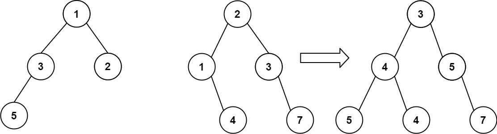
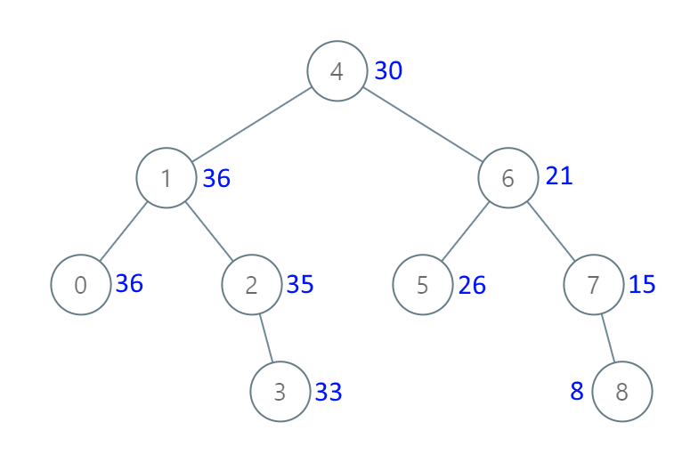
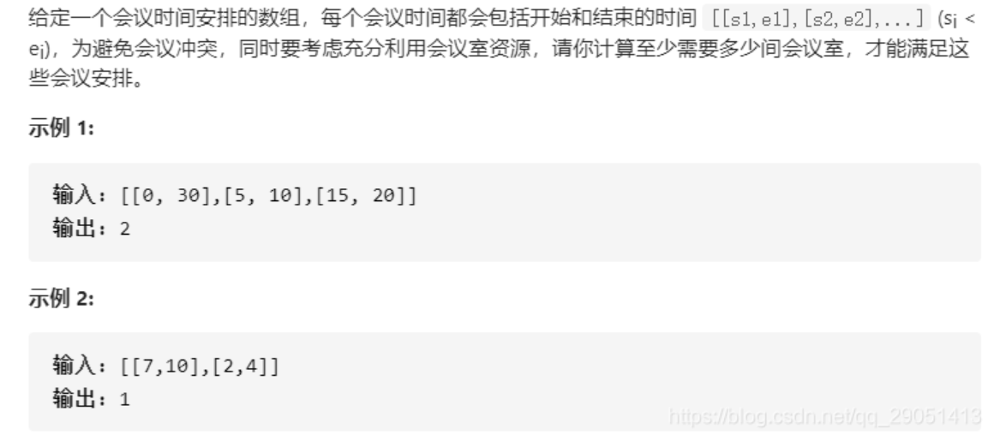

# 写在前头

这个leetcode刷题的pdf包含三个部分，个人认为重要度优先级为**hot100 > 代码随想录 ≈ hot100学习计划(new hot100)**。

三个部分的链接分别为。

**hot100：**[🔥 LeetCode 热题 HOT 100 - 力扣（LeetCode）全球极客挚爱的技术成长平台](https://leetcode.cn/problem-list/2cktkvj/)

**代码随想录：**[手把手带你撕出正确的二分法 | 二分查找法 | 二分搜索法 | LeetCode：704. 二分查找_哔哩哔哩_bilibili](https://www.bilibili.com/video/BV1fA4y1o715?spm_id_from=333.788.videopod.sections&vd_source=3850fe783abc77305f59d1bd405eea06)

**hot100学习计划(new hot100)：**[LeetCode 热题 100 - 学习计划 - 力扣（LeetCode）全球极客挚爱的技术成长平台](https://leetcode.cn/studyplan/top-100-liked/)

这个pdf还没写完，希望除夕之前能写完，并且个人能力有限，所以对于注释并不像网上的pdf那么详细，如果看不懂的话，建议配合ai使用。

此外，本人是算法萌新，本科无任何竞赛（大哭），希望与各位大佬多多交流，希望诸位同学不吝赐教。如有错误私聊我即可。


# 数组

### 461.汉明距离（hot 100）

给你两个整数 `x` 和 `y`，计算并返回它们之间的汉明距离。

**示例 1：**

```java
输入：x = 1, y = 4
输出：2
解释：
1   (0 0 0 1)
4   (0 1 0 0)
       ↑   ↑
上面的箭头指出了对应二进制位不同的位置。
```

```java
class Solution {
    // 计算两个整数的汉明距离
    public int hammingDistance(int x, int y) {
        // 使用异或运算符(^)得到两个整数对应位不同的结果，再使用Integer类的bitCount方法计算结果中1的个数，即为汉明距离
        return Integer.bitCount(x ^ y);
    }
}
```

### 338.比特位计数（hot 100）(4.1)

给你一个整数 `n` ，对于 `0 <= i <= n` 中的每个 `i` ，计算其二进制表示中 **`1` 的个数** ，返回一个长度为 `n + 1` 的数组 `ans` 作为答案。

**示例 1：**

```
输入：n = 2
输出：[0,1,1]
解释：
0 --> 0
1 --> 1
2 --> 10
```

**示例 2：**

```
输入：n = 5
输出：[0,1,1,2,1,2]
解释：
0 --> 0
1 --> 1
2 --> 10
3 --> 11
4 --> 100
5 --> 101
```

```java
// 定义Solution类
class Solution {
    // 定义countBits方法，参数为整数n，返回一个整型数组
    public int[] countBits(int n) {
        // 创建一个长度为n+1的整型数组ans，用于存储结果
        int[] ans = new int[n + 1];
        // 循环遍历从1到n的每个整数
        for (int i = 1; i <= n; ++i) {
            // 计算ans[i]，使用i和i-1的与操作，再加1。ans[i] 实际上就是 ans[i & (i - 1)] 的值加上1，表示比 i 少一个1的数的二进制中1的个数再加上1
            ans[i] = ans[i & (i - 1)] + 1;
        }
        // 返回计算结果数组ans
        return ans;
    }
}
```

### 136.只出现一次的数字（hot 100）

给你一个 **非空** 整数数组 `nums` ，除了某个元素只出现一次以外，其余每个元素均出现两次。找出那个只出现了一次的元素。

你必须设计并实现线性时间复杂度的算法来解决此问题，且该算法只使用常量额外空间。

**示例 1 ：**

```
输入：nums = [2,2,1]
输出：1
```

**示例 2 ：**

```
输入：nums = [4,1,2,1,2]
输出：4
```

```java
class Solution {
    // 定义一个Solution类
    public int singleNumber(int[] nums) {
        // 定义一个方法，参数为整型数组nums，用于找出只出现一次的数字
        int ans = 0;
        // 初始化一个变量ans为0，用于存储结果
        for (int num : nums) {
            // 遍历整型数组nums中的每个元素
            ans ^= num;
            // 对结果ans与当前元素num进行异或操作
        }
        return ans;
        // 返回结果ans，即只出现一次的数字
    }
}
```

### 75.颜色分类（hot 100）（4.7）

给定一个包含红色、白色和蓝色、共 `n` 个元素的数组 `nums` ，**[原地](https://baike.baidu.com/item/原地算法)**对它们进行排序，使得相同颜色的元素相邻，并按照红色、白色、蓝色顺序排列。

我们使用整数 `0`、 `1` 和 `2` 分别表示红色、白色和蓝色。

必须在不使用库内置的 sort 函数的情况下解决这个问题。

**示例 1：**

```
输入：nums = [2,0,2,1,1,0]
输出：[0,0,1,1,2,2]
```

**示例 2：**

```
输入：nums = [2,0,1]
输出：[0,1,2]
```

初见，可以用冒泡排序解决

```java
/**
 * Solution类提供了一种对颜色数组进行排序的方法
 * 颜色数组中的元素代表三种不同的颜色，分别用0、1、2表示
 * 该排序算法的目的是将数组按照颜色排序，相同颜色的元素应该相邻，颜色的顺序为0、1、2
 * 这个问题也被称为荷兰国旗问题，由计算机科学家Dijkstra提出
 */
class Solution {
    /**
     * 对颜色数组进行排序
     * 使用冒泡排序算法，通过两层循环遍历数组，并通过交换操作将较大的元素逐渐交换到数组的末尾
     *
     * @param nums 颜色数组，其中的元素是代表颜色的整数，0表示红色，1表示白色，2表示蓝色
     */
    public void sortColors(int[] nums) {
        for (int i = 0; i < nums.length; i++) {
            for (int j = 0; j < nums.length; j++) {
                if (nums[j] > nums[i]) {
                    swap(nums, i, j);
                }
            }
        }
    }

    /**
     * 交换数组中两个位置的元素
     *
     * @param nums 颜色数组
     * @param i 第一个要交换的位置
     * @param j 第二个要交换的位置
     */
    void swap(int[] nums, int i, int j) {
        int temp = nums[i];
        nums[i] = nums[j];
        nums[j] = temp;
    }
}
```

**实际上正确解法应该是三指针**

```java
/**
 * Solution类提供了一种对颜色数组进行排序的方法
 * 颜色数组中的元素为0、1、2，分别代表三种不同的颜色
 * 排序的目的是将数组按照颜色排序，0放在数组的前面，2放在数组的后面，1在中间
 */
class Solution {
    /**
     * 对颜色数组进行排序
     *
     * @param nums 颜色数组，元素为0、1、2
     */
    public void sortColors(int[] nums) {
        // 初始化三个指针：low指向数组开始位置，current指向当前元素，high指向数组末尾
        int low = 0, current = 0, high = nums.length - 1;

        // 遍历数组，直到current指针超过high指针
        while (current <= high) {
            // 当前元素为0时，将当前元素与low指针指向的元素交换，并向前移动low和current指针
            if (nums[current] == 0) {
                swap(nums, low++, current++);
            }
            // 当前元素为2时，将当前元素与high指针指向的元素交换，并向后移动high指针
            else if (nums[current] == 2) {
                swap(nums, current, high--);
            }
            // 当前元素为1时，仅向前移动current指针
            else {
                current++;
            }
        }
    }

    /**
     * 交换数组中两个元素的位置
     *
     * @param nums 颜色数组
     * @param i 第一个元素的索引
     * @param j 第二个元素的索引
     */
    void swap(int[] nums, int i, int j) {
        // 临时变量用于存储第一个元素的值，以便交换
        int temp = nums[i];
        // 将第一个元素的值替换为第二个元素的值
        nums[i] = nums[j];
        // 将第二个元素的值替换为临时变量中的值，完成交换
        nums[j] = temp;
    }
}
```

### 704.二分查找

给定一个 `n` 个元素有序的（升序）整型数组 `nums` 和一个目标值 `target` ，写一个函数搜索 `nums` 中的 `target`，如果目标值存在返回下标，否则返回 `-1`。


**示例 1:**

```
输入: nums = [-1,0,3,5,9,12], target = 9
输出: 4
解释: 9 出现在 nums 中并且下标为 4
```

**示例 2:**

```
输入: nums = [-1,0,3,5,9,12], target = 2
输出: -1
解释: 2 不存在 nums 中因此返回 -1
```

```java
class Solution {
    // 二分查找算法
    public int search(int[] nums, int target) {
        // 定义左指针初始位置为数组第一个元素的索引
        int left = 0;
        // 定义右指针初始位置为数组最后一个元素的索引
        int right = nums.length - 1;
        // 当左指针小于等于右指针时，进行循环查找
        while(left <= right){
            // 计算中间元素的索引
            int mid = (left + right) / 2;
            // 如果中间元素等于目标值，则返回中间元素的索引
            if (nums[mid] == target)
                return mid;
            // 如果中间元素大于目标值，则将右指针移动到中间元素的左侧
            else if (nums[mid] > target)
                right = mid - 1;
            // 如果中间元素小于目标值，则将左指针移动到中间元素的右侧
            else
                left = mid + 1;
        }
        // 若未找到目标值，则返回-1
        return -1;
    }
}
```

### 35.搜索插入位置（new hot100）

给定一个排序数组和一个目标值，在数组中找到目标值，并返回其索引。如果目标值不存在于数组中，返回它将会被按顺序插入的位置。

请必须使用时间复杂度为 `O(log n)` 的算法。


**示例 1:**

```
输入: nums = [1,3,5,6], target = 5
输出: 2
```

**示例 2:**

```
输入: nums = [1,3,5,6], target = 2
输出: 1
```

**示例 3:**

```
输入: nums = [1,3,5,6], target = 7
输出: 4
```

```java
/**
 * Solution类提供了一个方法来解决二分查找问题
 * 这个类的主要作用是通过二分查找算法在有序数组中找到目标值的位置，或者找到目标值应该被插入的位置
 */
class Solution {
    /**
     * 使用二分查找在有序数组中查找目标值或者找到目标值应该插入的位置
     *
     * @param nums 一个已排序的整数数组
     * @param target 目标整数，需要在数组中查找
     * @return 目标整数在数组中的索引位置如果目标整数不存在于数组中，则返回它应该被插入的位置
     */
    public int searchInsert(int[] nums, int target) {
        // 初始化搜索范围的左边界
        int left = 0;
        // 初始化搜索范围的右边界
        int right = nums.length - 1;
        // 用于存储中间值的索引
        int mid;
        // 当左边界小于等于右边界时，进行二分查找
        while (left <= right) {
            // 计算中间值的索引
            mid = (left + right) / 2;
            // 如果中间值等于目标值，直接返回中间值的索引
            if (nums[mid] == target) {
                return mid;
            } else if (nums[mid] > target) {
                // 如果中间值大于目标值，调整右边界为中间值索引的前一个
                right = mid - 1;
            } else {
                // 如果中间值小于目标值，调整左边界为中间值索引的后一个
                left = mid + 1;
            }
        }
        // 如果没有找到目标值，返回左边界，即目标值应该被插入的位置
        return left;
    }
}
```

### 74.搜索二维矩阵（new hot100）

给你一个满足下述两条属性的 `m x n` 整数矩阵：

- 每行中的整数从左到右按非严格递增顺序排列。
- 每行的第一个整数大于前一行的最后一个整数。

给你一个整数 `target` ，如果 `target` 在矩阵中，返回 `true` ；否则，返回 `false` 。


**示例 1：**


```
输入：matrix = [[1,3,5,7],[10,11,16,20],[23,30,34,60]], target = 3
输出：true
```

**示例 2：**


```
输入：matrix = [[1,3,5,7],[10,11,16,20],[23,30,34,60]], target = 13
输出：false
```

```java
/**
 * Solution类提供了一个方法来在一个二维矩阵中搜索一个目标值
 * 这个矩阵是一个按行和列都升序排序的二维数组
 */
class Solution {
    /**
     * 在二维矩阵中搜索目标值
     *
     * @param matrix 一个按行和列都升序排序的二维数组
     * @param target 要搜索的目标值
     * @return 如果目标值在矩阵中，则返回true；否则返回false
     */
    public boolean searchMatrix(int[][] matrix, int target) {
        // 初始化左指针和右指针
        int left = 0, right = matrix.length * matrix[0].length - 1;
        int mid;
        // 使用二分查找在二维矩阵中搜索目标值
        while (left <= right) {
            mid = (left + right) / 2;
            // 通过计算行列索引来获取当前mid指向的元素值
            int row = mid / matrix[0].length;
            int col = mid % matrix[0].length;
            if (matrix[row][col] == target) {
                // 如果找到目标值，返回true
                return true;
            } else if (matrix[row][col] > target) {
                // 如果当前元素值大于目标值，则目标值在左半部分
                right = mid - 1;
            } else {
                // 如果当前元素值小于目标值，则目标值在右半部分
                left = mid + 1;
            }
        }
        // 如果没有找到目标值，返回false
        return false;
    }
}
```

### 34.在排序数组中查找元素的第一个和最后一个位置（new hot100）

给你一个按照非递减顺序排列的整数数组 `nums`，和一个目标值 `target`。请你找出给定目标值在数组中的开始位置和结束位置。

如果数组中不存在目标值 `target`，返回 `[-1, -1]`。

你必须设计并实现时间复杂度为 `O(log n)` 的算法解决此问题。


**示例 1：**

```
输入：nums = [5,7,7,8,8,10], target = 8
输出：[3,4]
```

**示例 2：**

```
输入：nums = [5,7,7,8,8,10], target = 6
输出：[-1,-1]
```

**示例 3：**

```
输入：nums = [], target = 0
输出：[-1,-1]
```


```java
/**
 * Solution类提供了一种在排序数组中查找元素的起始和结束位置的方法
 */
class Solution {

    /**
     * 在排序数组中查找给定目标值的起始和结束位置
     * 
     * @param nums 排序的整数数组
     * @param target 要查找的目标值
     * @return 包含目标值的起始和结束位置的数组，如果不存在则返回[-1, -1]
     */
    public int[] searchRange(int[] nums, int target) {
        return new int[]{findFirstIndex(nums, target), findLastIndex(nums, target)};
    }

    /**
     * 查找目标值在排序数组中的第一个出现的索引
     * 
     * @param nums 排序的整数数组
     * @param target 目标值
     * @return 目标值第一次出现的索引，如果不存在则返回-1
     */
    int findFirstIndex(int[] nums, int target) {
        int left = 0, right = nums.length - 1, index = -1; // 初始化左边界、右边界和索引
        while (left <= right) { // 当左边界不大于右边界时继续循环
            int mid = (left + right) / 2; // 计算中间索引
            if (nums[mid] >= target) { // 如果中间元素大于等于目标值，则调整右边界
                right = mid - 1;
            } else { // 否则调整左边界
                left = mid + 1;
            }
            if (nums[mid] == target) { // 如果中间元素等于目标值，则记录索引
                index = mid;
            }
        }
        return index; // 返回目标值的第一个出现位置
    }

    /**
     * 查找目标值在排序数组中的最后一个出现的索引
     * 
     * @param nums 排序的整数数组
     * @param target 目标值
     * @return 目标值最后一次出现的索引，如果不存在则返回-1
     */
    int findLastIndex(int[] nums, int target) {
        int left = 0, right = nums.length - 1, index = -1; // 初始化左边界、右边界和索引
        while (left <= right) { // 当左边界不大于右边界时继续循环
            int mid = (left + right) / 2; // 计算中间索引
            if (nums[mid] <= target) { // 如果中间元素小于等于目标值，则调整左边界
                left = mid + 1;
            } else { // 否则调整右边界
                right = mid - 1;
            }
            if (nums[mid] == target) { // 如果中间元素等于目标值，则记录索引
                index = mid;
            }
        }
        return index; // 返回目标值的最后一个出现位置
    }
}

```

### 33.搜索旋转排序数组（new hot100）（3.29）

整数数组 `nums` 按升序排列，数组中的值 **互不相同** 。

在传递给函数之前，`nums` 在预先未知的某个下标 `k`（`0 <= k < nums.length`）上进行了 **旋转**，使数组变为 `[nums[k], nums[k+1], ..., nums[n-1], nums[0], nums[1], ..., nums[k-1]]`（下标 **从 0 开始** 计数）。例如， `[0,1,2,4,5,6,7]` 在下标 `3` 处经旋转后可能变为 `[4,5,6,7,0,1,2]` 。

给你 **旋转后** 的数组 `nums` 和一个整数 `target` ，如果 `nums` 中存在这个目标值 `target` ，则返回它的下标，否则返回 `-1` 。

你必须设计一个时间复杂度为 `O(log n)` 的算法解决此问题。


**示例 1：**

```
输入：nums = [4,5,6,7,0,1,2], target = 0
输出：4
```

**示例 2：**

```
输入：nums = [4,5,6,7,0,1,2], target = 3
输出：-1
```

**示例 3：**

```
输入：nums = [1], target = 0
输出：-1
```

```java
/**
 * 解决方案类，提供数组查找功能
 */
class Solution {
    /**
     * 使用二分查找算法在旋转排序数组中查找目标值
     * 旋转排序数组是将原始递增排序的数组在某个点上进行旋转后得到的数组
     * 例如：[0,1,2,4,5,6,7] 可能变为 [4,5,6,7,0,1,2]
     *
     * @param nums 旋转排序数组
     * @param target 需要查找的目标值
     * @return 目标值在数组中的索引，如果不存在则返回 -1
     */
    public int search(int[] nums, int target) {
        // 初始化左右指针
        int left = 0, right = nums.length - 1;
        // 中间指针
        int mid;
        // 使用while循环进行二分查找
        while (left <= right) {
            // 计算中间位置
            mid = (left + right) / 2;
            // 如果中间位置的值等于目标值，直接返回索引
            if (nums[mid] == target) {
                return mid;
            }

            // 判断左半部分是否是有序的
            if (nums[left] <= nums[mid]) {
                // 如果目标值在左半部分的范围内，则调整右指针
                if (nums[left] <= target && target < nums[mid]) {
                    right = mid - 1;
                } else {
                    // 否则调整左指针
                    left = mid + 1;
                }
            } else {
                // 判断右半部分是否是有序的
                // 如果目标值在右半部分的范围内，则调整左指针
                if (nums[mid] < target && target <= nums[right]) {
                    left = mid + 1;
                } else {
                    // 否则调整右指针
                    right = mid - 1;
                }
            }
        }
        // 如果没有找到目标值，返回 -1
        return -1;
    }
}
```

### 153.寻找旋转排序数组中的最小值（new hot100）（3.28）

已知一个长度为 `n` 的数组，预先按照升序排列，经由 `1` 到 `n` 次 **旋转** 后，得到输入数组。例如，原数组 `nums = [0,1,2,4,5,6,7]` 在变化后可能得到：

- 若旋转 `4` 次，则可以得到 `[4,5,6,7,0,1,2]`
- 若旋转 `7` 次，则可以得到 `[0,1,2,4,5,6,7]`

注意，数组 `[a[0], a[1], a[2], ..., a[n-1]]` **旋转一次** 的结果为数组 `[a[n-1], a[0], a[1], a[2], ..., a[n-2]]` 。

给你一个元素值 **互不相同** 的数组 `nums` ，它原来是一个升序排列的数组，并按上述情形进行了多次旋转。请你找出并返回数组中的 **最小元素** 。

你必须设计一个时间复杂度为 `O(log n)` 的算法解决此问题。


**示例 1：**

```
输入：nums = [3,4,5,1,2]
输出：1
解释：原数组为 [1,2,3,4,5] ，旋转 3 次得到输入数组。
```

**示例 2：**

```
输入：nums = [4,5,6,7,0,1,2]
输出：0
解释：原数组为 [0,1,2,4,5,6,7] ，旋转 3 次得到输入数组。
```

**示例 3：**

```
输入：nums = [11,13,15,17]
输出：11
解释：原数组为 [11,13,15,17] ，旋转 4 次得到输入数组。
```

左闭右开区间的典例

```java
/**
 * Solution类用于解决寻找旋转排序数组中的最小值的问题
 */
class Solution {
    /**
     * 使用二分查找算法寻找旋转排序数组中的最小值
     *
     * @param nums 一个旋转排序数组，其中每个元素都是唯一的
     * @return 数组中的最小值
     */
    public int findMin(int[] nums) {
        // 初始化左指针和右指针
        int left = 0, right = nums.length - 1;
        // 当左指针小于右指针时，进行二分查找
        while (left < right) {
            // 计算中间位置
            int mid = (left + right) / 2;
            // 判断中间元素是否大于右侧元素，以确定最小值所在的区间
            if (nums[mid] > nums[right]) {
                // nums[mid] > nums[right] 说明数组的右半部分是无序的（旋转数组的特点），所以最小值一定在右半部分。因此，更新 left = mid + 1。
                left = mid + 1;
            } else {
                // nums[mid] <= nums[right] 说明数组的右半部分是有序的，最小值有可能是 mid 或者更小的元素，因此更新 right = mid。
                right = mid;
            }
        }
        // 此时左指针和右指针重合，指向最小值
        return nums[right];
    }
}
```

### 4.寻找两个正序数组的中位数（new hot100）（4.11）

给定两个大小分别为 `m` 和 `n` 的正序（从小到大）数组 `nums1` 和 `nums2`。请你找出并返回这两个正序数组的 **中位数** 。

算法的时间复杂度应该为 `O(log (m+n))` 。


**示例 1：**

```
输入：nums1 = [1,3], nums2 = [2]
输出：2.00000
解释：合并数组 = [1,2,3] ，中位数 2
```

**示例 2：**

```
输入：nums1 = [1,2], nums2 = [3,4]
输出：2.50000
解释：合并数组 = [1,2,3,4] ，中位数 (2 + 3) / 2 = 2.5
```

```java
/**
 * Solution类用于解决两个已排序数组的中位数查找问题
 */
class Solution {
    /**
     * 寻找两个已排序数组的中位数
     * 
     * @param nums1 第一个已排序数组
     * @param nums2 第二个已排序数组
     * @return 两个数组合并后的中位数
     */
    public double findMedianSortedArrays(int[] nums1, int[] nums2) {
        int totalLength = nums1.length + nums2.length;
        // 根据数组总长度的奇偶性决定中位数的计算方式
        return totalLength % 2 != 0 ? findTheKThLargestNumber(nums1, nums2, totalLength / 2 + 1)
                : (findTheKThLargestNumber(nums1, nums2, totalLength / 2 + 1) + findTheKThLargestNumber(nums1, nums2, totalLength / 2)) / 2.0;
    }

    /**
     * 寻找两个已排序数组中的第k小的数
     * 
     * @param nums1 第一个已排序数组
     * @param nums2 第二个已排序数组
     * @param k 想要找到的第k小的数的索引
     * @return 两个数组中的第k小的数
     */
    int findTheKThLargestNumber(int[] nums1, int[] nums2, int k) {
        int length1 = nums1.length, length2 = nums2.length;
        int index1 = 0, index2 = 0;
        while (true) {
            // 如果遍历完nums1数组，直接从nums2数组中找第k小的数
            if (index1 == length1) {
                while (k != 1) {
                    index2++;
                    k--;
                }
                return nums2[index2];
            }
            // 如果遍历完nums2数组，直接从nums1数组中找第k小的数
            if (index2 == length2) {
                while (k != 1) {
                    index1++;
                    k--;
                }
                return nums1[index1];
            }
            // 如果k为1，返回两个数组当前最小的数
            if (k == 1) {
                return Math.min(nums1[index1], nums2[index2]);
            }
            // 比较两个数组当前的数，较小的那个数的索引向前移动，并将k值减1
            if (nums1[index1] <= nums2[index2]) {
                index1++;
            } else {
                index2++;
            }
            k--;
        }
    }
}
```

### 27.移除元素

```java
// 定义一个名为Solution的类
class Solution {
    // 定义一个名为removeElement的方法，接收一个整型数组nums和一个整数val作为参数，返回一个整数
    public int removeElement(int[] nums, int val) {
        // 初始化一个变量k，用于记录不等于val的元素个数
        int k = 0;
        // 遍历整型数组nums
        for (int i = 0; i < nums.length; i++){
            // 如果当前元素不等于val
            if (nums[i] != val){
                // 将当前元素移动到数组的前面，并更新k
                nums[k++] = nums[i];
            }
        }
        // 返回不等于val的元素个数
        return k;
    }
}
```

### 977.有序数组的平方

双指针方法

```java
class Solution {
    public int[] sortedSquares(int[] nums) {
        int[] result = new int[nums.length];
        int i = nums.length - 1,j = nums.length - 1, k = 0;
        while (k <= j) {
            if ((nums[k] * nums[k]) >= (nums[j] * nums[j])) {
                result[i] = nums[k] * nums[k];
                k++;
                i--;
            } else {
                result[i] = nums[j] * nums[j];
                j--;
                i--;
            }
        }
        return result;
    }
}
```

更简单的

```java
class Solution {
    public int[] sortedSquares(int[] nums) {
        for (int i = 0; i < nums.length; i++) {
            nums[i] = nums[i] * nums[i];
        }

        Arrays.sort(nums);
        return nums;
    }
}
```

### 209.长度最小的子数组（3.25）

给定一个含有 `n` 个正整数的数组和一个正整数 `target` **。**

找出该数组中满足其总和大于等于 `target` 的长度最小的 **子数组** `[numsl, numsl+1, ..., numsr-1, numsr]` ，并返回其长度**。**如果不存在符合条件的子数组，返回 `0` 。


**示例 1：**

```
输入：target = 7, nums = [2,3,1,2,4,3]
输出：2
解释：子数组 [4,3] 是该条件下的长度最小的子数组。
```

**示例 2：**

```
输入：target = 4, nums = [1,4,4]
输出：1
```

**示例 3：**

```
输入：target = 11, nums = [1,1,1,1,1,1,1,1]
输出：0
```

```java
/**
 * 解决方案类，提供数组相关的问题解决方法
 */
class Solution {
    /**
     * 计算满足条件的最短子数组的长度
     * 
     * 该方法用于找到一个子数组，使得子数组的所有元素和至少为目标值，
     * 并返回满足条件的最短子数组的长度如果不存在这样的子数组，则返回0
     * 
     * @param target 目标值，子数组的和至少要达到这个值
     * @param nums 输入的整数数组
     * @return 返回满足条件的最短子数组的长度，如果不存在则返回0
     */
    public int minSubArrayLen(int target, int[] nums) {
        // 累加和，用于记录当前子数组的和
        int sum = 0;
        // 子数组的最小长度，初始值设为最大整数，以便后续比较
        int count = Integer.MAX_VALUE;
        // 使用双指针技术遍历数组，i为慢指针，j为快指针
        for (int i = 0, j = 0; i < nums.length; i++) {
            // 将当前元素加到子数组的和中
            sum += nums[i];
            // 当当前子数组的和大于等于目标值时，尝试缩小子数组的范围
            while (sum >= target) {
                // 更新子数组的最小长度
                count = Math.min(count, i - j + 1);
                // 移动快指针，减小子数组的范围
                sum -= nums[j];
                j++;
            }
        }

        // 如果最小长度仍然是初始值，则说明没有找到满足条件的子数组，返回0
        // 否则返回计算出的最小长度
        return count == Integer.MAX_VALUE ? 0 : count;
    }
}
```

### 560.和为k的子数组(hot100)(3.29)

给你一个整数数组 `nums` 和一个整数 `k` ，请你统计并返回 *该数组中和为 `k` 的子数组的个数* 。

子数组是数组中元素的连续非空序列。

**示例 1：**

```
输入：nums = [1,1,1], k = 2
输出：2
```

**示例 2：**

```
输入：nums = [1,2,3], k = 3
输出：2
```

暴力解，复杂度 O(n^2)，推荐这种，简单好记。

```java
auxiliaryMap.getOrDefault(sum - k, 0)
```

**为什么这种遍历能解决问题：**

- **子数组的定义**：子数组是数组中一段连续的非空元素序列。通过双重循环，内层循环遍历从某个起始位置 `i` 开始的所有子数组，从而可以检查所有可能的子数组。
- **计算和的方式**：内层循环每次计算当前子数组的和，逐步累加数组元素，直到找到和为 `k` 的子数组。


**优化后的O(N)，用前缀和的思想。不如上面好记**

```java
class Solution {
    // 定义一个方法，用于计算数组中连续子数组的和等于k的个数
    public int subarraySum(int[] nums, int k) {
        // 定义结果变量，用于存储连续子数组的和等于k的个数
        int result = 0, sum = 0;
        // 定义一个HashMap，用于存储前缀和及其出现的次数
        HashMap<Integer, Integer> map = new HashMap<>();
        // 将前缀和为0的情况放入HashMap中，表示从数组开头到当前位置的和为0
        map.put(0, 1);
        // 遍历数组
        for (int i = 0; i < nums.length; i++) {
            // 计算当前位置的前缀和
            sum += nums[i];
            // 如果HashMap中存在前缀和为sum-k的情况，则说明存在连续子数组的和为k
            if (map.containsKey(sum - k)) {
                // 将前缀和为sum-k的次数加到结果中
                result += map.get(sum - k);
            }
            // 将当前前缀和放入HashMap中，并更新其出现的次数
            map.put(sum, map.getOrDefault(sum, 0) + 1);
        }
        // 返回结果
        return result;
    }
}
```

### 238.除自身以外数组的乘积（hot100）（4.18）

给你一个整数数组 `nums`，返回 数组 `answer` ，其中 `answer[i]` 等于 `nums` 中除 `nums[i]` 之外其余各元素的乘积 。

题目数据 **保证** 数组 `nums`之中任意元素的全部前缀元素和后缀的乘积都在 **32 位** 整数范围内。

请 **不要使用除法，**且在 `O(n)` 时间复杂度内完成此题。

**示例 1:**

```
输入: nums = [1,2,3,4]
输出: [24,12,8,6]
```

**示例 2:**

```
输入: nums = [-1,1,0,-3,3]
输出: [0,0,9,0,0]
```

**提示：**

- `2 <= nums.length <= 105`
- `-30 <= nums[i] <= 30`
- **保证** 数组 `nums`之中任意元素的全部前缀元素和后缀的乘积都在 **32 位** 整数范围内

```java
/**
 * Solution类提供了一个方法来计算一个整数数组中除了自身之外所有元素的乘积
 */
class Solution {
    /**
     * 计算数组中除了自身之外所有元素的乘积
     * 
     * @param nums 输入的整数数组
     * @return 返回一个数组，其中每个元素是原数组中除了当前位置元素之外所有元素的乘积
     */
    public int[] productExceptSelf(int[] nums) {
        // 初始化结果数组，长度与输入数组相同
        int[] resultArray = new int[nums.length];
        // 设置第一个元素为1，因为左边没有元素
        resultArray[0] = 1;
        // 计算每个位置左边所有元素的乘积
        for (int i = 1; i < nums.length; i++) {
            resultArray[i] = resultArray[i - 1] * nums[i - 1];
        }

        // 初始化右边乘积变量为1，用于计算右边元素的乘积
        int auxiliaryRightNum = 1;
        // 从后向前遍历数组，计算每个位置右边元素的乘积
        for (int i = nums.length - 1; i >= 0; i--) {
            resultArray[i] *= auxiliaryRightNum;
            auxiliaryRightNum *= nums[i];
        }

        // 返回结果数组
        return resultArray;
    }
}
```


### 283.移动零（hot100）（27.移除元素的进阶）

给定一个数组 `nums`，编写一个函数将所有 `0` 移动到数组的末尾，同时保持非零元素的相对顺序。

**请注意** ，必须在不复制数组的情况下原地对数组进行操作。

**示例 1:**

```
输入: nums = [0,1,0,3,12]
输出: [1,3,12,0,0]
```

```java
class Solution {
    // 定义一个方法，用于将数组中的0移动到数组的末尾
    public void moveZeroes(int[] nums) {
        // 定义一个变量k，用于记录非0元素的个数
        int k = 0;
        // 遍历数组
        for (int i = 0; i < nums.length; i++) {
            // 如果当前元素不为0
            if (nums[i] != 0) {
                // 将当前元素赋值给nums[k]，并将k加1
                nums[k++] = nums[i];
            }
        }
        // 将数组中剩余的位置全部赋值为0
        while (k < nums.length) {
            nums[k++] = 0;
        }
    }
}
```

### 189.轮转数组（new hot100）

给定一个整数数组 `nums`，将数组中的元素向右轮转 `k` 个位置，其中 `k` 是非负数。

**示例 1:**

```
输入: nums = [1,2,3,4,5,6,7], k = 3
输出: [5,6,7,1,2,3,4]
解释:
向右轮转 1 步: [7,1,2,3,4,5,6]
向右轮转 2 步: [6,7,1,2,3,4,5]
向右轮转 3 步: [5,6,7,1,2,3,4]
```

**示例 2:**

```
输入：nums = [-1,-100,3,99], k = 2
输出：[3,99,-1,-100]
解释: 
向右轮转 1 步: [99,-1,-100,3]
向右轮转 2 步: [3,99,-1,-100]
```

**提示：**

- `1 <= nums.length <= 105`
- `-231 <= nums[i] <= 231 - 1`
- `0 <= k <= 105`

暴力解法

```java
class Solution {
    /**
     * 将给定的整数数组 nums 中的元素向右旋转 k 个位置
     * 
     * @param nums 要旋转的整数数组
     * @param k 旋转的位置数，不能为0
     */
    public void rotate(int[] nums, int k) {
        // 如果k为0，则不需要旋转，直接返回
        if (k != 0) {
            // 初始化辅助数组，用于存放旋转后的元素
            int[] auxiliaryArray = new int[nums.length];
            // 遍历原始数组，将元素根据旋转规则放入辅助数组
            for (int i = 0; i < nums.length; i++) {
                auxiliaryArray[(i + k) % nums.length] = nums[i];
            }
            // 将辅助数组中的元素复制回原始数组，完成旋转
            for (int i = 0; i < nums.length; i++) {
                nums[i]=auxiliaryArray[i];
            }
        }
    }
}

```

O（1）的处理空间，思路类似右旋字符串。

```java
class Solution {
    /**
     * 将数组 nums 中的元素向右旋转 k 个位置
     * 通过反转数组的方式来实现旋转操作
     * 
     * @param nums 原始数组
     * @param k 旋转的步数
     */
    public void rotate(int[] nums, int k) {
        // 计算实际需要移动的步数，防止 k 大于数组长度的情况
        int NumberOfStepsMoved = k % (nums.length);
        // 反转整个数组
        reverse(nums, 0, nums.length - 1);
        // 反转前 NumberOfStepsMoved 个元素
        reverse(nums, 0, NumberOfStepsMoved - 1);
        // 反转剩余的元素
        reverse(nums, NumberOfStepsMoved, nums.length - 1);
    }

    /**
     * 反转数组中指定范围的元素
     * 
     * @param nums 原始数组
     * @param left 反转范围的左边界
     * @param right 反转范围的右边界
     */
    void reverse(int[] nums, int left, int right) {
        int tempNum;
        while (left < right) {
            // 交换当前元素
            tempNum = nums[right];
            nums[right] = nums[left];
            nums[left] = tempNum;
            // 移动指针，进行下一轮交换
            right--;
            left++;
        }
    }
}

```

### 41.缺失的第一个正数（new hot100）（3.22）

给你一个未排序的整数数组 `nums` ，请你找出其中没有出现的最小的正整数。

请你实现时间复杂度为 

```
O(n)
```

 并且只使用常数级别额外空间的解决方案。

**示例 1：**

```
输入：nums = [1,2,0]
输出：3
解释：范围 [1,2] 中的数字都在数组中。
```

**示例 2：**

```
输入：nums = [3,4,-1,1]
输出：2
解释：1 在数组中，但 2 没有。
```

**示例 3：**

```
输入：nums = [7,8,9,11,12]
输出：1
解释：最小的正数 1 没有出现。
```

**提示：**

- `1 <= nums.length <= 105`
- `-231 <= nums[i] <= 231 - 1`

```java
class Solution {
    /**
     * 找到数组中缺失的最小正整数
     * 
     * @param nums 输入的整数数组
     * @return 返回缺失的最小正整数
     */
    public int firstMissingPositive(int[] nums) {
        // 第一遍遍历数组，将每个数字放到它应该在的位置上
        for (int i = 0; i < nums.length; i++) {
            // 使用 while 循环而不是 if 是因为一个元素经过一次交换后，可能还需要继续交换
            // 直到这个元素到达它应该在的位置。
            // 比如，假设 nums[i] 的值是 5，它应该放在 nums[4] 的位置上。
            // 如果我们交换后 nums[i] 变成了另一个不在正确位置的数字，比如 3，
            // 那么 nums[i] 还需要继续交换到正确的位置 nums[2]。
            //nums[i] 是当前我们正在检查的数字
			//nums[i] - 1 是这个数字应该在的索引位置
			//nums[nums[i] - 1] 是现在占据这个位置的数字
            while (nums[i] > 0 && nums[i] <= nums.length && nums[nums[i] - 1] != nums[i]) {
                // 当条件满足时交换元素：
                // 1. nums[i] > 0：数字应该是正数才需要处理（负数和 0 无需移动）
                // 2. nums[i] <= nums.length：只处理范围在 1 到 n 之间的数字（忽略大于 n 的数字，因为它们无法成为答案）
                // 3. nums[nums[i] - 1] != nums[i]：只在元素未处于正确位置时才交换，避免重复交换和死循环
                swap(nums, nums[i] - 1, i);
            }
        }

        // 第二次遍历数组，查找第一个位置 i 使得 nums[i] != i + 1
        for (int i = 0; i < nums.length; i++) {
            // 如果发现某个位置的数字与 i+1 不符，那么 i+1 就是缺失的最小正整数
            if (nums[i] != i + 1) {
                return i + 1; // 返回第一个缺失的最小正整数
            }
        }

        // 如果数组中所有数字都符合 nums[i] == i + 1 的情况，那么缺失的最小正整数就是 nums.length + 1
        return nums.length + 1;
    }

    /**
     * 交换数组中两个位置的值
     * 
     * @param nums 输入的整数数组
     * @param i 第一个位置的索引
     * @param j 第二个位置的索引
     */
    private void swap(int[] nums, int i, int j) {
        int temp = nums[i];  // 保存 nums[i] 的值
        nums[i] = nums[j];   // 将 nums[j] 赋给 nums[i]
        nums[j] = temp;      // 将 temp 中保存的值赋给 nums[j]
    }
}

```

### 59.螺旋矩阵II

```java
class Solution {
    public int[][] generateMatrix(int n) {
        int[][] matrix = new int[n][n];
        int num = 0;
        for (int k = 0, i = 0, j = 0, starx = 0, stary = 0; k < n / 2; k++) {

            for (j = stary; j < n - k - 1; j++) {
                matrix[starx][j] = ++num;
            }
            for (i = starx; i < n - k - 1; i++) {
                matrix[i][n - k - 1] = ++num;
            }
            for (j = n - k - 1; j > k; j--) {
                matrix[n - k - 1][j] = ++num;
            }
            for (i = n - k - 1; i > k; i--) {
                matrix[i][stary] = ++num;
            }
            starx++;
            stary++;

        }
        if (n % 2 != 0) {
            matrix[n / 2][n / 2] = ++num;
        }

        return matrix;
    }
}
```


### 54.螺旋矩阵（new hot100）（4.19）

```java
class Solution {
    /**
     * 按螺旋顺序返回矩阵中的元素
     * 
     * @param matrix 二维整数数组，表示输入的矩阵
     * @return List<Integer>，包含按螺旋顺序遍历矩阵的元素
     */
    public List<Integer> spiralOrder(int[][] matrix) {
        // 初始化结果列表
        List<Integer> resultList = new ArrayList<>();
        // 初始化上下左右边界
        int top = 0, bottom = matrix.length - 1, left = 0, right = matrix[0].length - 1;

        // 当上边界小于等于下边界且左边界小于等于右边界时，进行螺旋遍历
        while (top <= bottom && left <= right) {
            // 从左到右遍历顶部元素
            for (int i = left; i <= right; i++) {
                resultList.add(matrix[top][i]);
            }
            // 上边界下移
            top++;
            // 从上到下遍历右侧元素
            for (int i = top; i <= bottom; i++) {
                resultList.add(matrix[i][right]);
            }
            // 右边界左移
            right--;
            // 如果上边界小于等于下边界，则从右到左遍历底部元素
            if (top <= bottom) {
                for (int i = right; i >= left; i--) {
                    resultList.add(matrix[bottom][i]);
                }
                // 下边界上移
                bottom--;
            }
            // 如果左边界小于等于右边界，则从下到上遍历左侧元素
            if (left <= right) {
                for (int i = bottom; i >= top; i--) {
                    resultList.add(matrix[i][left]);
                }
                // 左边界右移
                left++;
            }
        }
        // 返回螺旋遍历的结果
        return resultList;
    }
}

```

在螺旋顺序遍历中，后两个循环（从右到左、从下到上）需要进行条件判断，主要原因是为了避免重复遍历或越界操作。

具体来说：

1. **第一个判断 (top <= bottom)**：
   - 在从右到左遍历底部时，这个判断确保在矩阵的行数足够时才进行遍历。经过前两个遍历（从左到右、从上到下）后，`top` 已经递增了，而 `bottom` 已经递减了，可能在某一时刻 `top` 超过了 `bottom`，说明已经处理完所有行。此时无需再执行从右到左的遍历，避免重复添加元素。
2. **第二个判断 (left <= right)**：
   - 同理，在从下到上遍历左侧列时，这个判断确保列数足够时才进行遍历。前面的遍历可能已经处理掉了所有列，因此需要判断 `left` 和 `right` 的关系，避免重复访问已经处理过的列。

这些判断确保每一次只处理剩下未访问的行和列，避免不必要的重复处理或越界错误，尤其是在矩阵非常小的情况下（比如 1xN 或 Nx1 的矩阵）。


### 73.矩阵置0（new hot100）

给定一个 `*m* x *n*` 的矩阵，如果一个元素为 **0** ，则将其所在行和列的所有元素都设为 **0** 。请使用 **原地** 算法**。**

**示例 1：**


```
输入：matrix = [[1,1,1],[1,0,1],[1,1,1]]
输出：[[1,0,1],[0,0,0],[1,0,1]]
```

**示例 2：**


```
输入：matrix = [[0,1,2,0],[3,4,5,2],[1,3,1,5]]
输出：[[0,0,0,0],[0,4,5,0],[0,3,1,0]]
```


```java
class Solution {
    /**
     * 将矩阵中指定元素设为0
     * 如果一个矩阵中的元素为0，则将其所在行和列的所有元素都设为0
     *
     * @param matrix 二维整数数组，表示需要处理的矩阵
     */
    public void setZeroes(int[][] matrix) {
        // 创建布尔数组记录矩阵中每行每列是否有元素为0
        boolean[] row = new boolean[matrix.length];
        boolean[] col = new boolean[matrix[0].length];

        // 遍历矩阵，标记含有0的行和列
        for (int i = 0; i < matrix.length; i++) {
            for (int j = 0; j < matrix[0].length; j++) {
                if (matrix[i][j] == 0) {
                    row[i] = true;
                    col[j] = true;
                }
            }
        }

        // 根据标记的行和列，将对应位置的元素设为0
        for (int i = 0; i < matrix.length; i++) {
            for (int j = 0; j < matrix[0].length; j++) {
                if (row[i] || col[j]) {
                    matrix[i][j] = 0;
                }
            }
        }
    }
}
```

空间复杂度是O(1)，防止面试刁难。

```java
/**
 * Solution类提供了一个方法setZeroes，用于将包含0的元素所在的行和列置零
 */
class Solution {
    /**
     * 将矩阵中包含0的元素所在的行和列置零
     * 
     * @param matrix 一个整数矩阵
     */
    public void setZeroes(int[][] matrix) {
        // 矩阵的行数
        int m = matrix.length;
        // 矩阵的列数
        int n = matrix[0].length;
        // 标记首行是否包含0
        boolean firstRowZero = false;
        // 标记首列是否包含0
        boolean firstColumnZero = false;
        
        // 检查首行是否包含0
        for (int j = 0; j < n; j++) {
            if (matrix[0][j] == 0) {
                firstRowZero = true;
                break;
            }
        }
        
        // 检查首列是否包含0
        for (int i = 0; i < m; i++) {
            if (matrix[i][0] == 0) {
                firstColumnZero = true;
                break;
            }
        }
        
        // 遍历矩阵，将包含0的元素所在的行和列的对应标志位置零
        for (int i = 1; i < m; i++) {
            for (int j = 1; j < n; j++) {
                if (matrix[i][j] == 0) {
                    matrix[i][0] = 0;
                    matrix[0][j] = 0;
                }
            }
        }
        
        // 根据标志位，将对应的行和列置零
        for (int i = 1; i < m; i++) {
            for (int j = 1; j < n; j++) {
                if (matrix[i][0] == 0 || matrix[0][j] == 0) {
                    matrix[i][j] = 0;
                }
            }
        }
        
        // 如果首行包含0，将首行置零
        if (firstRowZero) {
            for (int j = 0; j < n; j++) {
                matrix[0][j] = 0;
            }
        }
        
        // 如果首列包含0，将首列置零
        if (firstColumnZero) {
            for (int i = 0; i < m; i++) {
                matrix[i][0] = 0;
            }
        }
    }
}

```


### 48.旋转图像（new hot100）（4.15）

给定一个 *n* × *n* 的二维矩阵 `matrix` 表示一个图像。请你将图像顺时针旋转 90 度。

你必须在 **原地** 旋转图像，这意味着你需要直接修改输入的二维矩阵。**请不要** 使用另一个矩阵来旋转图像。


**示例 1：**


```
输入：matrix = [[1,2,3],[4,5,6],[7,8,9]]
输出：[[7,4,1],[8,5,2],[9,6,3]]
```

**示例 2：**


```
输入：matrix = [[5,1,9,11],[2,4,8,10],[13,3,6,7],[15,14,12,16]]
输出：[[15,13,2,5],[14,3,4,1],[12,6,8,9],[16,7,10,11]]
```


```java
class Solution {
    /**
     * 将二维矩阵顺时针旋转90度
     * 通过先转置矩阵，然后沿垂直中线翻转来实现
     *
     * @param matrix 二维整数数组，表示需要旋转的矩阵
     */
    public void rotate(int[][] matrix) {
        // 获取矩阵的行数（也是列数，因为矩阵是方阵）
        int n = matrix.length;

        // 遍历矩阵的上半部分，进行转置
        // 只需遍历上三角，转置后会得到一个对称矩阵
        for (int i = 0; i < n; i++) {
            for (int j = i; j < n; j++) {
                // 交换矩阵对角线上的元素，完成转置
                int temp = matrix[i][j];
                matrix[i][j] = matrix[j][i];
                matrix[j][i] = temp;
            }
        }

        // 遍历矩阵的每一行，沿垂直中线翻转
        for (int i = 0; i < n; i++) {
            for (int j = 0; j < n / 2; j++) {
                // 交换每行中对称位置的元素
                int temp = matrix[i][j];
                matrix[i][j] = matrix[i][n - 1 - j];
                matrix[i][n - 1 - j] = temp;
            }
        }
    }
}
```


### 240.搜索二维矩阵II（new hot100）

编写一个高效的算法来搜索 `*m* x *n*` 矩阵 `matrix` 中的一个目标值 `target` 。该矩阵具有以下特性：

- 每行的元素从左到右升序排列。
- 每列的元素从上到下升序排列。


**示例 1：**


```
输入：matrix = [[1,4,7,11,15],[2,5,8,12,19],[3,6,9,16,22],[10,13,14,17,24],[18,21,23,26,30]], target = 5
输出：true
```

**示例 2：**


```
输入：matrix = [[1,4,7,11,15],[2,5,8,12,19],[3,6,9,16,22],[10,13,14,17,24],[18,21,23,26,30]], target = 20
输出：false
```


```java
/**
 * 在二维矩阵中搜索目标值
 * 这个函数采用从右上角开始搜索的策略，充分利用矩阵的有序特性，从而实现高效搜索
 * 
 * @param matrix 一个二维整数数组，表示待搜索的矩阵该矩阵每行从左到右递增，每列从上到下递增
 * @param target 要搜索的目标值
 * @return 如果目标值存在于矩阵中，则返回true；否则返回false
 */
class Solution {
    public boolean searchMatrix(int[][] matrix, int target) {
        // 首先检查矩阵是否为空，或者行或列是否为空
        if (matrix == null || matrix.length == 0 || matrix[0].length == 0) {
            return false;
        }

        // 初始化搜索的起始位置为矩阵的右上角
        int row = 0;
        int col = matrix[0].length - 1;

        // 开始在矩阵中搜索，只要搜索指针不超出矩阵的边界
        while (row < matrix.length && col >= 0) {
            // 如果当前位置的值等于目标值，说明找到了目标，返回true
            if (matrix[row][col] == target) {
                return true;
            } 
            // 如果当前值大于目标值，向下一行移动
            else if (matrix[row][col] > target) {
                col--;
            } 
            // 如果当前值小于目标值，向左一列移动
            else {
                row++;
            }
        }

        // 如果搜索结束都没有找到目标值，返回false
        return false;
    }
}
```

### 31.下一个排列（hot 100）（3.21）

整数数组的一个 **排列** 就是将其所有成员以序列或线性顺序排列。

- 例如，`arr = [1,2,3]` ，以下这些都可以视作 `arr` 的排列：`[1,2,3]`、`[1,3,2]`、`[3,1,2]`、`[2,3,1]` 。

整数数组的 **下一个排列** 是指其整数的下一个字典序更大的排列。更正式地，如果数组的所有排列根据其字典顺序从小到大排列在一个容器中，那么数组的 **下一个排列** 就是在这个有序容器中排在它后面的那个排列。如果不存在下一个更大的排列，那么这个数组必须重排为字典序最小的排列（即，其元素按升序排列）。

- 例如，`arr = [1,2,3]` 的下一个排列是 `[1,3,2]` 。
- 类似地，`arr = [2,3,1]` 的下一个排列是 `[3,1,2]` 。
- 而 `arr = [3,2,1]` 的下一个排列是 `[1,2,3]` ，因为 `[3,2,1]` 不存在一个字典序更大的排列。

给你一个整数数组 `nums` ，找出 `nums` 的下一个排列。

必须**[ 原地 ](https://baike.baidu.com/item/原地算法)**修改，只允许使用额外常数空间。

**示例 1：**

```
输入：nums = [1,2,3]
输出：[1,3,2]
```

**示例 2：**

```
输入：nums = [3,2,1]
输出：[1,2,3]
```

**示例 3：**

```
输入：nums = [1,1,5]
输出：[1,5,1]
```

```java
class Solution {
    // 下一个排列
    public void nextPermutation(int[] nums) {
        int i = nums.length - 2;
        // 从倒数第二个数开始向前遍历，找到第一个不满足递减顺序的数
        while (i >= 0 && nums[i] >= nums[i + 1]) {
            i--;
        }
        // 如果找到了这样的数
        if (i >= 0) {
            int j = nums.length - 1;
            // 从末尾向前找到第一个大于nums[i]的数
            while (nums[j] <= nums[i]) {
                j--;
            }
            // 交换这两个数
            swap(nums, i, j);
        }
        // 反转从i+1开始的部分，使其变为递增顺序
        reverse(nums, i + 1);
    }

    // 反转数组
    private void reverse(int[] nums, int start) {
        int i = start, j = nums.length - 1;
        // 从start到末尾依次交换数字
        while (i < j) {
            swap(nums, i, j);
            i++;
            j--;
        }
    }

    // 交换数组中的两个元素
    private void swap(int[] nums, int i, int j) {
        int temp = nums[i];
        nums[i] = nums[j];
        nums[j] = temp;
    }
}
```

### 287.寻找重复数（hot 100）（3.29）

给定一个包含 `n + 1` 个整数的数组 `nums` ，其数字都在 `[1, n]` 范围内（包括 `1` 和 `n`），可知至少存在一个重复的整数。

假设 `nums` 只有 **一个重复的整数** ，返回 **这个重复的数** 。

你设计的解决方案必须 **不修改** 数组 `nums` 且只用常量级 `O(1)` 的额外空间。

**示例 1：**

```
输入：nums = [1,3,4,2,2]
输出：2
```

**示例 2：**

```
输入：nums = [3,1,3,4,2]
输出：3
```

**示例 3 :**

```
输入：nums = [3,3,3,3,3]
输出：3
```

```java
/**
 * 解决方案类，用于寻找数组中的重复数字
 */
class Solution {
    /**
     * 寻找重复数字
     * 该方法使用快慢指针技术，类似于检测链表中的环
     * 数组中的重复数字导致了值的循环引用，类似于链表中的环入口
     *
     * @param nums 输入的整数数组，其中包含一个重复的数字
     * @return 返回数组中的重复数字
     */
    public int findDuplicate(int[] nums) {
        // 初始化快慢指针，两者都从索引0开始
        int fast = 0, slow = 0;
        // 快慢指针以不同速度移动，直到它们相遇
        do {
            // 快指针每次移动两步
            fast = nums[nums[fast]];
            // 慢指针每次移动一步
            slow = nums[slow];
        } while (fast != slow);
        // 慢指针重置到起点
        slow = 0;
        // 快慢指针再次以相同速度移动，直到它们再次相遇
        while (fast != slow) {
            // 快指针每次移动一步
            fast = nums[fast];
            // 慢指针每次移动一步
            slow = nums[slow];
        }
        // 当它们再次相遇时，相遇点即为重复数字
        return fast;
    }
}
```

### 11.盛水最多的容器（hot 100）（3.30）

给定一个长度为 `n` 的整数数组 `height` 。有 `n` 条垂线，第 `i` 条线的两个端点是 `(i, 0)` 和 `(i, height[i])` 。

找出其中的两条线，使得它们与 `x` 轴共同构成的容器可以容纳最多的水。

返回容器可以储存的最大水量。

**说明：**你不能倾斜容器。


**示例 1：**


```
输入：[1,8,6,2,5,4,8,3,7]
输出：49 
解释：图中垂直线代表输入数组 [1,8,6,2,5,4,8,3,7]。在此情况下，容器能够容纳水（表示为蓝色部分）的最大值为 49。
```

**示例 2：**

```
输入：height = [1,1]
输出：1
```

```java
class Solution {
    /**
     * 计算给定高度数组中，两点可以形成的最大容器的水量
     *
     * @param height 高度数组，每个元素代表一个点的高度
     * @return 最大水量
     *
     * 方法通过双指针技术寻找最大容器指针分别从数组的两端开始，逐步向中间移动，
     * 在每一步中计算当前指针所指向的两点可以形成的容器的水量，并更新最大水量
     * 移动规则是：将较短的一端向内移动，因为容器的高度由两端中较短的一端决定，
     * 移动较短的一端可能会找到更高的边，从而可能增加容器的水量
     */
    public int maxArea(int[] height) {
        // 初始化左右指针
        int left = 0, right = height.length - 1;
        // 初始化最大面积
        int maxarea = 0;
        // 当左指针小于右指针时，执行循环
        while (left < right) {
            // 计算当前左右指针形成的容器的面积，并更新最大面积
            maxarea = Math.max(maxarea, Math.min(height[left], height[right]) * (right - left));
            // 移动较短的一端的指针
            if (height[left] < height[right]) {
                left++;
            } else {
                right--;
            }
        }
        // 返回最大面积
        return maxarea;
    }
}
```

### 581.最短连续无序子数组（hot100）(3.27)

给你一个整数数组 `nums` ，你需要找出一个 **连续子数组** ，如果对这个子数组进行升序排序，那么整个数组都会变为升序排序。

请你找出符合题意的 **最短** 子数组，并输出它的长度。

**示例 1：**

```
输入：nums = [2,6,4,8,10,9,15]
输出：5
解释：你只需要对 [6, 4, 8, 10, 9] 进行升序排序，那么整个表都会变为升序排序。
```

**示例 2：**

```
输入：nums = [1,2,3,4]
输出：0
```

**示例 3：**

```
输入：nums = [1]
输出：0
```

这个问题的核心是需要找到一个子数组，使得排序这个子数组后，整个数组变为有序。

这个子数组的起点和终点需要满足：

- 起点是第一个不满足升序的位置。
- 终点是最后一个不满足升序的位置。

整个思路其实用的贪心，而且用了双指针的方式。

```java
public class Solution {
    // 寻找最短无序连续子数组的方法
    public int findUnsortedSubarray(int[] nums) {
        // 复制原始数组
        int[] temp = Arrays.copyOf(nums, nums.length);
        // 对复制的数组进行排序
        Arrays.sort(temp);
        // 初始化左右指针
        int leftPos = 0;
        int rightPos = nums.length - 1;

        // 循环直到找到需要调整的子数组
        while (leftPos <= rightPos && (temp[leftPos] == nums[leftPos] || temp[rightPos] == nums[rightPos])) {
            // 移动左指针直到找到需要调整的位置
            if (temp[leftPos] == nums[leftPos]) {
                leftPos++;
            }
            // 移动右指针直到找到需要调整的位置
            if (temp[rightPos] == nums[rightPos]) {
                rightPos--;
            }
        }

        // 返回需要调整的子数组的长度
        return rightPos - leftPos + 1 >= 0 ? rightPos - leftPos + 1 : 0;
    }
}
```


# 链表

### 203.移除链表元素

```java
// 定义一个Solution类
class Solution {
    // 定义一个方法，用于移除链表中指定元素
    public ListNode removeElements(ListNode head, int val) {
        // 如果链表为空，直接返回null
        if(head == null)
            return null;
        // 创建一个虚拟头节点，并将其指向链表的头节点
        ListNode dummyHead = new ListNode();
        dummyHead.next = head;
        // 创建一个指针cur指向虚拟头节点
        ListNode cur = dummyHead;
        // 遍历链表
        while(cur.next != null){
            // 如果当前节点的下一个节点的值等于要删除的值val，则将当前节点的next指针指向下下个节点，相当于删除当前节点
            if (cur.next.val == val)
                cur.next = cur.next.next;
            else
                cur = cur.next; // 否则移动cur指针到下一个节点
        }
        // 返回虚拟头节点的下一个节点，即为处理后的链表
        return dummyHead.next;
    }
}
```

### 707.设计链表

```java
class MyLinkedList {
    int size;
    LinkNode head;

    public MyLinkedList() {
        size = 0;
        head = new LinkNode();
    }

    public int get(int index) {
        if (index >= size) {
            return -1;
        }
        LinkNode auxiliary = head;
        for (int i = 0; i <= index; i++) {
            auxiliary = auxiliary.next;
        }
        return auxiliary.val;
    }

    public void addAtHead(int val) {
        LinkNode current = new LinkNode();
        current.val = val;
        current.next = head.next;
        head.next = current;
        size++;
    }

    public void addAtTail(int val) {
        LinkNode current = new LinkNode();
        current.val = val;
        current.next = null;
        LinkNode auxiliary = head;
        while (auxiliary.next != null) {
            auxiliary = auxiliary.next;
        }
        auxiliary.next = current;
        size++;
    }

    public void addAtIndex(int index, int val) {
        if (index > size) {
            return;
        }
        if (index == size) {
            addAtTail(val);
            return;
        }
        LinkNode current = new LinkNode();
        current.val = val;
        LinkNode auxiliary = head;
        for (int i = 0; i < index; i++) {
            auxiliary = auxiliary.next;
        }
        current.next = auxiliary.next;
        auxiliary.next = current;
        size++;
    }

    public void deleteAtIndex(int index) {
        if (index >= size) {
            return;
        }
        LinkNode auxiliary = head;
        for (int i = 0; i < index; i++) {
            auxiliary = auxiliary.next;
        }
        auxiliary.next = auxiliary.next.next;
        size--;
    }
}

class LinkNode {
    int val;
    LinkNode next;
}
```

### 206.反转链表（hot100）（3.21）

```java
class Solution {
    // 定义一个方法，用于反转链表
    public ListNode reverseList(ListNode head) {
        // 定义三个指针变量
        ListNode temp;
        ListNode pre = null; // pre指向前一个节点
        ListNode cur = head; // cur指向当前节点
        // 遍历链表
        while(cur != null) {
            temp = cur.next; // 临时保存下一个节点
            cur.next = pre; // 当前节点指向前一个节点
            pre = cur; // pre指向当前节点
            cur = temp; // cur指向下一个节点
        }
        return pre; // 返回反转后的链表头节点
    }
}
```

### 24.两两交换链表中的节点

给你一个链表，两两交换其中相邻的节点，并返回交换后链表的头节点。你必须在不修改节点内部的值的情况下完成本题（即，只能进行节点交换）。


**示例 1：**


```
输入：head = [1,2,3,4]
输出：[2,1,4,3]
```

**示例 2：**

```
输入：head = []
输出：[]
```

**示例 3：**

```
输入：head = [1]
输出：[1]
```

```java
class Solution {
    public ListNode swapPairs(ListNode head) {
        // 创建辅助头节点，简化头节点处理逻辑
        ListNode auxiliaryHead = new ListNode();
        // 初始化指针：left用于反转节点对的前一个节点，right为当前节点，current用于构建结果链表，temp用于暂存节点
        ListNode left = null, right = head, current = auxiliaryHead, temp = head;
        int count = 0;
        // 计算链表长度以确定需要交换的节点对数
        while (temp != null) {
            count++;
            temp = temp.next;
        }
        // 每对节点进行交换，共交换 count/2 对
        for (int i = 0; i < count / 2; i++) {
            // 反转当前两个节点的指向
            for (int j = 0; j < 2; j++) {
                temp = right.next; // 暂存下一个节点，防止断链
                right.next = left; // 反转当前节点的指针
                left = right;      // left指针前移
                right = temp;      // right指针后移
            }
            // 将反转后的节点对连接到结果链表
            current.next = left;
            // 移动current指针到结果链表的末尾，准备连接下一对节点
            current = current.next.next;
        }
        // 处理剩余节点（当链表长度为奇数时，最后一个节点不处理）
        current.next = right;
        // 根据链表长度返回结果：长度不足2直接返回原链表，否则返回辅助头节点的下一个节点
        return count < 2 ? head : auxiliaryHead.next;
    }
}
```

### 19.删除链表倒数第N个节点（hot100）

```java
/**
 * 解决方案类，提供删除链表倒数第N个节点的方法
 */
class Solution {
    /**
     * 删除链表中的倒数第n个节点
     *
     * @param head 链表的头节点
     * @param n    要删除的倒数位置
     * @return 返回删除节点后的链表头节点
     */
    public ListNode removeNthFromEnd(ListNode head, int n) {
        // 创建虚拟头节点，简化边界情况处理
        ListNode dummy = new ListNode();
        dummy.next = head;
        
        // 定义快慢指针，初始都指向虚拟头节点
        ListNode fast = dummy, slow = dummy;
        
        // 快指针先向前移动n步
        for (int i = 0; i < n; i++) {
            fast = fast.next;
        }
        
        // 当快指针到达链表末尾时，慢指针恰好位于待删除节点的前一个节点
        while (fast.next != null) {
            fast = fast.next;
            slow = slow.next;
        }

        // 跳过待删除节点
        slow.next = slow.next.next;
        
        // 返回新的链表头节点
        return dummy.next;
    }
}

```

### 160.相交链表（hot100）

```java
/**
 * 解决方案类，用于寻找两个链表的交点
 */
public class Solution {
    /**
     * 获取两个链表的交点节点
     * 
     * @param headA 第一个链表的头节点
     * @param headB 第二个链表的头节点
     * @return 返回两个链表的交点节点，如果不存在交点则返回null
     */
    public ListNode getIntersectionNode(ListNode headA, ListNode headB) {
        // 辅助节点，用于遍历链表A
        ListNode auxA = headA;
        // 辅助节点，用于遍历链表B
        ListNode auxB = headB;
        // 链表A的长度
        int lengthA = 1;
        // 链表B的长度
        int lengthB = 1;
        
        // 遍历链表A，计算其长度
        while (auxA.next != null) {
            auxA = auxA.next;
            lengthA++;
        }
        // 遍历链表B，计算其长度
        while (auxB.next != null) {
            auxB = auxB.next;
            lengthB++;
        }
        
        // 如果链表A比链表B长，交换两个链表的位置，确保链表B是较长的那个
        if (lengthA > lengthB) {
            ListNode tempNode = headB;
            headB = headA;
            headA = tempNode;
            int tempLength = lengthB;
            lengthB = lengthA;
            lengthA = tempLength;
        }
        
        // 让较长的链表B先走差值步数，这样当两个链表都走到末尾时，它们会同时到达交点节点
        for (int i = 0; i < lengthB - lengthA; i++) {
            headB = headB.next;
        }
        
        // 同时遍历两个链表，直到找到交点节点或两个链表都遍历结束
        while (headA != null && headB != null) {
            if (headA == headB) {
                // 找到交点节点
                return headA;
            }
            headA = headA.next;
            headB = headB.next;
        }
        
        // 如果没有交点，返回null
        return null;
    }
}

```

### 141.环形链表（hot100）

```java
/**
 * 解决方案类，用于检测链表中是否存在循环
 */
public class Solution {
    /**
     * 检测给定的链表中是否存在循环
     * 
     * 通过快慢指针的方法来判断链表中是否存在循环
     * 快指针每次移动两步，慢指针每次移动一步
     * 如果链表中存在循环，快指针最终会追上慢指针
     * 如果链表中不存在循环，快指针会首先到达链表的末尾
     * 
     * @param head 链表的头节点
     * @return 如果链表中存在循环，则返回true；否则返回false
     */
    public boolean hasCycle(ListNode head) {
        // 初始化快慢指针
        ListNode fast = head;
        ListNode slow = head;
        
        // 遍历链表，直到快指针到达链表末尾或下一个节点是末尾
        while (fast != null && fast.next != null) {
            // 快指针移动两步
            fast = fast.next.next;
            // 慢指针移动一步
            slow = slow.next;
            // 如果快慢指针相遇，说明链表中存在循环
            if (fast == slow) {
                return true;
            }
        }
        // 如果快指针到达链表末尾，说明链表中不存在循环
        return false;
    }
}

```

### 142.环形链表II（hot100）

```java
/**
 * 解决方案类，用于检测链表中的环
 */
public class Solution {
    /**
     * 检测链表中是否有环，并返回环的起始节点
     * 
     * @param head 链表的头节点
     * @return 环的起始节点，如果没有环则返回null
     */
    public ListNode detectCycle(ListNode head) {
        // 初始化快慢指针
        ListNode fast = head;
        ListNode slow = head;
        
        // 使用快慢指针遍历链表
        while (fast != null && fast.next != null) {
            // 快指针每次移动两步，慢指针每次移动一步
            fast = fast.next.next;
            slow = slow.next;
            
            // 如果快慢指针相遇，说明存在环
            if (fast == slow) {
                // 将慢指针重新指向头节点，快指针继续向前移动
                slow = head;
                // 再次使用快慢指针以相同速度前进，直到它们再次相遇
                while (slow != fast) {
                    slow = slow.next;
                    fast = fast.next;
                }
                // 返回相遇点，即环的起始节点
                return slow;
            }
        }
        // 如果快指针到达链表末尾，说明链表无环
        return null;
    }
}

```

### 234.回文链表（hot100）

```java
class Solution {
    // 判断给定的链表是否为回文链表
    public boolean isPalindrome(ListNode head) {
        // 使用栈来存储链表前半部分的节点值
        Deque<Integer> stack = new LinkedList<>();
        // 使用快慢指针找到链表中点
        ListNode fast = head, slow = head;
        while (fast != null && fast.next != null) {
            stack.push(slow.val);
            slow = slow.next;
            fast = fast.next.next;
        }
        // 链表节点个数为奇数时，跳过中间节点
        if (fast != null) {
            slow = slow.next;
        }
        // 从中点开始，与栈中的值逐个比较，判断链表是否为回文
        while (slow != null) {
            if (slow.val != stack.pop()) {
                return false;
            }
            slow = slow.next;
        }
        return true;
    }
}
```

### 21.合并两个有序链表（hot100）

将两个升序链表合并为一个新的 **升序** 链表并返回。新链表是通过拼接给定的两个链表的所有节点组成的。

**示例 1：**


```
输入：l1 = [1,2,4], l2 = [1,3,4]
输出：[1,1,2,3,4,4]
```

```java
class Solution {
    // 合并两个有序链表
    public ListNode mergeTwoLists(ListNode list1, ListNode list2) {
        // 创建一个辅助头节点
        ListNode auxiliaryHead = new ListNode();
        // 创建一个当前节点，指向辅助头节点
        ListNode current = auxiliaryHead;
        // 当list1和list2都不为空时，循环遍历
        while (list1 != null && list2 != null) {
            // 如果list1的值小于等于list2的值，将list1节点连接到当前节点后面，并将list1和当前节点向后移动一位
            if (list1.val <= list2.val) {
                current.next = list1;
                list1 = list1.next;
                current = current.next;
            // 否则，将list2节点连接到当前节点后面，并将list2和当前节点向后移动一位
            } else {
                current.next = list2;
                list2 = list2.next;
                current = current.next;
            }
        }

        // 如果list1为空，将list2连接到当前节点后面
        if (list1 == null) {
            current.next = list2;
        // 否则，将list1连接到当前节点后面
        } else {
            current.next = list1;
        }

        // 返回辅助头节点的下一个节点，即合并后的链表
        return auxiliaryHead.next;
    }
}
```

### 2.两数相加（hot100）(3.26)

给你两个 **非空** 的链表，表示两个非负的整数。它们每位数字都是按照 **逆序** 的方式存储的，并且每个节点只能存储 **一位** 数字。

请你将两个数相加，并以相同形式返回一个表示和的链表。

你可以假设除了数字 0 之外，这两个数都不会以 0 开头。

**示例 1：**


```
输入：l1 = [2,4,3], l2 = [5,6,4]
输出：[7,0,8]
解释：342 + 465 = 807.
```

**初见，第一反应比较笨的方法，不推荐**

```java
/**
 * Solution类用于解决两个链表表示的数字相加的问题
 */
class Solution {
    /**
     * 将两个表示数字的链表相加
     *
     * @param l1 第一个链表的头节点
     * @param l2 第二个链表的头节点
     * @return 返回相加后链表的头节点
     */
    public ListNode addTwoNumbers(ListNode l1, ListNode l2) {
        // 进位和当前位之和
        int carry = 0, sum = 0;
        // 辅助头节点，方便处理结果链表
        ListNode auxilairyHead = new ListNode();
        // 当前操作节点
        ListNode current = auxilairyHead;
        // l1和l2的游标节点
        ListNode temp1 = l1, temp2 = l2;

        // 无限循环，直到满足终止条件
        while (true) {
            // 计算当前位的和及进位
            sum = (temp1 == null ? 0 : temp1.val) + (temp2 == null ? 0 : temp2.val) + carry;
            carry = sum / 10;
            sum = sum % 10;
            // 如果两个链表都遍历完且没有进位，终止循环
            if (temp1 == null && temp2 == null && sum == 0 && carry == 0) {
                break;
            }
            // 创建新节点并链接到结果链表
            current.next = new ListNode(sum);
            current = current.next;
            // 移动链表指针，如果链表已经遍历完，则保持为null
            temp1 = (temp1 == null ? null : temp1.next);
            temp2 = (temp2 == null ? null : temp2.next);
        }
        // 返回结果链表的头节点
        return auxilairyHead.next;
    }
}


```


### 138.随机链表的复制（hot100）（4.2）

给你一个长度为 `n` 的链表，每个节点包含一个额外增加的随机指针 `random` ，该指针可以指向链表中的任何节点或空节点。

构造这个链表的 **深拷贝**。 深拷贝应该正好由 `n` 个 **全新** 节点组成，其中每个新节点的值都设为其对应的原节点的值。新节点的 `next` 指针和 `random` 指针也都应指向复制链表中的新节点，并使原链表和复制链表中的这些指针能够表示相同的链表状态。**复制链表中的指针都不应指向原链表中的节点** 。

例如，如果原链表中有 `X` 和 `Y` 两个节点，其中 `X.random --> Y` 。那么在复制链表中对应的两个节点 `x` 和 `y` ，同样有 `x.random --> y` 。

返回复制链表的头节点。

用一个由 `n` 个节点组成的链表来表示输入/输出中的链表。每个节点用一个 `[val, random_index]` 表示：

- `val`：一个表示 `Node.val` 的整数。
- `random_index`：随机指针指向的节点索引（范围从 `0` 到 `n-1`）；如果不指向任何节点，则为 `null` 。

你的代码 **只** 接受原链表的头节点 `head` 作为传入参数。


**示例 1：**


```
输入：head = [[7,null],[13,0],[11,4],[10,2],[1,0]]
输出：[[7,null],[13,0],[11,4],[10,2],[1,0]]
```

**示例 2：**


```
输入：head = [[1,1],[2,1]]
输出：[[1,1],[2,1]]
```

**示例 3：**

****

```
输入：head = [[3,null],[3,0],[3,null]]
输出：[[3,null],[3,0],[3,null]]
```

```java
class Solution {
    /**
     * 复制带随机指针的链表
     * 
     * @param head 原始链表的头节点
     * @return 复制链表的头节点
     */
    public Node copyRandomList(Node head) {
        // 辅助哈希表，用于存储原始节点和新节点之间的映射关系
        HashMap<Node, Node> auxiliaryMap = new HashMap<Node, Node>();
        // 创建一个哑节点，作为复制链表的头节点，便于处理链表操作
        Node dummyHead = new Node(0);
        // 辅助节点，用于构建复制链表
        Node auxiliaryNode = dummyHead;
        // 当前遍历的原始链表节点
        Node currentNode = head;
        // 第一次遍历，创建原始节点到新节点的映射
        while (currentNode != null) {
            // 将当前节点映射到一个新的节点
            auxiliaryMap.put(currentNode, new Node(currentNode.val));
            // 移动到下一个原始节点
            currentNode = currentNode.next;
        }
        // 重新初始化当前节点为头节点，准备第二次遍历
        currentNode = head;
        // 辅助节点和当前节点同步遍历原始链表和复制链表
        while (currentNode != null) {
            // 将辅助节点的下一个节点指向当前节点在哈希表中对应的新节点
            auxiliaryNode.next = auxiliaryMap.get(currentNode);
            // 设置复制链表中节点的random指针
            auxiliaryNode.next.random = auxiliaryMap.get(currentNode.random);
            // 辅助节点移动到下一个节点
            auxiliaryNode = auxiliaryNode.next;
            // 原始链表的当前节点移动到下一个节点
            currentNode = currentNode.next;
        }

        // 返回复制链表的头节点
        return dummyHead.next;
    }
}

```

### 148.排序链表(hot100)（4.15）

给你链表的头结点 `head` ，请将其按 **升序** 排列并返回 **排序后的链表** 。

**示例 1：**


```
输入：head = [4,2,1,3]
输出：[1,2,3,4]
```

**示例 2：**


```
输入：head = [-1,5,3,4,0]
输出：[-1,0,3,4,5]
```

**示例 3：**

```
输入：head = []
输出：[]
```

```java
class Solution {
    /**
     * 使用优先队列（最小堆）对链表进行排序
     * 
     * @param head 需要排序的链表头节点
     * @return 排序后的链表头节点
     */
    public ListNode sortList(ListNode head) {
        // 如果链表为空，则直接返回
        if (head == null) {
            return head;
        }
        // 创建一个虚拟头节点，用于构建排序后的链表
        ListNode dummyHead = new ListNode();
        // 辅助节点用于遍历并连接排序后的节点
        ListNode auxiliaryNode = dummyHead;

        // 使用最小堆来实现堆排序，这里使用PriorityQueue来实现最小堆
        PriorityQueue<Integer> minHeap = new PriorityQueue<>();
        // 遍历链表，将所有节点的值添加到最小堆中
        while (head != null) {
            minHeap.add(head.val);
            head = head.next;
        }

        // 从最小堆中不断取出最小值，构建排序后的链表
        while (!minHeap.isEmpty()) {
            // 从最小堆中取出最小值，创建新的节点
            auxiliaryNode.next = new ListNode(minHeap.poll());
            // 移动辅助节点，用于连接下一个排序后的节点
            auxiliaryNode = auxiliaryNode.next;
        }

        // 返回排序后链表的头节点
        return dummyHead.next;
    }
}

```

### 146. LRU缓存（hot100）（3.20）

请你设计并实现一个满足 [LRU (最近最少使用) 缓存](https://baike.baidu.com/item/LRU) 约束的数据结构。

实现 `LRUCache` 类：

- `LRUCache(int capacity)` 以 **正整数** 作为容量 `capacity` 初始化 LRU 缓存
- `int get(int key)` 如果关键字 `key` 存在于缓存中，则返回关键字的值，否则返回 `-1` 。
- `void put(int key, int value)` 如果关键字 `key` 已经存在，则变更其数据值 `value` ；如果不存在，则向缓存中插入该组 `key-value` 。如果插入操作导致关键字数量超过 `capacity` ，则应该 **逐出** 最久未使用的关键字。

函数 `get` 和 `put` 必须以 `O(1)` 的平均时间复杂度运行。

**示例：**

```
输入
["LRUCache", "put", "put", "get", "put", "get", "put", "get", "get", "get"]
[[2], [1, 1], [2, 2], [1], [3, 3], [2], [4, 4], [1], [3], [4]]
输出
[null, null, null, 1, null, -1, null, -1, 3, 4]

解释
LRUCache lRUCache = new LRUCache(2);
lRUCache.put(1, 1); // 缓存是 {1=1}
lRUCache.put(2, 2); // 缓存是 {1=1, 2=2}
lRUCache.get(1);    // 返回 1
lRUCache.put(3, 3); // 该操作会使得关键字 2 作废，缓存是 {1=1, 3=3}
lRUCache.get(2);    // 返回 -1 (未找到)
lRUCache.put(4, 4); // 该操作会使得关键字 1 作废，缓存是 {4=4, 3=3}
lRUCache.get(1);    // 返回 -1 (未找到)
lRUCache.get(3);    // 返回 3
lRUCache.get(4);    // 返回 4
```

```java
/**
 * 实现一个最近最少使用（LRU）缓存
 */
class LRUCache {
    // 缓存容量
    int capacity;
    // 存储键值对的哈希映射，用于快速查找
    HashMap<Integer, Integer> Lru;
    // 存储键的链表，用于快速移动最近使用的键到末尾
    LinkedHashSet<Integer> LruOrder;

    /**
     * 初始化LRU缓存
     * 
     * @param capacity 缓存的最大容量
     */
    public LRUCache(int capacity) {
        this.capacity = capacity;
        Lru = new HashMap<>();
        LruOrder = new LinkedHashSet<>();
    }

    /**
     * 获取缓存中的值
     * 
     * @param key 键
     * @return 对应键的值，如果键不存在返回-1
     */
    public int get(int key) {
        // 如果键存在，更新键的顺序，并返回对应的值
        if (Lru.containsKey(key)) {
            LruOrder.remove(key);
            LruOrder.add(key);
            return Lru.get(key);
        }
        // 如果键不存在，返回-1
        return -1;
    }

    /**
     * 将键值对放入缓存中
     * 
     * @param key   键
     * @param value 值
     */
    public void put(int key, int value) {
        // 如果缓存未满且键不存在，直接添加键值对
        if (Lru.size() < capacity && !Lru.containsKey(key)) {
            LruOrder.add(key);
            Lru.put(key, value);
        // 如果缓存未满且键已存在，更新键值对和顺序
        } else if (Lru.size() < capacity && Lru.containsKey(key)) {
            LruOrder.remove(key);
            LruOrder.add(key);
            Lru.put(key, value);
        // 如果缓存已满且键已存在，更新键值对和顺序
        } else if (capacity == Lru.size() && Lru.containsKey(key)) {
            LruOrder.remove(key);
            LruOrder.add(key);
            Lru.put(key, value);
        // 如果缓存已满且键不存在，移除最近最少使用的元素，并添加新的键值对
        } else {
            int LRUElements = LruOrder.iterator().next();
            LruOrder.remove(LRUElements);
            Lru.remove(LRUElements);
            Lru.put(key, value);
            LruOrder.add(key);
        }
    }
}
```

### 460.LFU（了解即可，这个比LRU难多了）

请你为 [最不经常使用（LFU）](https://baike.baidu.com/item/%E7%BC%93%E5%AD%98%E7%AE%97%E6%B3%95)缓存算法设计并实现数据结构。

实现 `LFUCache` 类：

- `LFUCache(int capacity)` - 用数据结构的容量 `capacity` 初始化对象
- `int get(int key)` - 如果键 `key` 存在于缓存中，则获取键的值，否则返回 `-1` 。
- `void put(int key, int value)` - 如果键 `key` 已存在，则变更其值；如果键不存在，请插入键值对。当缓存达到其容量 `capacity` 时，则应该在插入新项之前，移除最不经常使用的项。在此问题中，当存在平局（即两个或更多个键具有相同使用频率）时，应该去除 **最久未使用** 的键。

为了确定最不常使用的键，可以为缓存中的每个键维护一个 **使用计数器** 。使用计数最小的键是最久未使用的键。

当一个键首次插入到缓存中时，它的使用计数器被设置为 `1` (由于 put 操作)。对缓存中的键执行 `get` 或 `put` 操作，使用计数器的值将会递增。

函数 `get` 和 `put` 必须以 `O(1)` 的平均时间复杂度运行。

**示例：**

```
输入：
["LFUCache", "put", "put", "get", "put", "get", "get", "put", "get", "get", "get"]
[[2], [1, 1], [2, 2], [1], [3, 3], [2], [3], [4, 4], [1], [3], [4]]
输出：
[null, null, null, 1, null, -1, 3, null, -1, 3, 4]

解释：
// cnt(x) = 键 x 的使用计数
// cache=[] 将显示最后一次使用的顺序（最左边的元素是最近的）
LFUCache lfu = new LFUCache(2);
lfu.put(1, 1);   // cache=[1,_], cnt(1)=1
lfu.put(2, 2);   // cache=[2,1], cnt(2)=1, cnt(1)=1
lfu.get(1);      // 返回 1
                 // cache=[1,2], cnt(2)=1, cnt(1)=2
lfu.put(3, 3);   // 去除键 2 ，因为 cnt(2)=1 ，使用计数最小
                 // cache=[3,1], cnt(3)=1, cnt(1)=2
lfu.get(2);      // 返回 -1（未找到）
lfu.get(3);      // 返回 3
                 // cache=[3,1], cnt(3)=2, cnt(1)=2
lfu.put(4, 4);   // 去除键 1 ，1 和 3 的 cnt 相同，但 1 最久未使用
                 // cache=[4,3], cnt(4)=1, cnt(3)=2
lfu.get(1);      // 返回 -1（未找到）
lfu.get(3);      // 返回 3
                 // cache=[3,4], cnt(4)=1, cnt(3)=3
lfu.get(4);      // 返回 4
                 // cache=[3,4], cnt(4)=2, cnt(3)=3
```

**提示：**

- `1 <= capacity <= 104`
- `0 <= key <= 105`
- `0 <= value <= 109`
- 最多调用 `2 * 105` 次 `get` 和 `put` 方法

缺点是没有O（1），但面试应该能过。

```java
class LFUCache {
    LinkedHashMap<Integer, NodeOfVal> auxiliaryMap;
    int length;

    public LFUCache(int capacity) {
        auxiliaryMap = new LinkedHashMap<>();
        length = capacity;
    }
    
    public int get(int key) {
        NodeOfVal tempNode;
        if (auxiliaryMap.containsKey(key)) {
            tempNode = auxiliaryMap.get(key);
            tempNode.count++;
            auxiliaryMap.remove(key);
            auxiliaryMap.put(key, tempNode);
            return tempNode.val;
        } else {
            return -1;
        }
    }
    
    public void put(int key, int value) {
        NodeOfVal tempNode;
        if (length == 0 && auxiliaryMap.containsKey(key)) {
            tempNode = auxiliaryMap.get(key);
            tempNode.count++;
            tempNode.val = value;
            auxiliaryMap.remove(key);
            auxiliaryMap.put(key, tempNode);
        } else if (length == 0 && !auxiliaryMap.containsKey(key)) {
            tempNode = new NodeOfVal(value);
            int deleteKey = getdelKey(auxiliaryMap);
            auxiliaryMap.remove(deleteKey);
            auxiliaryMap.put(key, tempNode);
        } else if (length != 0 && auxiliaryMap.containsKey(key)) {
            tempNode = auxiliaryMap.get(key);
            tempNode.count++;
            tempNode.val = value;
            auxiliaryMap.remove(key);
            auxiliaryMap.put(key, tempNode);
        } else {
            tempNode = new NodeOfVal(value);
            auxiliaryMap.put(key, tempNode);
            length--;
        }
    }

    int getdelKey(LinkedHashMap<Integer, NodeOfVal> auxiliaryMap) {
        int count = Integer.MAX_VALUE;
        int pre = 0;
        int result = auxiliaryMap.entrySet().iterator().next().getKey();
        for (Map.Entry<Integer, NodeOfVal> entry : auxiliaryMap.entrySet()) {
            if (entry.getValue().count < count) {
                count = entry.getValue().count;
                if (count != pre) {
                    result = entry.getKey();

                }

            }
            pre = entry.getValue().count;
        }
        return result;
    }
}


class NodeOfVal {
    int val;
    int count;

    public NodeOfVal(int val) {
        this.val = val;
        count = 1;
    }
}
```

### 25.K 个一组翻转链表（new hot100）（3.20）

给你链表的头节点 `head` ，每 `k` 个节点一组进行翻转，请你返回修改后的链表。

`k` 是一个正整数，它的值小于或等于链表的长度。如果节点总数不是 `k` 的整数倍，那么请将最后剩余的节点保持原有顺序。

你不能只是单纯的改变节点内部的值，而是需要实际进行节点交换。


**示例 1：**


```
输入：head = [1,2,3,4,5], k = 2
输出：[2,1,4,3,5]
```

**示例 2：**


```
输入：head = [1,2,3,4,5], k = 3
输出：[3,2,1,4,5]
```

提示：

- 链表中的节点数目为 `n`
- `1 <= k <= n <= 5000`
- `0 <= Node.val <= 1000`


我的初见，逻辑较为直观。

```java
class Solution {
    public ListNode reverseKGroup(ListNode head, int k) {
        // 创建一个辅助头节点，用于简化头节点处理逻辑
        ListNode auxiliaryHead = new ListNode();
        auxiliaryHead.next = head;
        ListNode current = auxiliaryHead; // current用于遍历和连接各组
        ListNode left = null;  // 反转部分的头节点（反转后变为尾节点）
        ListNode right = head; // 当前待反转部分的起始节点
        ListNode temp = head;  // 临时节点用于遍历计算长度和反转操作
        int length = 0;
        
        // 计算链表总长度
        while (temp != null) {
            length++;
            temp = temp.next;
        }
        
        // 外层循环：处理每一组k个节点的反转
        for (int i = 0; i < length / k; i++) {
            // 内层循环：反转当前k个节点
            for (int j = 0; j < k; j++) {
                temp = right.next; // 保存下一个节点
                right.next = left; // 反转指针，将当前节点指向left
                left = right;      // left移动到当前节点，作为新的反转头
                right = temp;      // right移动到下一个待处理节点
            }
            // 将当前反转后的k个节点连接到已处理部分的末尾
            current.next = left;
            // 移动current到当前组的末尾，以便连接下一组
            for (int j = 0; j < k; j++) {
                current = current.next;
            }
        }
        // 处理剩余不足k个的节点，直接连接到current的末尾
        current.next = right;
        // 返回辅助头节点的下一个节点，即新链表的头
        return auxiliaryHead.next;
    }
}
```


标准答案，性能稍微更好

```java
class Solution {
    /**
     * 反转链表的每个 k 组节点
     * 
     * @param head 链表的头节点
     * @param k    每组节点的个数
     * @return 反转后的链表头节点
     */
    public ListNode reverseKGroup(ListNode head, int k) {
        // 基本情况：如果链表为空或 k 为 1（意味着不需要反转），则直接返回原链表
        if (head == null || k == 1) return head;

        // 创建一个哑节点（dummy node），用来指向头节点，便于处理链表头节点的特殊情况
        ListNode dummyHead = new ListNode();
        dummyHead.next = head;

        // 几个辅助指针的定义：
        ListNode auxiliaryNode = head; // 用于计算链表的长度
        ListNode curheadNode = head;   // 当前段反转的第一个节点
        ListNode curtailNode = dummyHead; // 当前段反转前的最后一个节点（用来连接反转后的部分）
        ListNode nextHeadNode = head;  // 当前段反转后的下一个节点的头部
        ListNode tempNode = null;      // 临时指针，用于在反转过程中临时存储

        // 计算链表的总长度 count
        int count = 0;
        while (auxiliaryNode != null) {
            auxiliaryNode = auxiliaryNode.next;
            count++;
        }

        // 当剩余的节点数大于等于 k 时，继续进行反转操作
        while (count >= k) {
            // 当前段的头节点是 curtailNode 的下一个节点
            curheadNode = curtailNode.next;
            // nextHeadNode 是当前段反转时的下一个节点
            nextHeadNode = curheadNode.next;

            // 对当前 k 个节点进行反转
            // 例如当 k = 3 时：1 -> 2 -> 3 变成 3 -> 2 -> 1
            for (int i = 1; i < k; i++) {
                tempNode = nextHeadNode.next;   // 暂存下一个节点
                nextHeadNode.next = curheadNode; // 将 nextHeadNode 插到 curheadNode 前面，实现反转
                curheadNode = nextHeadNode;      // 更新 curheadNode，继续反转下一个节点
                nextHeadNode = tempNode;         // 更新 nextHeadNode，指向下一轮反转的节点
            }

            // 完成反转后，curtailNode 的下一个节点指向反转后的当前段头节点
            tempNode = curtailNode.next;  // 暂存反转前的头节点
            curtailNode.next.next = nextHeadNode; // 将反转后的尾节点连接到下一段链表
            curtailNode.next = curheadNode;       // 将 curtailNode 的下一个指向反转后的头节点
            curtailNode = tempNode;               // 更新 curtailNode 为当前段反转前的尾节点

            // 减少剩余未处理节点的计数
            count -= k;
        }

        // 返回新的链表头节点，即 dummyHead 的下一个节点
        return dummyHead.next;
    }
}
```

### 23.合并 K 个升序链表（new hot100）（4.4）

给你一个链表数组，每个链表都已经按升序排列。

请你将所有链表合并到一个升序链表中，返回合并后的链表。

**示例 1：**

```
输入：lists = [[1,4,5],[1,3,4],[2,6]]
输出：[1,1,2,3,4,4,5,6]
解释：链表数组如下：
[
  1->4->5,
  1->3->4,
  2->6
]
将它们合并到一个有序链表中得到。
1->1->2->3->4->4->5->6
```

**示例 2：**

```
输入：lists = []
输出：[]
```

**示例 3：**

```
输入：lists = [[]]
输出：[]
```


```java
class Solution {
    /**
     * 合并多个已排序的链表
     *
     * @param lists 包含多个已排序链表的数组
     * @return 合并后的单个排序链表的头节点
     */
    public ListNode mergeKLists(ListNode[] lists) {
        // 创建一个哑节点作为结果链表的头节点
        ListNode dummyHead = new ListNode();
        ListNode currentNode = dummyHead;

        // 创建一个优先队列（最小堆），按节点值排序
        PriorityQueue<ListNode> auxiliaryQueue = new PriorityQueue<>((a, b) -> a.val - b.val);

        // 将所有链表的头节点加入优先队列
        for (ListNode curheadNode : lists) {
            if (curheadNode != null) {
                auxiliaryQueue.offer(curheadNode);
            }
        }

        // 当优先队列不为空时，持续合并
        while (!auxiliaryQueue.isEmpty()) {
            // 取出当前最小值的节点
            ListNode nextHeadNode = auxiliaryQueue.poll();
            currentNode.next = nextHeadNode;
            currentNode = currentNode.next;

            // 如果被取出的节点还有下一个节点，将其加入优先队列
            if (nextHeadNode.next != null) {
                auxiliaryQueue.offer(nextHeadNode.next);
            }
        }

        // 返回合并后的链表（去掉哑节点）
        return dummyHead.next;
    }
}

```

# 哈希表

### 169.多数元素（hot 100）

给定一个大小为 `n` 的数组 `nums` ，返回其中的多数元素。多数元素是指在数组中出现次数 **大于** `⌊ n/2 ⌋` 的元素。

你可以假设数组是非空的，并且给定的数组总是存在多数元素。

**示例 1：**

```
输入：nums = [3,2,3]
输出：3
```

**示例 2：**

```
输入：nums = [2,2,1,1,1,2,2]
输出：2
```

```java
/**
 * 解决方案类，用于提供数组中元素的解决方案
 */
class Solution {
    /**
     * 寻找数组中的多数元素
     * 多数元素定义为在数组中出现次数大于数组长度一半的元素
     * 使用HashMap来记录每个元素出现的次数，以便找出多数元素
     *
     * @param nums 输入的整数数组
     * @return 数组中的多数元素，如果不存在多数元素则返回-1
     */
    public int majorityElement(int[] nums) {
        // 初始化HashMap，用于存储数字及其出现的次数
        HashMap<Integer, Integer> axuiliaryMap = new HashMap<>();
        // 遍历数组，统计每个数字出现的次数
        for (int i = 0; i < nums.length; i++) {
            // 如果数字已存在于Map中，则增加其计数；否则，初始化计数为1
            axuiliaryMap.put(nums[i], axuiliaryMap.getOrDefault(nums[i], 0) + 1);
        }
        // 遍历Map中的每个条目，寻找出现次数超过数组长度一半的数字
        for (Map.Entry<Integer, Integer> entry : axuiliaryMap.entrySet()) {
            // 如果找到多数元素，则返回该元素
            if (entry.getValue() > nums.length / 2) {
                return entry.getKey();
            }
        }
        // 如果没有找到多数元素，返回-1
        return -1;
    }
}

```


### 242.有效的字母异位词

```java
class Solution {
    /**
     * 判断两个字符串是否为字母异位词
     * 字母异位词是指两个字符串含有相同的字符，但字符的顺序不同
     * 通过使用一个辅助数组来统计两个字符串中每个字符出现的次数，并比较这些次数是否相等
     * 
     * @param s 第一个字符串
     * @param t 第二个字符串
     * @return 如果两个字符串是字母异位词，则返回true；否则返回false
     */
    public boolean isAnagram(String s, String t) {
        // 如果两个字符串长度不同，则它们不可能是字母异位词
        if (s.length() != t.length()) {
            return false;
        }
        // 使用一个大小为26的整型数组来存储每个字母出现的次数
        // 因为字符串只包含小写字母，所以数组的索引由字母的ascii码减去'a'的ascii码得到
        int[] auxiliaryArray = new int[26];
        // 遍历字符串s和t，统计每个字符出现的次数
        // s中的字符次数加1，t中的字符次数减1
        for (int i = 0; i < s.length(); i++) {
            auxiliaryArray[s.charAt(i) - 'a']++;
            auxiliaryArray[t.charAt(i) - 'a']--;
        }
        // 遍历辅助数组，如果任意一个值不为0，则说明两个字符串不是字母异位词
        // 因为如果是字母异位词，辅助数组中的值应该全部为0
        for (int i = 0; i < auxiliaryArray.length; i++) {
            if (auxiliaryArray[i] != 0) {
                return false;
            }
        }
        // 如果辅助数组中的所有值都为0，则两个字符串是字母异位词
        return true;
    }
}
```

### 448.找出数组中消失的数字（hot100）

给你一个含 `n` 个整数的数组 `nums` ，其中 `nums[i]` 在区间 `[1, n]` 内。请你找出所有在 `[1, n]` 范围内但没有出现在 `nums` 中的数字，并以数组的形式返回结果。


**示例 1：**

```
输入：nums = [4,3,2,7,8,2,3,1]
输出：[5,6]
```

**示例 2：**

```
输入：nums = [1,1]
输出：[2]
```

```java
/**
 * Solution类用于解决找出数组中所有消失的数字的问题
 */
class Solution {
    /**
     * 找出数组中所有消失的数字
     *
     * @param nums 输入的整数数组
     * @return 返回一个整数列表，包含所有消失的数字
     */
    public List<Integer> findDisappearedNumbers(int[] nums) {
        // 初始化结果列表
        List<Integer> resultList = new ArrayList<>();
        // 辅助集合，用于快速查找数组中是否存在某个数字
        HashSet<Integer> auxiliarySet = new HashSet<>();

        // 遍历数组，将所有出现的数字添加到辅助集合中
        for (int i = 0; i < nums.length; i++) {
            auxiliarySet.add(nums[i]);
        }

        // 遍历从1到数组长度的所有可能数字
        for (int i = 1; i <= nums.length; i++) {
            // 如果当前数字不在辅助集合中，说明该数字在数组中消失了
            if (!auxiliarySet.contains(i)) {
                // 将消失的数字添加到结果列表中
                resultList.add(i);
            }
        }

        // 返回结果列表
        return resultList;
    }
}
```


### 349.两个数组的交集

**Java 中的 `ArrayList`**

`ArrayList` 是 Java 中 `List` 接口的一个具体实现，它提供了一个可动态调整大小的数组。以下是 `ArrayList` 的一些主要特点和用法：

1. **动态数组**: `ArrayList` 可以自动调整其容量以适应新增元素。
2. **快速随机访问**: 提供 `O(1)` 时间复杂度的随机访问，因为它是基于数组实现的。
3. **允许重复元素**: `ArrayList` 可以包含重复的元素。
4. **允许null值**: 可以存储 `null` 元素。
5. **非同步**: `ArrayList` 不是线程安全的。如果多个线程同时访问 `ArrayList`，并且至少有一个线程从结构上修改了列表，那么它必须保持外部同步。

有冗余操作，直觉版

```java
class Solution {
    // 定义一个方法，用于找出两个数组的交集
    public int[] intersection(int[] nums1, int[] nums2) {
        // 对nums2数组进行排序
        Arrays.sort(nums2);
        // 定义一个HashSet，用于存储nums1数组中的元素
        HashSet<Integer> auxiliarySet = new HashSet<>();
        // 定义一个ArrayList，用于存储交集元素
        ArrayList<Integer> resultList = new ArrayList<>();
        // 遍历nums1数组，将元素添加到auxiliarySet中
        for (int i = 0; i < nums1.length; i++) {
            auxiliarySet.add(nums1[i]);
        }

        // 遍历nums2数组
        for (int i = 0; i < nums2.length; i++) {
            // 如果当前元素与前一个元素相同，则跳过
            if (i > 0 && nums2[i] == nums2[i - 1]) {
                continue;
            }
            // 如果auxiliarySet中包含当前元素，则将其添加到resultList中
            if (auxiliarySet.contains(nums2[i])) {
                resultList.add(nums2[i]);
            }
        }
        // 将resultList转换为int数组并返回
        return resultList.stream().mapToInt(Integer::intValue).toArray();
    }
}
```

**int**:

- **原始数据类型（Primitive Type）**: `int` 是一种原始数据类型，用于表示整数。
- **内存占用**: 占用 4 个字节（32 位）。
- **性能**: 原始数据类型的操作速度快，因为它们直接存储在栈内存中。
- **默认值**: `int` 的默认值为 `0`。

**Integer**:

- **包装类（Wrapper Class）**: `Integer` 是一个类，用于将 `int` 原始数据类型包装为一个对象。
- **内存占用**: 相比于原始数据类型，`Integer` 对象占用更多内存，因为它们存储在堆内存中，并且包含额外的元数据。
- **功能**: 提供了许多有用的方法，例如将 `int` 转换为字符串、解析字符串为 `int` 等。
- **默认值**: `Integer` 的默认值为 `null`。

优化版本，推荐记忆这个

```java
/**
 * Solution类用于寻找两个数组的交集
 * 它提供了一个公共方法来实现这一功能
 */
class Solution {
    /**
     * 寻找两个数组的交集
     * 该方法通过遍历数组并将结果存储在新的列表中来找到两个数组的交集元素
     * 
     * @param nums1 第一个数组，包含一组整数
     * @param nums2 第二个数组，包含另一组整数
     * @return 交集数组，包含两个数组中都出现的元素
     */
    public int[] intersection(int[] nums1, int[] nums2) {
        // 创建一个ArrayList来存储最终的交集结果
        ArrayList<Integer> resultList = new ArrayList<>();
        // 创建一个HashSet用于辅助计算交集，避免重复元素的影响
        HashSet<Integer> auxiliarySet = new HashSet<>();
        
        // 遍历第一个数组，将元素添加到辅助集合中
        for (int i = 0; i < nums1.length; i++) {
            auxiliarySet.add(nums1[i]);
        }
        
        // 遍历第二个数组，检查元素是否在辅助集合中
        for (int i = 0; i < nums2.length; i++) {
            // 如果元素在辅助集合中，则添加到结果列表中，并从辅助集合中移除，以避免重复添加
            if (auxiliarySet.contains(nums2[i])) {
                resultList.add(nums2[i]);
                auxiliarySet.remove(nums2[i]);
            }
        }
        
        // 将结果列表转换为整数数组并返回
        return resultList.stream().mapToInt(Integer::intValue).toArray();
    }
}
```

### 202.快乐数（2.XX，很有意思）

编写一个算法来判断一个数 `n` 是不是快乐数。

**「快乐数」** 定义为：

- 对于一个正整数，每一次将该数替换为它每个位置上的数字的平方和。
- 然后重复这个过程直到这个数变为 1，也可能是 **无限循环** 但始终变不到 1。
- 如果这个过程 **结果为** 1，那么这个数就是快乐数。

如果 `n` 是 *快乐数* 就返回 `true` ；不是，则返回 `false` 。

**示例 1：**

```
输入：n = 19
输出：true
解释：
12 + 92 = 82
82 + 22 = 68
62 + 82 = 100
12 + 02 + 02 = 1
```

**示例 2：**

```
输入：n = 2
输出：false
```

```java
/**
 * Solution类提供了一个方法来判断一个数字是否为快乐数
 * 快乐数定义为，将数字的各位平方和相加，如果最终结果为1，则该数字是快乐数
 */
class Solution {
    /**
     * 判断给定的数字n是否为快乐数
     * 
     * @param n 待判断的数字
     * @return 如果n是快乐数，返回true；否则返回false
     */
    public boolean isHappy(int n) {
        // 使用HashSet来存储计算过程中的中间结果，用于检测循环
        HashSet<Integer> auxiliarySet = new HashSet<>();
        while (n != 1) {
            // 如果当前数字已经在辅助集中，则说明陷入了循环，不是快乐数
            if (auxiliarySet.contains(n)) {
                return false;
            }
            auxiliarySet.add(n);
            // 计算下一个数字
            n = calculateTheSumOfSquares(n);
        }
        // 如果循环结束时n为1，则说明是快乐数
        return true;
    }

    /**
     * 计算给定数字的各位平方和
     * 
     * @param num 待计算的数字
     * @return 计算结果，即各位平方和
     */
    int calculateTheSumOfSquares(int num) {
        // 用于累加各位的平方和
        int sum = 0;
        // 遍历数字的每一位，计算平方和
        while (num > 0) {
            // 取出最后一位数字，计算其平方并累加到sum上
            sum += (num % 10) * (num % 10);
            // 将数字除以10，移除最后一位
            num = num / 10;
        }
        // 返回计算结果
        return sum;
    }
}

```

### 1.两数之和（hot100）（3.20）

给定一个整数数组 `nums` 和一个整数目标值 `target`，请你在该数组中找出 **和为目标值** *`target`* 的那 **两个** 整数，并返回它们的数组下标。

你可以假设每种输入只会对应一个答案。但是，数组中同一个元素在答案里不能重复出现。

你可以按任意顺序返回答案。

**示例 1：**

```
输入：nums = [2,7,11,15], target = 9
输出：[0,1]
解释：因为 nums[0] + nums[1] == 9 ，返回 [0, 1] 。
```

```java
/**
 * 本类用于解决两数之和的问题，通过查找数组中是否存在两个数，使得它们的和等于特定目标值
 */
class Solution {
    /**
     * 在给定整数数组中，寻找两个数使得它们的和等于目标值target
     * 
     * @param nums 整数数组，假设其中至少有两个元素
     * @param target 目标值，即两个数应该相加得到的值
     * @return 返回一个包含这两个数的索引的数组如果不存在这样的两个数，则返回null
     */
    public int[] twoSum(int[] nums, int target) {
        // 使用HashMap来辅助查找，键为数组中的数，值为该数的索引
        HashMap<Integer, Integer> auxiliaryMap = new HashMap<>();
        // 遍历数组中的每一个数
        for (int i = 0; i < nums.length; i++) {
            // 检查是否存在另一个数与当前数的和为目标值
            if (auxiliaryMap.containsKey(target - nums[i])) {
                // 如果存在，返回这两个数的索引
                return new int[]{i, auxiliaryMap.get(target - nums[i])};
            }
            // 将当前数及其索引放入辅助HashMap中，以便后续查找
            auxiliaryMap.put(nums[i], i);
        }
        // 如果遍历完数组后没有找到满足条件的两个数，返回null
        return null;
    }
}
```

### 454.四数相加II

给你四个整数数组 `nums1`、`nums2`、`nums3` 和 `nums4` ，数组长度都是 `n` ，请你计算有多少个元组 `(i, j, k, l)` 能满足：

- `0 <= i, j, k, l < n`
- `nums1[i] + nums2[j] + nums3[k] + nums4[l] == 0`

**示例 1：**

```
输入：nums1 = [1,2], nums2 = [-2,-1], nums3 = [-1,2], nums4 = [0,2]
输出：2
解释：
两个元组如下：
1. (0, 0, 0, 1) -> nums1[0] + nums2[0] + nums3[0] + nums4[1] = 1 + (-2) + (-1) + 2 = 0
2. (1, 1, 0, 0) -> nums1[1] + nums2[1] + nums3[0] + nums4[0] = 2 + (-1) + (-1) + 0 = 0
```

```java
class Solution {
    /**
     * 计算四个数组中，选取的任意四个数相加等于0的组合数量
     * 
     * @param nums1 第一个整数数组
     * @param nums2 第二个整数数组
     * @param nums3 第三个整数数组
     * @param nums4 第四个整数数组
     * @return 满足条件的组合数量
     */
    public int fourSumCount(int[] nums1, int[] nums2, int[] nums3, int[] nums4) {
        // 辅助哈希表，用于存储nums1和nums2中两两元素相加的和及其出现的次数
        HashMap<Integer, Integer> auxiliaryMap = new HashMap<>();
        // 最终结果的计数器
        int resultCount = 0, tempNum;
        
        // 遍历nums1和nums2数组，计算所有可能的两数之和，并记录每个和出现的次数
        for (int i = 0; i < nums1.length; i++) {
            for (int j = 0; j < nums2.length; j++) {
                // 计算当前的和，并获取这个和当前出现的次数，然后次数加1
                tempNum = auxiliaryMap.getOrDefault(nums1[i] + nums2[j], 0) + 1;
                // 将计算得到的和及更新后的次数存入辅助哈希表
                auxiliaryMap.put(nums1[i] + nums2[j], tempNum);
            }
        }
        
        // 遍历nums3和nums4数组，查找与nums3[i] + nums4[j]和为0的组合数量
        for (int i = 0; i < nums3.length; i++) {
            for (int j = 0; j < nums4.length; j++) {
                // 从辅助哈希表中查找与nums3[i] + nums4[j]和为0的次数，并累加到结果计数器
                resultCount += auxiliaryMap.getOrDefault(0 - nums3[i] - nums4[j], 0);
            }
        }
        
        // 返回满足条件的组合数量
        return resultCount;
    }
}

```


### 383.赎金信

给你两个字符串：`ransomNote` 和 `magazine` ，判断 `ransomNote` 能不能由 `magazine` 里面的字符构成。

如果可以，返回 `true` ；否则返回 `false` 。

`magazine` 中的每个字符只能在 `ransomNote` 中使用一次。

**示例 1：**

```
输入：ransomNote = "a", magazine = "b"
输出：false
```

**示例 2：**

```
输入：ransomNote = "aa", magazine = "ab"
输出：false
```

**示例 3：**

```
输入：ransomNote = "aa", magazine = "aab"
输出：true
```

```java
class Solution {
    /**
     * 判断是否可以使用杂志字符串中的字符构成勒索信字符串
     * 
     * @param ransomNote 勒索信字符串
     * @param magazine 杂志字符串
     * @return 如果可以构成，返回true；否则返回false
     */
    public boolean canConstruct(String ransomNote, String magazine) {
        // 创建一个辅助数组，记录每个字母的出现次数
        int[] auxiliaryArray = new int[26];
        // 遍历杂志字符串，统计每个字符出现的次数
        for (int i = 0; i < magazine.length(); i++) {
            auxiliaryArray[magazine.charAt(i) - 'a']++;
        }

        // 遍历勒索信字符串，减去对应字符的出现次数
        for (int i = 0; i < ransomNote.length(); i++) {
            auxiliaryArray[ransomNote.charAt(i) - 'a']--;
            // 如果某个字符的出现次数小于0，说明无法构成勒索信，返回false
            if (auxiliaryArray[ransomNote.charAt(i) - 'a'] < 0) {
                return false;
            }
        }
        // 如果能完整遍历勒索信字符串而没有返回false，说明可以构成，返回true
        return true;
    }
}
```

### 15.三数之和（hot100）（4.1）

给你一个整数数组 `nums` ，判断是否存在三元组 `[nums[i], nums[j], nums[k]]` 满足 `i != j`、`i != k` 且 `j != k` ，同时还满足 `nums[i] + nums[j] + nums[k] == 0` 。请

你返回所有和为 `0` 且不重复的三元组。

**注意：**答案中不可以包含重复的三元组。

**示例 1：**

```
输入：nums = [-1,0,1,2,-1,-4]
输出：[[-1,-1,2],[-1,0,1]]
解释：
nums[0] + nums[1] + nums[2] = (-1) + 0 + 1 = 0 。
nums[1] + nums[2] + nums[4] = 0 + 1 + (-1) = 0 。
nums[0] + nums[3] + nums[4] = (-1) + 2 + (-1) = 0 。
不同的三元组是 [-1,0,1] 和 [-1,-1,2] 。
注意，输出的顺序和三元组的顺序并不重要。
```

**示例 2：**

```
输入：nums = [0,1,1]
输出：[]
解释：唯一可能的三元组和不为 0 。
```

**示例 3：**

```
输入：nums = [0,0,0]
输出：[[0,0,0]]
解释：唯一可能的三元组和为 0 。
```

```java
class Solution {
    /**
     * 寻找数组中所有不重复的三元组，这些三元组的和为0
     * 
     * @param nums 输入的整数数组
     * @return 返回一个列表，包含所有和为0的不重复三元组
     */
    public List<List<Integer>> threeSum(int[] nums) {
        // 对数组进行排序，以便后续使用双指针技术
        Arrays.sort(nums);
        // 初始化结果列表
        List<List<Integer>> resultList = new ArrayList<>();
        // 定义三个指针，i为当前遍历的元素，j为i后的第一个元素，k为数组的最后一个元素
        int j, k;
        // 遍历数组
        for (int i = 0; i < nums.length; i++) {
            // 如果当前元素与前一个元素相同，则跳过，以避免重复的三元组
            if (i > 0 && nums[i] == nums[i - 1]) {
                continue;
            }
            // 初始化j和k
            j = i + 1;
            k = nums.length - 1;
            // 使用双指针技术寻找三元组
            while (j < k) {
                // 如果三个数的和为0，添加到结果列表中
                if (nums[i] + nums[j] + nums[k] == 0) {
                    resultList.add(Arrays.asList(nums[i], nums[j], nums[k]));
                    // 移动指针，继续寻找下一组三元组
                    k--;
                    j++;
                    // 跳过重复的元素，避免重复的三元组
                    while (j < k && nums[j] == nums[j - 1]) {
                        j++;
                    }
                    while (j < k && nums[k] == nums[k + 1]) {
                        k--;
                    }
                } else if (nums[i] + nums[j] + nums[k] < 0) {
                    // 如果三个数的和小于0，j指针右移以增加和的值
                    j++;
                } else {
                    // 如果三个数的和大于0，k指针左移以减小和的值
                    k--;
                }
            }
        }
        // 返回结果列表
        return resultList;
    }
}
```

### 18.四数之和

给你一个由 `n` 个整数组成的数组 `nums` ，和一个目标值 `target` 。请你找出并返回满足下述全部条件且**不重复**的四元组 `[nums[a], nums[b], nums[c], nums[d]]` （若两个四元组元素一一对应，则认为两个四元组重复）：

- `0 <= a, b, c, d < n`
- `a`、`b`、`c` 和 `d` **互不相同**
- `nums[a] + nums[b] + nums[c] + nums[d] == target`

你可以按 **任意顺序** 返回答案 。

**示例 1：**

```
输入：nums = [1,0,-1,0,-2,2], target = 0
输出：[[-2,-1,1,2],[-2,0,0,2],[-1,0,0,1]]
```

**示例 2：**

```
输入：nums = [2,2,2,2,2], target = 8
输出：[[2,2,2,2]]
```

```java
class Solution {
    /**
     * 寻找数组中四数之和等于特定目标值的四元组
     * 
     * @param nums 输入的整数数组
     * @param target 目标值
     * @return 符合条件的四元组的列表
     */
    public List<List<Integer>> fourSum(int[] nums, int target) {
        // 初始化结果列表
        List<List<Integer>> resultList = new ArrayList<>();
        // 如果数组长度小于4，直接返回空结果
        if (nums.length < 4) {
            return resultList;
        }
        // 对数组进行排序
        Arrays.sort(nums);
        // 初始化指针k和l
        int k, l;

        // 遍历数组，作为第一个数
        for (int i = 0; i < nums.length; i++) {
            // 避免重复计算，跳过相同的数
            if (i > 0 && nums[i] == nums[i - 1]) {
                continue;
            }
            // 遍历剩余数组，作为第二个数
            for (int j = i + 1; j < nums.length; j++) {
                // 避免重复计算，跳过相同的数
                if (j > i + 1 && nums[j] == nums[j - 1]) {
                    continue;
                }
                // 初始化指针k（第三个数的起始位置）和l（第四个数的位置）
                k = j + 1;
                l = nums.length - 1;
                // 使用双指针寻找符合条件的数对
                while (k < l) {
                    // 当找到符合条件的四数之和时
                    if ((long)nums[i] + nums[j] + nums[k] + nums[l] == target) {
                        // 将结果添加到结果列表中
                        resultList.add(Arrays.asList(nums[i], nums[j], nums[k], nums[l]));
                        // 移动指针，继续寻找下一组数
                        k++;
                        l--;
                        // 避免重复结果，跳过相同的数
                        while (k < l && nums[k] == nums[k - 1]) {
                            k++;
                        }
                        while (k < l && nums[l] == nums[l + 1]) {
                            l--;
                        }
                    } else if (nums[i] + nums[j] + nums[k] + nums[l] < target) {
                        // 如果和小于目标值，移动k指针以增大和
                        k++;
                    } else {
                        // 如果和大于目标值，移动l指针以减小和
                        l--;
                    }
                }
            }
        }
        // 返回结果列表
        return resultList;
    }
}

```

### 49.字母异位词分组（hot100）（3.21）

给你一个字符串数组，请你将 **字母异位词** 组合在一起。可以按任意顺序返回结果列表。

**字母异位词** 是由重新排列源单词的所有字母得到的一个新单词。

**示例 1:**

```
输入: strs = ["eat", "tea", "tan", "ate", "nat", "bat"]
输出: [["bat"],["nat","tan"],["ate","eat","tea"]]
```

```java
class Solution {
    /**
     * 将字符串数组按字母异位词分组
     * 字母异位词由重新排列源单词的字母形成的单词，所有字母的类型和数量都相同
     * 
     * @param strs 字符串数组，其中包含可能的字母异位词
     * @return 返回一个列表，其中包含给定字符串数组分组后的字母异位词
     */
    public List<List<String>> groupAnagrams(String[] strs) {
        // 初始化结果列表，用于存储分组后的字母异位词
        List<List<String>> resultlist = new ArrayList<>();
        // 初始化辅助哈希表，用于在字母异位词分组时存储中间结果
        HashMap<String, List<String>> auxiliaryMap = new HashMap<>();
        
        // 遍历输入的字符串数组
        for (int i = 0; i < strs.length; i++) {
            // 将当前字符串转换为字符数组并排序，以便找到字母异位词的键值
            char[] tempCharArray = strs[i].toCharArray();
            Arrays.sort(tempCharArray);
            // 将排序后的字符数组转换回字符串，作为哈希表中的键
            String key = String.valueOf(tempCharArray);
            // 从辅助哈希表中获取与当前键对应的字符串列表，如果不存在则创建一个新的列表
            List<String> auxiliaryList = auxiliaryMap.getOrDefault(key, new ArrayList<>());
            // 将当前字符串添加到对应的列表中
            auxiliaryList.add(strs[i]);
            // 更新辅助哈希表，将当前字符串添加到对应的列表中
            auxiliaryMap.put(key, auxiliaryList);
        }
        
        // 将辅助哈希表中的所有值列表添加到结果列表中
        for (List<String> list : auxiliaryMap.values()) {
            resultlist.add(list);
        }
        
        // 返回最终的结果列表
        return resultlist;
    }
}
```

### 128.最长连续序列（hot100）（3.21）

给定一个未排序的整数数组 `nums` ，找出数字连续的最长序列（不要求序列元素在原数组中连续）的长度。

请你设计并实现时间复杂度为 `O(n)` 的算法解决此问题。

**示例 1：**

```
输入：nums = [100,4,200,1,3,2]
输出：4
解释：最长数字连续序列是 [1, 2, 3, 4]。它的长度为 4。
```

**示例 2：**

```
输入：nums = [0,3,7,2,5,8,4,6,0,1]
输出：9
```

**较为慢，时间复杂度但仍然是O(n)**

```java
class Solution {
    // 定义一个方法，用于计算数组中连续数字的最大长度
    public int longestConsecutive(int[] nums) {
        // 创建一个HashSet，用于存储数组中的数字
        HashSet<Integer> auxiliarySet = new HashSet<>();
        // 遍历数组，将数组中的数字添加到HashSet中
        for (int num : nums) {
            auxiliarySet.add(num);
        }

        // 定义一个变量，用于存储连续数字的最大长度
        int maxContinuousCount =0;
        // 再次遍历数组
        for (int num : nums) {
            // 定义一个变量，用于存储当前连续数字的长度
            int count = 1;
            // 如果当前数字的前一个数字不在HashSet中，说明当前数字是连续数字的起始数字
            if (!auxiliarySet.contains(num - 1)) {
                // 循环遍历HashSet，找到当前数字的后一个数字，并增加连续数字的长度
                while (auxiliarySet.contains(++num)) {
                    count++;
                }
                // 更新连续数字的最大长度
                maxContinuousCount = Math.max(maxContinuousCount, count);
            }
        }
        // 返回连续数字的最大长度
        return maxContinuousCount;
    }
}
```

优化，将第二次遍历转化为对Set的遍历，改一行代码，快10倍不止（set去除了大量重复元素）。

```java
class Solution {
    // 定义一个方法，用于计算数组中连续数字的最大长度
    public int longestConsecutive(int[] nums) {
        // 创建一个HashSet，用于存储数组中的数字
        HashSet<Integer> auxiliarySet = new HashSet<>();
        // 遍历数组，将数组中的数字添加到HashSet中
        for (int num : nums) {
            auxiliarySet.add(num);
        }

        // 定义一个变量，用于存储连续数字的最大长度
        int maxContinuousCount =0;
        // 遍历HashSet中的数字
        for (int num : auxiliarySet) {
            // 定义一个变量，用于存储当前连续数字的长度
            int count = 1;
            // 如果当前数字的前一个数字不在HashSet中，说明当前数字是连续数字的起始数字
            if (!auxiliarySet.contains(num - 1)) {
                // 循环遍历HashSet中的数字，直到遇到一个不在HashSet中的数字
                while (auxiliarySet.contains(++num)) {
                    // 每次遇到一个在HashSet中的数字，连续数字的长度加1
                    count++;
                }
                // 更新连续数字的最大长度
                maxContinuousCount = Math.max(maxContinuousCount, count);
            }
        }
        // 返回连续数字的最大长度
        return maxContinuousCount;
    }
}
```


### 621.任务调度器（hot100）(3.27)

给你一个用字符数组 `tasks` 表示的 CPU 需要执行的任务列表，用字母 A 到 Z 表示，以及一个冷却时间 `n`。每个周期或时间间隔允许完成一项任务。任务可以按任何顺序完成，但有一个限制：两个 **相同种类** 的任务之间必须有长度为 `n` 的冷却时间。

返回完成所有任务所需要的 **最短时间间隔** 。

**示例 1：**

```
输入：tasks = ["A","A","A","B","B","B"], n = 2
输出：8
解释：A -> B -> (待命) -> A -> B -> (待命) -> A -> B
     在本示例中，两个相同类型任务之间必须间隔长度为 n = 2 的冷却时间，而执行一个任务只需要一个单位时间，所以中间出现了（待命）状态。 
```


```java
class Solution {
    // 计算任务调度器执行任务的最小时间
    public int leastInterval(char[] tasks, int n) {
        // 创建一个数组 cnt 来统计每种任务出现的次数
        int[] cnt = new int[26];
        // 遍历任务列表，对每个任务字符进行计数
        for (char t : tasks) {
            cnt[t - 'A']++;  // 使用 t - 'A' 得到任务对应的索引，增加该任务的计数
        }

        // 将任务出现次数进行排序，从小到大排列
        Arrays.sort(cnt);

        // 计算最大任务的间隔数（最大任务次数 - 1）和空闲时间
        int mx = cnt[25] - 1;  // 最常见的任务出现次数减去 1，表示剩余需要填充的间隔
        int idle = mx * n;      // 间隔数乘以冷却时间 n，得到总的空闲时间

        // 遍历所有其他任务，尝试减少空闲时间
        // 从索引 24 开始，因为索引 25 是任务出现最多的任务
        for (int i = 24; i >= 0; i--) {
            // 如果当前任务的数量大于零，尽量减少空闲时间
            idle -= Math.min(cnt[i], mx);  // 用当前任务的数量和最大任务数量（mx）的最小值来填充空闲时间
        }

        // 如果有剩余的空闲时间（即空闲时间大于 0），则需要额外的时间来填充这些空闲时间
        // 否则，任务执行时间就是任务总数
        return idle > 0 ? idle + tasks.length : tasks.length;
    }
}

```


# 字符串

### 344.反转字符串

编写一个函数，其作用是将输入的字符串反转过来。输入字符串以字符数组 `s` 的形式给出。

不要给另外的数组分配额外的空间，你必须**[原地](https://baike.baidu.com/item/原地算法)修改输入数组**、使用 O(1) 的额外空间解决这一问题。

**示例 1：**

```
输入：s = ["h","e","l","l","o"]
输出：["o","l","l","e","h"]
```

```java
// 定义一个名为Solution的类
class Solution {
    // 定义一个名为reverseString的公共方法，参数为字符数组s
    public void reverseString(char[] s) {
        // 定义整型变量left并赋值为0
        int left = 0;
        // 定义整型变量right并赋值为s的长度减1
        int right = s.length - 1;
        // 当left小于right时执行循环
        while(left < right) {
            // 定义字符型变量temp并赋值为s[left]
            char temp = s[left];
            // 将s[left]赋值为s[right]
            s[left] = s[right];
            // 将s[right]赋值为temp
            s[right] = temp;
            // left自增1
            left++;
            // right自减1
            right--;
        }
    }
}
```

### 541.反转字符串II

给定一个字符串 `s` 和一个整数 `k`，从字符串开头算起，每计数至 `2k` 个字符，就反转这 `2k` 字符中的前 `k` 个字符。

- 如果剩余字符少于 `k` 个，则将剩余字符全部反转。
- 如果剩余字符小于 `2k` 但大于或等于 `k` 个，则反转前 `k` 个字符，其余字符保持原样。

**示例 1：**

```
输入：s = "abcdefg", k = 2
输出："bacdfeg"
```

**示例 2：**

```
输入：s = "abcd", k = 2
输出："bacd"
```

```java
class Solution {
    /**
     * 反转字符串s中每2k个字符的前k个字符
     * 
     * @param s 输入的字符串
     * @param k 每2k个字符中要反转的字符数量
     * @return 反转后的字符串
     */
    public String reverseStr(String s, int k) {
        // 将字符串转换为字符数组，便于逐个字符操作
        char[] str = s.toCharArray();
        // 计算完整周期的数量，每个周期包含2k个字符
        int numberOfCycles = str.length / (2 * k);
        // 遍历每个完整周期，对每个周期的前k个字符进行反转
        for (int i = 0; i < numberOfCycles; i++) {
            reverseString(str, i * 2 * k, i * 2 * k + k - 1);
        }
        // 如果剩余字符数量大于等于k，对最后一个周期的前k个字符进行反转
        if (str.length % (2 * k) >= k) {
            reverseString(str, numberOfCycles * 2 * k, numberOfCycles * 2 * k + k - 1);
        } else {
            // 否则，对剩余的所有字符进行反转
            reverseString(str, numberOfCycles * 2 * k, str.length - 1);
        }
        // 将字符数组转换回字符串并返回
        return String.valueOf(str);
    }

    /**
     * 辅助函数：反转指定位置之间的字符
     * 
     * @param s   待操作的字符数组
     * @param left 左边界位置
     * @param right 右边界位置
     */
    void reverseString(char[] s, int left, int right) {
        // 使用双指针技术从两端交换字符，直到左指针大于等于右指针
        while (left < right) {
            char tempChar = s[left];
            s[left] = s[right];
            s[right] = tempChar;
            left++;
            right--;
        }
    }
}
```

### （代码随想录自创）替换数字

给定一个字符串 s，它包含小写字母和数字字符，请编写一个函数，将字符串中的字母字符保持不变，而将每个数字字符替换为number。

例如，对于输入字符串 "a1b2c3"，函数应该将其转换为 "anumberbnumbercnumber"。

对于输入字符串 "a5b"，函数应该将其转换为 "anumberb"

输入：一个字符串 s,s 仅包含小写字母和数字字符。

输出：打印一个新的字符串，其中每个数字字符都被替换为了number

样例输入：a1b2c3

样例输出：anumberbnumbercnumber

数据范围：1 <= s.length < 10000。

不用接口：

```java
class Solution {
    public String replaceNum(String s) {
        int len = s.length();
        for (int i = 0; i < s.length(); i++) {
            if (s.charAt(i) >= '0' && s.charAt(i) <= '9') {
                len = len + 5;
            }
        }
        char[] result = new char[len];
        char[] strArray = s.toCharArray();

        for (int i = 0; i < strArray.length; i++) {
            result[i] = strArray[i];
        }

        for (int i = strArray.length - 1, j = result.length - 1; i >= 0; i--) {
            if ((result[i] >= '0') && (result[i] <= '9')) {
                result[j--] = 'r';
                result[j--] = 'e';
                result[j--] = 'b';
                result[j--] = 'm';
                result[j--] = 'u';
                result[j--] = 'n';
            } else {
                result[j--] = result[i];
            }
        }

        return new String(result);
    }
}
```

用接口，不要重复造轮子，**记下面这个这个**

```java
class Solution1 {
    /**
     * 替换字符串中的数字字符
     *
     * @param s 输入的字符串，只包含小写字母和数字字符
     * @return 新的字符串，其中每个数字字符都被替换为 "number"
     */
    public String replaceNum(String s) {
        // 使用 StringBuilder 来构建新的字符串
        StringBuilder sb = new StringBuilder();
        
        // 遍历输入字符串的每一个字符
        for (int i = 0; i < s.length(); i++) {
            // 如果当前字符是数字，则追加 "number"
            if (s.charAt(i) >= '0' && s.charAt(i) <= '9') {
                sb.append("number");
            } else {
                // 否则直接追加原字符
                sb.append(s.charAt(i));
            }
        }

        // 返回构造的新字符串
        return sb.toString();
    }
}
```

### （代码随想录自创）右旋字符串

字符串的右旋转操作是把字符串尾部的若干个字符转移到字符串的前面。给定一个字符串 s 和一个正整数 k，请编写一个函数，将字符串中的后面 k 个字符移到字符串的前面，实现字符串的右旋转操作。

例如，对于输入字符串 "abcdefg" 和整数 2，函数应该将其转换为 "fgabcde"。

输入：输入共包含两行，第一行为一个正整数 k，代表右旋转的位数。第二行为字符串 s，代表需要旋转的字符串。

输出：输出共一行，为进行了右旋转操作后的字符串。

样例输入：

```text
2
abcdefg 
```

样例输出：

```text
fgabcde
```

数据范围：1 <= k < 10000, 1 <= s.length < 10000;

```java
class Solution {
    /**
     * 执行字符串的右旋转操作
     * @param s 要旋转的字符串
     * @param num 右旋转的位数
     * @return 旋转后的字符串
     */
    public String RightRotateStr(String s, int num) {
        // 将字符串转换为字符数组，便于操作
        char[] str = s.toCharArray();
        
        // 步骤1：翻转整个字符串
        reverse(str, 0, str.length - 1);
        
        // 步骤2：翻转前num个字符（原字符串的最后num个字符）
        reverse(str, 0, num - 1);
        
        // 步骤3：翻转剩余的字符
        reverse(str, num, str.length - 1);
        
        // 将处理后的字符数组转换回字符串并返回
        return String.valueOf(str);
    }
    
    /**
     * 翻转字符数组中指定范围内的字符
     * @param chars 要操作的字符数组
     * @param left 要翻转的起始索引（包含）
     * @param right 要翻转的结束索引（包含）
     */
    private void reverse(char[] chars, int left, int right) {
        char charTemp;
        // 使用双指针法进行翻转
        while (left < right) {
            // 交换left和right指向的字符
            charTemp = chars[left];
            chars[left] = chars[right];
            chars[right] = charTemp;
            // 移动指针
            left++;
            right--;
        }
    }
}
```

### 151.翻转字符串里的单词

给你一个字符串 `s` ，请你反转字符串中 **单词** 的顺序。

**单词** 是由非空格字符组成的字符串。`s` 中使用至少一个空格将字符串中的 **单词** 分隔开。

返回 **单词** 顺序颠倒且 **单词** 之间用单个空格连接的结果字符串。

**注意：**输入字符串 `s`中可能会存在前导空格、尾随空格或者单词间的多个空格。返回的结果字符串中，单词间应当仅用单个空格分隔，且不包含任何额外的空格。

**示例 1：**

```
输入：s = "the sky is blue"
输出："blue is sky the"
```

```java
class Solution {
    /**
     * 反转字符串中的单词
     * 
     * @param s 输入的字符串
     * @return 反转后的字符串
     */
    public String reverseWords(String s) {
        // 将字符串转换为字符数组
        char[] str = s.toCharArray();
        // 初始化左右指针
        int left = 0, right = str.length - 1;
        // 移除前导空格
        while (str[left] == ' ') {
            left++;
        }
        // 移除尾随空格
        while (str[right] == ' ') {
            right--;
        }
        // 将整个字符串反转
        reverseString(str, left, right);
        // 移除多余空格
        for (int i = left; i <= right; i++) {
            if (str[i] == ' ' && str[i] == str[i - 1]) {
                continue;
            }
            str[count++] = str[i];
        }
        // 反转每个单词
        for (int i = 0, j = 0; i < count; i++) {
            if (str[i] == ' ') {
                reverseString(str, j, i - 1);
                j = i + 1;
            } else if (i == count - 1) {
                reverseString(str, j, i);
            }
        }
        // 返回处理后的字符串
        return String.valueOf(str).substring(0, count);
    }

    /**
     * 反转字符数组中指定区间的字符
     * 
     * @param s 字符数组
     * @param left 左边界
     * @param right 右边界
     */
    void reverseString(char[] s, int left, int right) {
        // 使用双指针技术进行反转
        while (left < right) {
            char tempChar = s[left];
            s[left] = s[right];
            s[right] = tempChar;
            left++;
            right--;
        }
    }
}

```

### 28.找出字符串中第一个匹配项的下标(KMP)(3.25)

给你两个字符串 `haystack` 和 `needle` ，请你在 `haystack` 字符串中找出 `needle` 字符串的第一个匹配项的下标（下标从 0 开始）。如果 `needle` 不是 `haystack` 的一部分，则返回 `-1` 。

**示例 1：**

```
输入：haystack = "sadbutsad", needle = "sad"
输出：0
解释："sad" 在下标 0 和 6 处匹配。
第一个匹配项的下标是 0 ，所以返回 0 。
```

**示例 2：**

```
输入：haystack = "leetcode", needle = "leeto"
输出：-1
解释："leeto" 没有在 "leetcode" 中出现，所以返回 -1 。
```

**我的评价是：KMP就是纯背**

```java
class Solution {
    /**
     * 实现字符串的查找算法
     * 该方法使用KMP算法来查找字符串haystack中首次出现子字符串needle的索引
     * 如果找到，则返回首次出现的索引；如果未找到，则返回-1
     *
     * @param haystack 主字符串，即我们要在其中搜索needle的字符串
     * @param needle   子字符串，即我们要在haystack中搜索的字符串
     * @return 返回needle在haystack中首次出现的索引，如果未找到则返回-1
     */
    public int strStr(String haystack, String needle) {
        // 计算needle的next数组，用于KMP算法匹配
        int[] next = new int[needle.length()];
        // i表示当前处理的needle字符索引，j表示之前匹配的字符数量
        for (int i = 1, j = 0; i < needle.length(); i++) {
            // 当匹配的字符数量大于0且当前needle字符不等于needle的j索引字符时，回退j
            while (j > 0 && needle.charAt(i) != needle.charAt(j)) {
                j = next[j - 1];
            }
            // 如果当前needle字符和needle的j索引字符相等，j增加
            if (needle.charAt(i) == needle.charAt(j)) {
                j++;
            }
            // 更新next数组
            next[i] = j;
        }

        // 使用KMP算法在haystack中搜索needle
        for (int i = 0, j = 0; i < haystack.length(); i++) {
            // 当匹配的字符数量大于0且当前haystack字符不等于needle的j索引字符时，回退j
            while (j > 0 && haystack.charAt(i) != needle.charAt(j)) {
                j = next[j - 1];
            }
            // 如果当前haystack字符和needle的j索引字符相等，j增加
            if (haystack.charAt(i) == needle.charAt(j)) {
                j++;
            }
            // 如果j达到needle的长度，说明找到匹配，返回匹配的起始索引
            if (j == needle.length()) {
                return i - j + 1;
            }
        }

        // 如果没有找到匹配，返回-1
        return -1;
    }
}

```

### 459.重复的子字符串

给定一个非空的字符串 `s` ，检查是否可以通过由它的一个子串重复多次构成。

**示例 1:**

```
输入: s = "abab"
输出: true
解释: 可由子串 "ab" 重复两次构成。
```

**示例 2:**

```
输入: s = "aba"
输出: false
```

```java
class Solution {
    /**
     * 判断字符串s是否由重复的子字符串构成
     * 通过将字符串s拼接自身，然后去除首尾字符，检查剩余字符串是否包含原字符串s来实现判断
     * 这种方法利用了字符串的性质和包含关系来检测重复模式
     * 
     * @param s 输入的字符串，用于检查是否由重复子字符串构成
     * @return 如果字符串s由重复的子字符串构成，则返回true；否则返回false
     */
    public boolean repeatedSubstringPattern(String s) {
        // 将字符串s拼接自身，得到一个新的字符串str
        String str = s + s;
        // 判断去掉首尾字符后的str是否包含原始字符串s，若包含则返回true，否则返回false
        str = str.substring(1, str.length() - 1);
        return str.contains(s);
    }
}

```

### 438.找到字符串中所有的字母异位词（hot100）(4.1)

给定两个字符串 `s` 和 `p`，找到 `s` 中所有 `p` 的 **异位词** 的子串，返回这些子串的起始索引。不考虑答案输出的顺序。

**异位词** 指由相同字母重排列形成的字符串（包括相同的字符串）。

**示例 1:**

```
输入: s = "cbaebabacd", p = "abc"
输出: [0,6]
解释:
起始索引等于 0 的子串是 "cba", 它是 "abc" 的异位词。
起始索引等于 6 的子串是 "bac", 它是 "abc" 的异位词。
```

**示例 2:**

```java
输入: s = "abab", p = "ab"
输出: [0,1,2]
解释:
起始索引等于 0 的子串是 "ab", 它是 "ab" 的异位词。
起始索引等于 1 的子串是 "ba", 它是 "ab" 的异位词。
起始索引等于 2 的子串是 "ab", 它是 "ab" 的异位词。
```

**滑动窗口**

```java
class Solution {
    // 寻找字符串s中所有p的字母异位词的起始索引
    public List<Integer> findAnagrams(String s, String p) {
        List<Integer> ans = new ArrayList<>(); // 用于存储结果的列表
        if (s.length() < p.length()) { // 如果s的长度小于p的长度，直接返回空列表
            return ans;
        }
        int[] cnt1 = new int[26]; // 用于统计p中各字母出现次数的数组
        int[] cnt2 = new int[26]; // 用于统计s中当前窗口内各字母出现次数的数组
        for (int i = 0; i < p.length(); ++i) {
            ++cnt1[p.charAt(i) - 'a']; // 统计p中各字母出现次数
            ++cnt2[s.charAt(i) - 'a']; // 统计s中前p.length()个字符的出现次数
        }
        if (Arrays.equals(cnt1, cnt2)) { // 如果初始窗口内p和s中各字母出现次数相同，加入结果列表
            ans.add(0);
        }
        for (int i = p.length(); i < s.length(); ++i) {
            ++cnt2[s.charAt(i) - 'a']; // 移动窗口，新增一个字符
            --cnt2[s.charAt(i - p.length()) - 'a']; // 移动窗口，移除一个字符
            if (Arrays.equals(cnt1, cnt2)) { // 如果窗口内p和s中各字母出现次数相同，加入结果列表
                ans.add(i - p.length() + 1);
            }
        }
        return ans; // 返回结果列表
    }
}
```

暴力代码的时间复杂度是 **O(n \* m log m)**，但和 49.字母异位词分组（hot100）思路一样

```java
class Solution {
    /**
     * 查找字符串s中的所有排列，这些排列在字符串p中是字母异位词
     * 
     * @param s 主字符串，在这个字符串中查找字母异位词
     * @param p 目标字符串，查找s中与p相同的字母异位词
     * @return 包含所有字母异位词起始索引的列表
     */
    public List<Integer> findAnagrams(String s, String p) {
        // 辅助哈希表，用于存储排序后的字符序列和对应的索引列表
        HashMap<String, List<Integer>> auxiliaryMap = new HashMap<>();
        
        // 将字符串p转换为字符数组并进行排序，以便生成基准键值
        char[] tempCharArray = p.toCharArray();
        Arrays.sort(tempCharArray);
        String key = String.valueOf(tempCharArray);
        
        // 遍历主字符串s，寻找所有可能的字母异位词
        for (int i = 0; i < s.length() - p.length() + 1; i++) {
            // 从s中提取与p相同长度的子字符串，转换为字符数组并排序
            tempCharArray = s.substring(i, i + p.length()).toCharArray();
            Arrays.sort(tempCharArray);
            String tempKey = String.valueOf(tempCharArray);
            
            // 从辅助哈希表中获取当前排序后字符序列对应的索引列表，如果不存在则初始化
            List<Integer> tempList = auxiliaryMap.getOrDefault(tempKey, new ArrayList<>());
            // 将当前索引添加到列表中
            tempList.add(i);
            // 更新辅助哈希表
            auxiliaryMap.put(tempKey, tempList);
        }
        
        // 根据基准键值从辅助哈希表中获取对应的索引列表，如果不存在则返回空列表
        return auxiliaryMap.get(key) == null ? new ArrayList<>() : auxiliaryMap.get(key);
    }
}

```

### 3.无重复字符的最长子串（hot100）(4.1)

给定一个字符串 `s` ，请你找出其中不含有重复字符的 **最长子串** 的长度。

**示例 1:**

```
输入: s = "abcabcbb"
输出: 3 
解释: 因为无重复字符的最长子串是 "abc"，所以其长度为 3。
```

**示例 2:**

```
输入: s = "bbbbb"
输出: 1
解释: 因为无重复字符的最长子串是 "b"，所以其长度为 1。
```

**示例 3:**

```java
输入: s = "pwwkew"
输出: 3
解释: 因为无重复字符的最长子串是 "wke"，所以其长度为 3。
```

```java
/**
 * Solution类提供了一个方法来计算字符串中最长无重复字符的子串的长度
 */
class Solution {
    /**
     * 计算给定字符串中最长无重复字符的子串的长度
     * 
     * @param s 输入的字符串
     * @return 最长无重复字符的子串的长度
     */
    public int lengthOfLongestSubstring(String s) {
        // 使用HashSet存储当前遍历的无重复字符的子串
        HashSet<Character> auxiliarySet = new HashSet<>();
        // 记录最长无重复字符的子串的长度
        int maxLength = 0;
        // 初始化左右指针
        int left = 0, right = 0;
        // 遍历字符串
        while (right < s.length()) {
            // 如果当前字符不在Set中，则添加到Set中，移动右指针，并更新最大长度
            if (!auxiliarySet.contains(s.charAt(right))) {
                auxiliarySet.add(s.charAt(right++));
                maxLength = Math.max(maxLength, right - left);
            } else {
                auxiliarySet.remove(s.charAt(left++));
                }
            }
        }
        // 返回最长无重复字符的子串的长度
        return maxLength;
    }
}
```

### 76.最小覆盖子串（hot100）(4.4)

给你一个字符串 `s` 、一个字符串 `t` 。返回 `s` 中涵盖 `t` 所有字符的最小子串。如果 `s` 中不存在涵盖 `t` 所有字符的子串，则返回空字符串 `""` 。

**注意：**

- 对于 `t` 中重复字符，我们寻找的子字符串中该字符数量必须不少于 `t` 中该字符数量。
- 如果 `s` 中存在这样的子串，我们保证它是唯一的答案。

**示例 1：**

```java
输入：s = "ADOBECODEBANC", t = "ABC"
输出："BANC"
解释：最小覆盖子串 "BANC" 包含来自字符串 t 的 'A'、'B' 和 'C'。
```

**示例 2：**

```java
输入：s = "a", t = "a"
输出："a"
解释：整个字符串 s 是最小覆盖子串。
```

**示例 3:**

```java
输入: s = "a", t = "aa"
输出: ""
解释: t 中两个字符 'a' 均应包含在 s 的子串中，
因此没有符合条件的子字符串，返回空字符串。
```

```java
class Solution {
    /**
     * 寻找字符串s中包含字符串t的最小子串
     * 
     * @param s 字符串s
     * @param t 字符串t
     * @return 返回包含字符串t的最小子串，如果不存在则返回空字符串
     */
    public String minWindow(String s, String t) {
        // 使用哈希表辅助存储字符串t中每个字符的出现次数
        HashMap<Character, Integer> auxiliaryMap = new HashMap<>();
        for (int i = 0; i < t.length(); i++) {
            auxiliaryMap.put(t.charAt(i), auxiliaryMap.getOrDefault(t.charAt(i), 0) + 1);
        }

        // 初始化最小窗口的长度为最大值，左侧位置为0，start和end作为窗口的左右指针，count表示未覆盖的t字符数
        int minLength = Integer.MAX_VALUE, minLeft = 0, start = 0, end = 0, count = t.length();

        // 遍历字符串s
        while (end < s.length()) {
            char endChar = s.charAt(end);
            // 如果当前字符在t中存在
            if (auxiliaryMap.containsKey(endChar)) {
                // 如果当前字符在辅助哈希表中的计数大于0，说明需要覆盖，count减1
                if (auxiliaryMap.get(endChar) > 0) {
                    count--;
                }
                // 当前字符的计数减1
                auxiliaryMap.put(endChar, auxiliaryMap.get(endChar) - 1);
            }
            end++;

            // 当count为0时，表示找到了一个包含t的子串
            while (count == 0) {
                // 如果当前窗口长度小于最小长度，更新最小长度和左侧位置
                if (end - start < minLength) {
                    minLength = end - start;
                    minLeft = start;
                }
                char startChar = s.charAt(start);
                // 移动左指针，重新调整窗口
                if (auxiliaryMap.containsKey(startChar)) {
                    // 将覆盖的字符计数加1
                    auxiliaryMap.put(startChar, auxiliaryMap.get(startChar) + 1);
                    // 如果计数大于0，表示该字符还需要被覆盖，count加1
                    if (auxiliaryMap.get(startChar) > 0) {
                        count++;
                    }
                }
                start++;
            }
        }
        // 根据最小长度从s中提取最小子串
        return minLength == Integer.MAX_VALUE ? "" : s.substring(minLeft, minLeft + minLength);
    }
}
```


**滑动窗口概述**
滑动窗口是一种在字符串、数组等数据结构上，处理连续区间的问题时常用的技巧。它通过移动左右指针（即窗口的两端），动态维护当前子区间的性质。
在这个问题中，滑动窗口用于动态维护一个"有效窗口"，即包含字符串 `t` 所有字符的子串。

**代码中的滑动窗口逻辑**
我们来看一下代码的关键逻辑以及滑动窗口的移动规则。

**1. 初始化**
```java
HashMap<Character, Integer> auxiliaryMap = new HashMap<>();
for (int i = 0; i < t.length(); i++) {
    auxiliaryMap.put(t.charAt(i), auxiliaryMap.getOrDefault(t.charAt(i), 0) + 1);
}
```
这里构建了一个 `auxiliaryMap`，存储 `t` 中每个字符的出现次数。这样我们可以知道每个字符需要在滑动窗口内出现多少次。
```java
int minLength = Integer.MAX_VALUE, minLeft = 0, start = 0, end = 0, count = t.length();
```
- `minLength`：记录找到的最小子串长度。
- `minLeft`：记录最小子串的起始位置。
- `start` 和 `end`：滑动窗口的左指针和右指针。
- `count`：表示当前还需要在窗口中找到多少个字符才能覆盖字符串 `t`。初始值为 `t.length()`，因为一开始我们还没有找到任何字符。

**2. 向右扩展窗口（扩大窗口）**
```java
while (end < s.length()) {
    char endChar = s.charAt(end);
    if (auxiliaryMap.containsKey(endChar)) {
        if (auxiliaryMap.get(endChar) > 0) {
            count--;
        }
        auxiliaryMap.put(endChar, auxiliaryMap.get(endChar) - 1);
    }
    end++;
```
我们通过右指针 `end` 不断向右扩展窗口：
- `endChar` 是 `s` 中当前 `end` 指向的字符。
- 如果 `endChar` 是 `t` 中的字符（即 `auxiliaryMap` 中存在），我们检查该字符在 `auxiliaryMap` 中的计数是否大于0。如果大于0，表示这是一个我们还需要的字符，于是 `count--`。
- 然后，无论 `auxiliaryMap` 的计数是正数还是负数，我们都将其计数减1。这是因为即使这个字符不再需要（比如多次出现），我们依然要跟踪窗口中的字符情况。

**3. 收缩窗口（缩小窗口）**
当 `count == 0` 时，说明当前窗口包含了 `t` 的所有字符，这时我们尝试缩小窗口以找到更小的有效子串：
```java
while (count == 0) {
    if (end - start < minLength) {
        minLength = end - start;
        minLeft = start;
    }
    char startChar = s.charAt(start);
    if (auxiliaryMap.containsKey(startChar)) {
        auxiliaryMap.put(startChar, auxiliaryMap.get(startChar) + 1);
        if (auxiliaryMap.get(startChar) > 0) {
            count++;
        }
    }
    start++;
}
```
- 如果当前窗口大小比之前找到的最小子串还要小，就更新 `minLength` 和 `minLeft`。
- 然后我们开始移动左指针 `start`，尝试缩小窗口。
  - `startChar` 是窗口的左边界字符。
  - 如果 `startChar` 是 `t` 中的字符，增加它在 `auxiliaryMap` 中的计数。
  - 如果此时 `auxiliaryMap` 中 `startChar` 的计数变得大于0，说明我们少了一个需要的字符，于是 `count++`。

**滑动窗口移动原理**
- **右指针移动：** 每次右指针移动都尝试扩大窗口，直到窗口包含了 `t` 的所有字符。
- **左指针移动：** 一旦找到一个包含 `t` 所有字符的窗口（即 `count == 0`），我们移动左指针，尝试缩小窗口，直到窗口不再包含所有字符为止。


通过这样的机制，我们确保找到的子串既包含所有 `t` 的字符，又是最短的。

**4. 最终返回结果**
```java
return minLength == Integer.MAX_VALUE ? "" : s.substring(minLeft, minLeft + minLength);
```
最后，根据记录的 `minLength` 和 `minLeft`，返回最小子串。如果没有找到，返回空字符串。

**总结**
- **右指针负责扩展窗口**，直到找到一个有效窗口。
- **左指针负责收缩窗口**，以便尝试找到最小的有效窗口。
- 通过这两者的配合，算法能够高效地找到最小子串。


### **415. 字符串相加** 

给定两个字符串形式的非负整数 `num1` 和`num2` ，计算它们的和并同样以字符串形式返回。

你不能使用任何內建的用于处理大整数的库（比如 `BigInteger`）， 也不能直接将输入的字符串转换为整数形式。


**示例 1：**

```
输入：num1 = "11", num2 = "123"
输出："134"
```

**示例 2：**

```
输入：num1 = "456", num2 = "77"
输出："533"
```

**示例 3：**

```
输入：num1 = "0", num2 = "0"
输出："0"
```

**提示：**

- `1 <= num1.length, num2.length <= 104`
- `num1` 和`num2` 都只包含数字 `0-9`
- `num1` 和`num2` 都不包含任何前导零

```java
class Solution {
    public String addStrings(String num1, String num2) {
        StringBuilder Sb = new StringBuilder();
        int caray = 0, sum = 0;
        int index1 = num1.length() - 1, index2 = num2.length() - 1;
        while (true) {
            sum = (index1 >= 0 ? num1.charAt(index1)-'0' : 0) + (index2 >= 0 ? num2.charAt(index2)-'0' : 0) + caray;
            caray = sum >= 10 ? 1 : 0;
            sum = sum % 10;

            if (sum == 0 && caray == 0 && index1 < 0 && index2 < 0) {
                break;
            }
            Sb.append(sum);
            index1--;
            index2--;
        }
        return Sb.reverse().toString();
    }
}
```


### **43.字符串相乘** *

给定两个以字符串形式表示的非负整数 `num1` 和 `num2`，返回 `num1` 和 `num2` 的乘积，它们的乘积也表示为字符串形式。

**注意：**不能使用任何内置的 BigInteger 库或直接将输入转换为整数。


**示例 1:**

```
输入: num1 = "2", num2 = "3"
输出: "6"
```

**示例 2:**

```
输入: num1 = "123", num2 = "456"
输出: "56088"
```


**提示：**

- `1 <= num1.length, num2.length <= 200`
- `num1` 和 `num2` 只能由数字组成。
- `num1` 和 `num2` 都不包含任何前导零，除了数字0本身。

```java
class Solution {
    public String multiply(String num1, String num2) {
        // 处理特殊情况：如果任一数字为"0"，直接返回"0"
        if (num1.equals("0") || num2.equals("0")) {
            return "0";
        }

        String result = "0";

        // 从右向左遍历第二个数的每一位
        for (int i = num2.length() - 1; i >= 0; i--) {
            // 取出当前位的数字
            int digit = num2.charAt(i) - '0';

            // 计算num1与当前位相乘的结果
            StringBuilder temp = new StringBuilder();

            // 添加相应数量的0（根据位置）
            for (int j = 0; j < num2.length() - 1 - i; j++) {
                temp.append('0');
            }

            int carry = 0;
            // 从右向左遍历第一个数的每一位
            for (int j = num1.length() - 1; j >= 0; j--) {
                int product = (num1.charAt(j) - '0') * digit + carry;
                carry = product / 10;
                temp.append(product % 10);
            }

            // 处理最后的进位
            if (carry > 0) {
                temp.append(carry);
            }

            // 将temp反转后与result相加
            result = get(result, temp.reverse().toString());
        }

        return result;
    }

    String get(String num1, String num2) {
        StringBuilder Sb = new StringBuilder();
        int caray = 0, sum = 0;
        int index1 = num1.length() - 1, index2 = num2.length() - 1;
        while (true) {
            sum = (index1 >= 0 ? num1.charAt(index1)-'0' : 0) + (index2 >= 0 ? num2.charAt(index2)-'0' : 0) + caray;
            caray = sum >= 10 ? 1 : 0;
            sum = sum % 10;

            if (sum == 0 && caray == 0 && index1 < 0 && index2 < 0) {
                break;
            }
            Sb.append(sum);
            index1--;
            index2--;
        }
        return Sb.reverse().toString();
    }
}
```


### 字符串相减(拓展)

```java
class Solution {
    public String subtractStrings(String num1, String num2) {
        // 假设 num1 >= num2
        StringBuilder sb = new StringBuilder();
        int borrow = 0;
        int index1 = num1.length() - 1, index2 = num2.length() - 1;
        
        // 从低位开始逐位相减
        while (index1 >= 0 || index2 >= 0) {
            int digit1 = index1 >= 0 ? num1.charAt(index1) - '0' : 0;
            int digit2 = index2 >= 0 ? num2.charAt(index2) - '0' : 0;
            
            int diff = digit1 - borrow - digit2;
            if (diff < 0) {
                diff += 10;
                borrow = 1;
            } else {
                borrow = 0;
            }
            
            sb.append(diff);
            index1--;
            index2--;
        }
        
        // 去掉可能存在的前导零（注意至少保留一位）
        while (sb.length() > 1 && sb.charAt(sb.length() - 1) == '0') {
            sb.setLength(sb.length() - 1);
        }
        
        return sb.reverse().toString();
    }
}
```


# 栈与队列与堆

### 232.用栈实现队列

请你仅使用两个栈实现先入先出队列。队列应当支持一般队列支持的所有操作（`push`、`pop`、`peek`、`empty`）：

实现 `MyQueue` 类：

- `void push(int x)` 将元素 x 推到队列的末尾
- `int pop()` 从队列的开头移除并返回元素
- `int peek()` 返回队列开头的元素
- `boolean empty()` 如果队列为空，返回 `true` ；否则，返回 `false`

```java
/**
 * 使用栈实现队列
 * 通过一个栈来模拟队列的行为
 */
class MyQueue {
    // 用于模拟队列的栈
    Stack<Integer> simulationQueue;
    // 队列的大小
    int size;

    /**
     * 初始化队列
     */
    public MyQueue() {
        simulationQueue = new Stack<>();
        size = 0;
    }
    
    /**
     * 将元素加入队列
     * 通过辅助栈来保证新元素能够插入到队列的尾部
     * 
     * @param x 要加入队列的元素
     */
    public void push(int x) {
        Stack<Integer> auxiliaryStack = new Stack<>();
        // 将模拟队列中的元素临时存放到辅助栈中
        while (!simulationQueue.empty()) {
            auxiliaryStack.push(simulationQueue.pop());
        }
        // 将新元素加入到模拟队列中
        simulationQueue.push(x);
        size++;
        // 将辅助栈中的元素重新放回模拟队列
        while (!auxiliaryStack.isEmpty()) {
            simulationQueue.push(auxiliaryStack.pop());
        }
    }
    
    /**
     * 从队列中移除并返回头部元素
     * 
     * @return 移除的头部元素
     */
    public int pop() {
        size--;
        return simulationQueue.pop();
    }
    
    /**
     * 返回队列的头部元素
     * 
     * @return 队列的头部元素
     */
    public int peek() {
        return simulationQueue.peek();
    }
    
    /**
     * 判断队列是否为空
     * 
     * @return true 如果队列为空，否则返回 false
     */
    public boolean empty() {
        if (size == 0) {
            return true;
        }
        return false;
    }
}
```

### 225.用队列实现栈

请你仅使用两个队列实现一个后入先出（LIFO）的栈，并支持普通栈的全部四种操作（`push`、`top`、`pop` 和 `empty`）。

实现 `MyStack` 类：

- `void push(int x)` 将元素 x 压入栈顶。
- `int pop()` 移除并返回栈顶元素。
- `int top()` 返回栈顶元素。
- `boolean empty()` 如果栈是空的，返回 `true` ；否则，返回 `false` 。

```java
/**
 * 使用队列模拟栈操作的数据结构。
 * 栈是一种后进先出（LIFO）的数据结构，这意味着最后一个插入的元素是第一个被移除的。
 */
class MyStack {
    // 使用队列来模拟栈
    Queue<Integer> simulationStack;
    // 栈中元素的数量
    int size;

    /**
     * MyStack的构造方法。
     * 初始化一个空的队列和大小为0的栈。
     */
    public MyStack() {
        simulationStack = new LinkedList<>();
        size = 0;
    }
    
    /**
     * 将元素推入栈顶。
     * @param x 要推入的元素。
     * 此方法将元素添加到队列的末尾，然后通过循环将除最后一个元素外的所有元素移至队列末尾，
     * 使得最后一个插入的元素位于队列的开头，即栈顶。
     */
    public void push(int x) {
        simulationStack.offer(x);
        for (int i = 0; i <= size - 1; i++) {
            simulationStack.offer(simulationStack.poll());
        }
        size++;
    }
    
    /**
     * 移除并返回栈顶元素。
     * @return 返回移除的栈顶元素。
     * 此方法从队列头部移除并返回元素，即栈顶元素。
     */
    public int pop() {
        size--;
        return simulationStack.poll();
    }
    
    /**
     * 返回栈顶元素，但不移除它。
     * @return 返回栈顶元素。
     * 此方法返回队列头部的元素，即栈顶元素，但不改变队列内容。
     */
    public int top() {
        return simulationStack.peek();
    }
    
    /**
     * 检查栈是否为空。
     * @return 如果栈为空，则返回true；否则返回false。
     * 通过检查栈的大小是否为0来判断栈是否为空。
     */
    public boolean empty() {
        if (size == 0) {
            return true;
        } else {
            return false;
        }
    }
}

```

### 155.最小栈（hot100）

设计一个支持 `push` ，`pop` ，`top` 操作，并能在常数时间内检索到最小元素的栈。

实现 `MinStack` 类:

- `MinStack()` 初始化堆栈对象。
- `void push(int val)` 将元素val推入堆栈。
- `void pop()` 删除堆栈顶部的元素。
- `int top()` 获取堆栈顶部的元素。
- `int getMin()` 获取堆栈中的最小元素。

**示例 1:**

```
输入：
["MinStack","push","push","push","getMin","pop","top","getMin"]
[[],[-2],[0],[-3],[],[],[],[]]

输出：
[null,null,null,null,-3,null,0,-2]

解释：
MinStack minStack = new MinStack();
minStack.push(-2);
minStack.push(0);
minStack.push(-3);
minStack.getMin();   --> 返回 -3.
minStack.pop();
minStack.top();      --> 返回 0.
minStack.getMin();   --> 返回 -2.
```

```java
/**
 * MinStack类，用于实现一个支持获取最小元素操作的数据结构
 * 该类通过两个栈来实现：一个用于存储所有元素，另一个用于跟踪最小元素
 */
class MinStack {
    // 存储所有元素的栈
    Stack<Integer> stack;
    // 存储当前最小元素的栈，底部初始化为整型最大值，确保任何新元素都会小于这个值
    Stack<Integer> minStack;

    /**
     * MinStack构造函数
     * 初始化两个栈：一个用于存储元素，另一个用于跟踪最小元素
     * 将整型最大值作为初始最小值放入minStack中
     */
    public MinStack() {
        stack = new Stack<>();
        minStack = new Stack<>();
        minStack.push(Integer.MAX_VALUE);
    }
    
    /**
     * 将一个元素压入栈中
     * 每次压入元素时，也将当前最小值压入minStack，以便于pop操作时保持minStack的同步性
     * 
     * @param val 要压入栈的元素值
     */
    public void push(int val) {
        stack.push(val);
        minStack.push(Math.min(minStack.peek(), val));
    }
    
    /**
     * 弹出栈顶元素
     * 同时从两个栈中弹出顶部元素，保持minStack与stack的同步
     */
    public void pop() {
        stack.pop();
        minStack.pop();
    }
    
    /**
     * 获取栈顶元素
     * 返回stack的顶部元素，即最近压入的元素（非最小值栈）
     * 
     * @return 栈顶元素的值
     */
    public int top() {
        return stack.peek();
    }
    
    /**
     * 获取当前的最小元素
     * 返回minStack的顶部元素，即当前栈中的最小值
     * 
     * @return 当前最小元素的值
     */
    public int getMin() {
        return minStack.peek();
    }
}
```


### 20.有效的括号

给定一个只包括 `'('`，`')'`，`'{'`，`'}'`，`'['`，`']'` 的字符串 `s` ，判断字符串是否有效。

有效字符串需满足：

1. 左括号必须用相同类型的右括号闭合。
2. 左括号必须以正确的顺序闭合。
3. 每个右括号都有一个对应的相同类型的左括号。

**示例 1：**

```
输入：s = "()"
输出：true
```

**示例 2：**

```
输入：s = "()[]{}"
输出：true
```

**示例 3：**

```
输入：s = "(]"
输出：false
```

```java
class Solution {
    /**
     * 检查给定的字符串中的括号是否有效
     * 通过使用栈来处理括号的匹配问题
     * 
     * @param s 待检查的字符串，包含可能的括号字符
     * @return 如果字符串中的括号有效，则返回true；否则返回false
     */
    public boolean isValid(String s) {
        // 使用栈作为辅助数据结构，用于存储左括号
        Stack<Character> auxiliaryStack = new Stack<>();
        // 遍历字符串中的每个字符，判断是否为括号并进行相应处理
        for (int i = 0; i < s.length(); i++) {
            // 遇到左括号时，将其压入栈中
            if (s.charAt(i) == '(' || s.charAt(i) == '[' || s.charAt(i) == '{') {
                auxiliaryStack.push(s.charAt(i));
            } 
            // 当栈为空且遇到右括号时，说明没有左括号与之匹配，返回false
            else if (auxiliaryStack.isEmpty() && (s.charAt(i) == ')' || s.charAt(i) == ']' || s.charAt(i) == '}')) {
                return false;
            } 
            // 遇到右括号时，根据栈顶的左括号进行匹配
            else if (s.charAt(i) == ')') {
                // 如果栈顶的左括号为'('，则弹出栈顶元素，表示匹配成功
                if (auxiliaryStack.peek() == '(') {
                    auxiliaryStack.pop();
                } else {
                    // 如果栈顶的左括号不为'('，说明括号不匹配，返回false
                    return false;
                }
            } else if (s.charAt(i) == ']') {
                // 如果栈顶的左括号为'['，则弹出栈顶元素，表示匹配成功
                if (auxiliaryStack.peek() == '[') {
                    auxiliaryStack.pop();
                } else {
                    // 如果栈顶的左括号不为'['，说明括号不匹配，返回false
                    return false;
                }
            } else {
                // 如果栈顶的左括号为'{'，则弹出栈顶元素，表示匹配成功
                if (auxiliaryStack.peek() == '{') {
                    auxiliaryStack.pop();
                } else {
                    // 如果栈顶的左括号不为'{'，说明括号不匹配，返回false
                    return false;
                }
            }
        }
        // 如果遍历完字符串后，栈为空，则说明所有括号都有效，返回true；否则返回false
        return auxiliaryStack.empty() ? true : false;
    }
}

```

### 1047.删除字符串中的所有相邻重复项

给出由小写字母组成的字符串 `S`，**重复项删除操作**会选择两个相邻且相同的字母，并删除它们。

在 S 上反复执行重复项删除操作，直到无法继续删除。

在完成所有重复项删除操作后返回最终的字符串。答案保证唯一。

**示例：**

```
输入："abbaca"
输出："ca"
解释：
例如，在 "abbaca" 中，我们可以删除 "bb" 由于两字母相邻且相同，这是此时唯一可以执行删除操作的重复项。之后我们得到字符串 "aaca"，其中又只有 "aa" 可以执行重复项删除操作，所以最后的字符串为 "ca"。
```

```java
class Solution {
    /**
     * 移除字符串中所有相邻重复项
     * 
     * @param s 输入的字符串
     * @return 移除所有相邻重复项后的字符串
     */
    public String removeDuplicates(String s) {
        // 使用栈作为辅助结构，用于临时存储字符并方便移除相邻重复项
        Stack<Character> auxiliaryStack = new Stack<>();
        // StringBuilder用于构建最终的结果字符串
        StringBuilder sb = new StringBuilder();
        
        // 遍历输入字符串的每个字符
        for (int i = 0; i < s.length(); i++) {
            // 如果栈不为空且栈顶元素与当前字符相同，则移除栈顶元素，即移除相邻重复项
            if (!auxiliaryStack.isEmpty() && auxiliaryStack.peek() == s.charAt(i)) {
                auxiliaryStack.pop();
            } else {
                // 否则，将当前字符压入栈中
                auxiliaryStack.push(s.charAt(i));
            }
        }
        
        // 将栈中剩余的字符转移到StringBuilder中，构建移除重复项后的字符串
        while (!auxiliaryStack.isEmpty()) {
            sb.append(auxiliaryStack.pop());
        }
        
        // 由于栈的特性是后进先出，所以需要将StringBuilder中的字符串反转，以得到正确的顺序
        return sb.reverse().toString();
    }
}
```

### 150.逆波兰表达式求值

给你一个字符串数组 `tokens` ，表示一个根据 [逆波兰表示法](https://baike.baidu.com/item/逆波兰式/128437) 表示的算术表达式。

请你计算该表达式。返回一个表示表达式值的整数。

**注意：**

- 有效的算符为 `'+'`、`'-'`、`'*'` 和 `'/'` 。
- 每个操作数（运算对象）都可以是一个整数或者另一个表达式。
- 两个整数之间的除法总是 **向零截断** 。
- 表达式中不含除零运算。
- 输入是一个根据逆波兰表示法表示的算术表达式。
- 答案及所有中间计算结果可以用 **32 位** 整数表示。

**示例 1：**

```
输入：tokens = ["2","1","+","3","*"]
输出：9
解释：该算式转化为常见的中缀算术表达式为：((2 + 1) * 3) = 9
```

```java
class Solution {
    /**
     * 根据逆波兰表达式计算结果
     * 逆波兰表达式是一种没有括号的算术表达式，以 postfix 形式表示
     * 在这种表示中，操作数可以是数字或另一个表达式，而运算符位于操作数之后
     *
     * @param tokens 字符串数组，包含逆波兰表达式的符号和操作数
     * @return 表达式的计算结果
     */
    public int evalRPN(String[] tokens) {
        // 创建一个辅助栈，用于存储运算过程中的中间结果
        Stack<Integer> auxiliaryStack = new Stack<>();
        
        // 遍历逆波兰表达式的每个元素
        for (int i = 0; i < tokens.length; i++) {
            // 当前元素为运算符"+"
            if (tokens[i].equals("+")) {
                // 从栈中弹出两个操作数
                int num1 = auxiliaryStack.pop();
                int num2 = auxiliaryStack.pop();
                // 将两个操作数的和压入栈中
                auxiliaryStack.push(num2 + num1);
            } 
            // 当前元素为运算符"-"
            else if (tokens[i].equals("-")) {
                // 从栈中弹出两个操作数
                int num1 = auxiliaryStack.pop();
                int num2 = auxiliaryStack.pop();
                // 将两个操作数的差压入栈中
                auxiliaryStack.push(num2 - num1);
            } 
            // 当前元素为运算符"*"
            else if (tokens[i].equals("*")) {
                // 从栈中弹出两个操作数
                int num1 = auxiliaryStack.pop();
                int num2 = auxiliaryStack.pop();
                // 将两个操作数的乘积累入栈中
                auxiliaryStack.push(num2 * num1);
            } 
            // 当前元素为运算符"/"
            else if (tokens[i].equals("/")) {
                // 从栈中弹出两个操作数
                int num1 = auxiliaryStack.pop();
                int num2 = auxiliaryStack.pop();
                // 将两个操作数的商压入栈中
                auxiliaryStack.push(num2 / num1);
            } 
            // 当前元素为操作数
            else {
                // 将操作数解析为整数并压入栈中
                auxiliaryStack.push(Integer.parseInt(tokens[i]));
            }
        }
        // 返回栈顶元素，即表达式的计算结果
        return auxiliaryStack.peek();
    }
}
```

### 394.字符串解码（hot100）(4.2)

给定一个经过编码的字符串，返回它解码后的字符串。

编码规则为: `k[encoded_string]`，表示其中方括号内部的 `encoded_string` 正好重复 `k` 次。注意 `k` 保证为正整数。

你可以认为输入字符串总是有效的；输入字符串中没有额外的空格，且输入的方括号总是符合格式要求的。

此外，你可以认为原始数据不包含数字，所有的数字只表示重复的次数 `k` ，例如不会出现像 `3a` 或 `2[4]` 的输入。

**示例 1：**

```
输入：s = "3[a]2[bc]"
输出："aaabcbc"
```

**示例 2：**

```
输入：s = "3[a2[c]]"
输出："accaccacc"
```

**示例 3：**

```
输入：s = "2[abc]3[cd]ef"
输出："abcabccdcdcdef"
```

直观的解法，比较复杂，不推荐记忆。

```java
class Solution {
    /**
     * 解码字符串
     * 
     * 根据给定的规则解码字符串，规则为：k[encoded_string]，表示其中方括号内部的 encoded_string 正好重复 k 次
     * 数字 k 为正整数，输入字符串保证是有效的，不包含额外的空格，并且方括号总是以正确的顺序闭合
     * 
     * @param s 待解码的字符串
     * @return 解码后的字符串
     */
    public String decodeString(String s) {
        // 用于拼接最终的解码字符串
        StringBuilder sb = new StringBuilder();
        // 辅助栈，用于存储遇到的数字，以便后续重复字符串
        Stack<Integer> auxiliaryStackDigit = new Stack<>();
        // 辅助栈，用于存储字符串片段
        Stack<String> auxiliaryStackChar = new Stack<>();
        // 当前处理的位置
        int pos = 0;
        // 临时存储数字，用于计算重复次数
        int num = 0;
        // 输入字符串的长度
        int size = s.length();
        // 临时字符串构建器，用于组装重复的字符串
        StringBuilder tempSB = new StringBuilder();

        // 遍历输入字符串
        while (pos < size) {
            // 如果当前字符是字母且栈为空，直接将字母添加到结果字符串中
            if (Character.isLetter(s.charAt(pos)) && auxiliaryStackDigit.isEmpty()) {
                sb.append(s.charAt(pos));
            } else if (Character.isDigit(s.charAt(pos))) {
                // 如果当前字符是数字，计算数字的值
                num = num * 10 + s.charAt(pos) - '0';
            } else if (s.charAt(pos) == '[') {
                /**
                 * 遇到左括号 '['，将之前的数字入栈，并初始化字符串片段
                 * 
                 * 为什么要在遇到左括号时加入空字符串？
                 * - 因为每当遇到左括号时，我们即将处理新的括号范围内的字符串。
                 * - 需要初始化一个空字符串用于保存该范围内的字符。如果后面有嵌套的结构，则还会进一步处理，
                 *   最终将解码后的字符串拼接到这里存储的空字符串中。
                 * - 这样做确保了在嵌套的情况下，能够正确保存每层的子字符串。
                 */
                auxiliaryStackDigit.push(num);  // 将重复的次数推入栈
                auxiliaryStackChar.push("");    // 在字符栈中存入空字符串，表示新的子字符串
                num = 0;  // 将 num 重置为 0，准备解析下一个数字
            } else if (Character.isLetter(s.charAt(pos))) {
                // 如果在括号内遇到字母，将其添加到栈顶的字符串中
                auxiliaryStackChar.push(auxiliaryStackChar.pop() + s.charAt(pos));
            } else {
                // 遇到右括号 ']'，处理括号内的字符串重复问题
                int tempNum = auxiliaryStackDigit.pop();  // 弹出数字，表示重复次数
                String tempStr = auxiliaryStackChar.pop();  // 弹出栈顶的字符串，即方括号内的字符串

                // 将弹出的字符串重复 tempNum 次
                for (int i = 0; i < tempNum; i++) {
                    tempSB.append(tempStr);
                }

                /**
                 * 如果栈不为空，说明还有更外层的嵌套，当前重复结果需要继续存放在栈顶的字符串中
                 * 否则，将重复后的字符串添加到最终的结果 sb 中
                 */
                if (!auxiliaryStackChar.isEmpty()) {
                    auxiliaryStackChar.push(auxiliaryStackChar.pop() + tempSB.toString());
                } else {
                    sb.append(tempSB.toString());
                }

                /**
                 * 清空临时字符串构建器 tempSB，以便后续使用
                 * 
                 * 为什么 StringBuilder.setLength(0) 可行？
                 * - `StringBuilder.setLength(0)` 实际上是重置 `StringBuilder` 的长度为 0，
                 *   清空所有字符的有效部分，不会重新分配内存。
                 * - 这个操作很高效，它不会删除底层数组中的数据，但会将其视为无效，从而允许在同一块
                 *   内存中重新追加新内容。
                 * - 在这里使用 `setLength(0)` 来清空 `tempSB`，是为了避免在每次循环中创建新的 `StringBuilder` 对象，
                 *   提高性能。
                 */
                tempSB.setLength(0);
            }
            // 移动到下一个字符
            pos++;
        }
        // 返回解码后的字符串
        return sb.toString();
    }
}
```

**递归的解法，更直观推荐**

```java
class Solution {
    public String decodeString(String s) {
        // 使用递归方法，入口是位置0
        return dfs(s, new int[]{0});
    }

    // 递归函数，参数s是原始字符串，index是当前处理位置的指针（用数组模拟引用传递）
    private String dfs(String s, int[] index) {
        StringBuilder res = new StringBuilder();
        int num = 0; // 用于累积当前数字

        while (index[0] < s.length()) {
            char c = s.charAt(index[0]);
            if (Character.isDigit(c)) {
                // 计算数字的值
                num = num * 10 + (c - '0');
                index[0]++; // 移动到下一个字符
            } else if (c == '[') {
                // 遇到左括号，递归处理子串
                index[0]++; // 跳过'['
                String inner = dfs(s, index); // 递归得到括号内的解码结果
                // 将子串重复num次拼接到结果
                for (int i = 0; i < num; i++) {
                    res.append(inner);
                }
                num = 0; // 重置num
            } else if (c == ']') {
                // 遇到右括号，结束当前递归层，返回结果
                index[0]++; // 跳过']'
                return res.toString();
            } else {
                // 普通字符直接拼接
                res.append(c);
                index[0]++;
            }
        }
        // 返回最终结果
        return res.toString();
    }
}
```


### 239.滑动窗口最大值（hot100）(3.25)

给你一个整数数组 `nums`，有一个大小为 `k` 的滑动窗口从数组的最左侧移动到数组的最右侧。你只可以看到在滑动窗口内的 `k` 个数字。滑动窗口每次只向右移动一位。

返回 滑动窗口中的最大值*。

**示例 1：**

```
输入：nums = [1,3,-1,-3,5,3,6,7], k = 3
输出：[3,3,5,5,6,7]
解释：
滑动窗口的位置                最大值
---------------               -----
[1  3  -1] -3  5  3  6  7       3
 1 [3  -1  -3] 5  3  6  7       3
 1  3 [-1  -3  5] 3  6  7       5
 1  3  -1 [-3  5  3] 6  7       5
 1  3  -1  -3 [5  3  6] 7       6
 1  3  -1  -3  5 [3  6  7]      7
```

单调队列

```java
/**
 * 解决方案类，提供滑动窗口最大值的计算功能
 */
class Solution {
    /**
     * 计算滑动窗口中的最大值
     * 
     * 本方法通过维护一个辅助双端队列来实现高效查找每个窗口的最大值该队列保证队首元素总是当前窗口的最大值，
     * 并且队列中的元素索引不会包含窗口之外的元素这种方法避免了对每个窗口进行全数组扫描，提高了效率
     * 
     * @param nums 输入的整数数组
     * @param k 窗口的大小
     * @return 一个数组，包含每个滑动窗口中的最大值
     */
    public int[] maxSlidingWindow(int[] nums, int k) {
        // 辅助双端队列，用于存储数组索引
        Deque<Integer> auxiliaryDeque = new LinkedList<>();
        // 用于存储结果的数组，长度为原数组长度减去窗口大小加一
        int[] resultArray = new int[nums.length - k + 1];
        
        for (int i = 0; i < nums.length; i++) {
            // 移除队首超出窗口范围的索引
            while (!auxiliaryDeque.isEmpty() && auxiliaryDeque.peekFirst() == i - k) {
                auxiliaryDeque.pollFirst();
            }
            // 移除队尾所有小于当前元素索引的元素，以保证队列中的元素从大到小排列
            while (!auxiliaryDeque.isEmpty() && nums[auxiliaryDeque.peekLast()] < nums[i]) {
                auxiliaryDeque.pollLast();
            }
            // 将当前元素索引加入队尾
            auxiliaryDeque.offerLast(i);
            // 当前元素属于第i-k+1个窗口，记录此窗口的最大值
            if (i >= k - 1) {
                resultArray[i - k + 1] = nums[auxiliaryDeque.peekFirst()];
            }
        }
        // 返回结果数组
        return resultArray;
    }
}
```

### 215.数组中第k个最大元素（hot100）

给定整数数组 `nums` 和整数 `k`，请返回数组中第 `k` 个最大的元素。

请注意，你需要找的是数组排序后的第 `k` 个最大的元素，而不是第 `k` 个不同的元素。

你必须设计并实现时间复杂度为 `O(n)` 的算法解决此问题。

**示例 1:**

```
输入: [3,2,1,5,6,4], k = 2
输出: 5
```

**示例 2:**

```
输入: [3,2,3,1,2,4,5,5,6], k = 4
输出: 4
```

```java
/**
 * Solution类提供了一个方法来寻找数组中第k大的元素
 */
class Solution {
    /**
     * 寻找数组中第k大的元素
     * 
     * @param nums 一个整数数组
     * @param k 第k大的元素的索引
     * @return 数组中第k大的元素
     */
    public int findKthLargest(int[] nums, int k) {
        // 创建一个最大堆，用于存储数组中的元素，并能高效地获取最大元素
        PriorityQueue<Integer> maxHeap = new PriorityQueue<>(Comparator.reverseOrder());
        // 将所有元素添加到最大堆中
        for (int num : nums) {
            maxHeap.add(num);
        }
        // 从最大堆中移除k-1个元素，以便堆顶元素为第k大的元素
        for (int i = 0; i < k - 1; i++) {
            maxHeap.poll();
        }
        // 返回最大堆的堆顶元素，即第k大的元素
        return maxHeap.peek();
    }
}
```


### 347.前k个高频元素（hot100）(3.20)

给你一个整数数组 `nums` 和一个整数 `k` ，请你返回其中出现频率前 `k` 高的元素。你可以按 **任意顺序** 返回答案。

**示例 1:**

```
输入: nums = [1,1,1,2,2,3], k = 2
输出: [1,2]
```

**示例 2:**

```
输入: nums = [1], k = 1
输出: [1]
```

```java
class Solution {
    /**
     * 找出数组中出现频率最高的k个数
     * 
     * @param nums 原始整数数组
     * @param k 需要返回的元素个数
     * @return 出现频率最高的k个数的数组
     */
    public int[] topKFrequent(int[] nums, int k) {
        // 使用哈希表来存储每个数字出现的频率
        HashMap<Integer, Integer> auxiliaryMap = new HashMap<>();
        // 结果数组，用于存储出现频率最高的k个数
        int[] resultArray = new int[k];
        
        // 遍历输入数组，统计每个数字出现的频率
        for (int i = 0; i < nums.length; i++) {
            auxiliaryMap.put(nums[i], auxiliaryMap.getOrDefault(nums[i], 0) + 1);
        }
        
        // 使用优先队列来维护出现频率最高的k个数，队列的排序依据是频率的大小
        PriorityQueue<Map.Entry<Integer, Integer>> auxiliaryHeap = new PriorityQueue<>(
                (a, b) -> a.getValue() - b.getValue()
        );
        
        // 遍历哈希表中的每个条目，将条目添加到优先队列中
        for (Map.Entry<Integer, Integer> entry : auxiliaryMap.entrySet()) {
            auxiliaryHeap.add(entry);
            // 如果优先队列的大小超过k，则移除队首元素，保证队列中只保留频率最高的k个数
            if (auxiliaryHeap.size() > k) {
                auxiliaryHeap.poll();
            }
        }
        
        // 从优先队列中按频率从高到低的顺序取出元素，填充结果数组
        for (int i = k - 1; i >= 0; i--) {
            resultArray[i] = auxiliaryHeap.poll().getKey();
        }
        
        // 返回结果数组
        return resultArray;
    }
}
```

### 295.数据流的中位数（new hot100）(3.20)

**中位数**是有序整数列表中的中间值。如果列表的大小是偶数，则没有中间值，中位数是两个中间值的平均值。

- 例如 `arr = [2,3,4]` 的中位数是 `3` 。
- 例如 `arr = [2,3]` 的中位数是 `(2 + 3) / 2 = 2.5` 。

实现 MedianFinder 类:

- `MedianFinder() `初始化 `MedianFinder` 对象。
- `void addNum(int num)` 将数据流中的整数 `num` 添加到数据结构中。
- `double findMedian()` 返回到目前为止所有元素的中位数。与实际答案相差 `10-5` 以内的答案将被接受。

**示例 1：**

```
输入
["MedianFinder", "addNum", "addNum", "findMedian", "addNum", "findMedian"]
[[], [1], [2], [], [3], []]
输出
[null, null, null, 1.5, null, 2.0]

解释
MedianFinder medianFinder = new MedianFinder();
medianFinder.addNum(1);    // arr = [1]
medianFinder.addNum(2);    // arr = [1, 2]
medianFinder.findMedian(); // 返回 1.5 ((1 + 2) / 2)
medianFinder.addNum(3);    // arr[1, 2, 3]
medianFinder.findMedian(); // return 2.0
```

**纯背，无fuck说**

```java
/**
 * MedianFinder 类用于在线路中寻找数据的中位数
 * 通过维护两个优先队列（一个最大堆，一个最小堆）来实现
 * 最大堆（maxHeap）存储较小的一半数值，最小堆（minHeap）存储较大的一半数值
 */
class MedianFinder {
    // 最大堆，存储较小的一半数值
    PriorityQueue<Integer> maxHeap;
    // 最小堆，存储较大的一半数值
    PriorityQueue<Integer> minHeap;

    /**
     * 构造函数初始化两个优先队列
     * maxHeap 使用反向排序器，使其成为一个最大堆
     * minHeap 使用默认排序器，使其成为一个最小堆
     */
    public MedianFinder() {
        maxHeap = new PriorityQueue<>(Comparator.reverseOrder());
        minHeap = new PriorityQueue<>();
    }
    
    /**
     * 向数据结构中添加一个数字
     * 首先将数字添加到最大堆中，然后将最大堆的顶部元素移动到最小堆中
     * 如果最小堆比最大堆大1，将最小堆的顶部元素移回最大堆
     * 这样可以确保最大堆和最小堆的大小相差不超过1，且最大堆的顶部元素是中位数或中位数之一
     * @param num 要添加的数字
     */
    public void addNum(int num) {
        maxHeap.add(num);
        minHeap.add(maxHeap.poll());
        if (minHeap.size() > maxHeap.size()) {
            maxHeap.add(minHeap.poll());
        }
    }
    
    /**
     * 返回当前数据流的中位数
     * 如果最大堆和最小堆的大小相等，返回两堆顶部元素的平均值
     * 否则，返回最大堆的顶部元素作为中位数
     * @return 当前数据流的中位数
     */
    public double findMedian() {
        if (maxHeap.size() == minHeap.size()) {
            return (maxHeap.peek() + minHeap.peek()) / 2.0;
        } else {
            return maxHeap.peek();
        }
    }
}

```

# 二叉树

### 94.二叉树的中序遍历（hot100）

给定一个二叉树的根节点 `root` ，返回 *它的 **中序** 遍历* 。

**示例 1：**


```
输入：root = [1,null,2,3]
输出：[1,3,2]
```

**示例 2：**

```
输入：root = []
输出：[]
```

**示例 3：**

```
输入：root = [1]
输出：[1]
```

```java
//递归
class Solution {
    // 定义一个方法，实现二叉树的中序遍历
    public List<Integer> inorderTraversal(TreeNode root) {
        List<Integer> res = new ArrayList<>();// 创建一个存放结果的列表
        if (root == null) {
            return res; // 如果根节点为空，直接返回空列表
        }
        Stack<TreeNode> stack = new Stack<>(); // 创建一个栈用于辅助遍历
        TreeNode cur = root;// 当前节点初始化为根节点
        while (cur != null || !stack.isEmpty()) { // 循环直到当前节点为空且栈为空
            while (cur != null) { // 将当前节点及其左子节点依次入栈
                stack.push(cur);
                cur = cur.left;
            }
            cur = stack.pop(); // 弹出栈顶节点，将节点值加入结果列表
            res.add(cur.val);
            cur = cur.right;  // 将当前节点指向右子节点，继续遍历右子树
        }
        // 返回最终结果列表
        return res;
    }
}

//非递归
class Solution {
    public List<Integer> inorderTraversal(TreeNode root) {
        List<Integer> resultList = new ArrayList<>();
        if (root == null) {
            return resultList;
        }
        TreeNode tempNode;
        Stack<TreeNode> auxiliaryStack = new Stack<TreeNode>();
        tempNode = root;
        while (tempNode !=null || !auxiliaryStack.empty()) {
            if (tempNode != null) {
                auxiliaryStack.push(tempNode);
                tempNode = tempNode.left;
            } else {
                tempNode = auxiliaryStack.pop();
                resultList.add(tempNode.val);
                tempNode = tempNode.right;
            }
        }
        return resultList;
    }
}
```


### 144.二叉树的前序遍历

给你二叉树的根节点 `root` ，返回它节点值的 **前序** 遍历。

**示例 1：**


```
输入：root = [1,null,2,3]
输出：[1,2,3]
```

**示例 2：**

```
输入：root = []
输出：[]
```

```java
class Solution {
    public List<Integer> postorderTraversal(TreeNode root) {
        List<Integer> result = new ArrayList<>();
        postorder(result, root);
        return result;
    }

    private void postorder(List<Integer> result,TreeNode root) {
        if (root == null) {
            return;
        }
		result.add(root.val);
        postorder(result, root.left);
        postorder(result, root.right);
        
    }
}


class Solution {
    public List<Integer> preorderTraversal(TreeNode root) {
        List<Integer> resultList = new ArrayList<>();
        if (root == null) {
            return resultList;
        }
        TreeNode tempNode;
        Stack<TreeNode> auxiliaryStack = new Stack<TreeNode>();
        auxiliaryStack.push(root);
        while (!auxiliaryStack.empty()) {
            tempNode = auxiliaryStack.pop();
            resultList.add(tempNode.val);
            if (tempNode.right != null) {
                auxiliaryStack.push(tempNode.right);
            }
            if (tempNode.left != null) {
                auxiliaryStack.push(tempNode.left);
            }
        }
        return resultList;
    }
}
```

### 145.二叉树的后序遍历

```java
class Solution {
    public List<Integer> postorderTraversal(TreeNode root) {
        List<Integer> result = new ArrayList<>();
        postorder(result, root);
        return result;
    }

    private void postorder(List<Integer> result,TreeNode root) {
        if (root == null) {
            return;
        }

        postorder(result, root.left);
        postorder(result, root.right);
        result.add(root.val);
    }
}


class Solution {
    public List<Integer> postorderTraversal(TreeNode root) {
        List<Integer> resultList = new ArrayList<>();
        if (root == null) {
            return resultList;
        }
        TreeNode tempNode;
        Stack<TreeNode> auxiliaryStack = new Stack<TreeNode>();
        auxiliaryStack.push(root);
        while (!auxiliaryStack.empty()) {
            tempNode = auxiliaryStack.pop();
            resultList.add(tempNode.val);
            if (tempNode.left != null) {
                auxiliaryStack.push(tempNode.left);
            }
            if (tempNode.right != null) {
                auxiliaryStack.push(tempNode.right);
            }
        }
        Collections.reverse(resultList);
        return resultList;
    }
}
```


### 102.二叉树的层序遍历

给你二叉树的根节点 `root` ，返回其节点值的 **层序遍历** 。 （即逐层地，从左到右访问所有节点）。

**示例 1：**


```
输入：root = [3,9,20,null,null,15,7]
输出：[[3],[9,20],[15,7]]
```

```java
/**
 * 二叉树的层序遍历
 */
class Solution {
    /**
     * 层序遍历二叉树
     * @param root 二叉树的根节点
     * @return 返回二叉树层序遍历的结果
     */
    public List<List<Integer>> levelOrder(TreeNode root) {
        Queue<TreeNode> queue = new LinkedList<>(); // 创建一个队列用于层序遍历
        List<List<Integer>> res = new ArrayList<>(); // 用于存储层序遍历的结果
        if (root == null) {
            return res; // 如果根节点为空，直接返回空结果
        }
        queue.add(root); // 将根节点加入队列
        while (!queue.isEmpty()) {
            int size = queue.size(); // 获取当前层的节点个数
            List<Integer> list = new ArrayList<>(); // 用于存储当前层的节点值
            for (int i = 0; i < size; i++) {
                TreeNode node = queue.poll(); // 从队列中取出节点
                list.add(node.val); // 将节点值加入当前层的列表
                if (node.left != null) {
                    queue.add(node.left); // 将左子节点加入队列
                }
                if (node.right != null) {
                    queue.add(node.right); // 将右子节点加入队列
                }
            }
            res.add(list); // 将当前层的节点值列表加入结果列表
        }
        return res; // 返回层序遍历的结果
    }
}
```

### 107.二叉树的层次遍历II(3.26)

给定一个二叉树，返回其节点值自底向上的层次遍历。 （即按从叶子节点所在层到根节点所在的层，逐层从左向右遍历）


```java
class Solution {
    // 二叉树的层序遍历 II
    public List<List<Integer>> levelOrderBottom(TreeNode root) {
        // 创建一个队列用于层序遍历
        Queue<TreeNode> queue = new LinkedList<>();
        // 创建一个列表用于存储结果
        List<List<Integer>> res = new ArrayList<>();
        // 如果根节点为空，直接返回空结果列表
        if (root == null) {
            return res;
        }
        // 将根节点加入队列
        queue.add(root);
        // 遍历队列直到为空
        while (!queue.isEmpty()) {
            // 获取当前层的节点数
            int size = queue.size();
            // 创建一个列表用于存储当前层的节点值
            List<Integer> list = new ArrayList<>();
            // 遍历当前层的节点
            for (int i = 0; i < size; i++) {
                // 弹出队首节点
                TreeNode node = queue.poll();
                // 将节点值加入当前层列表
                list.add(node.val);
                // 将左子节点加入队列
                if (node.left != null) {
                    queue.add(node.left);
                }
                // 将右子节点加入队列
                if (node.right != null) {
                    queue.add(node.right);
                }
            }
            // 将当前层列表加入结果列表
            res.add(list);
        }
        // 将结果列表反转
        Collections.reverse(res);
        // 返回结果列表
        return res;
    }
}
```

### 199.二叉树的右视图

给定一棵二叉树，想象自己站在它的右侧，按照从顶部到底部的顺序，返回从右侧所能看到的节点值。


```java
class Solution {
    public List<Integer> rightSideView(TreeNode root) {
        List<Integer> resultList = new ArrayList<>();
        if (root == null) {
            return resultList;
        }
        Queue<TreeNode> auxiliaryQueue = new LinkedList<>();
        TreeNode tempNode;
        auxiliaryQueue.add(root);
        int size;
        while (!auxiliaryQueue.isEmpty()) {
            size = auxiliaryQueue.size();
            while (size > 0) {
                tempNode = auxiliaryQueue.poll();
                if (tempNode.left != null) {
                    auxiliaryQueue.add(tempNode.left);
                }
                if (tempNode.right != null) {
                    auxiliaryQueue.add(tempNode.right);
                }
                size--;
                if (size == 0) {
                    resultList.add(tempNode.val);
                }
            }
        }
        return resultList;
    }
}
```

### 637.二叉树的层平均值

给定一个非空二叉树, 返回一个由每层节点平均值组成的数组。


```java
class Solution {
    // 计算二叉树每层节点的平均值
    public List<Double> averageOfLevels(TreeNode root) {
        // 使用队列来进行层次遍历
        Queue<TreeNode> queue = new LinkedList<>();
        // 用于存储每层节点的平均值
        List<Double> list = new ArrayList<>();
        queue.add(root);
        while (!queue.isEmpty()) {
            int size = queue.size();
            double sum = 0;
            // 遍历当前层的节点
            for (int i = 0; i < size; i++) {
                TreeNode node = queue.poll();
                sum += node.val;
                // 将当前节点的子节点加入队列
                if (node.left != null) {
                    queue.add(node.left);
                }
                if (node.right != null) {
                    queue.add(node.right);
                }
            }
            // 计算当前层节点的平均值并加入到结果列表中
            list.add(sum / size);
        }
        // 返回每层节点的平均值列表
        return list;
    }
}
```

### 429. N叉树的层序遍历(3.24)

给定一个 N 叉树，返回其节点值的层序遍历。 (即从左到右，逐层遍历)。

例如，给定一个 3叉树 :


返回其层序遍历:

[ [1], [3,2,4], [5,6] ]

```java
class Solution {
    public List<List<Integer>> levelOrder(Node root) {
        List<List<Integer>> resultList = new ArrayList<>();
        if (root == null) {
            return resultList;
        }
        Queue<Node> auxiliaryQueue = new LinkedList<>();
        Node tempNode;
        int size;
        auxiliaryQueue.add(root);
        while (!auxiliaryQueue.isEmpty()) {
            size = auxiliaryQueue.size();
            List<Integer> listOfLevel = new ArrayList<>();
            while (size > 0) {
                tempNode = auxiliaryQueue.poll();
                for (Node current : tempNode.children) {
                    auxiliaryQueue.add(current);
                }
                listOfLevel.add(tempNode.val);
                size--;
            }
            resultList.add(listOfLevel);
        }
        return resultList;
    }
}
```

### 515.在每个树行中找最大值

您需要在二叉树的每一行中找到最大的值。


```java
class Solution {
    public List<Integer> largestValues(TreeNode root) {
        List<Integer> resultList = new ArrayList<>();
        if (root == null) {
            return resultList;
        }
        Queue<TreeNode> auxiliaryQueue = new LinkedList<>();
        TreeNode tempNode;
        auxiliaryQueue.add(root);
        int size;

        while (!auxiliaryQueue.isEmpty()) {
            size = auxiliaryQueue.size();
            int max = Integer.MIN_VALUE;
            while (size > 0) {
                tempNode = auxiliaryQueue.poll();
                max = Math.max(max, tempNode.val);
                if (tempNode.left != null) {
                    auxiliaryQueue.offer(tempNode.left);
                }
                if (tempNode.right != null) {
                    auxiliaryQueue.offer(tempNode.right);
                }
                size--;
            }

            resultList.add(max);
        }
        return resultList;
    }
}
```

### 116.填充每个节点的下一个右侧节点指针(3.28)

给定一个完美二叉树，其所有叶子节点都在同一层，每个父节点都有两个子节点。二叉树定义如下：

```cpp
struct Node {
  int val;
  Node *left;
  Node *right;
  Node *next;
}
```

填充它的每个 next 指针，让这个指针指向其下一个右侧节点。如果找不到下一个右侧节点，则将 next 指针设置为 NULL。

初始状态下，所有 next 指针都被设置为 NULL。


**比较低效的方法（使用了栈），直觉。**

```java
class Solution {
    public Node connect(Node root) {
        if (root == null) {
            return root;
        }
        Queue<Node> auxiliaryQueue = new LinkedList<>();
        auxiliaryQueue.add(root);
        Stack<Node> auxiliaryStack = new Stack<Node>();
        int size;
        Node tempNode;
        while (!auxiliaryQueue.isEmpty()) {
            size = auxiliaryQueue.size();
            while (size > 0) {
                tempNode = auxiliaryQueue.poll();
                auxiliaryStack.push(tempNode);
                if (tempNode.left != null) {
                    auxiliaryQueue.offer(tempNode.left);
                }
                if (tempNode.right != null) {
                    auxiliaryQueue.offer(tempNode.right);
                }
                size--;
            }

            tempNode = auxiliaryStack.pop();
            tempNode.next = null;
            while (!auxiliaryStack.empty()) {
                auxiliaryStack.peek().next = tempNode;
                tempNode = auxiliaryStack.pop();
            }
        }
        return root;
    }
}
```

**优化后的**

```java
/**
 * 填充每个节点的下一个右侧节点指针
 */
class Solution {
    /**
     * 连接每个节点的下一个右侧节点
     * @param root 给定的根节点
     * @return 连接后的根节点
     */
    public Node connect(Node root) {
        Queue<Node> queue = new LinkedList<>(); // 创建一个队列用于层序遍历
        if (root == null) { // 如果根节点为空，则直接返回
            return root;
        }
        queue.offer(root); // 将根节点加入队列
        while (!queue.isEmpty()) { // 当队列不为空时循环
            int size = queue.size(); // 获取当前层的节点数量
            for (int i = 0; i < size; i++) { // 遍历当前层的节点
                Node node = queue.poll(); // 弹出队首节点
                if (i < size - 1) { // 如果不是当前层的最后一个节点
                    node.next = queue.peek(); // 将当前节点的next指向队首节点
                }
                if (node.left != null) { // 如果当前节点有左子节点，则加入队列
                    queue.offer(node.left);
                }
                if (node.right != null) { // 如果当前节点有右子节点，则加入队列
                    queue.offer(node.right);
                }
            }
        }
        return root; // 返回连接后的根节点
    }
}
```


### 226.翻转二叉树(3.31)

翻转一棵二叉树。


```java
/**
 * Solution类提供了一个方法来翻转二叉树
 * 翻转二叉树意味着交换二叉树中每个节点的左右子节点
 */
class Solution {
    /**
     * 翻转二叉树的根节点
     * 
     * @param root 二叉树的根节点
     * @return 翻转后的二叉树的根节点
     */
    public TreeNode invertTree(TreeNode root) {
        // 通过sotrOrder方法来实现二叉树的翻转
        sotrOrder(root);
        // 返回翻转后的二叉树的根节点
        return root;
    }

    /**
     * 通过后序遍历来交换二叉树中每个节点的左右子节点
     * 
     * @param current 当前遍历到的节点
     */
    void sotrOrder(TreeNode current) {
        // 如果当前节点为空，则返回，不再执行翻转操作
        if (current == null) {
            return;
        }
        // 先递归遍历左子树
        sotrOrder(current.left);
        // 再递归遍历右子树
        sotrOrder(current.right);

        // 交换当前节点的左右子节点
        TreeNode temp = current.left;
        current.left = current.right;
        current.right = temp;
    }
}

```

### 101.对称二叉树(4.2)

给定一个二叉树，检查它是否是镜像对称的。


```java
/**
 * 判断给定的二叉树是否是对称二叉树
 */
class Solution {
    /**
     * 判断二叉树是否对称
     * @param root 二叉树的根节点
     * @return 如果是对称二叉树返回true，否则返回false
     */
    public boolean isSymmetric(TreeNode root) {
        return compare(root.left, root.right);
    }

    /**
     * 比较左右两个节点及其子树是否对称
     * @param left 左子树的根节点
     * @param right 右子树的根节点
     * @return 如果对称返回true，否则返回false
     */
    private boolean compare(TreeNode left, TreeNode right) {
        if (left == null && right == null) {
            return true;
        }
        if (left == null || right == null) {
            return false;
        }
        if (left.val != right.val) {
            return false;
        }
        return compare(left.left, right.right) && compare(left.right, right.left);
    }
}
```

### 104.二叉树的最大深度

给定一个二叉树，找出其最大深度。

二叉树的深度为根节点到最远叶子节点的最长路径上的节点数。

说明: 叶子节点是指没有子节点的节点。

示例：

给定二叉树 [3,9,20,null,null,15,7]，


返回它的最大深度 3 。

```java
/**
 * Solution类用于解决计算二叉树最大深度的问题
 */
class Solution {
    /**
     * 计算给定二叉树根节点的最大深度
     * 
     * @param root 二叉树的根节点
     * @return 根节点的最大深度
     */
    public int maxDepth(TreeNode root) {
        return sortOrder(root);
    }

    /**
     * 递归函数，用于计算当前节点的最大深度
     * 
     * @param currentNode 当前遍历的节点
     * @return 当前节点的最大深度
     */
    int sortOrder(TreeNode currentNode) {
        // 如果当前节点为空，说明已经到达叶节点的下一层，返回0
        if (currentNode == null) {
            return 0;
        }
        // 计算左子树的最大深度
        int leftLength = sortOrder(currentNode.left) + 1;
        // 计算右子树的最大深度
        int rightLength = sortOrder(currentNode.right) + 1;
        // 返回左、右子树中的最大深度
        return Math.max(leftLength, rightLength);
    }
}
```

### 111.二叉树的最小深度(3.31)

给定一个二叉树，找出其最小深度。

最小深度是从根节点到最近叶子节点的最短路径上的节点数量。

**说明：**叶子节点是指没有子节点的节点。


**示例 1：**


```
输入：root = [3,9,20,null,null,15,7]
输出：2
```

**示例 2：**

```
输入：root = [2,null,3,null,4,null,5,null,6]
输出：5
```

```java
/**
 * Solution类用于解决计算二叉树最小深度的问题
 */
class Solution {
    /**
     * 计算给定二叉树的最小深度
     * 
     * @param root 二叉树的根节点
     * @return 返回二叉树的最小深度
     */
    public int minDepth(TreeNode root) {
        // 如果根节点为空，返回0，表示空树的深度为0
        if (root == null) {
            return 0;
        }
        // 调用辅助函数sortOrder来计算最小深度
        return sortOrder(root, 1);
    }

    /**
     * 辅助函数，用于递归地计算当前节点的最小深度
     * 
     * @param currentNode 当前节点
     * @param depth 当前节点所在的深度
     * @return 返回当前节点的最小深度
     */
    int sortOrder(TreeNode currentNode, int depth) {
        // 如果当前节点没有左右子节点，说明找到了一个叶节点，返回当前深度
        if (currentNode.left == null && currentNode.right == null) {
            return depth;
        }
        // 初始化左子树和右子树的最小深度为最大整数值，以便后续比较
        int minLeft = Integer.MAX_VALUE;
        int minRight = Integer.MAX_VALUE;
        // 如果当前节点有左子节点，递归计算左子树的最小深度
        if (currentNode.left != null) {
            minLeft = sortOrder(currentNode.left, depth + 1);
        }
        // 如果当前节点有右子节点，递归计算右子树的最小深度
        if (currentNode.right != null) {
            minRight = sortOrder(currentNode.right, depth + 1);
        }
        // 返回左右子树中的最小深度
        return Math.min(minLeft, minRight);
    }
}
```

层次遍历

```java
// 定义Solution类
class Solution {
    // 定义minDepth方法，返回值为int类型，参数为TreeNode类型的root
    public int minDepth(TreeNode root) {
        // 创建一个LinkedList类型的队列queue
        Queue<TreeNode> queue = new LinkedList<>();
        // 如果root为null，返回0
        if (root == null) {
            return 0;
        }
        // 将root加入队列
        queue.offer(root);
        // 初始化深度为1
        int depth = 1;
        // 当队列不为空时循环
        while (!queue.isEmpty()) {
            // 获取当前队列的大小
            int size = queue.size();
            // 遍历当前队列中的节点
            for (int i = 0; i < size; i++) {
                // 从队列中取出节点
                TreeNode node = queue.poll();
                // 如果节点的左右子节点都为null，返回当前深度
                if (node.left == null && node.right == null) {
                    return depth;
                }
                // 如果节点的左子节点不为null，将左子节点加入队列
                if (node.left != null) {
                    queue.offer(node.left);
                }
                // 如果节点的右子节点不为null，将右子节点加入队列
                if (node.right != null) {
                    queue.offer(node.right);
                }
            }
            // 深度加一
            depth++;
        }
        // 返回深度
        return depth;
    }
}
```

### 257. 二叉树的所有路径(4.4)

给定一个二叉树，返回所有从根节点到叶子节点的路径。

说明: 叶子节点是指没有子节点的节点。

示例: 

```java
class Solution {
    public List<String> binaryTreePaths(TreeNode root) {
        List<String> resultList = new ArrayList<>();
        if (root == null) {
            return resultList;
        }
        getOrder(root,resultList,"");
        return resultList;
    }

    void getOrder(TreeNode current, List<String> resultList, String path) {
        if (current == null) {
            return;
        }
        path += current.val;
        if (current.left == null && current.right == null) {
            resultList.add(path);
        }
        path += "->";
        getOrder(current.left, resultList, path);
        getOrder(current.right, resultList, path);
    }
}
```

使用StringBuilder，注意回溯操作性能会稍高。

```java

/**
 * Solution类用于解决二叉树路径的问题
 * 它提供了一个方法来返回从根到叶子的所有路径的字符串列表
 */
class Solution {
    /**
     * binaryTreePaths方法获取二叉树的所有从根到叶子的路径
     * @param root 二叉树的根节点
     * @return 包含所有路径的字符串列表
     */
    public List<String> binaryTreePaths(TreeNode root) {
        List<String> resultList = new ArrayList<>();
        sortOrder(root, resultList, new StringBuilder());
        return resultList;
    }

    /**
     * sortOrder方法用于递归遍历二叉树并记录路径
     * @param current 当前遍历的节点
     * @param resultList 存储所有路径的列表
     * @param SB StringBuilder用于构建当前路径的字符串
     */
    void sortOrder(TreeNode current, List<String> resultList, StringBuilder SB) {
        if (current == null) {
            return;
        }
        int length = SB.length();
        // 在路径中添加当前节点的值
        SB.append(current.val);
        // 如果当前节点是叶子节点，则将当前路径添加到结果列表中
        if (current.left == null && current.right == null) {
            resultList.add(SB.toString());
        }
        // 在路径中添加指向下一个节点的箭头
        SB.append("->");
        // 递归遍历左子树
        sortOrder(current.left, resultList, SB);
        // 递归遍历右子树
        sortOrder(current.right, resultList, SB);
        // 回溯，恢复StringBuilder到访问当前节点前的状态
        SB.setLength(length);
    }
}
```


### 404.左叶子之和(2.xx)

计算给定二叉树的所有左叶子之和。

示例：


```java
class Solution {
    public int sumOfLeftLeaves(TreeNode root) {
        return getOrder(root);
    }
    int getOrder(TreeNode current) {
        if (current == null) {
            return 0;
        }
        int leftLeavesNum = getOrder(current.left);
        int rightLeavesNum = getOrder(current.right);

        if (current.left != null && (current.left.left == null && current.left.right == null)) {
            return current.left.val + leftLeavesNum + rightLeavesNum;
        }
        return leftLeavesNum + rightLeavesNum;
    }
}
```

或直接记录状态

```java
/**
 * Solution类用于计算二叉树的左叶子之和
 */
class Solution {
    /**
     * 从根节点开始计算左叶子之和
     * 
     * @param root 二叉树的根节点
     * @return 左叶子之和
     */
    public int sumOfLeftLeaves(TreeNode root) {
        // 初始化sum为0，用于累加左叶子的值
        sum = 0;
        // 递归遍历树，从根节点开始，不是左节点的情况传递false
        sortOrder(root, false);
        // 返回计算得到的左叶子之和
        return sum;
    }

    // 用于累加左叶子值的变量
    int sum = 0;

    /**
     * 递归函数，用于遍历二叉树并累加左叶子的值
     * 
     * @param current 当前节点
     * @param isLeft  当前节点是否为左节点
     */
    void sortOrder(TreeNode current, boolean isLeft) {
        // 如果当前节点为空，则返回，结束当前递归路径
        if (current == null) {
            return;
        }

        // 递归遍历当前节点的左子节点，传递true表示是左节点
        sortOrder(current.left, true);
        // 递归遍历当前节点的右子节点，传递false表示不是左节点
        sortOrder(current.right, false);
        // 如果当前节点是叶子节点且是左节点，则将其值累加到sum
        if (current.left == null && current.right == null && isLeft) {
            sum += current.val;
        }
    }
}

```


### 513.找树左下角的值(4.16)

给定一个二叉树，在树的最后一行找到最左边的值。

```java
/**
 * Solution类用于解决找出二叉树最后一行最左边的值的问题
 */
class Solution {
    /**
     * 找出二叉树最后一行最左边的值
     * 
     * @param root 二叉树的根节点
     * @return 最后一行最左边节点的值
     */
    public int findBottomLeftValue(TreeNode root) {
        // 辅助队列，用于层序遍历二叉树
        Queue<TreeNode> auxiliaryQueue = new LinkedList<>();
        // 用于记录当前层的节点数
        int size;
        // 用于记录最后一行最左边的值
        int num = 0;
        // 临时节点，用于遍历
        TreeNode tempNode;
        
        // 将根节点加入队列开始层序遍历
        auxiliaryQueue.add(root);
        
        // 当队列不为空时，继续遍历
        while (!auxiliaryQueue.isEmpty()) {
            size = auxiliaryQueue.size();
            // flag用于标记当前层的第一个节点
            int flag = size;
            
            // 遍历当前层的所有节点
            while (size > 0) {
                tempNode = auxiliaryQueue.poll();
                
                // 如果是当前层的第一个节点，更新num
                if (size == flag) {
                    num = tempNode.val;
                }
                
                // 如果左子节点不为空，加入队列
                if (tempNode.left != null) {
                    auxiliaryQueue.add(tempNode.left);
                }
                // 如果右子节点不为空，加入队列
                if (tempNode.right != null) {
                    auxiliaryQueue.add(tempNode.right);
                }
                
                size--;
            }
        }
        
        // 返回最后一行最左边的值
        return num;
    }
}
```

### 112.路径总和

```java
class Solution{
	Public boolean haspathSum(TreeNode root,int targetSum){
		if(root == null)
			return false;
		if(root.left == null && root.right == null &&root.val == targetSum)
			return true;
		if(root.left == null && root.right == null)
			return false;
		if(root.left != null)
			if(hasPathSum(root.left, targetSum-root.val))
				return true;
		if(root.right != null)
			if(hasPathSum(root.right, targetSum-root.val))
				return true;
		return false;
	}
}
```


我的直觉版

```java
class Solution {
    public boolean hasPathSum(TreeNode root, int targetSum) {
        return getorder(root, 0, targetSum);
    }

    boolean getorder(TreeNode current, int sum, int targetSum) {
        if (current == null) {
            return false;
        }

        sum = sum + current.val;
        if (current.left == null && current.right == null) {
            return sum == targetSum;
        }

        boolean left = getorder(current.left, sum, targetSum);
        boolean right = getorder(current.right, sum, targetSum);

        if (left || right) {
            return true;
        } else {
            return false;
        }
    }
}
```


修正后版本

```java
/**
 * Solution类用于解决二叉树路径和问题
 */
class Solution {
    /**
     * 判断二叉树中是否存在从根节点到叶子节点的路径，其路径上的所有节点值之和等于目标和
     *
     * @param root 二叉树的根节点
     * @param targetSum 目标和
     * @return 如果存在满足条件的路径，则返回true；否则返回false
     */
    public boolean hasPathSum(TreeNode root, int targetSum) {
        return sortOrder(root, targetSum);
    }

    /**
     * 递归函数，用于检查从当前节点开始的路径是否满足目标和条件
     *
     * @param currentNode 当前节点
     * @param targetSum 当前路径的目标和
     * @return 如果从当前节点开始的路径满足目标和条件，则返回true；否则返回false
     */
    boolean sortOrder(TreeNode currentNode, int targetSum) {
        // 如果当前节点为空，则说明路径不存在，返回false
        if (currentNode == null) {
            return false;
        }
        // 如果当前节点是叶子节点，则判断当前节点的值是否等于目标和
        if (currentNode.left == null && currentNode.right == null) {
            return targetSum == currentNode.val;
        }

        // 递归检查左子树和右子树的路径
        boolean leftboolean = sortOrder(currentNode.left, targetSum - currentNode.val);
        boolean rightboolean = sortOrder(currentNode.right, targetSum - currentNode.val);
        // 返回左子树或右子树的路径检查结果
        return leftboolean || rightboolean;
    }
}
```


### 113.路径总和II

给你二叉树的根节点 `root` 和一个整数目标和 `targetSum` ，找出所有 **从根节点到叶子节点** 路径总和等于给定目标和的路径。

**叶子节点** 是指没有子节点的节点。


**示例 1：**


```
输入：root = [5,4,8,11,null,13,4,7,2,null,null,5,1], targetSum = 22
输出：[[5,4,11,2],[5,8,4,5]]
```

**示例 2：**


```
输入：root = [1,2,3], targetSum = 5
输出：[]
```

**示例 3：**

```
输入：root = [1,2], targetSum = 0
输出：[]
```


**提示：**

- 树中节点总数在范围 `[0, 5000]` 内
- `-1000 <= Node.val <= 1000`
- `-1000 <= targetSum <= 1000`

```java
class Solution {
    List<List<Integer>> resultList = new ArrayList<>();
    public List<List<Integer>> pathSum(TreeNode root, int targetSum) {
        sortOrder(root, targetSum, new ArrayList<>());
        return resultList;
    }

    void sortOrder(TreeNode currentNode, int targetSum, List<Integer> auxiliaryList) {
        if (currentNode == null) {
            return;
        }
        if (currentNode.left == null && currentNode.right == null) {
            if (targetSum == currentNode.val) {
                auxiliaryList.add(currentNode.val);
                resultList.add(new ArrayList<>(auxiliaryList));
                auxiliaryList.remove(auxiliaryList.size() - 1);
            }
            return;
        }
        auxiliaryList.add(currentNode.val);
        sortOrder(currentNode.left, targetSum - currentNode.val, auxiliaryList);
        sortOrder(currentNode.right, targetSum - currentNode.val, auxiliaryList);
        auxiliaryList.remove(auxiliaryList.size() - 1);
    }
}
```

### 437.路径总和III（new hot 100）(4.5)

给定一个二叉树的根节点 `root` ，和一个整数 `targetSum` ，求该二叉树里节点值之和等于 `targetSum` 的 **路径** 的数目。

**路径** 不需要从根节点开始，也不需要在叶子节点结束，但是路径方向必须是向下的（只能从父节点到子节点）。


**示例 1：**


```
输入：root = [10,5,-3,3,2,null,11,3,-2,null,1], targetSum = 8
输出：3
解释：和等于 8 的路径有 3 条，如图所示。
```

**示例 2：**

```
输入：root = [5,4,8,11,null,13,4,7,2,null,null,5,1], targetSum = 22
输出：3
```

```java
/**
 * Solution类用于解决计算二叉树中所有路径之和等于给定值的路径数量的问题
 */
class Solution {

    /**
     * 计算二叉树中所有路径之和等于给定值的路径数量
     *
     * @param root 二叉树的根节点
     * @param targetSum 目标和
     * @return 路径数量
     */
    public int pathSum(TreeNode root, int targetSum) {
        // 如果根节点为空，说明没有路径，返回0
        if (root == null) {
            return 0;
        }
        // 计算当前节点开始的路径数，加上左子树和右子树中的路径数
        return sortOrder(root, targetSum) + pathSum(root.left, targetSum) + pathSum(root.right, targetSum);
    }

    /**
     * 在当前节点开始的路径中，计算路径之和等于给定值的路径数量
     *
     * @param current 当前节点
     * @param targetSum 目标和
     * @return 当前节点开始的路径中，满足条件的路径数量
     */
    int sortOrder(TreeNode current, long targetSum) {
        // 如果当前节点为空，说明没有路径，返回0
        if (current == null) {
            return 0;
        }

        int count = 0;
        // 如果当前节点的值等于目标和，说明找到了一条路径，计数加1
        if (current.val == targetSum) {
            count++;
        }

        // 继续在左子树和右子树中寻找满足条件的路径，并累加计数
        count += sortOrder(current.left, targetSum - current.val);
        count += sortOrder(current.right, targetSum - current.val);

        // 返回当前节点开始的路径中，满足条件的路径数量
        return count;
    }
}
```


### 106.中序和后序遍历构造二叉树（3.31）

给定两个整数数组 `inorder` 和 `postorder` ，其中 `inorder` 是二叉树的中序遍历， `postorder` 是同一棵树的后序遍历，请你构造并返回这颗 *二叉树* 。


**示例 1:**


```
输入：inorder = [9,3,15,20,7], postorder = [9,15,7,20,3]
输出：[3,9,20,null,null,15,7]
```

**示例 2:**

```
输入：inorder = [-1], postorder = [-1]
输出：[-1]
```


**提示:**

- `1 <= inorder.length <= 3000`
- `postorder.length == inorder.length`
- `-3000 <= inorder[i], postorder[i] <= 3000`
- `inorder` 和 `postorder` 都由 **不同** 的值组成
- `postorder` 中每一个值都在 `inorder` 中
- `inorder` **保证**是树的中序遍历
- `postorder` **保证**是树的后序遍历

```java
class Solution {
    // 创建哈希表，用于快速查找中序遍历中节点值对应的索引
    HashMap<Integer, Integer> auxiliarymap = new HashMap<>();
    
    public TreeNode buildTree(int[] inorder, int[] postorder) {
        // 将中序遍历的节点值及其索引存入哈希表
        for (int i = 0; i < inorder.length; i++) {
            auxiliarymap.put(inorder[i], i);
        }
        
        // 调用辅助方法构建树，传入完整的中序和后序遍历数组（使用前闭后开区间）
        return getorder(inorder, 0, inorder.length, postorder, 0, postorder.length);
    }

    // 辅助方法：根据中序和后序遍历的子数组构建树
    TreeNode getorder(int[] inorder, int inBegin, int inEnd, int[] postorder, int postBegin, int postEnd) {
        // 如果子数组为空，返回null（递归终止条件）
        if (inBegin >= inEnd || postBegin >= postEnd) {
            return null;
        }

        // 获取后序遍历最后一个元素（当前子树的根节点）在中序遍历中的索引
        int currentIndexOfInorder = auxiliarymap.get(postorder[postEnd - 1]);
        // 创建当前子树的根节点
        TreeNode current = new TreeNode(inorder[currentIndexOfInorder]);
        // 计算左子树的节点数量
        int leftInorderSize = currentIndexOfInorder - inBegin;

        // 递归构建左子树
        current.left = getorder(inorder, inBegin, currentIndexOfInorder, 
                                postorder, postBegin, postBegin + leftInorderSize);
        // 递归构建右子树
        current.right = getorder(inorder, currentIndexOfInorder + 1, inEnd, 
                                 postorder, postBegin + leftInorderSize, postEnd - 1);

        // 返回构建好的子树根节点
        return current;
    }
}
```

### 105.中序和前序遍历构造二叉树（3.24）

给定两个整数数组 `preorder` 和 `inorder` ，其中 `preorder` 是二叉树的**先序遍历**， `inorder` 是同一棵树的**中序遍历**，请构造二叉树并返回其根节点。


**示例 1:**


```
输入: preorder = [3,9,20,15,7], inorder = [9,3,15,20,7]
输出: [3,9,20,null,null,15,7]
```

**示例 2:**

```
输入: preorder = [-1], inorder = [-1]
输出: [-1]
```


**提示:**

- `1 <= preorder.length <= 3000`
- `inorder.length == preorder.length`
- `-3000 <= preorder[i], inorder[i] <= 3000`
- `preorder` 和 `inorder` 均 **无重复** 元素
- `inorder` 均出现在 `preorder`
- `preorder` **保证** 为二叉树的前序遍历序列
- `inorder` **保证** 为二叉树的中序遍历序列

```java
class Solution {
    // 创建哈希表，用于快速查找中序遍历中节点值对应的索引
    HashMap<Integer, Integer> auxiliaryMap = new HashMap<>();
    
    public TreeNode buildTree(int[] preorder, int[] inorder) {
        // 将中序遍历的节点值及其索引存入哈希表
        for (int i = 0; i < inorder.length; i++) {
            auxiliaryMap.put(inorder[i], i);
        }
        
        // 调用辅助方法构建树，传入完整的中序和前序遍历数组（使用前闭后开区间）
        return getOrder(inorder, 0, preorder.length, preorder, 0, preorder.length);
    }

    // 辅助方法：根据中序和前序遍历的子数组构建树
    TreeNode getOrder(int[] inorder, int inBegin, int inEnd, int[] preorder, int preBegin, int preEnd) {
        // 如果子数组为空，返回null（递归终止条件）
        if (inBegin >= inEnd || preBegin >= preEnd) {
            return null;
        }

        // 获取前序遍历第一个元素（当前子树的根节点）在中序遍历中的索引
        int currentIndexOfInorder = auxiliaryMap.get(preorder[preBegin]);
        // 创建当前子树的根节点
        TreeNode current = new TreeNode(inorder[currentIndexOfInorder]);
        // 计算左子树的节点数量
        int leftOfSize = currentIndexOfInorder - inBegin;

        // 递归构建左子树
        current.left = getOrder(inorder, inBegin, inBegin + leftOfSize, 
                                preorder, preBegin + 1, preBegin + leftOfSize + 1);
        // 递归构建右子树
        current.right = getOrder(inorder, currentIndexOfInorder + 1, inEnd, 
                                 preorder, preBegin + leftOfSize + 1, preEnd);
        
        // 返回构建好的子树根节点
        return current;
    }
}
```

### 654.最大二叉树(4.6)

给定一个不重复的整数数组 `nums` 。 **最大二叉树** 可以用下面的算法从 `nums` 递归地构建:

1. 创建一个根节点，其值为 `nums` 中的最大值。
2. 递归地在最大值 **左边** 的 **子数组前缀上** 构建左子树。
3. 递归地在最大值 **右边** 的 **子数组后缀上** 构建右子树。

返回 *nums 构建的* **最大二叉树** 。

 

**示例 1：**


```
输入：nums = [3,2,1,6,0,5]
输出：[6,3,5,null,2,0,null,null,1]
解释：递归调用如下所示：
- [3,2,1,6,0,5] 中的最大值是 6 ，左边部分是 [3,2,1] ，右边部分是 [0,5] 。
    - [3,2,1] 中的最大值是 3 ，左边部分是 [] ，右边部分是 [2,1] 。
        - 空数组，无子节点。
        - [2,1] 中的最大值是 2 ，左边部分是 [] ，右边部分是 [1] 。
            - 空数组，无子节点。
            - 只有一个元素，所以子节点是一个值为 1 的节点。
    - [0,5] 中的最大值是 5 ，左边部分是 [0] ，右边部分是 [] 。
        - 只有一个元素，所以子节点是一个值为 0 的节点。
        - 空数组，无子节点。
```

**示例 2：**


```
输入：nums = [3,2,1]
输出：[3,null,2,null,1]
```

```java
class Solution {
    public TreeNode constructMaximumBinaryTree(int[] nums) {
        return getOrder(nums, 0, nums.length);
    }

    TreeNode getOrder(int[] nums, int numsBegin, int numsEnd) {
        if (numsBegin >= numsEnd) {
            return null;
        }

        int maxValue = nums[numsBegin];
        int maxIndex = numsBegin;
        for (int i = numsBegin; i < numsEnd; i++) {
            if (nums[i] > maxValue) {
                maxValue = nums[i];
                maxIndex = i;
            }
        }

        TreeNode current = new TreeNode(maxValue);

        current.left = getOrder(nums, numsBegin, maxIndex);
        current.right = getOrder(nums, maxIndex + 1, numsEnd);

        return current;


    }

}
```

### 108.将有序数组转换为二叉搜索树(3.28)

给你一个整数数组 `nums` ，其中元素已经按 **升序** 排列，请你将其转换为一棵 平衡 二叉搜索树。


**示例 1：**


```
输入：nums = [-10,-3,0,5,9]
输出：[0,-3,9,-10,null,5]
解释：[0,-10,5,null,-3,null,9] 也将被视为正确答案：
```


**示例 2：**


```
输入：nums = [1,3]
输出：[3,1]
解释：[1,null,3] 和 [3,1] 都是高度平衡二叉搜索树。
```

```java
class Solution {
    // 将有序数组转换为二叉搜索树
    public TreeNode sortedArrayToBST(int[] nums) {
        // 调用递归函数，将数组转换为二叉搜索树
        return getOrder(nums, 0, nums.length);
    }

    // 递归函数，将数组转换为二叉搜索树
    TreeNode getOrder(int[] nums, int numBegin, int numEnd) {
        // 如果起始位置大于等于结束位置，则返回null
        if (numBegin >= numEnd) {
            return null;
        }

        // 计算中间位置
        int mid = (numBegin + numEnd) / 2;
        // 创建当前节点
        TreeNode current = new TreeNode(nums[mid]);

        // 递归调用，将左半部分数组转换为左子树
        current.left = getOrder(nums, numBegin, mid);
        // 递归调用，将右半部分数组转换为右子树
        current.right = getOrder(nums, mid + 1, numEnd);

        // 返回当前节点
        return current;

    }
}
```

### 617.合并二叉树(4.12)

给你两棵二叉树： `root1` 和 `root2` 。

想象一下，当你将其中一棵覆盖到另一棵之上时，两棵树上的一些节点将会重叠（而另一些不会）。你需要将这两棵树合并成一棵新二叉树。合并的规则是：如果两个节点重叠，那么将这两个节点的值相加作为合并后节点的新值；否则，**不为** null 的节点将直接作为新二叉树的节点。

返回合并后的二叉树。

**注意:** 合并过程必须从两个树的根节点开始。


**示例 1：**




```
输入：root1 = [1,3,2,5], root2 = [2,1,3,null,4,null,7]
输出：[3,4,5,5,4,null,7]
```

**示例 2：**

```
输入：root1 = [1], root2 = [1,2]
输出：[2,2]
```

**初映象，很冗余但很直觉**

```java
class Solution {
    /**
     * 合并两棵二叉树
     * 
     * @param root1 第一棵二叉树的根节点
     * @param root2 第二棵二叉树的根节点
     * @return 返回合并后的二叉树根节点
     */
    public TreeNode mergeTrees(TreeNode root1, TreeNode root2) {
        return sortOrder(root1, root2);
    }

    /**
     * 递归函数，用于合并当前节点
     * 
     * @param current1 第一棵二叉树的当前节点
     * @param current2 第二棵二叉树的当前节点
     * @return 返回合并后当前节点
     */
    TreeNode sortOrder(TreeNode current1, TreeNode current2) {
        // 如果两个节点都为空，则返回空节点
        if (current1 == null && current2 == null) {
            return null;
        }

        // 创建新节点，值为两个节点值之和
        TreeNode current = new TreeNode((current1 == null ? 0 : current1.val) + (current2 == null ? 0 : current2.val));
        // 递归合并左子树
        current.left = sortOrder(current1 == null ? null :current1.left, current2 == null ? null :current2.left);
        // 递归合并右子树
        current.right = sortOrder(current1 == null ? null :current1.right, current2 == null ? null :current2.right);
        return current;
    }
}
```


优化后

```java
/**
 * Solution类用于合并两棵二叉树
 */
class Solution {
    /**
     * 合并两棵二叉树
     *
     * @param root1 第一棵二叉树的根节点
     * @param root2 第二棵二叉树的根节点
     * @return 返回合并后的二叉树根节点
     */
    public TreeNode mergeTrees(TreeNode root1, TreeNode root2) {
        return sortOrder(root1, root2);
    }

    /**
     * 递归函数，用于合并两棵二叉树的节点
     *
     * @param current1 第一棵二叉树的当前节点
     * @param current2 第二棵二叉树的当前节点
     * @return 返回合并后的当前节点
     */
    TreeNode sortOrder(TreeNode current1, TreeNode current2) {
        // 如果第一棵树的当前节点为空，则直接返回第二棵树的当前节点
        if (current1 == null) {
            return current2;
        }
        // 如果第二棵树的当前节点为空，则直接返回第一棵树的当前节点
        if (current2 == null) {
            return current1;
        }
        // 将两个节点的值相加，作为合并后节点的值
        current1.val = current1.val + current2.val;
        // 递归合并左子树
        current1.left = sortOrder(current1.left, current2.left);
        // 递归合并右子树
        current1.right = sortOrder(current1.right, current2.right);
        // 返回合并后的当前节点
        return current1;
    }
}
```

1. **检查根节点是否为空**：
   - 如果 `root1` 为 `null`，直接返回 `root2`。这意味着如果第一棵树的当前节点为空，那么合并后的结果就是第二棵树的当前节点。
   - 如果 `root2` 为 `null`，直接返回 `root1`。这意味着如果第二棵树的当前节点为空，那么合并后的结果就是第一棵树的当前节点。
2. **创建合并后的节点**：
   - 如果 `root1` 和 `root2` 都不为 `null`，创建一个新的节点，其值为两者值之和。
3. **递归合并左右子树**：
   - 递归合并左子树和右子树，分别设置为合并后节点的左子树和右子树。

### 700.二叉搜索树中的搜索

给定二叉搜索树（BST）的根节点和一个值。 你需要在BST中找到节点值等于给定值的节点。 返回以该节点为根的子树。 如果节点不存在，则返回 NULL。


```java
/**
 * Solution类用于解决二叉搜索树中的搜索问题
 */
class Solution {
    /**
     * 在二叉搜索树中搜索给定值
     *
     * @param root 二叉搜索树的根节点
     * @param val 需要搜索的值
     * @return 如果找到含有给定值的节点，则返回该节点；否则返回null
     */
    public TreeNode searchBST(TreeNode root, int val) {
        return sortOrder(root, val);
    }

    /**
     * 递归函数，用于在二叉树中搜索给定值
     *
     * @param currentNode 当前节点
     * @param val 需要搜索的值
     * @return 如果找到含有给定值的节点，则返回该节点；否则返回null
     */
    TreeNode sortOrder(TreeNode currentNode, int val) {
        // 如果当前节点为空，说明未找到目标节点，返回null
        if (currentNode == null) {
            return null;
        }
        // 如果当前节点的值等于目标值，说明找到了目标节点，返回当前节点
        if (currentNode.val == val) {
            return currentNode;
        }
        // 在左子树中递归搜索目标值
        TreeNode left = sortOrder(currentNode.left, val);
        // 在右子树中递归搜索目标值
        TreeNode right = sortOrder(currentNode.right, val);
        // 如果左右子树都没有找到目标节点，返回null
        if (left == null && right == null) {
            return null;
        } else {
            // 如果在左子树中找到了目标节点，则返回左子树的搜索结果；否则返回右子树的搜索结果
            return left == null ? right : left;
        }
    }
}
```

### 98.验证二叉搜索树

给定一个二叉树，判断其是否是一个有效的二叉搜索树。

假设一个二叉搜索树具有如下特征：

- 节点的左子树只包含小于当前节点的数。

- 节点的右子树只包含大于当前节点的数。

- 所有左子树和右子树自身必须也是二叉搜索树。

  

```java
/**
 * Solution类用于检查二叉树是否为二叉搜索树
 */
class Solution {
    // preNode用于记录中序遍历的前一个节点
    TreeNode preNode;

    /**
     * 判断以root为根的树是否为二叉搜索树
     * @param root 二叉树的根节点
     * @return 如果是二叉搜索树返回true，否则返回false
     */
    public boolean isValidBST(TreeNode root) {
        return sortOrder(root);
    }

    /**
     * 中序遍历二叉树，检查节点值是否递增
     * @param currentNode 当前遍历到的节点
     * @return 如果遍历过程中发现不满足二叉搜索树条件，返回false，否则返回true
     */
    boolean sortOrder(TreeNode currentNode) {
        // 如果当前节点为空，说明当前子树为空，是二叉搜索树
        if (currentNode == null) {
            return true;
        }
        // 递归检查左子树是否为二叉搜索树
        boolean leftIsBST = sortOrder(currentNode.left);
        // 如果当前节点值小于等于前一个节点值，说明不满足二叉搜索树条件
        if (preNode != null && preNode.val >= currentNode.val) {
            return false;
        }
        // 更新前一个节点为当前节点
        preNode = currentNode;
        // 递归检查右子树是否为二叉搜索树
        boolean rightIsBST = sortOrder(currentNode.right);
        // 返回整个树是否为二叉搜索树的结果
        return leftIsBST && rightIsBST;
    }
}
```

### 530.二叉搜索树的最小绝对差

给你一个二叉搜索树的根节点 `root` ，返回 **树中任意两不同节点值之间的最小差值** 。

差值是一个正数，其数值等于两值之差的绝对值。


```java

class Solution {
    TreeNode pre; // 用于记录前一个遍历到的节点
    int minDifference = Integer.MAX_VALUE; // 存储最小绝对差值

    // 获取二叉搜索树中的最小绝对差
    public int getMinimumDifference(TreeNode root) {
        getOrder(root); // 调用递归函数进行中序遍历
        return minDifference; // 返回最小绝对差值
    }

    // 中序遍历二叉搜索树，并更新最小绝对差
    void getOrder(TreeNode current) {
        if (current == null) { // 递归终止条件，当前节点为空
            return;
        }

        getOrder(current.left); // 遍历左子树

        // 如果前一个节点存在且当前节点值与前一个节点值之差小于当前最小绝对差
        if (pre != null && current.val - pre.val < minDifference) {
            minDifference = current.val - pre.val; // 更新最小绝对差
        }
        pre = current; // 更新前一个节点为当前节点

        getOrder(current.right); // 遍历右子树
    }
}
```

### 501.二叉搜索树中的众数(3.22)

给你一个含重复值的二叉搜索树（BST）的根节点 `root` ，找出并返回 BST 中的所有 [众数](https://baike.baidu.com/item/%E4%BC%97%E6%95%B0/44796)（即，出现频率最高的元素）。

如果树中有不止一个众数，可以按 **任意顺序** 返回。

假定 BST 满足如下定义：

- 结点左子树中所含节点的值 **小于等于** 当前节点的值
- 结点右子树中所含节点的值 **大于等于** 当前节点的值
- 左子树和右子树都是二叉搜索树


**示例 1：**


```
输入：root = [1,null,2,2]
输出：[2]
```

**示例 2：**

```
输入：root = [0]
输出：[0]
```


```java
class Solution {
    // 存储众数结果的列表
    ArrayList<Integer> resultList = new ArrayList<>();
    // 上一个遍历的节点
    TreeNode pre;
    // 众数出现的最大次数
    int maxNum = Integer.MIN_VALUE;
    // 当前节点值出现的次数
    int sameNum = 0;
    // 查找二叉搜索树中的众数
    public int[] findMode(TreeNode root) {
        // 获取有序节点值
        getOrder(root);
        // 将列表转换为整数数组并返回
        return resultList.stream().mapToInt(Integer::intValue).toArray();
    }

    // 获取有序节点值并计算众数
    void getOrder(TreeNode current) {
        // 递归遍历左子树
        if (current == null) {
            return;
        }

        // 递归遍历左子树
        getOrder(current.left);
        // 判断当前节点是否为第一个节点或与前一个节点值不同
        if (pre == null) {
            sameNum = 1;
        } else if (pre.val == current.val) {
            // 当前节点值与前一个节点值相同，增加计数
            sameNum++;
        } else {
            // 当前节点值与前一个节点值不同，重置计数
            sameNum = 1;
        }

        // 如果当前节点值出现的次数等于当前众数出现的次数
        if (sameNum == maxNum) {
            // 将当前节点值添加到结果列表中
            resultList.add(current.val);
        } else if (sameNum > maxNum) {
            // 如果当前节点值出现的次数大于当前众数出现的次数
            // 更新众数出现的次数
            maxNum = sameNum;
            // 清空结果列表
            resultList.clear();
            // 将当前节点值添加到结果列表中
            resultList.add(current.val);
        }
        // 更新前一个节点为当前节点
        pre = current;

        // 递归遍历右子树
        getOrder(current.right);
    }
}
```

### 236.二叉树的最近公共祖先(4.10)

给定一个二叉树, 找到该树中两个指定节点的最近公共祖先。

[百度百科](https://baike.baidu.com/item/%E6%9C%80%E8%BF%91%E5%85%AC%E5%85%B1%E7%A5%96%E5%85%88/8918834?fr=aladdin)中最近公共祖先的定义为：“对于有根树 T 的两个节点 p、q，最近公共祖先表示为一个节点 x，满足 x 是 p、q 的祖先且 x 的深度尽可能大（**一个节点也可以是它自己的祖先**）。”

 

**示例 1：**


```
输入：root = [3,5,1,6,2,0,8,null,null,7,4], p = 5, q = 1
输出：3
解释：节点 5 和节点 1 的最近公共祖先是节点 3 。
```

**示例 2：**


```
输入：root = [3,5,1,6,2,0,8,null,null,7,4], p = 5, q = 4
输出：5
解释：节点 5 和节点 4 的最近公共祖先是节点 5 。因为根据定义最近公共祖先节点可以为节点本身。
```

**示例 3：**

```
输入：root = [1,2], p = 1, q = 2
输出：1
```

```java
/**
 * Solution类用于解决二叉树中两个节点的最近公共祖先问题
 */
class Solution {
    /**
     * 寻找二叉树中两个节点p和q的最近公共祖先
     * 
     * @param root 二叉树的根节点
     * @param p 第一个节点
     * @param q 第二个节点
     * @return 返回最近公共祖先节点
     */
    public TreeNode lowestCommonAncestor(TreeNode root, TreeNode p, TreeNode q) {
        return sortOrder(root, p, q);
    }

    /**
     * 辅助函数，用于在当前节点及其子树中寻找节点p和q的最近公共祖先
     * 
     * @param current 当前节点
     * @param p 第一个节点
     * @param q 第二个节点
     * @return 如果找到最近公共祖先则返回该节点，否则返回null
     */
    TreeNode sortOrder(TreeNode current, TreeNode p, TreeNode q) {
        // 如果当前节点为空，则返回null，表示未找到p或q
        if (current == null) {
            return null;
        }
        // 如果当前节点是p或q，则返回当前节点，表示找到了p或q
        if (p == current || q == current) {
            return current;
        }

        // 在左子树中寻找p和q的最近公共祖先
        TreeNode leftNode = sortOrder(current.left, p, q);
        // 在右子树中寻找p和q的最近公共祖先
        TreeNode rightNode = sortOrder(current.right, p, q);

        // 如果左右子树都找到了最近公共祖先，那么当前节点就是最近公共祖先
        if (leftNode != null && rightNode != null) {
            return current;
        } 
        // 如果左子树没有找到，但右子树找到了，那么右子树找到的就是最近公共祖先
        else if (leftNode == null && rightNode != null) {
            return rightNode;
        } 
        // 如果右子树没有找到，但左子树找到了，那么左子树找到的就是最近公共祖先
        else if (leftNode != null && rightNode == null) {
            return leftNode;
        } 
        // 如果左右子树都没有找到，那么返回null，表示未找到p或q
        else {
            return null;
        }
    }
}
```

### 235.二叉搜索树的最近公共祖先（3.20）

给定一个二叉搜索树, 找到该树中两个指定节点的最近公共祖先。

[百度百科](https://baike.baidu.com/item/%E6%9C%80%E8%BF%91%E5%85%AC%E5%85%B1%E7%A5%96%E5%85%88/8918834?fr=aladdin)中最近公共祖先的定义为：“对于有根树 T 的两个结点 p、q，最近公共祖先表示为一个结点 x，满足 x 是 p、q 的祖先且 x 的深度尽可能大（**一个节点也可以是它自己的祖先**）。”

例如，给定如下二叉搜索树: root = [6,2,8,0,4,7,9,null,null,3,5]


**示例 1:**

```
输入: root = [6,2,8,0,4,7,9,null,null,3,5], p = 2, q = 8
输出: 6 
解释: 节点 2 和节点 8 的最近公共祖先是 6。
```

**示例 2:**

```
输入: root = [6,2,8,0,4,7,9,null,null,3,5], p = 2, q = 4
输出: 2
解释: 节点 2 和节点 4 的最近公共祖先是 2, 因为根据定义最近公共祖先节点可以为节点本身。
```

```java

/**
 * Solution类用于解决二叉搜索树中的最近公共祖先问题
 */
class Solution {
    /**
     * 寻找二叉搜索树中两个节点的最近公共祖先
     * 
     * @param root 二叉树的根节点
     * @param p 第一个节点
     * @param q 第二个节点
     * @return 返回最近公共祖先节点
     */
    public TreeNode lowestCommonAncestor(TreeNode root, TreeNode p, TreeNode q) {
        // 确保p的值小于q的值，以便简化问题处理
        if (p.val < q.val) {
            return sortOrder(root, p, q);
        } else {
            return sortOrder(root, q, p);
        }
    }

    /**
     * 辅助函数，用于实际执行寻找最近公共祖先的逻辑
     * 
     * @param current 当前节点
     * @param p 值较小的节点
     * @param q 值较大的节点
     * @return 返回最近公共祖先节点或null
     */
    TreeNode sortOrder(TreeNode current, TreeNode p, TreeNode q) {
        // 如果当前节点为空，则返回null
        if (current == null) {
            return null;
        }
        // 如果当前节点的值介于p和q之间（包括p和q的值），则找到最近公共祖先
        if (current.val >= p.val && current.val <= q.val) {
            return current;
        }
        // 如果当前节点的值小于p的值，则在右子树中继续寻找
        if (current.val < p.val) {
            return sortOrder(current.right, p, q);
        } else {
            // 否则在左子树中继续寻找
            return sortOrder(current.left, p, q);
        }
    }
}
```

### 701.二叉搜索树中的插入操作(3.28)

给定二叉搜索树（BST）的根节点 `root` 和要插入树中的值 `value` ，将值插入二叉搜索树。 返回插入后二叉搜索树的根节点。 输入数据 **保证** ，新值和原始二叉搜索树中的任意节点值都不同。

**注意**，可能存在多种有效的插入方式，只要树在插入后仍保持为二叉搜索树即可。 你可以返回 **任意有效的结果** 。


**示例 1：**


```
输入：root = [4,2,7,1,3], val = 5
输出：[4,2,7,1,3,5]
```

解释：另一个满足题目要求可以通过的树是：


**示例 2：**

```
输入：root = [40,20,60,10,30,50,70], val = 25
输出：[40,20,60,10,30,50,70,null,null,25]
```

**示例 3：**

```
输入：root = [4,2,7,1,3,null,null,null,null,null,null], val = 5
输出：[4,2,7,1,3,5]
```

```java
class Solution {
    /**
     * 插入一个新值到二叉搜索树中
     * 如果根节点为空，说明树为空，直接创建并返回一个新节点
     * 否则，调用辅助方法sortOrder来找到合适的位置插入新值
     *
     * @param root BST的根节点，可能为空
     * @param val 要插入的新值
     * @return 插入新值后的BST的根节点
     */
    public TreeNode insertIntoBST(TreeNode root, int val) {
        // 如果树是空的，直接返回新节点
        if (root == null) {
            return new TreeNode(val);
        }
        // 调用递归方法插入节点
        sortOrder(root, val);
        return root;
    }
    /**
     * 递归地在BST中为新值找到合适的位置并插入
     * 如果当前节点的值小于新值，说明新值应该插入到当前节点的右子树中
     * 如果当前节点的值大于新值，说明新值应该插入到当前节点的左子树中
     * 当找到一个空的位置时，就地插入新值
     *
     * @param current 当前正在考察的节点
     * @param val 要插入的新值
     */
    void sortOrder(TreeNode currentNode, int val) {
        // 递归终止条件：当前节点为空（这种情况在这里不会发生，因为调用时检查了 null）
        if (currentNode == null) {
            return;
        }
        // 如果 val 应插入左子树
        if (val < currentNode.val) {
            if (currentNode.left == null) {
                currentNode.left = new TreeNode(val);
                return; // 插入后直接返回
            } else {
                sortOrder(currentNode.left, val);
            }
        }
        // 如果 val 应插入右子树
        else { // val > currentNode.val
            if (currentNode.right == null) {
                currentNode.right = new TreeNode(val);
                return; // 插入后直接返回
            } else {
                sortOrder(currentNode.right, val);
            }
        }
    }
}

```

### 450.删除二叉搜索树中的节点(3.27)

给定一个二叉搜索树的根节点 **root** 和一个值 **key**，删除二叉搜索树中的 **key** 对应的节点，并保证二叉搜索树的性质不变。返回二叉搜索树（有可能被更新）的根节点的引用。

一般来说，删除节点可分为两个步骤：

1. 首先找到需要删除的节点；
2. 如果找到了，删除它。


**示例 1:**


```
输入：root = [5,3,6,2,4,null,7], key = 3
输出：[5,4,6,2,null,null,7]
解释：给定需要删除的节点值是 3，所以我们首先找到 3 这个节点，然后删除它。
一个正确的答案是 [5,4,6,2,null,null,7], 如下图所示。
另一个正确答案是 [5,2,6,null,4,null,7]。
```


**示例 2:**

```
输入: root = [5,3,6,2,4,null,7], key = 0
输出: [5,3,6,2,4,null,7]
解释: 二叉树不包含值为 0 的节点
```

**示例 3:**

```
输入: root = [], key = 0
输出: []
```

```java
/**
 * Solution类提供了一种删除二叉搜索树中特定节点的方法
 */
class Solution {
    /**
     * 从二叉搜索树中删除指定值的节点
     * 
     * @param root 二叉搜索树的根节点
     * @param key 需要删除的节点的值
     * @return 删除节点后的二叉搜索树的根节点
     */
    public TreeNode deleteNode(TreeNode root, int key) {
        return sortOrder(root, key);
    }

    /**
     * 递归地在二叉搜索树中删除指定值的节点
     * 
     * @param current 当前遍历到的节点
     * @param key 需要删除的节点的值
     * @return 删除节点后的子树的根节点
     */
    TreeNode sortOrder(TreeNode current, int key) {
        if (current == null) {
            return null;
        }

        if (current.val == key) {
            // 当被删除节点只有右子树时，用右子树替换该节点
            if (current.left == null) {
                return current.right;
            }
            // 当被删除节点只有左子树时，用左子树替换该节点
            if (current.right == null) {
                return current.left;
            }
            // 当被删除节点既有左子树又有右子树时，找到右子树中最小的节点替换该节点
            TreeNode minNode = getMin(current.right);
            current.val = minNode.val;
            // 递归地在右子树中删除替换后的节点
            current.right = sortOrder(current.right, minNode.val);
        } else if (current.val > key) {
            // 当前节点值大于key，递归地在左子树中删除key值的节点
            current.left = sortOrder(current.left, key);
        } else {
            // 当前节点值小于key，递归地在右子树中删除key值的节点
            current.right = sortOrder(current.right, key);
        }

        return current;
    }

    /**
     * 获取二叉搜索树中的最小节点
     * 
     * @param current 当前遍历到的节点
     * @return 最小节点
     */
    TreeNode getMin(TreeNode current) {
        while (current.left != null) {
            current = current.left;
        }
        return current;
    }
}
```

### 669.修剪二叉搜索树(4.2)

给你二叉搜索树的根节点 `root` ，同时给定最小边界`low` 和最大边界 `high`。通过修剪二叉搜索树，使得所有节点的值在`[low, high]`中。修剪树 **不应该** 改变保留在树中的元素的相对结构 (即，如果没有被移除，原有的父代子代关系都应当保留)。 可以证明，存在 **唯一的答案** 。

所以结果应当返回修剪好的二叉搜索树的新的根节点。注意，根节点可能会根据给定的边界发生改变。


**示例 1：**


```
输入：root = [1,0,2], low = 1, high = 2
输出：[1,null,2]
```

**示例 2：**


```
输入：root = [3,0,4,null,2,null,null,1], low = 1, high = 3
输出：[3,2,null,1]
```

```java
/**
 * Definition for a binary tree node.
 * public class TreeNode {
 *     int val;
 *     TreeNode left;
 *     TreeNode right;
 *     TreeNode() {}
 *     TreeNode(int val) { this.val = val; }
 *     TreeNode(int val, TreeNode left, TreeNode right) {
 *         this.val = val;
 *         this.left = left;
 *         this.right = right;
 *     }
 * }
 */
/**
 * Solution类提供了一个方法来修剪二叉搜索树，使其只包含在指定范围内的节点
 */
class Solution {
    /**
     * 修剪二叉搜索树，使其只包含节点值在[low, high]范围内的节点
     *
     * @param root 二叉搜索树的根节点
     * @param low 修剪后树中节点值的下限
     * @param high 修剪后树中节点值的上限
     * @return 修剪后的二叉搜索树的根节点
     */
    public TreeNode trimBST(TreeNode root, int low, int high) {
        return sortOrder(root, low, high);
    }

    /**
     * 递归函数，用于修剪二叉搜索树中当前节点及其子树
     *
     * @param currentNode 当前节点
     * @param low 修剪后树中节点值的下限
     * @param high 修剪后树中节点值的上限
     * @return 修剪后的当前节点或其替代节点
     */
    TreeNode sortOrder(TreeNode currentNode, int low, int high) {
        // 如果当前节点为空，则返回空，表示已经到达树的底部或当前分支无需进一步处理
        if (currentNode == null) {
            return null;
        }
        // 如果当前节点的值小于指定的下限low，则说明当前节点及其左子树都不符合要求，因此递归处理其右子树
        if (currentNode.val < low) {
            return sortOrder(currentNode.right, low, high);
        }
        // 如果当前节点的值大于指定的上限high，则说明当前节点及其右子树都不符合要求，因此递归处理其左子树
        if (currentNode.val > high) {
            return sortOrder(currentNode.left, low, high);
        }
        // 当前节点的值在指定范围内，因此递归处理其左右子树，以确保整个树符合要求
        currentNode.left = sortOrder(currentNode.left, low, high);
        currentNode.right = sortOrder(currentNode.right, low, high);
        // 返回当前节点，表示当前节点及其修剪后的子树
        return currentNode;
    }
}
```

### 538.将二叉搜索树转换为累加树(4.2)

给出二叉 **搜索** 树的根节点，该树的节点值各不相同，请你将其转换为累加树（Greater Sum Tree），使每个节点 `node` 的新值等于原树中大于或等于 `node.val` 的值之和。

提醒一下，二叉搜索树满足下列约束条件：

- 节点的左子树仅包含键 **小于** 节点键的节点。
- 节点的右子树仅包含键 **大于** 节点键的节点。
- 左右子树也必须是二叉搜索树。

**注意：**本题和 1038: <https://leetcode-cn.com/problems/binary-search-tree-to-greater-sum-tree/> 相同

**转换的规则是：对于树中的每个节点，它的新值将变成原树中所有大于或等于该节点值的节点的值的总和。**

**举个简单的例子：**

- **假设有一个节点的值是5**
- **转换后，这个节点的新值将是树中所有大于或等于5的节点值的总和**

**这个转换过程需要你重新计算每个节点的值，使其成为一个"累加"的值。**

**示例 1：**

****

```
输入：[4,1,6,0,2,5,7,null,null,null,3,null,null,null,8]
输出：[30,36,21,36,35,26,15,null,null,null,33,null,null,null,8]
```

**示例 2：**

```
输入：root = [0,null,1]
输出：[1,null,1]
```

**示例 3：**

```
输入：root = [1,0,2]
输出：[3,3,2]
```

**示例 4：**

```
输入：root = [3,2,4,1]
输出：[7,9,4,10]
```

```java
class Solution {
    // 定义一个全局变量pre，用于记录前一个节点
    TreeNode pre;
    // 定义一个方法convertBST，用于将二叉搜索树转换为累加树
    public TreeNode convertBST(TreeNode root) {
        // 调用getOrder方法，对二叉树进行中序遍历
        getOrder(root);
        // 返回根节点
        return root;
    }

    // 定义一个方法getOrder，用于中序遍历二叉树
    void getOrder(TreeNode current) {
        // 如果当前节点为空，则返回
        if (current == null) {
            return;
        }

        // 递归遍历右子树
        getOrder(current.right);
        // 如果前一个节点不为空，则将当前节点的值加上前一个节点的值
        if (pre != null) {
            current.val = current.val + pre.val;
        }
        // 将当前节点赋值给前一个节点
        pre = current;
        // 递归遍历左子树
        getOrder(current.left);
    }
}
```

### 543.二叉树的直径(3.26)

给你一棵二叉树的根节点，返回该树的 **直径** 。

二叉树的 **直径** 是指树中任意两个节点之间最长路径的 **长度** 。这条路径可能经过也可能不经过根节点 `root` 。

两节点之间路径的 **长度** 由它们之间边数表示。

**示例 1：**


```
输入：root = [1,2,3,4,5]
输出：3
解释：3 ，取路径 [4,2,1,3] 或 [5,2,1,3] 的长度。
```

**注：虽然是在求二叉树最大深度的代码基础上修改，但不能简单理解为直径是根节点左右子树最大高度之和，因为二叉树直径可能不包括根节点**

```java
/**
 * Solution类用于计算二叉树的直径
 */
class Solution {
    /**
     * 用于存储二叉树的最大直径
     */
    int dia = 0;

    /**
     * 计算二叉树的直径
     * 直径的定义是二叉树中任意两个节点之间最长路径的长度
     *
     * @param root 二叉树的根节点
     * @return 返回二叉树的直径
     */
    public int diameterOfBinaryTree(TreeNode root) {
        // 通过深度优先搜索计算每个节点的最长路径
        sortOrder(root);
        // 返回计算得到的最大直径
        return dia;
    }

    /**
     * 深度优先搜索遍历二叉树，计算每个节点的最长路径
     *
     * @param current 当前遍历的节点
     * @return 返回当前节点的最长路径
     */
    int sortOrder(TreeNode current) {
        // 如果当前节点为空，返回0
        if (current == null) {
            return 0;
        }
        // 计算左子树的最长路径
        int leftLegth = sortOrder(current.left);
        // 计算右子树的最长路径
        int rightLegth = sortOrder(current.right);
        // 更新最大直径，直径为左子树最长路径加右子树最长路径
        dia = Math.max(dia, leftLegth + rightLegth);

        // 返回当前节点的最长路径，取左子树和右子树最长路径的最大值，再加1
        return Math.max(leftLegth, rightLegth) + 1;
    }
}

```

### 124.二叉树中的最大路径和（new hot 100）(3.27)

二叉树中的 **路径** 被定义为一条节点序列，序列中每对相邻节点之间都存在一条边。同一个节点在一条路径序列中 **至多出现一次** 。该路径 **至少包含一个** 节点，且不一定经过根节点。

**路径和** 是路径中各节点值的总和。

给你一个二叉树的根节点 `root` ，返回其 **最大路径和** 。


**示例 1：**


```
输入：root = [1,2,3]
输出：6
解释：最优路径是 2 -> 1 -> 3 ，路径和为 2 + 1 + 3 = 6
```

**示例 2：**


```
输入：root = [-10,9,20,null,null,15,7]
输出：42
解释：最优路径是 15 -> 20 -> 7 ，路径和为 15 + 20 + 7 = 42
```

```java
class Solution {
    // 记录全局最大路径和
    int maxDis = Integer.MIN_VALUE;

    /**
     * 计算二叉树中的最大路径和
     * @param root 二叉树的根节点
     * @return 最大路径和
     */
    public int maxPathSum(TreeNode root) {
        // 调用辅助函数计算从根节点出发的最大路径和
        sortOrder(root);
        // 返回全局最大路径和
        return maxDis;
    }

    /**
     * 计算从当前节点出发的最大路径和
     * @param current 当前节点
     * @return 从当前节点出发的最大路径和
     */
    int sortOrder(TreeNode current) {
        // 如果当前节点为空，返回0
        if (current == null) {
            return 0;
        }

        // 递归计算左子树的最大路径和，如果为负则不考虑，取0
        int leftMax = Math.max(0,sortOrder(current.left));
        // 递归计算右子树的最大路径和，如果为负则不考虑，取0
        int rightMax = Math.max(0,sortOrder(current.right));

        // 更新全局最大路径和，考虑当前节点和左右子树的最大路径和
        maxDis = Math.max(maxDis, current.val + leftMax + rightMax);

        // 返回从当前节点出发的最大路径和，只能选择左右子树中较大的一个
        return current.val + Math.max(leftMax, rightMax);
    }
}
```

### 


### 230.二叉搜索树中第K小的元素（new hot 100）(4.6)

给定一个二叉搜索树的根节点 `root` ，和一个整数 `k` ，请你设计一个算法查找其中第 `k` 小的元素（从 1 开始计数）。


**示例 1：**


```
输入：root = [3,1,4,null,2], k = 1
输出：1
```

**示例 2：**


```
输入：root = [5,3,6,2,4,null,null,1], k = 3
输出：3
```

```java
/**
 * Solution类用于解决二叉搜索树中第K小的元素问题
 */
class Solution {
    // result用于存储最终的结果
    // sum用于在中序遍历过程中计数当前访问的节点数
    int result, sum = 0;

    /**
     * 获取二叉搜索树中第K小的元素
     * @param root 二叉搜索树的根节点
     * @param k 指定的第K小的元素的K值
     * @return 返回第K小的元素的值
     */
    public int kthSmallest(TreeNode root, int k) {
        // 调用中序遍历函数，因为中序遍历二叉搜索树可以得到升序的节点值
        sortOrder(root, k);
        // 返回找到的第K小的元素的值
        return result;
    }

    /**
     * 中序遍历二叉搜索树
     * @param current 当前访问的节点
     * @param k 指定的第K小的元素的K值
     */
    void sortOrder(TreeNode current, int k) {
        // 如果当前节点为空，则返回，结束递归
        if (current == null) {
            return;
        }

        // 先递归遍历左子树，因为左子树上的所有节点都小于根节点
        sortOrder(current.left, k);
        // 对当前访问的节点进行计数
        sum++;
        // 如果当前计数值等于K，则说明找到了第K小的元素
        if (k == sum) {
            // 将当前节点的值赋给result，并返回，结束递归
            result = current.val;
            return;
        }
        // 如果当前计数值不等于K，则继续递归遍历右子树，因为右子树上的所有节点都大于根节点
        sortOrder(current.right, k);
    }
}

```


### 114.二叉树展开为链表（new hot 100）(3.28)

给你二叉树的根结点 `root` ，请你将它展开为一个单链表：

- 展开后的单链表应该同样使用 `TreeNode` ，其中 `right` 子指针指向链表中下一个结点，而左子指针始终为 `null` 。
- 展开后的单链表应该与二叉树 [**先序遍历**](https://baike.baidu.com/item/%E5%85%88%E5%BA%8F%E9%81%8D%E5%8E%86/6442839?fr=aladdin) 顺序相同。


**示例 1：**


```
输入：root = [1,2,5,3,4,null,6]
输出：[1,null,2,null,3,null,4,null,5,null,6]
```

**示例 2：**

```
输入：root = []
输出：[]
```

**示例 3：**

```
输入：root = [0]
输出：[0]
```


```java

/**
 * Solution类提供了一个方法来将二叉树转换为扁平化的链表
 */
class Solution {
    /**
     * 将给定的二叉树转换为扁平化的链表
     * 
     * @param root 二叉树的根节点
     */
    public void flatten(TreeNode root) {
        sortOrder(root);
    }

    /**
     * 辅助函数，通过前序遍历的方式转换二叉树
     * 
     * @param current 当前节点
     */
    void sortOrder(TreeNode current) {
        if (current == null) {
            return;
        }

        // 递归转换左子树和右子树
        sortOrder(current.left);
        sortOrder(current.right);

        // 保存当前节点的左子树和右子树
        TreeNode left = current.left;
        TreeNode right = current.right;

        // 将当前节点的左子树置为空，右子树改为左子树
        current.left = null;
        current.right = left;

        // 找到当前节点的最右边的节点，将其右子树设为之前的右子树
        TreeNode cur = current;
        while (cur.right != null) {
            cur = cur.right;
        }
        cur.right = right;
    }
}
```


### 297.二叉树的序列化与反序列化（hot100）（3.21）

序列化是将一个数据结构或者对象转换为连续的比特位的操作，进而可以将转换后的数据存储在一个文件或者内存中，同时也可以通过网络传输到另一个计算机环境，采取相反方式重构得到原数据。

请设计一个算法来实现二叉树的序列化与反序列化。这里不限定你的序列 / 反序列化算法执行逻辑，你只需要保证一个二叉树可以被序列化为一个字符串并且将这个字符串反序列化为原始的树结构。

**提示:** 输入输出格式与 LeetCode 目前使用的方式一致，详情请参阅 [LeetCode 序列化二叉树的格式](https://support.leetcode.cn/hc/kb/article/1567641/)。你并非必须采取这种方式，你也可以采用其他的方法解决这个问题。

**示例 1：**


```
输入：root = [1,2,3,null,null,4,5]
输出：[1,2,3,null,null,4,5]
```

**示例 2：**

```
输入：root = []
输出：[]
```

**示例 3：**

```
输入：root = [1]
输出：[1]
```

**示例 4：**

```
输入：root = [1,2]
输出：[1,2]
```

```java
public class Codec {
    // 序列化二叉树
    public String serialize(TreeNode root) {
        StringBuilder sb = new StringBuilder();
        Queue<TreeNode> queue = new LinkedList<>();
        queue.offer(root);
        while (!queue.isEmpty()) {
            TreeNode node = queue.poll();
            if (node != null) {
                sb.append(node.val).append(","); // 将节点值添加到序列化字符串中
                queue.offer(node.left); // 将左子节点加入队列
                queue.offer(node.right); // 将右子节点加入队列
            } else {
                sb.append("_").append(","); // 如果节点为空，用"_"表示
            }
        }
        return sb.toString(); // 返回序列化后的字符串
    }
    // 反序列化二叉树
    public TreeNode deserialize(String data) {
        String[] nodes = data.split(",");
        Queue<TreeNode> queue = new LinkedList<>();
        TreeNode root = getNode(nodes[0]); // 获取根节点
        queue.offer(root);

        for (int i = 1; i < nodes.length; ) {
            TreeNode parent = queue.poll(); // 出队父节点
            parent.left = getNode(nodes[i++]); // 设置左子节点
            parent.right = getNode(nodes[i++]); // 设置右子节点

            if (parent.left != null) {
                queue.offer(parent.left); // 将左子节点加入队列
            }
            if (parent.right != null) {
                queue.offer(parent.right); // 将右子节点加入队列
            }
        }
        return root; // 返回反序列化后的根节点
    }
    // 根据节点值获取节点
    private TreeNode getNode(String val) {
        if (val.equals("_")) {
            return null; // 如果节点值为"_"，表示为空节点
        }
        return new TreeNode(Integer.parseInt(val)); // 创建新节点
    }
}
```


# 回溯

### 77.组合(3.23)

给定两个整数 `n` 和 `k`，返回范围 `[1, n]` 中所有可能的 `k` 个数的组合。

你可以按 **任何顺序** 返回答案。


**示例 1：**

```
输入：n = 4, k = 2
输出：
[
  [2,4],
  [3,4],
  [2,3],
  [1,2],
  [1,3],
  [1,4],
]
```

**示例 2：**

```
输入：n = 1, k = 1
输出：[[1]]
```


```java
/**
 * Solution类用于解决组合问题，即从1到n的数字中选出k个数的所有可能组合
 */
class Solution {
    /**
     * 生成从1到n的数字中选出k个数的所有可能组合
     *
     * @param n 范围的上限，即数字1到n
     * @param k 每个组合中数字的数量
     * @return 包含所有可能组合的列表
     */
    public List<List<Integer>> combine(int n, int k) {
        List<List<Integer>> result = new ArrayList<>();
        List<Integer> path = new ArrayList<>();
        sortOrder(n, k, 1, result, path);
        return result;
    }

    /**
     * 递归函数，用于生成组合
     *
     * @param n 范围的上限，即数字1到n
     * @param k 每个组合中数字的数量
     * @param start 当前可选数字的起始点
     * @param result 存储所有可能组合的列表
     * @param path 当前的组合路径
     */
    void sortOrder(int n, int k, int start, List<List<Integer>> result, List<Integer> path) {
        // 当当前路径长度达到k时，将其添加到结果中
        if (path.size() == k) {
            result.add(new ArrayList<>(path));
            return;
        }

        // 遍历从start到n-(k-path.size())+1的数字，已经选择的元素个数：path.size();还需要的元素个数为: k - path.size();在集合n中至多要从该起始位置 : n - (k - path.size()) + 1，为什么有个+1呢，因为包括起始位置，我们要是一个左闭的集合。举个例子，n = 4，k = 3， 目前已经选取的元素为0（path.size为0），n - (k - 0) + 1 即 4 - ( 3 - 0) + 1 = 2。到2截止搜索是合理的，为了防止后面没有可搜索的。
        //关键点在于：确保在搜索过程中，剩余的元素数量始终足够组成目标长度的组合。这是一种非常典型的回溯算法优化技巧。
        for (int i = start; i <= n - (k - path.size()) + 1; i++) {
            path.add(i); // 将当前数字添加到路径中
            sortOrder(n, k, i + 1, result, path); // 递归调用，尝试下一个数字
            path.remove(path.size() - 1); // 回溯，移除当前数字，尝试下一个可能的数字
        }
    }
}
```

### 216.组合总和III(3.22)

找出所有相加之和为 `n` 的 `k` 个数的组合，且满足下列条件：

- 只使用数字1到9
- 每个数字 **最多使用一次**

返回 *所有可能的有效组合的列表* 。该列表不能包含相同的组合两次，组合可以以任何顺序返回。


**示例 1:**

```
输入: k = 3, n = 7
输出: [[1,2,4]]
解释:
1 + 2 + 4 = 7
没有其他符合的组合了。
```

**示例 2:**

```
输入: k = 3, n = 9
输出: [[1,2,6], [1,3,5], [2,3,4]]
解释:
1 + 2 + 6 = 9
1 + 3 + 5 = 9
2 + 3 + 4 = 9
没有其他符合的组合了。
```

**示例 3:**

```
输入: k = 4, n = 1
输出: []
解释: 不存在有效的组合。
在[1,9]范围内使用4个不同的数字，我们可以得到的最小和是1+2+3+4 = 10，因为10 > 1，没有有效的组合。
```

```java
/**
 * 解决方案类，用于寻找所有可能的组合，使得组合中的数字之和等于给定的目标值
 */
class Solution {
    /**
     * 寻找所有可能的组合，使得组合中的数字之和等于给定的目标值
     *
     * @param k 组合中数字的个数
     * @param n 目标值
     * @return 所有可能的组合列表
     */
    public List<List<Integer>> combinationSum3(int k, int n) {
        List<List<Integer>> result = new ArrayList<>();
        List<Integer> path = new ArrayList<>();
        sortOrder(n, k, 1, result, path);
        return result;
    }

    /**
     * 递归函数，用于生成所有可能的组合
     *
     * @param n 目标值
     * @param k 组合中数字的个数
     * @param start 当前搜索的起始数字
     * @param result 存储所有可能组合的结果列表
     * @param path 当前的组合路径
     */
    void sortOrder(int n, int k, int start, List<List<Integer>> result, List<Integer> path) {

        if (path.size() == k) {
            if (n == 0) {
                result.add(new ArrayList<>(path));
            }
            return;
        }

        // 从start开始遍历，尝试将每个数字加入当前的组合路径中
        for (int i = start; i <= 9 - (k - path.size()) + 1; i++) {
            path.add(i); // 将当前数字加入路径
            sortOrder(n - i, k, i + 1, result, path); // 递归调用，继续生成组合
            path.remove(path.size() - 1); // 回溯，移除最后一个数字，尝试新的组合
        }
    }
}

```

### 17.电话号码的字母组合(3.20)

给定一个仅包含数字 `2-9` 的字符串，返回所有它能表示的字母组合。答案可以按 **任意顺序** 返回。

给出数字到字母的映射如下（与电话按键相同）。注意 1 不对应任何字母。


**示例 1：**

```
输入：digits = "23"
输出：["ad","ae","af","bd","be","bf","cd","ce","cf"]
```

**示例 2：**

```
输入：digits = ""
输出：[]
```

**示例 3：**

```
输入：digits = "2"
输出：["a","b","c"]
```

```java
class Solution {
    // 定义一个方法，用于生成数字对应的字母组合
    public List<String> letterCombinations(String digits) {
        // 创建一个空列表，用于存储结果
        List<String> result = new ArrayList<>();
        // 如果输入的数字为空，则直接返回空列表
        if (digits.length() == 0) {
            return result;
        }
        // 定义一个字符串数组，用于存储数字对应的字母
        String[] map = new String[]{"", "", "abc", "def", "ghi", "jkl", "mno", "pqrs", "tuv", "wxyz"};
        // 调用回溯方法，生成字母组合
        backtracking(result, map, new StringBuilder(), digits, 0);
        // 返回结果
        return result;
    }

    // 定义一个回溯方法，用于生成字母组合
    void backtracking(List<String> result, String[] map, StringBuilder auxiliaryStringBuilder, String digits, int index) {
        // 如果当前索引等于输入数字的长度，则将生成的字母组合添加到结果列表中
        if (index == digits.length()) {
            result.add(auxiliaryStringBuilder.toString());
            return;
        }
        // 获取当前数字对应的字母
        String letters = map[digits.charAt(index) - '0'];
        // 遍历当前数字对应的字母
        for (int i = 0; i < letters.length(); i++) {
            // 将当前字母添加到辅助字符串中
            auxiliaryStringBuilder.append(letters.charAt(i));
            // 递归调用回溯方法，生成下一个字母组合
            backtracking(result, map, auxiliaryStringBuilder, digits, index + 1);
            // 将辅助字符串中的最后一个字母删除，以便生成下一个字母组合
            auxiliaryStringBuilder.deleteCharAt(auxiliaryStringBuilder.length() - 1);
        }
    }
}
```

### 39.组合总和(3.20)

给你一个 **无重复元素** 的整数数组 `candidates` 和一个目标整数 `target` ，找出 `candidates` 中可以使数字和为目标数 `target` 的 所有 **不同组合** ，并以列表形式返回。你可以按 **任意顺序** 返回这些组合。

`candidates` 中的 **同一个** 数字可以 **无限制重复被选取** 。如果至少一个数字的被选数量不同，则两种组合是不同的。

对于给定的输入，保证和为 `target` 的不同组合数少于 `150` 个。


**示例 1：**

```
输入：candidates = [2,3,6,7], target = 7
输出：[[2,2,3],[7]]
解释：
2 和 3 可以形成一组候选，2 + 2 + 3 = 7 。注意 2 可以使用多次。
7 也是一个候选， 7 = 7 。
仅有这两种组合。
```

**示例 2：**

```
输入: candidates = [2,3,5], target = 8
输出: [[2,2,2,2],[2,3,3],[3,5]]
```

**示例 3：**

```
输入: candidates = [2], target = 1
输出: []
```

```java
class Solution {
    // 主函数，输入候选数组candidates和目标值target，返回所有可能的组合
    public List<List<Integer>> combinationSum(int[] candidates, int target) {
        // 创建结果列表
        List<List<Integer>> result = new ArrayList<>();
        // 创建路径列表
        List<Integer> path = new ArrayList<>();
        // 调用回溯函数
        backtracking(0, candidates, target, path, result);
        // 返回结果列表
        return result;
    }

    // 回溯函数，输入起始索引startIndex，候选数组candidates，目标值target，路径列表path和结果列表result
    void backtracking(int startIndex, int[] candidates, int target, List<Integer> path, List<List<Integer>> result) {
        // 如果目标值为0，说明找到了一组组合，将其加入结果列表
        if (target == 0) {
            result.add(new ArrayList<>(path));
            return;
        // 如果目标值小于0，说明当前组合不满足条件，直接返回
        } else if (target < 0) {
            return;
        }

        // 遍历候选数组
        for (int i = startIndex; i < candidates.length; i++) {
            // 将当前候选数加入路径列表
            path.add(candidates[i]);
            // 递归调用回溯函数，传入当前索引i，目标值减去当前候选数，路径列表和结果列表
            backtracking(i, candidates, target - candidates[i], path, result);
            // 将路径列表中的最后一个元素移除，回溯
            path.remove(path.size() - 1);
        }
    }
}
```

### 40.组合总和II(3.20)

给定一个数组 candidates 和一个目标数 target ，找出 candidates 中所有可以使数字和为 target 的组合。

candidates 中的每个数字在每个组合中只能使用一次。

说明： 所有数字（包括目标数）都是正整数。解集不能包含重复的组合。

- 示例 1:
- 输入: candidates = [10,1,2,7,6,1,5], target = 8,
- 所求解集为:

```text
[
  [1, 7],
  [1, 2, 5],
  [2, 6],
  [1, 1, 6]
]
```

- 示例 2:
- 输入: candidates = [2,5,2,1,2], target = 5,
- 所求解集为:

```text
[
  [1,2,2],
  [5]
]
```

```java
class Solution7 {
    // 主函数，输入候选数组candidates和目标值target，返回所有和为target的组合
    public List<List<Integer>> combinationSum2(int[] candidates, int target) {
        List<List<Integer>> result = new ArrayList<>();
        List<Integer> path = new ArrayList<>();
        // 对候选数组进行排序，方便后续去重
        Arrays.sort(candidates);
        // 调用回溯函数
        backtracking(0, candidates, target, path, result);
        return result;
    }

    // 回溯函数，输入起始索引startIndex，候选数组candidates，目标值target，当前路径path和结果result
    void backtracking(int startIndex, int[] candidates, int target, List<Integer> path, List<List<Integer>> result) {
        // 如果目标值为0，说明找到了一组和为target的组合，将其加入结果中
        if (target == 0) {
            result.add(new ArrayList<>(path));
            return;
            // 如果目标值小于0，说明当前路径的和已经超过了target，直接返回
        } else if (target < 0) {
            return;
        }

        // 遍历候选数组
        for (int i = startIndex; i < candidates.length; i++) {
            // 如果当前元素和前一个元素相同，则跳过，避免重复组合
            if (i > startIndex && candidates[i] == candidates[i - 1]) {
                continue;
            }
            // 如果当前元素大于目标值，则直接跳出循环，因为后面的元素只会更大，剪枝
            if (candidates[i] > target) {
                break;
            }
            // 将当前元素加入路径
            path.add(candidates[i]);
            // 递归调用回溯函数，传入下一个起始索引，目标值减去当前元素，当前路径和结果
            backtracking(i + 1, candidates, target - candidates[i], path, result);
            // 回溯，将当前元素从路径中移除
            path.remove(path.size() - 1);
        }
    }
}
```

### 131.分割回文串(3.21)

给定一个字符串 s，将 s 分割成一些子串，使每个子串都是回文串。

返回 s 所有可能的分割方案。

示例: 输入: "aab" 输出: [ ["aa","b"], ["a","a","b"] ]


也可以在回溯函数的最终情况判断path中的是否都是回文串，但时间复杂度可能会高

```java
class Solution {
    // 主函数，返回字符串s的所有回文子串的集合
    public List<List<String>> partition(String s) {
        // 创建结果集
        List<List<String>> result = new ArrayList<>();
        // 如果字符串s为空或长度为0，直接返回结果集
        if (s == null || s.length() == 0) {
            return result;
        }
        // 创建路径集
        List<String> path = new ArrayList<>();
        // 调用回溯函数
        backtracking(s, 0, path, result);
        // 返回结果集
        return result;
    }

    // 回溯函数，用于生成所有可能的回文子串
    void backtracking(String str,int startIndex,List<String> path,List<List<String>> result) {
        // 如果起始索引等于字符串长度，说明已经生成了一个完整的回文子串，将其加入结果集
        if (startIndex == str.length()) {
            result.add(new ArrayList<>(path));
            return;
        }
        // 遍历字符串，从起始索引开始，依次截取子串
        for (int i = startIndex; i < str.length(); i++) {
            // 如果子串是回文，将其加入路径集，并继续递归
            if (ispalindromicStrings(str, startIndex, i)) {
                path.add(str.substring(startIndex, i + 1));
                backtracking(str, i + 1, path, result);
                // 回溯，移除路径集中的最后一个元素
                path.remove(path.size() - 1);
            }
        }
    }

    // 判断子串是否为回文
    boolean ispalindromicStrings(String str, int begin, int end) {
        // 如果起始索引等于结束索引，说明子串只有一个字符，直接返回true
        if (begin == end) {
            return true;
        }
        // 双指针法，从子串的首尾开始比较字符
        while (begin <= end) {
            // 如果字符不相等，说明不是回文，返回false
            if (str.charAt(begin) != str.charAt(end)) {
                return false;
            }
            // 移动指针
            begin++;
            end--;
        }
        // 如果遍历完所有字符，说明是回文，返回true
        return true;
    }
}
```

### 93.复原IP地址(3.21)

给定一个只包含数字的字符串，复原它并返回所有可能的 IP 地址格式。

有效的 IP 地址 正好由四个整数（每个整数位于 0 到 255 之间组成，且不能含有前导 0），整数之间用 '.' 分隔。

例如："0.1.2.201" 和 "192.168.1.1" 是 有效的 IP 地址，但是 "0.011.255.245"、"192.168.1.312" 和 "192.168@1.1" 是 无效的 IP 地址。

示例 1：

- 输入：s = "25525511135"
- 输出：["255.255.11.135","255.255.111.35"]

示例 2：

- 输入：s = "0000"
- 输出：["0.0.0.0"]

示例 3：

- 输入：s = "1111"
- 输出：["1.1.1.1"]

示例 4：

- 输入：s = "010010"

- 输出：["0.10.0.10","0.100.1.0"]

  

```java
class Solution {
    public List<String> restoreIpAddresses(String s) {
        // 初始化结果列表
        List<String> result = new ArrayList<>();
        
        // 如果字符串长度小于4，则不可能形成有效的IP地址，直接返回空结果
        if (s.length() < 4) {
            return result;
        }
        
        // 调用回溯函数开始生成IP地址
        backtracking(0, 0, s, result, new StringBuilder());
        
        // 返回生成的所有可能的IP地址列表
        return result;
    }

    /**
     * 回溯函数，用于生成所有可能的有效IP地址
     * @param startIndex 当前字符串的起始位置
     * @param number     当前IP地址中已有的段数
     * @param str        原始输入字符串
     * @param result     存储所有有效IP地址的结果列表
     * @param auxiliaryBuilder 当前构建的IP地址
     */
    void backtracking(int startIndex, int number, String str, List<String> result, StringBuilder auxiliaryBuilder) {
        // 如果已经到达字符串末尾且IP地址已经分为4段，则将当前构建的IP地址添加到结果列表中
        if (startIndex == str.length() && number == 4) {
            result.add(auxiliaryBuilder.toString());
            return;
        }
        
        // 如果已经到达字符串末尾或IP地址已经有4段，但条件不满足，则直接返回
        if (startIndex == str.length() || number == 4) {
            return;
        }

        // 尝试从当前位置开始分割字符串，形成IP地址的一段
        for (int i = startIndex; i < str.length() && i - startIndex < 3 && Integer.parseInt(str.substring(startIndex, i + 1)) >= 0 && Integer.parseInt(str.substring(startIndex, i + 1)) <= 255; i++) {

            // 如果分割后发现数字以0开头且长度超过1，则该段无效，跳过该段
            if (i > startIndex && str.charAt(startIndex) == '0') {
                continue;
            }
            
            // 将当前段添加到IP地址构建器中
            auxiliaryBuilder.append(str.substring(startIndex, i + 1));
            
            // 如果还没有达到4段，则在当前段后面添加一个点
            if (number < 3) {
                auxiliaryBuilder.append('.');
            }
            
            // 增加当前IP地址的段数，并递归处理下一个段
            number++;
            backtracking(i + 1, number, str, result, auxiliaryBuilder);
            
            // 回溯：恢复当前段数，并移除刚刚添加的IP地址段
            number--;
            auxiliaryBuilder.delete(startIndex + number, i + 2 + number);
        }
    }
}


在 restoreIpAddresses 方法中创建一个空的字符串列表 result。
定义公共方法 restoreIpAddresses，接受一个字符串 s 作为参数，并返回一个字符串列表。
在 restoreIpAddresses 方法中，首先检查输入字符串的长度是否小于 4。如果是，直接返回空结果，因为不可能形成有效的 IP 地址。
调用私有方法 backtracking，传入参数：起始索引 0，当前 IP 段数 0，原始字符串 s，结果列表 result，以及一个新的 StringBuilder 对象。
在 backtracking 方法中，首先判断如果 startIndex 等于 str 的长度且 number 等于 4，说明已经找到了一个符合要求的 IP 地址，将 auxiliaryBuilder 转换为字符串并添加到 result 列表中，然后返回。
接着判断如果 startIndex 等于 str 的长度但是 IP 段的数量不为 4，或者 IP 段的数量为 4 但是 startIndex 小于 str 的长度，则直接返回。
使用一个循环遍历字符串 str，从 startIndex 开始到 str 的长度，并且限制每个数字的长度不超过 3，并且每个数字的值在 0 到 255 之间。
在循环中，首先判断如果当前数字的长度大于 1 并且第一个字符为 0，说明该数字不符合规则（有前导零），直接跳过。
将当前有效的 IP 段添加到 auxiliaryBuilder 中。
如果 number 小于 3，说明还需要添加点号，将点号添加到 auxiliaryBuilder 中。
增加 number 的值。
递归调用 backtracking 方法，传入参数 str、i+1 和新的 number。
递归调用返回后，减少 number 的值（回溯）。
删除 auxiliaryBuilder 中从 startIndex + number 到 i + 1 + number（java中的StringBuilder.delete区间是左闭右开）的字符（回溯）；针对最后一个IP段i + 2 + number可能越界但StringBuilder.delete end 参数指定的索引大于 StringBuilder 当前的字符序列长度，delete 方法会调整删除操作以适应当前序列的实际长度所以不会抛出异常。
循环结束后，返回到上一层递归调用的位置。
最后，restoreIpAddresses 方法返回 result 列表作为最终结果，包含所有可能的有效 IP 地址。
```

### 22.括号生成（new hot100）(3.22)

数字 `n` 代表生成括号的对数，请你设计一个函数，用于能够生成所有可能的并且 **有效的** 括号组合。


**示例 1：**

```
输入：n = 3
输出：["((()))","(()())","(())()","()(())","()()()"]
```

**示例 2：**

```
输入：n = 1
输出：["()"]
```

```java
/**
 * Solution类用于生成所有可能的n对括号的组合
 */
class Solution {
    /**
     * 生成n对括号的所有可能组合
     *
     * @param n 指定的括号对数
     * @return 包含所有可能组合的字符串列表
     */
    public List<String> generateParenthesis(int n) {
        List<String> resultList = new ArrayList<>();
        StringBuilder SB = new StringBuilder();
        sortOrder(n, resultList, SB, n, n);
        return resultList;
    }

    /**
     * 递归函数，用于生成括号组合
     *
     * @param n 总的括号对数
     * @param resultList 存储结果的列表
     * @param SB 用于构建字符串的StringBuilder
     * @param left 剩余可用的左括号数量
     * @param right 剩余可用的右括号数量
     */
    void sortOrder(int n, List<String> resultList, StringBuilder SB, int left, int right) {
        // 当没有剩余的括号时，将当前构建的字符串添加到结果列表中
        if (left == 0 && right == 0) {
            resultList.add(SB.toString());
            return;
        }

        // 如果还有左括号可用，则添加一个左括号并递归调用
        if (left > 0) {
            SB.append('(');
            sortOrder(n, resultList, SB, left - 1, right);
            // 回溯，移除最后一个字符，以尝试其他可能的组合
            SB.deleteCharAt(SB.length() - 1);
        }

        // 如果右括号的数量大于左括号的数量，则添加一个右括号并递归调用
        if (right > left) {
            SB.append(')');
            sortOrder(n, resultList, SB, left, right - 1);
            // 回溯，移除最后一个字符，以尝试其他可能的组合
            SB.deleteCharAt(SB.length() - 1);
        }
    }
}
```

### 301.删除无效的括号(hot100)(3.28)

给你一个由若干括号和字母组成的字符串 `s` ，删除最小数量的无效括号，使得输入的字符串有效。

返回所有可能的结果。答案可以按 **任意顺序** 返回。

**示例 1：**

```
输入：s = "()())()"
输出：["(())()","()()()"]
```

**示例 2：**

```
输入：s = "(a)())()"
输出：["(a())()","(a)()()"]
```

**示例 3：**

```
输入：s = ")("
输出：[""]
```

```java
import java.util.*;

class Solution {
    public List<String> removeInvalidParentheses(String s) {
        // 先计算需要删除的左括号和右括号数量
        int leftRemove = 0, rightRemove = 0;
        for (char c : s.toCharArray()) {
            if (c == '(') {
                leftRemove++;
            } else if (c == ')') {
                if (leftRemove == 0) {
                    rightRemove++;
                } else {
                    leftRemove--;
                }
            }
        }
        Set<String> res = new HashSet<>();
        dfs(s, 0, leftRemove, rightRemove, res);
        return new ArrayList<>(res);
    }

    // DFS 函数：从字符串 s 的 start 位置开始，删除 leftRemove 个 '(' 和 rightRemove 个 ')'
    private void dfs(String s, int start, int leftRemove, int rightRemove, Set<String> res) {
        // 当删除要求全部满足时，判断 s 是否有效
        if (leftRemove == 0 && rightRemove == 0) {
            if (isValid(s)) {
                res.add(s);
            }
            return;
        }

        // 遍历字符串，尝试删除一个括号
        for (int i = start; i < s.length(); i++) {
            // 剪枝：如果当前字符与前一个相同，就跳过，避免重复删除相同情况
            if (i != start && s.charAt(i) == s.charAt(i - 1)) continue;
            // 只有括号才有删除的意义
            if (s.charAt(i) != '(' && s.charAt(i) != ')') continue;

            // 构造新的字符串：删除第 i 个字符
            String cur = s.substring(0, i) + s.substring(i + 1);
            // 如果当前字符是右括号且还有 rightRemove 要删除，则尝试删除
            if (rightRemove > 0 && s.charAt(i) == ')') {
                dfs(cur, i, leftRemove, rightRemove - 1, res);
            }
            // 如果当前字符是左括号且还有 leftRemove 要删除，则尝试删除
            else if (leftRemove > 0 && s.charAt(i) == '(') {
                dfs(cur, i, leftRemove - 1, rightRemove, res);
            }
        }
    }

    // 检查字符串是否是有效的括号字符串
    private boolean isValid(String s) {
        int count = 0;
        for (char c : s.toCharArray()) {
            if (c == '(') count++;
            if (c == ')') count--;
            if (count < 0) return false;
        }
        return count == 0;
    }
}

```


### 79.单词搜索（new hot100）(4.8)

给定一个 `m x n` 二维字符网格 `board` 和一个字符串单词 `word` 。如果 `word` 存在于网格中，返回 `true` ；否则，返回 `false` 。

单词必须按照字母顺序，通过相邻的单元格内的字母构成，其中“相邻”单元格是那些水平相邻或垂直相邻的单元格。同一个单元格内的字母不允许被重复使用。


**示例 1：**


```
输入：board = [["A","B","C","E"],["S","F","C","S"],["A","D","E","E"]], word = "ABCCED"
输出：true
```

**示例 2：**


```
输入：board = [["A","B","C","E"],["S","F","C","S"],["A","D","E","E"]], word = "SEE"
输出：true
```

**示例 3：**


```
输入：board = [["A","B","C","E"],["S","F","C","S"],["A","D","E","E"]], word = "ABCB"
输出：false
```


```java
/**
 * Solution类用于解决单词搜索问题
 * 它提供了一个公共方法exist，用于判断给定的单词是否存在于二维网格中
 */
class Solution {
    /**
     * 判断给定的单词是否存在于二维网格中
     * 
     * @param board 二维字符数组，代表网格
     * @param word 待搜索的单词
     * @return 如果单词存在于网格中，则返回true；否则返回false
     */
    public boolean exist(char[][] board, String word) {
        // 遍历二维网格的每个位置
        for (int i = 0; i < board.length; i++) {
            for (int j = 0; j < board[0].length; j++) {
                // 如果当前位置的字符与单词的第一个字符相同，进一步调用sortOrder方法检查
                if (sortOrder(board, word, i, j, 0)) {
                    return true;
                }
            }
        }
        return false;
    }

    /**
     * 深度优先搜索算法，用于检查单词是否在网格中
     * 
     * @param board 二维字符数组，代表网格
     * @param word 待搜索的单词
     * @param i 当前行的位置
     * @param j 当前列的位置
     * @param startIndex 当前单词的索引
     * @return 如果从当前位置开始，能够找到单词，则返回true；否则返回false
     */
    boolean sortOrder(char[][] board, String word, int i, int j, int startIndex) {
        // 如果当前索引等于单词长度，说明已经找到完整的单词
        if (startIndex == word.length()) {
            return true;
        }

        // 检查当前位置是否超出网格范围或者当前位置的字符与单词当前索引的字符不同
        if (i < 0 || j < 0 || i >= board.length || j >= board[0].length || word.charAt(startIndex) != board[i][j]) {
            return false;
        }

        // 临时保存当前位置的字符，并标记为已访问
        char temp = board[i][j];
        board[i][j] = '#';

        // 递归检查上下左右四个方向
        boolean flag = sortOrder(board, word, i + 1, j, startIndex + 1)
                || sortOrder(board, word, i - 1, j, startIndex + 1)
                || sortOrder(board, word, i, j + 1, startIndex + 1)
                || sortOrder(board, word, i, j - 1, startIndex + 1);

        // 回溯，恢复当前位置的字符
        board[i][j] = temp;
        return flag;
    }
}
```


### 78.子集(4.9)

给定一组不含重复元素的整数数组 nums，返回该数组所有可能的子集（幂集）。

说明：解集不能包含重复的子集。

示例: 输入: nums = [1,2,3] 输出: [ [3],  [1],  [2],  [1,2,3],  [1,3],  [2,3],  [1,2],  [] ]

```java
该代码实现的功能是生成给定数组的所有子集。
代码的具体步骤如下：
1. 创建一个空的列表`res`，用于存储所有子集。
2. 创建一个空的列表`list`，用于存储当前正在构建的子集。
3. 将空列表`list`添加到`res`中，作为初始的空子集。
4. 调用`backtrack`函数，开始构建子集。
5. 在`backtrack`函数中，如果`start`等于数组的长度，则表示已经遍历完所有元素，直接返回。
6. 使用一个循环，从`start`开始遍历数组中的元素。
7. 将当前元素添加到`list`中。
8. 将`list`添加到`res`中，作为一个新的子集。
9. 递归调用`backtrack`函数，传入更新后的`list`、`res`、`nums`和`i + 1`作为参数，继续构建子集。
10. 在递归调用返回后，将`list`中的最后一个元素移除，以便尝试下一个元素。
11. 重复步骤6-10，直到遍历完所有元素。
12. 返回最终的子集列表`res`。
/**
 * 子集
 */
class Solution {
    /**
     * 生成给定数组的所有子集
     * @param nums 给定的数组
     * @return 所有子集的列表
     */
    public List<List<Integer>> subsets(int[] nums) {
        List<List<Integer>> res = new ArrayList<>(); // 存储结果的列表
        List<Integer> list = new ArrayList<>(); // 存储当前子集的列表
        res.add(new ArrayList<>(list)); // 将空集添加到结果列表中
        backtrack(res, list, nums, 0); // 回溯生成所有子集
        return res; // 返回结果列表
    }

    /**
     * 回溯生成所有子集
     * @param res 结果列表
     * @param list 当前子集的列表
     * @param nums 给定的数组
     * @param start 当前回溯的起始位置
     */
    private void backtrack(List<List<Integer>> res, List<Integer> list, int[] nums, int start) {
        if (start == nums.length) // 如果回溯的起始位置等于数组长度，说明已经遍历完所有元素，返回
            return;
        for (int i = start; i < nums.length; i++){ // 从起始位置开始遍历数组
            list.add(nums[i]); // 将当前元素加入当前子集
            res.add(new ArrayList<>(list)); // 将当前子集添加到结果列表中
            backtrack(res, list, nums, i + 1); // 递归回溯生成下一个子集
            list.remove(list.size() - 1); // 回溯，移除当前子集的最后一个元素
        }
    }
}
```

### 90.子集II(4.9)

给定一个可能包含重复元素的整数数组 nums，返回该数组所有可能的子集（幂集）。

说明：解集不能包含重复的子集。

示例:

- 输入: [1,2,2]
- 输出: [ [2], [1], [1,2,2], [2,2], [1,2], [] ]

```java
该代码实现的功能是找出给定数组的所有子集，包括重复元素。
代码的具体步骤如下：
1. 创建一个空的结果列表`res`和一个空的列表`list`。
2. 对给定数组`nums`进行排序。
3. 将空列表`list`添加到结果列表`res`中。
4. 调用回溯函数`backtrack`，传入结果列表`res`、空列表`list`、排序后的数组`nums`和起始索引0。
5. 在回溯函数中，从起始索引开始遍历数组`nums`。
6. 如果当前索引大于起始索引且当前元素与前一个元素相同，则跳过当前循环。
7. 将当前元素添加到列表`list`中。
8. 将列表`list`的副本添加到结果列表`res`中。
9. 递归调用回溯函数`backtrack`，传入结果列表`res`、列表`list`、数组`nums`和当前索引加1。
10. 移除列表`list`的最后一个元素，以便进行下一次循环。
11. 返回结果列表`res`。
class Solution {
    public List<List<Integer>> subsetsWithDup(int[] nums) {
        List<List<Integer>> res = new ArrayList<>(); // 创建一个存储结果的列表
        List<Integer> list = new ArrayList<>(); // 创建一个临时列表，用于存储每个子集
        Arrays.sort(nums); // 对数组进行排序，以便处理重复元素
        res.add(new ArrayList<>(list)); // 将空列表添加到结果列表中，作为初始子集
        backtrack(res, new ArrayList<>(), nums, 0); // 回溯生成所有子集
        return res; // 返回结果列表
    }

    private void backtrack(List<List<Integer>> res, List<Integer> list, int[] nums, int start) {
        for (int i = start; i < nums.length; i++){ // 遍历数组中的每个元素
            if (i > start && nums[i] == nums[i - 1]) { // 如果当前元素与前一个元素相同，跳过该元素，避免生成重复的子集
                continue;
            }
            list.add(nums[i]); // 将当前元素添加到临时列表中
            res.add(new ArrayList<>(list)); // 将临时列表添加到结果列表中，生成一个新的子集
            backtrack(res, list, nums, i + 1); // 递归调用，继续生成下一个元素的子集
            list.remove(list.size() - 1); // 回溯，移除最后一个元素，以便生成其他子集
        }
    }
}
```

### 491.非递减子序列(3.24)

给你一个整数数组 `nums` ，找出并返回所有该数组中不同的递增子序列，递增子序列中 **至少有两个元素** 。你可以按 **任意顺序** 返回答案。

数组中可能含有重复元素，如出现两个整数相等，也可以视作递增序列的一种特殊情况。


**示例 1：**

```
输入：nums = [4,6,7,7]
输出：[[4,6],[4,6,7],[4,6,7,7],[4,7],[4,7,7],[6,7],[6,7,7],[7,7]]
```

**示例 2：**

```
输入：nums = [4,4,3,2,1]
输出：[[4,4]]
```

```java
// 解决方案类，用于寻找数组中的所有递增子序列
class Solution {
    /**
     * 寻找给定数组中的所有递增子序列
     *
     * @param nums 输入的整数数组
     * @return 所有递增子序列的列表
     */
    public List<List<Integer>> findSubsequences(int[] nums) {
        // 存储所有递增子序列的结果列表
        List<List<Integer>> resultList = new ArrayList<>();
        // 辅助列表，用于在递归过程中构建递增子序列
        List<Integer> auxiliaryList = new ArrayList<>();
        // 从数组的第一个元素开始，递归寻找所有递增子序列
        sortOrder(nums, resultList, auxiliaryList, 0);
        return resultList;
    }

    /**
     * 递归函数，用于寻找递增子序列
     *
     * @param nums 输入的整数数组
     * @param resultList 存储所有递增子序列的列表
     * @param auxiliaryList 辅助列表，用于在递归过程中构建递增子序列
     * @param startIndex 当前搜索的起始索引
     */
    void sortOrder(int[] nums, List<List<Integer>> resultList, List<Integer> auxiliaryList, int startIndex) {
        // 如果辅助列表的长度超过1，则当前的递增子序列符合条件，将其添加到结果列表中
        if (auxiliaryList.size() > 1) {
            resultList.add(new ArrayList<>(auxiliaryList));
        }
        // 辅助集合，用于在当前递归层级上记录已经处理过的数字，避免重复处理
        HashSet<Integer> auxiliarySet = new HashSet<>();
        // 从当前起始索引开始遍历数组
        for (int i = startIndex; i < nums.length; i++) {
            // 如果辅助列表不为空且当前数字小于辅助列表中的最后一个数字，说明不满足递增条件，跳过当前数字
            if (!auxiliaryList.isEmpty() && nums[i] < auxiliaryList.get(auxiliaryList.size() - 1)) {
                continue;
            }
            // 如果当前数字已经在辅助集合中出现过，说明在当前递归层级上已经处理过该数字，跳过以避免重复
            if (auxiliarySet.contains(nums[i])) {
                continue;
            }
            // 将当前数字添加到辅助集合中，表示在当前递归层级上已经处理该数字
            auxiliarySet.add(nums[i]);
            // 将当前数字添加到辅助列表中，尝试构建新的递增子序列
            auxiliaryList.add(nums[i]);
            // 递归调用，从下一个索引开始，继续寻找递增子序列
            sortOrder(nums, resultList, auxiliaryList, i + 1);
            // 回溯，移除辅助列表中的最后一个数字，尝试其他可能的递增子序列
            auxiliaryList.remove(auxiliaryList.size() - 1);
        }
    }
}
```

### 46.全排列(3.24)

给定一个不含重复数字的数组 `nums` ，返回其 *所有可能的全排列* 。你可以 **按任意顺序** 返回答案。

**示例 1：**

```
输入：nums = [1,2,3]
输出：[[1,2,3],[1,3,2],[2,1,3],[2,3,1],[3,1,2],[3,2,1]]
```

**示例 2：**

```
输入：nums = [0,1]
输出：[[0,1],[1,0]]
```

**示例 3：**

```
输入：nums = [1]
输出：[[1]]
```

```java
class Solution {
    // 生成全排列
    public List<List<Integer>> permute(int[] nums) {
        List<List<Integer>> res = new ArrayList<>(); // 存储结果的列表
        if (nums == null || nums.length == 0) {
            return res; // 如果输入数组为空，则直接返回空结果列表
        }
        int len = nums.length; // 数组长度
        boolean[] visited = new boolean[len]; // 标记元素是否被访问过的数组
        List<Integer> path = new ArrayList<>(); // 存储当前路径的列表
        backtrack(nums, len, 0, visited, path, res); // 回溯生成全排列
        return res; // 返回结果列表
    }

    // 回溯生成全排列
    private void backtrack(int[] nums, int len, int depth, boolean[] visited, List<Integer> path, List<List<Integer>> res) {
        if (depth == len) { // 如果当前深度等于数组长度，说明找到一个全排列
            res.add(new ArrayList<>(path)); // 将当前路径加入结果列表
            return;
        }
        for (int i = 0; i < len; i++) {
            if (visited[i]) { // 如果元素已经被访问过，则跳过
                continue;
            }
            path.add(nums[i]); // 将当前元素加入路径
            visited[i] = true; // 标记当前元素为已访问
            backtrack(nums, len, depth + 1, visited, path, res); // 递归进入下一层
            path.remove(path.size() - 1); // 回溯，移除最后一个元素
            visited[i] = false; // 标记当前元素为未访问，以便其他路径使用
        } 
    }
}
```

### 47.全排列II(3.23)

给定一个可包含重复数字的序列 `nums` ，***按任意顺序*** 返回所有不重复的全排列。

**示例 1：**

```
输入：nums = [1,1,2]
输出：
[[1,1,2],
 [1,2,1],
 [2,1,1]]
```

**示例 2：**

```
输入：nums = [1,2,3]
输出：[[1,2,3],[1,3,2],[2,1,3],[2,3,1],[3,1,2],[3,2,1]]
```

**提示：**

- `1 <= nums.length <= 8`
- `-10 <= nums[i] <= 10`

```java
class Solution {
    // 主函数，返回所有可能的排列
    public List<List<Integer>> permuteUnique(int[] nums) {
        // 结果列表
        List<List<Integer>> result = new ArrayList<>();
        // 如果数组为空，直接返回结果列表
        if (nums.length == 0) {
            return result;
        }
        // 路径列表
        List<Integer> path = new ArrayList<>();
        // 标记数组，记录元素是否被使用
        boolean[] usedArray = new boolean[nums.length];
        // 对数组进行排序，方便去重
        Arrays.sort(nums);
        // 调用回溯函数
        backtracking(usedArray, nums, path, result);
        return result;
    }

    // 回溯函数
    void backtracking(boolean[] usedArray, int[] nums, List<Integer> path, List<List<Integer>> result) {
        // 如果路径长度等于数组长度，说明已经找到一个排列
        if (path.size() == nums.length) {
            // 将路径添加到结果列表中
            result.add(new ArrayList<>(path));
            return;
        }
        // 遍历数组
        for (int i = 0; i < nums.length; i++) {
            // 如果元素已经被使用，或者元素与前一个元素相同且前一个元素未被使用，则跳过
            if (usedArray[i] || (i > 0 && nums[i] == nums[i - 1] && !usedArray[i - 1])) {
                continue;
            }
            // 标记元素为已使用
            usedArray[i] = true;
            // 将元素添加到路径中
            path.add(nums[i]);
            // 递归调用回溯函数
            backtracking(usedArray, nums, path, result);
            // 标记元素为未使用
            usedArray[i] = false;
            // 从路径中移除元素
            path.remove(path.size() - 1);
        }
    }
}
```

### 51.N皇后

按照国际象棋的规则，皇后可以攻击与之处在同一行或同一列或同一斜线上的棋子。

**n 皇后问题** 研究的是如何将 `n` 个皇后放置在 `n×n` 的棋盘上，并且使皇后彼此之间不能相互攻击。

给你一个整数 `n` ，返回所有不同的 **n 皇后问题** 的解决方案。

每一种解法包含一个不同的 **n 皇后问题** 的棋子放置方案，该方案中 `'Q'` 和 `'.'` 分别代表了皇后和空位。

 

**示例 1：**


```
输入：n = 4
输出：[[".Q..","...Q","Q...","..Q."],["..Q.","Q...","...Q",".Q.."]]
解释：如上图所示，4 皇后问题存在两个不同的解法。
```

**示例 2：**

```
输入：n = 1
输出：[["Q"]]
```

 

**提示：**

- `1 <= n <= 9`

```java
/**
 * N皇后问题的解决方案类
 * 该类提供了方法来解决如何在n*n的棋盘上放置n个皇后，使得它们互不攻击的问题
 */
class Solution {
    /**
     * 解决N皇后问题的主要方法
     * @param n 棋盘的大小，即皇后的数量
     * @return 包含所有解决方案的列表，每个解决方案都是一个字符串列表，表示棋盘的每一行
     */
    public List<List<String>> solveNQueens(int n) {
        List<List<String>> resultList = new ArrayList<>();
        char[][] chessBoard = new char[n][n];
        // 初始化棋盘，所有位置都放置为空（'.'）
        for (int i = 0; i < n; i++) {
            for (int j = 0; j < n; j++) {
                chessBoard[i][j] = '.';
            }
        }
        // 从第一行开始尝试放置皇后
        sortOrder(n, resultList, chessBoard, 0);
        return resultList;
    }

    /**
     * 尝试在棋盘上放置皇后的方法
     * @param n 棋盘的大小
     * @param resultList 存放所有解决方案的列表
     * @param chessBoard 当前尝试的棋盘状态
     * @param rowIndex 当前尝试放置皇后的行号
     */
    void sortOrder(int n, List<List<String>> resultList, char[][] chessBoard, int rowIndex) {
        // 如果已经到达最后一行的下一行，说明已经找到了一个解决方案
        if (rowIndex == n) {
            resultList.add(buider(n, chessBoard));
            return;
        }

        // 尝试在当前行的每一列放置皇后
        for (int i = 0; i < n; i++) {
            // 检查当前位置是否安全，即没有其他皇后可以攻击到
            if (isSafe(i, chessBoard, rowIndex)) {
                // 放置皇后
                chessBoard[rowIndex][i] = 'Q';
                // 继续尝试放置下一行的皇后
                sortOrder(n, resultList, chessBoard, rowIndex + 1);
                // 回溯，撤销当前位置的皇后
                chessBoard[rowIndex][i] = '.';
            }
        }
    }

    /**
     * 检查当前位置是否安全，即没有其他皇后可以攻击到
     * @param index 当前列号
     * @param chessBoard 当前尝试的棋盘状态
     * @param rowIndex 当前行号
     * @return 如果当前位置安全返回true，否则返回false
     */
    boolean isSafe(int index, char[][] chessBoard, int rowIndex) {
        // 检查当前列是否有皇后
        for (int i = 0; i < rowIndex; i++) {
            if (chessBoard[i][index] == 'Q') {
                return false;
            }
        }

        // 检查左对角线是否有皇后
        for (int i = rowIndex - 1, j = index - 1; i >= 0 && j >= 0; i--, j--) {
            if (chessBoard[i][j] == 'Q') {
                return false;
            }
        }

        // 检查右对角线是否有皇后
        for (int i = rowIndex - 1, j = index + 1; i >= 0 && j < chessBoard.length; i--, j++) {
            if (chessBoard[i][j] == 'Q') {
                return false;
            }
        }
        // 当前位置安全
        return true;
    }

    /**
     * 根据当前棋盘状态构建一个解决方案
     * @param n 棋盘的大小
     * @param chessBoard 当前的棋盘状态
     * @return 一个字符串列表，表示当前的棋盘状态
     */
    List<String> buider(int n,char[][] chessBoard) {
        List<String> tempList = new ArrayList<>();
        StringBuilder SB = new StringBuilder();
        // 遍历棋盘，构建每个位置的字符表示
        for (int i = 0; i < n; i++) {
            for (int j = 0; j < n; j++) {
                SB.append(chessBoard[i][j]);
            }
            tempList.add(SB.toString());
            SB.setLength(0);
        }
        return tempList;
    }
}
```

**对于isSafe函数只检查上方，左上方，右上的原因是：**

我们只需要检查这些方向的原因是：我们是从上到下逐行放置皇后，并且每次只考虑当前行 `row` 是否可以放置皇后。所以，在检查当前位置 `(row, col)` 是否安全时，只需要检查：

- 同一列上方的皇后，因为在下方还没有放置任何皇后。
- 左上和右上的对角线，因为这些方向有可能存在已放置的皇后。

### 37.解数独

编写一个程序，通过填充空格来解决数独问题。

数独的解法需 **遵循如下规则**：

1. 数字 `1-9` 在每一行只能出现一次。
2. 数字 `1-9` 在每一列只能出现一次。
3. 数字 `1-9` 在每一个以粗实线分隔的 `3x3` 宫内只能出现一次。（请参考示例图）

数独部分空格内已填入了数字，空白格用 `'.'` 表示。

 

**示例 1：**


```
输入：board = [["5","3",".",".","7",".",".",".","."],["6",".",".","1","9","5",".",".","."],[".","9","8",".",".",".",".","6","."],["8",".",".",".","6",".",".",".","3"],["4",".",".","8",".","3",".",".","1"],["7",".",".",".","2",".",".",".","6"],[".","6",".",".",".",".","2","8","."],[".",".",".","4","1","9",".",".","5"],[".",".",".",".","8",".",".","7","9"]]
输出：[["5","3","4","6","7","8","9","1","2"],["6","7","2","1","9","5","3","4","8"],["1","9","8","3","4","2","5","6","7"],["8","5","9","7","6","1","4","2","3"],["4","2","6","8","5","3","7","9","1"],["7","1","3","9","2","4","8","5","6"],["9","6","1","5","3","7","2","8","4"],["2","8","7","4","1","9","6","3","5"],["3","4","5","2","8","6","1","7","9"]]
```

**解释：**输入的数独如上图所示，唯一有效的解决方案如下所示：

 

**提示：**

- `board.length == 9`
- `board[i].length == 9`
- `board[i][j]` 是一位数字或者 `'.'`
- 题目数据 **保证** 输入数独仅有一个解

```java
class Solution {
    // 主函数，调用回溯函数
    public void solveSudoku(char[][] board) {
        backtracking(board);
    }

    // 回溯函数，用于解决数独问题
    boolean backtracking(char[][] board) {
        // 遍历数独的每一个格子
        for (int i = 0; i < board.length; i++) {
            for (int j = 0; j < board[0].length; j++) {
                // 如果当前格子为空，则尝试填入数字
                if (board[i][j] == '.') {
                    // 尝试填入1-9的数字
                    for (char k = '1'; k <= '9'; k++) {
                        // 判断填入的数字是否合法
                        if (isSafe(i, j, k, board)) {
                            // 如果合法，则填入数字
                            board[i][j] = k;
                            // 递归调用回溯函数，继续填下一个格子
                            if (backtracking(board)) {
                                return true;
                            }
                            // 如果递归调用返回false，则回溯，将当前格子重新置为空
                            board[i][j] = '.';
                        }
                    }
                    // 如果1-9的数字都不合法，则返回false
                    return false;
                }
            }
        }
        // 如果所有格子都填满了，则返回true
        return true;
    }

    // 判断填入的数字是否合法
    boolean isSafe(int i, int j, char k, char[][] board) {
        // 判断当前行是否合法
        for (int l = 0; l < board.length; l++) {
            if (board[i][l] == k) {
                return false;
            }
        }

        // 判断当前列是否合法
        for (int l = 0; l < board.length; l++) {
            if (board[l][j] == k) {
                return false;
            }
        }
        // 判断当前3x3的小方格是否合法
        int rowStart = (i / 3) * 3;
        int columnStart = (j / 3) * 3;

        for (int l = rowStart; l < rowStart + 3; l++) {
            for (int m = columnStart; m < columnStart + 3; m++) {
                if (board[l][m] == k) {
                    return false;
                }
            }
        }

        // 如果当前行、列、3x3小方格都合法，则返回true
        return true;
    }
}
```


# 贪心

### 455.分发饼干

假设你是一位很棒的家长，想要给你的孩子们一些小饼干。但是，每个孩子最多只能给一块饼干。

对每个孩子 `i`，都有一个胃口值 `g[i]`，这是能让孩子们满足胃口的饼干的最小尺寸；并且每块饼干 `j`，都有一个尺寸 `s[j]` 。如果 `s[j] >= g[i]`，我们可以将这个饼干 `j` 分配给孩子 `i` ，这个孩子会得到满足。你的目标是尽可能满足越多数量的孩子，并输出这个最大数值。

**示例 1:**

```
输入: g = [1,2,3], s = [1,1]
输出: 1
解释: 
你有三个孩子和两块小饼干，3个孩子的胃口值分别是：1,2,3。
虽然你有两块小饼干，由于他们的尺寸都是1，你只能让胃口值是1的孩子满足。
所以你应该输出1。
```

**示例 2:**

```
输入: g = [1,2], s = [1,2,3]
输出: 2
解释: 
你有两个孩子和三块小饼干，2个孩子的胃口值分别是1,2。
你拥有的饼干数量和尺寸都足以让所有孩子满足。
所以你应该输出2.
```

**提示：**

- `1 <= g.length <= 3 * 104`
- `0 <= s.length <= 3 * 104`
- `1 <= g[i], s[j] <= 231 - 1`

```java
class Solution {
    // 定义一个方法，用于找到满足条件的孩子数量
    public int findContentChildren(int[] g, int[] s) {
        // 对孩子的需求数组进行排序
        Arrays.sort(g);
        // 对饼干大小数组进行排序
        Arrays.sort(s);
        // 定义一个计数器，用于记录满足条件的孩子数量
        int count = 0;
        // 定义两个指针，分别指向饼干大小数组和孩子的需求数组的末尾
        int i = s.length - 1, j = g.length - 1;
        // 当两个指针都大于等于0时，循环执行
        while (i >= 0 && j >= 0) {
            // 如果当前最大的饼干可以满足当前最大的孩子需求
            if (s[i] >= g[j]) {
                // 将饼干指针向前移动一位
                i--;
                // 将孩子需求指针向前移动一位
                j--;
                // 满足条件的孩子数量加1
                count++;
            } else {
                // 如果当前最大的饼干不能满足当前最大的孩子需求，将孩子需求指针向前移动一位
                j--;
            }
        }

        // 返回满足条件的孩子数量
        return count;
    }
}
```

### 376.摆动序列

如果连续数字之间的差严格地在正数和负数之间交替，则数字序列称为 **摆动序列 。**第一个差（如果存在的话）可能是正数或负数。仅有一个元素或者含两个不等元素的序列也视作摆动序列。

- 例如， `[1, 7, 4, 9, 2, 5]` 是一个 **摆动序列** ，因为差值 `(6, -3, 5, -7, 3)` 是正负交替出现的。
- 相反，`[1, 4, 7, 2, 5]` 和 `[1, 7, 4, 5, 5]` 不是摆动序列，第一个序列是因为它的前两个差值都是正数，第二个序列是因为它的最后一个差值为零。

**子序列** 可以通过从原始序列中删除一些（也可以不删除）元素来获得，剩下的元素保持其原始顺序。

给你一个整数数组 `nums` ，返回 `nums` 中作为 **摆动序列** 的 **最长子序列的长度** 。

**示例 1：**

```
输入：nums = [1,7,4,9,2,5]
输出：6
解释：整个序列均为摆动序列，各元素之间的差值为 (6, -3, 5, -7, 3) 。
```

**示例 2：**

```
输入：nums = [1,17,5,10,13,15,10,5,16,8]
输出：7
解释：这个序列包含几个长度为 7 摆动序列。
其中一个是 [1, 17, 10, 13, 10, 16, 8] ，各元素之间的差值为 (16, -7, 3, -3, 6, -8) 。
```

**示例 3：**

```
输入：nums = [1,2,3,4,5,6,7,8,9]
输出：2
```

**提示：**

- `1 <= nums.length <= 1000`
- `0 <= nums[i] <= 1000`

**初见，有bug，但可以通过**

```java
class Solution {
    // 计算数组中波峰波谷的数量
    public int wiggleMaxLength(int[] nums) {
        // 如果数组长度为1，则返回1
        if (nums.length == 1) {
            return 1;
        }
        // 初始化计数器
        int count = 0;
        // 计算第二个数与第一个数的差值
        int num = nums[1] - nums[0];
        // 如果差值不为0，则计数器加1
        if (num != 0) {
            count++;
        }
        // 遍历数组，从第三个数开始
        for (int i = 2; i < nums.length; i++) {
            // 如果当前数与前一个数相等，则跳过
            if (nums[i] == nums[i - 1]) {
                continue;
            }
            // 如果前一个差值不为0，且当前差值与前一个差值的乘积小于0，或者前一个差值为0，且当前差值与前一个差值不相等，则计数器加1
            if ((num != 0 && num * (nums[i] - nums[i - 1]) < 0) || (num == 0 && nums[i] - nums[i - 1] != 0)) {
                count++;
            }

            // 更新差值
            num = nums[i] - nums[i - 1];
        }
        // 返回计数器加1，因为第一个数也算一个波峰或波谷
        return count + 1;
    }
}
```

比较好记的答案，推荐。

```java
class Solution {
    // 计算数组中波峰波谷的数量
    public int wiggleMaxLength(int[] nums) {
        // 如果数组长度为1，则返回1
        if (nums.length == 1) {
            return 1;
        }

        // 初始化up和down为1
        int up = 1, down = 1;

        // 遍历数组
        for (int i = 1; i < nums.length; i++) {
            // 如果当前元素大于前一个元素，则up等于down加1
            if (nums[i] > nums[i - 1]) {
                up = down + 1;
            // 如果当前元素小于前一个元素，则down等于up加1
            } else if (nums[i] < nums[i - 1]) {
                down = up + 1;
            }
        }

        // 返回up和down中的较大值
        return Math.max(up, down);
    }
}
```


### 53.最大子数组和

给你一个整数数组 `nums` ，请你找出一个具有最大和的连续子数组（子数组最少包含一个元素），返回其最大和。

**子数组** 是数组中的一个连续部分。


**示例 1：**

```
输入：nums = [-2,1,-3,4,-1,2,1,-5,4]
输出：6
解释：连续子数组 [4,-1,2,1] 的和最大，为 6 。
```

**示例 2：**

```
输入：nums = [1]
输出：1
```

**示例 3：**

```
输入：nums = [5,4,-1,7,8]
输出：23
```


**提示：**

- `1 <= nums.length <= 105`
- `-104 <= nums[i] <= 104`


**进阶：**如果你已经实现复杂度为 `O(n)` 的解法，尝试使用更为精妙的 **分治法** 求解。

```java
class Solution {
    // 定义一个方法，用于计算数组中最大子数组的和
    public int maxSubArray(int[] nums) {
        // 定义一个变量sum，用于存储当前子数组的和
        int sum = 0;
        // 定义一个变量maxSum，用于存储最大子数组的和，初始值为Integer的最小值
        int maxSum = Integer.MIN_VALUE;
        // 遍历数组
        for (int i = 0; i < nums.length; i++) {
            // 将当前元素加到sum中
            sum = sum + nums[i];
            // 如果sum大于maxSum，则更新maxSum的值
            if (sum > maxSum) {
                maxSum = sum;
            }
            // 如果sum小于0，则将sum重置为0
            if (sum < 0) {
                sum = 0;
            }
        }
        // 返回最大子数组的和
        return maxSum;
    }
}
```


### 122.买卖股票的最佳时机II

给定一个数组，它的第  i 个元素是一支给定股票第 i 天的价格。

设计一个算法来计算你所能获取的最大利润。你可以尽可能地完成更多的交易（多次买卖一支股票）。

注意：你不能同时参与多笔交易（你必须在再次购买前出售掉之前的股票）。

示例 1:

- 输入: [7,1,5,3,6,4]
- 输出: 7
- 解释: 在第 2 天（股票价格 = 1）的时候买入，在第 3 天（股票价格 = 5）的时候卖出, 这笔交易所能获得利润 = 5-1 = 4。随后，在第 4 天（股票价格 = 3）的时候买入，在第 5 天（股票价格 = 6）的时候卖出, 这笔交易所能获得利润 = 6-3 = 3 。

示例 2:

- 输入: [1,2,3,4,5]
- 输出: 4
- 解释: 在第 1 天（股票价格 = 1）的时候买入，在第 5 天 （股票价格 = 5）的时候卖出, 这笔交易所能获得利润 = 5-1 = 4 。注意你不能在第 1 天和第 2 天接连购买股票，之后再将它们卖出。因为这样属于同时参与了多笔交易，你必须在再次购买前出售掉之前的股票。

示例  3:

- 输入: [7,6,4,3,1]
- 输出: 0
- 解释: 在这种情况下, 没有交易完成, 所以最大利润为 0。

**局部最优：收集每天的正利润，全局最优：求得最大利润**。

```java
//贪心算法
// 定义一个Solution类
prices[3] - prices[0]表示从第4天到第1天的利润，同时可以拆解为prices[3] - prices[0] = (p3 - p2) + (p2 - p1) + (p1 - p0),而prices[i] - prices[i - 1]是相邻天数利润，取每天为正即可。
class Solution {
    // 定义一个方法，用于计算买卖股票的最佳时机
    public int maxProfit(int[] prices) {
        // 初始化最大利润为0
        int ans = 0;
        // 遍历股票价格数组
        for (int i = 1; i < prices.length; ++i) {
            // 计算当前价格与前一天价格的差值，如果差值大于0，则将差值累加到最大利润中
            ans += Math.max(0, prices[i] - prices[i - 1]);
        }
        // 返回最大利润
        return ans;
    }
}
```

### 55.跳跃游戏

给定一个非负整数数组，你最初位于数组的第一个位置。

数组中的每个元素代表你在该位置可以跳跃的最大长度。

判断你是否能够到达最后一个位置。

示例  1:

- 输入: [2,3,1,1,4]
- 输出: true
- 解释: 我们可以先跳 1 步，从位置 0 到达 位置 1, 然后再从位置 1 跳 3 步到达最后一个位置。

示例  2:

- 输入: [3,2,1,0,4]

- 输出: false

- 解释: 无论怎样，你总会到达索引为 3 的位置。但该位置的最大跳跃长度是 0 ， 所以你永远不可能到达最后一个位置。

  **贪心算法局部最优解：每次取最大跳跃步数（取最大覆盖范围），整体最优解：最后得到整体最大覆盖范围，看是否能到终点**。

  局部最优推出全局最优，找不出反例，试试贪心！

  如图：

  

```java
// 定义一个名为Solution的类
class Solution {
    // 定义一个名为canJump的公共方法，返回值为布尔类型，参数为一个整型数组nums
    public boolean canJump(int[] nums) {
        // 定义一个整型变量cover，初始值为0，表示当前能够覆盖的最远距离
        int cover = 0;
        // 使用for循环遍历数组nums，循环条件为i小于等于cover
        for (int i = 0; i <= cover; i++) {
            // 更新cover的值，取当前cover和i+nums[i]的较大值
            cover = Math.max(cover, i + nums[i]);
            // 如果cover大于等于数组长度减1，说明可以跳到最后一个位置，返回true
            if (cover >= nums.length - 1) {
                return true;
            }
        }
        // 循环结束后，如果没有返回true，则返回false
        return false;
    }
}
```

### 45.跳跃游戏II

给定一个非负整数数组，你最初位于数组的第一个位置。

数组中的每个元素代表你在该位置可以跳跃的最大长度。

你的目标是使用最少的跳跃次数到达数组的最后一个位置。

示例:

- 输入: [2,3,1,1,4]
- 输出: 2
- 解释: 跳到最后一个位置的最小跳跃数是 2。从下标为 0 跳到下标为 1 的位置，跳  1 步，然后跳  3 步到达数组的最后一个位置。

说明: 假设你总是可以到达数组的最后一个位置。

```java
class Solution {
    // 定义一个方法，用于计算跳跃次数
    public int jump(int[] nums) {
        // 如果数组长度为1，则不需要跳跃，返回0
        if (nums.length == 1) {
            return 0;
        }
        // 定义当前覆盖范围
        int currentCover = 0;
        // 定义下一个覆盖范围
        int nextCover = 0;
        // 定义跳跃次数
        int count = 0;
        // 遍历数组
        for (int i = 0; i < nums.length; i++) {
            // 更新下一个覆盖范围
            nextCover = Math.max(nextCover, i + nums[i]);
            // 如果当前覆盖范围等于当前位置
            if (i == currentCover) {
                // 跳跃次数加1
                count++;
                // 更新当前覆盖范围
                currentCover = nextCover;
                // 如果当前覆盖范围大于等于数组长度减1，则跳出循环
                if (currentCover >= nums.length - 1) {
                    break;
                }
            }
        }
        // 返回跳跃次数
        return count;
    }
}
```

该问题解法有点难以理解，贪心策略如下：

1. **定义当前跳跃的范围**：`currentCover` 表示当前跳跃范围的最远位置，`nextCover` 表示在下一跳中能够到达的最远位置。
2. **每次都跳到能到达的最远位置**：在遍历数组时，我们不断更新 `nextCover`，即在当前位置能跳到的最远位置。每当到达 `currentCover` 时，意味着需要跳跃一次，更新 `currentCover` 为 `nextCover`。
3. **终止条件**：一旦 `currentCover` 达到或超过了目标位置 `nums.length - 1`，说明已经能够到达数组的最后位置，跳跃的次数已经得出。

每次选择跳到当前跳跃范围内能到达的最远位置。这保证了我们每次都在尽可能远的地方进行跳跃，从而减少跳跃次数。


### 1005. K次取反后最大化的数组和

给定一个整数数组 A，我们只能用以下方法修改该数组：我们选择某个索引 i 并将 A[i] 替换为 -A[i]，然后总共重复这个过程 K 次。（我们可以多次选择同一个索引 i。）

以这种方式修改数组后，返回数组可能的最大和。

示例 1：

- 输入：A = [4,2,3], K = 1
- 输出：5
- 解释：选择索引 (1,) ，然后 A 变为 [4,-2,3]。

示例 2：

- 输入：A = [3,-1,0,2], K = 3
- 输出：6
- 解释：选择索引 (1, 2, 2) ，然后 A 变为 [3,1,0,2]。

示例 3：

- 输入：A = [2,-3,-1,5,-4], K = 2
- 输出：13
- 解释：选择索引 (1, 4) ，然后 A 变为 [2,3,-1,5,4]。

```java
class Solution {
    // 定义一个方法，用于计算数组中元素经过k次取反后的最大和
    public int largestSumAfterKNegations(int[] nums, int k) {
        // 对数组进行排序
        Arrays.sort(nums);
        // 遍历数组，如果元素小于等于0且k大于0，则将元素取反，并将k减1
        for (int i = 0;i < nums.length && nums[i] <= 0 && k > 0; i++, k--) {
            // 如果元素等于0，则直接返回数组的和
            if (nums[i] == 0) {
                return Arrays.stream(nums).sum();
            }
            // 将元素取反
            nums[i] = -nums[i];
        }
        // 再次对数组进行排序
        Arrays.sort(nums);
        // 如果k为偶数，则返回数组的和
        return k % 2 == 0 ? Arrays.stream(nums).sum() : Arrays.stream(nums).sum() - (2 * nums[0]);
    }
}
```

### 134.加油站

在一条环路上有 N 个加油站，其中第 i 个加油站有汽油 gas[i] 升。

你有一辆油箱容量无限的的汽车，从第 i 个加油站开往第 i+1 个加油站需要消耗汽油 cost[i] 升。你从其中的一个加油站出发，开始时油箱为空。

如果你可以绕环路行驶一周，则返回出发时加油站的编号，否则返回 -1。

说明:

- 如果题目有解，该答案即为唯一答案。
- 输入数组均为非空数组，且长度相同。
- 输入数组中的元素均为非负数。

示例 1: 输入:

- gas = [1,2,3,4,5]
- cost = [3,4,5,1,2]

输出: 3 解释:

- 从 3 号加油站(索引为 3 处)出发，可获得 4 升汽油。此时油箱有 = 0 + 4 = 4 升汽油
- 开往 4 号加油站，此时油箱有 4 - 1 + 5 = 8 升汽油
- 开往 0 号加油站，此时油箱有 8 - 2 + 1 = 7 升汽油
- 开往 1 号加油站，此时油箱有 7 - 3 + 2 = 6 升汽油
- 开往 2 号加油站，此时油箱有 6 - 4 + 3 = 5 升汽油
- 开往 3 号加油站，你需要消耗 5 升汽油，正好足够你返回到 3 号加油站。
- 因此，3 可为起始索引。

```java
class Solution {
    // 定义一个方法，判断是否能完成一圈
    public int canCompleteCircuit(int[] gas, int[] cost) {
        // 定义总油量
        int totalOre = 0;
        // 定义当前油量
        int currentOre = 0;
        // 定义起始索引
        int startIndex = 0;
        // 遍历数组
        for (int i = 0; i < gas.length; i++) {
            // 当前油量等于当前油量加上当前加油站提供的油量减去当前加油站消耗的油量
            currentOre = currentOre + gas[i] - cost[i];
            // 总油量等于总油量加上当前加油站提供的油量减去当前加油站消耗的油量
            totalOre = totalOre + gas[i] - cost[i];
            // 如果当前油量小于0，说明从当前加油站出发无法完成一圈，将起始索引设为下一个加油站，当前油量置为0
            if (currentOre < 0) {
                startIndex = i + 1;
                currentOre = 0;
            }
        }
        // 如果总油量小于0，说明无法完成一圈，返回-1
        if (totalOre < 0) {
            return -1;
        }
        // 返回起始索引
        return startIndex;
    }
}
```


这道题的贪心策略的关键点在于：

1. 累计油量：遍历所有加油站时，我们维护两个变量：
   - `currentOre`：当前从某个加油站开始行驶时，汽车的油量。
   - `totalOre`：全局油量，记录整个行程的油量变化（总油量）。
2. 如果当前油量为负，说明从当前加油站出发，汽车无法到达下一个加油站。因此，当前的起点不合适，需要将起点调整为下一个加油站。调整起点时：
   - 将 `currentOre` 重置为 0，因为如果当前油量不足，说明从当前加油站出发已经失败，新的起点应该是下一个加油站。
3. **总油量判断**：如果所有加油站的总油量（`totalOre`）小于 0，意味着即使从某个起点出发，也没有足够的油量完成整个环路。所以如果 `totalOre < 0`，返回 -1。


### 135.分发糖果


`n` 个孩子站成一排。给你一个整数数组 `ratings` 表示每个孩子的评分。

你需要按照以下要求，给这些孩子分发糖果：

- 每个孩子至少分配到 `1` 个糖果。
- 相邻两个孩子评分更高的孩子会获得更多的糖果。

请你给每个孩子分发糖果，计算并返回需要准备的 **最少糖果数目** 。


**示例 1：**

```
输入：ratings = [1,0,2]
输出：5
解释：你可以分别给第一个、第二个、第三个孩子分发 2、1、2 颗糖果。
```

**示例 2：**

```
输入：ratings = [1,2,2]
输出：4
解释：你可以分别给第一个、第二个、第三个孩子分发 1、2、1 颗糖果。
     第三个孩子只得到 1 颗糖果，这满足题面中的两个条件。
```

```java
class Solution {
    // 定义一个方法，用于计算糖果数量
    public int candy(int[] ratings) {
        // 定义一个数组，用于存储每个孩子得到的糖果数量
        int[] result = new int[ratings.length];
        // 初始化每个孩子得到的糖果数量为1
        for (int i = 0; i < result.length; i++) {
            result[i] = 1;
        }
        // 从左到右遍历数组，如果当前孩子的评分比前一个孩子高，则当前孩子得到的糖果数量为前一个孩子得到的糖果数量加1
        for (int i = 1; i < ratings.length; i++) {
            if (ratings[i] > ratings[i - 1]) {
                result[i] = result[i - 1] + 1;
            }
        }

        // 从右到左遍历数组，如果当前孩子的评分比后一个孩子高，则当前孩子得到的糖果数量为前一个孩子得到的糖果数量加1
        for (int i = result.length - 2; i >= 0; i--) {
            if (ratings[i] > ratings[i + 1]) {
                result[i] = Math.max(result[i], result[i + 1] + 1);
            }
        }
        // 返回所有孩子得到的糖果数量之和
        return Arrays.stream(result).sum();
    }
}
```

### 860.柠檬水找零

在柠檬水摊上，每一杯柠檬水的售价为 `5` 美元。顾客排队购买你的产品，（按账单 `bills` 支付的顺序）一次购买一杯。

每位顾客只买一杯柠檬水，然后向你付 `5` 美元、`10` 美元或 `20` 美元。你必须给每个顾客正确找零，也就是说净交易是每位顾客向你支付 `5` 美元。

注意，一开始你手头没有任何零钱。

给你一个整数数组 `bills` ，其中 `bills[i]` 是第 `i` 位顾客付的账。如果你能给每位顾客正确找零，返回 `true` ，否则返回 `false` 。


**示例 1：**

```
输入：bills = [5,5,5,10,20]
输出：true
解释：
前 3 位顾客那里，我们按顺序收取 3 张 5 美元的钞票。
第 4 位顾客那里，我们收取一张 10 美元的钞票，并返还 5 美元。
第 5 位顾客那里，我们找还一张 10 美元的钞票和一张 5 美元的钞票。
由于所有客户都得到了正确的找零，所以我们输出 true。
```

**示例 2：**

```
输入：bills = [5,5,10,10,20]
输出：false
解释：
前 2 位顾客那里，我们按顺序收取 2 张 5 美元的钞票。
对于接下来的 2 位顾客，我们收取一张 10 美元的钞票，然后返还 5 美元。
对于最后一位顾客，我们无法退回 15 美元，因为我们现在只有两张 10 美元的钞票。
由于不是每位顾客都得到了正确的找零，所以答案是 false。
```

```java
/**
 * 解决方案类，用于处理柠檬水找零问题
 */
class Solution {
    /**
     * 检查是否能够给每个顾客正确找零
     * 
     * @param bills 顾客支付的钞票数组，只能是5、10或20美元
     * @return 如果能给每个顾客正确找零，则返回true；否则返回false
     */
    public boolean lemonadeChange(int[] bills) {
        // five和ten分别记录当前拥有的5美元和10美元钞票的数量
        int five = 0, ten = 0;
        
        // 遍历每个顾客支付的钞票
        for (int i = 0; i < bills.length; i++) {
            // 当顾客支付20美元时
            if (bills[i] == 20) {
                // 如果有10美元钞票，则优先使用10美元和5美元找零
                if (ten > 0) {
                    ten--;
                    five--;
                } else {
                    // 没有10美元钞票时，使用三张5美元找零
                    five = five - 3;
                }
            } else if (bills[i] == 10) {
                // 当顾客支付10美元时，使用5美元找零，并将10美元收下
                ten++;
                five--;
            } else {
                // 当顾客支付5美元时，无需找零，直接收下
                five++;
            }
            // 如果在任何时刻5美元或10美元的数量小于0，说明无法给每个顾客正确找零
            if (ten < 0 || five < 0) {
                return false;
            }
        }
        // 如果能遍历完所有顾客并给每个人正确找零，则返回true
        return true;
    }
}
```

### 406.根据身高重建队列

假设有打乱顺序的一群人站成一个队列，数组 people 表示队列中一些人的属性（不一定按顺序）。每个 people[i] = [hi, ki] 表示第 i 个人的身高为 hi ，前面 正好 有 ki 个身高大于或等于 hi 的人。

请你重新构造并返回输入数组 people 所表示的队列。返回的队列应该格式化为数组 queue ，其中 queue[j] = [hj, kj] 是队列中第 j 个人的属性（queue[0] 是排在队列前面的人）。

示例 1：

- 输入：people = [[7,0],[4,4],[7,1],[5,0],[6,1],[5,2]]
- 输出：[[5,0],[7,0],[5,2],[6,1],[4,4],[7,1]]
- 解释：
  - 编号为 0 的人身高为 5 ，没有身高更高或者相同的人排在他前面。
  - 编号为 1 的人身高为 7 ，没有身高更高或者相同的人排在他前面。
  - 编号为 2 的人身高为 5 ，有 2 个身高更高或者相同的人排在他前面，即编号为 0 和 1 的人。
  - 编号为 3 的人身高为 6 ，有 1 个身高更高或者相同的人排在他前面，即编号为 1 的人。
  - 编号为 4 的人身高为 4 ，有 4 个身高更高或者相同的人排在他前面，即编号为 0、1、2、3 的人。
  - 编号为 5 的人身高为 7 ，有 1 个身高更高或者相同的人排在他前面，即编号为 1 的人。
  - 因此 [[5,0],[7,0],[5,2],[6,1],[4,4],[7,1]] 是重新构造后的队列。


初见，原地移动数组，不太好记。

```java
class Solution {
    // 定义一个方法，用于重构队列
    public int[][] reconstructQueue(int[][] people) {
        // 对people数组进行排序，按照hi从大到小排序，如果hi相同，则按照ki从小到大排序
        Arrays.sort(people, (a, b) -> {
            if (a[0] != b[0]) {
                return b[0] - a[0]; // hi从大到小排序
            } else {
                return a[1] - b[1]; // ki从小到大排序
            }
        });

        // 遍历排序后的数组
        for (int i = 0; i < people.length; i++) {
            // 获取当前元素的插入位置
            int insertPos = people[i][1];
            // 如果插入位置不等于当前索引，则进行插入操作
            if (insertPos != i) {
                // 定义一个临时数组，用于存储当前元素
                int[] tempArray = people[i];
                // 将当前元素后面的元素依次向后移动一位
                for (int j = i; j > insertPos; j--) {
                    people[j] = people[j - 1];
                }
                // 将当前元素插入到正确的位置
                people[insertPos] = tempArray;
            }
        }
        // 返回重构后的队列
        return people;
    }
}
```


这个很方便。推荐记忆

```java
class Solution {
    // 定义一个方法，用于重构队列
    public int[][] reconstructQueue(int[][] people) {
        // 对people数组进行排序，按照hi从大到小排序，如果hi相同，则按照ki从小到大排序
        Arrays.sort(people, (a, b) -> {
            if (a[0] != b[0]) {
                return b[0] - a[0]; // hi从大到小排序
            } else {
                return a[1] - b[1]; // ki从小到大排序
            }
        });

        // 定义一个List，用于存储结果
        List<int[]> result = new LinkedList<>();
        // 遍历people数组
        for (int i = 0; i < people.length; i++) {
            // 将people[i]插入到result的ki位置
            result.add(people[i][1], people[i]);
        }
        // 将result转换为二维数组并返回
        return result.toArray(new int[people.length][2]);
    }
}
```


### 452.用最少数量的箭引爆气球

给你一个数组 points ，其中 points [i] = [xstart,xend] ，返回引爆所有气球所必须射出的最小弓箭数。

示例 1：

- 输入：points = [[10,16],[2,8],[1,6],[7,12]]
- 输出：2
- 解释：对于该样例，x = 6 可以射爆 [2,8],[1,6] 两个气球，以及 x = 11 射爆另外两个气球

```java
class Solution {
    // 定义一个方法，用于找到最少的箭射数
    public int findMinArrowShots(int[][] points) {
        // 对points数组进行排序，按照每个数组的第一个元素进行升序排序，如果第一个元素相等，则按照第二个元素进行升序排序，Integer.compare(a[0], b[0])相比a[0]-b[0]，更加友好，能够处理int数组边界问题
        Arrays.sort(points, (a, b) -> {
            int compareFirst = Integer.compare(a[0], b[0]); 
            if (compareFirst != 0) {
                return compareFirst;
            }
            return Integer.compare(a[1], b[1]); 
        });
        // 定义一个计数器，用于记录箭的数量
        int count = 0;
        // 遍历points数组
        for (int i = 1; i < points.length; i++) {
            // 如果当前数组的第一个元素大于前一个数组的第二个元素，说明需要增加箭的数量
            if (points[i][0] > points[i - 1][1]) {
                count++;
            } else {
                // 否则，将当前数组的第二个元素更新为前一个数组的第二个元素和当前数组第二个元素的最小值
                points[i][1] = Math.min(points[i][1], points[i - 1][1]);
            }
        }
        // 返回箭的数量加1
        return count + 1;
    }
}
```

### 435.无重叠区间

给定一个区间的集合，找到需要移除区间的最小数量，使剩余区间互不重叠。

注意: 可以认为区间的终点总是大于它的起点。 区间 [1,2] 和 [2,3] 的边界相互“接触”，但没有相互重叠。

示例 1:

- 输入: [ [1,2], [2,3], [3,4], [1,3] ]
- 输出: 1
- 解释: 移除 [1,3] 后，剩下的区间没有重叠。

示例 2:

- 输入: [ [1,2], [1,2], [1,2] ]
- 输出: 2
- 解释: 你需要移除两个 [1,2] 来使剩下的区间没有重叠。

示例 3:

- 输入: [ [1,2], [2,3] ]
- 输出: 0
- 解释: 你不需要移除任何区间，因为它们已经是无重叠的了。

```java
class Solution {
    // 定义一个方法，用于删除重叠的区间
    public int eraseOverlapIntervals(int[][] intervals) {
        // 对区间按照起始位置进行排序，如果起始位置相同，则按照结束位置进行排序
        Arrays.sort(intervals,(a,b) -> {
            int compareResult = Integer.compare(a[0], b[0]);
            if (compareResult != 0) {
                return compareResult;
            }
            return Integer.compare(a[1], b[1]);
        });

        // 定义一个计数器，用于记录删除的区间数量
        int count = 0;
        // 遍历区间
        for (int i = 1; i < intervals.length; i++) {
            // 如果当前区间的起始位置小于前一个区间的结束位置，说明有重叠
            if (intervals[i][0] < intervals[i - 1][1]) {
                // 将当前区间的结束位置更新为与前一个区间的结束位置的最小值
                intervals[i][1] = Math.min(intervals[i][1], intervals[i - 1][1]);
                // 计数器加一
                count++;
            }
        }
        // 返回删除的区间数量
        return count;
    }
}
```

### 763.划分字母区间

字符串 S 由小写字母组成。我们要把这个字符串划分为尽可能多的片段，同一字母最多出现在一个片段中。返回一个表示每个字符串片段的长度的列表。

示例：

- 输入：S = "ababcbacadefegdehijhklij"
- 输出：[9,7,8] 解释： 划分结果为 "ababcbaca", "defegde", "hijhklij"。 每个字母最多出现在一个片段中。 像 "ababcbacadefegde", "hijhklij" 的划分是错误的，因为划分的片段数较少。


在遍历的过程中相当于是要找每一个字母的边界，**如果找到之前遍历过的所有字母的最远边界，说明这个边界就是分割点了**。此时前面出现过所有字母，最远也就到这个边界了。

可以分为如下两步：

- 统计每一个字符最后出现的位置
- 从头遍历字符，并更新字符的最远出现下标，如果找到字符最远出现位置下标和当前下标相等了，则找到了分割点

如图：


```java
class Solution {
    // 定义一个方法，用于将字符串s分割成尽可能多的连续子串
    public List<Integer> partitionLabels(String s) {
        // 创建一个列表，用于存储分割后的子串长度
        List<Integer> result = new ArrayList<>();
        // 创建一个哈希表，用于存储每个字符在字符串中最后出现的位置
        HashMap<Character, Integer> auxiliaryMap = new HashMap<>();
        // 遍历字符串，将每个字符及其最后出现的位置存入哈希表中
        for (int i = 0; i < s.length(); i++) {
                auxiliaryMap.put(s.charAt(i), i);
        }
        // 定义一个变量cover，用于记录当前子串中字符的最大位置
        int cover = 0;
        // 定义一个变量legth，用于记录当前子串的长度
        int legth = 1;
        // 遍历字符串，更新cover和legth的值
        for (int i = 0; i < s.length(); i++, legth++) {
            // 更新cover的值为当前子串中字符的最大位置
            cover = Math.max(cover, auxiliaryMap.get(s.charAt(i)));
            // 如果当前字符的位置等于cover，说明当前子串已经遍历完毕，将其长度添加到结果列表中
            if (i == cover) {
                result.add(legth);
                // 重置legth的值为0，开始计算下一个子串的长度
                legth = 0;
            }
        }
        // 返回结果列表
        return result;
    }
}
```

### 56.合并区间

给出一个区间的集合，请合并所有重叠的区间。

示例 1:

- 输入: intervals = [[1,3],[2,6],[8,10],[15,18]]
- 输出: [[1,6],[8,10],[15,18]]
- 解释: 区间 [1,3] 和 [2,6] 重叠, 将它们合并为 [1,6].

示例 2:

- 输入: intervals = [[1,4],[4,5]]
- 输出: [[1,5]]
- 解释: 区间 [1,4] 和 [4,5] 可被视为重叠区间。

```java
class Solution {
    // 合并区间
    public int[][] merge(int[][] intervals) {
        // 对区间按照起始位置进行排序
        Arrays.sort(intervals,(a,b) -> {
            int compareResult = Integer.compare(a[0], b[0]);
            if (compareResult != 0) {
                return compareResult;
            }
            // 如果起始位置相同，则按照结束位置进行排序
            return Integer.compare(a[1], b[1]);
        });
        // 创建一个链表来存储合并后的区间
        List<int[]> result = new LinkedList<>();
        // 遍历排序后的区间
        for (int i = 0; i < intervals.length; i++) {
            // 如果当前区间的起始位置小于等于前一个区间的结束位置，则说明两个区间有重叠
            if (i > 0 && intervals[i][0] <= intervals[i - 1][1]) {
                // 更新当前区间的结束位置为两个区间结束位置的最大值
                intervals[i][1] = Math.max(intervals[i][1], intervals[i - 1][1]);
                // 将前一个区间从结果链表中移除，并将更新后的区间添加到结果链表中
                result.add(new int[]{result.remove(result.size() - 1)[0], intervals[i][1]});
            } else {
                // 如果当前区间与前一个区间没有重叠，则直接将当前区间添加到结果链表中
                result.add(intervals[i]);
            }
        }

        // 将结果链表转换为二维数组并返回
        return result.toArray(new int[result.size()][2]);
    }
}
```

### 253.会议室II (hot 100)*




**这个问题和上面的问题大不相同， LeetCode 452、435、56思想是求解需要删除的区间数量以避免重叠的问题**，而253.会议室II是**找到最少的序列（会议室）**，使得每个序列中的区间（会议）不重叠的问题。

删除区间问题关注的是 **删除操作**，而会议室 II 问题关注的是 **资源分配**。前者通常用贪心算法，后者通常用贪心算法 + 小根堆。


先对所有的会议时间按开始时间从小到大排序。

  接着定义一个小顶堆作为会议室，每个节点的值是会议的结束时间。

  小顶堆在我的代码中是用优先队列。无论加入多少个队列，小顶堆的堆顶就是当前使用会议室中最早的结束时间，并且小顶堆的元素个数即会议室当前占用的间数。

  最早开始的会议的结束时间 add 到小顶堆中。

  接着对 [1, size-1] 个会议依次进行以下操作：

  1、对比当前会议的开始时间和小顶堆的堆顶元素值，若小于，说明当前所有会议室正在进行的会议中，最早结束的都还没结束，只能新建会议室了；

  2、若当前会议的开始时间大于小顶堆的堆顶元素值，说明会议室正在进行的会议中，最早结束的会议已经结束，可以把它从小顶堆删除，自己进入小顶堆（重复利用会议室）。

  等最后一个会议时间进入小顶堆，此时的小顶堆元素个数即至少需要的会议室数量。

```java
class Solution {
    public int minMeetingRooms(int[][] intervals) {
        if (intervals.length == 0) return 0;

        // 最小堆
        PriorityQueue<Integer> allocator = new PriorityQueue<Integer>();

        // 对时间表按照开始时间从小到大排序
        Arrays.sort(intervals, (a, b) -> a[0] - b[0]);

        // 添加第一场会议的结束时间
        allocator.add(intervals[0][1]);

        // 遍历除第一场之外的所有会议
        for (int i = 1; i < intervals.length; i++) {
            if (intervals[i][0] >= allocator.peek()) {
                // 如果当前会议的开始时间大于前面已经开始的会议中最晚结束的时间
                // 说明有会议室空闲出来了，可以直接重复利用
                // 当前时间已经是 intervals[i][0]，因此把已经结束的会议删除
                allocator.poll();
            }
            // 把当前会议的结束时间加入最小堆中
            allocator.add(intervals[i][1]);
        }

        // 当所有会议遍历完毕，还在最小堆里面的，说明会议还没结束，此时的数量就是会议室的最少数量
        return allocator.size();
    }
}

```


### 738.单调递增的数字

给定一个非负整数 N，找出小于或等于 N 的最大的整数，同时这个整数需要满足其各个位数上的数字是单调递增。

（当且仅当每个相邻位数上的数字 x 和 y 满足 x <= y 时，我们称这个整数是单调递增的。）

示例 1:

- 输入: N = 10
- 输出: 9

示例 2:

- 输入: N = 1234
- 输出: 1234

示例 3:

- 输入: N = 332
- 输出: 299

```java
class Solution {
    // 定义一个方法，用于将一个整数转换为单调递增的整数
    public int monotoneIncreasingDigits(int n) {
        // 将整数n转换为字符串
        String auxlilaryStr = Integer.toString(n);
        // 定义一个变量，用于记录字符串的长度
        int flag = auxlilaryStr.length();
        // 将字符串转换为字符数组
        char[] resultArray = auxlilaryStr.toCharArray();
        // 从字符数组的最后一个元素开始向前遍历
        for (int i = resultArray.length - 1; i > 0; i--) {
            // 如果当前元素小于前一个元素
            if (resultArray[i] < resultArray[i - 1]) {
                // 将flag设置为当前元素的索引
                flag = i;
                // 将前一个元素减1
                resultArray[i - 1]--;
            }
        }

        // 从flag开始，将字符数组中的元素全部设置为'9'
        for (int i = flag; i < resultArray.length; i++) {
            resultArray[i] = '9';
        }

        // 将字符数组转换为字符串，并转换为整数返回
        return Integer.valueOf(new String(resultArray));
    }
}
```

### 968.监控二叉树

给定一个二叉树，我们在树的节点上安装摄像头。

节点上的每个摄影头都可以监视**其父对象、自身及其直接子对象。**

计算监控树的所有节点所需的最小摄像头数量。


**示例 1：**


```
输入：[0,0,null,0,0]
输出：1
解释：如图所示，一台摄像头足以监控所有节点。
```

**示例 2：**


```
输入：[0,0,null,0,null,0,null,null,0]
输出：2
解释：需要至少两个摄像头来监视树的所有节点。 上图显示了摄像头放置的有效位置之一。
```

```java
class Solution {
    // 定义一个全局变量count，用于记录需要安装的摄像头数量
    int count = 0;
    // 定义一个方法minCameraCover，用于计算需要安装的摄像头数量
    public int minCameraCover(TreeNode root) {
        // 如果根节点为空，则返回count+1
        if (getOrder(root) == 0) {
            return count + 1;
        } else {
            // 否则返回count
            return count;
        }
    }
    
    
	//每个二叉树三种状态,0表示没有被覆盖，1表示自己是摄像头，2表示自己被覆盖。
    // 定义一个方法getOrder，用于获取当前节点的状态
    int getOrder(TreeNode current) {
        // 如果当前节点为空，则返回2，表示有覆盖
        if (current == null) {
            return 2;
        }
        // 获取左子树和右子树的状态
        int leftState = getOrder(current.left);
        int rightState = getOrder(current.right);
        // 如果左子树和右子树的状态都为2，则返回0，表示无覆盖
        if (leftState == 2 && rightState == 2) {
            return 0;
        }
        // 如果左子树或右子树的状态为0，则返回1，表示有摄像头，并增加count
        if (leftState == 0 || rightState == 0) {
            count++;
            return 1;
        }
        // 如果左子树或右子树的状态为1，则返回2，表示有覆盖
        if (leftState == 1 || rightState == 1) {
            return 2;
        }

        // 如果以上条件都不满足，则返回-1
        return -1;
    }
}
```


# 动态规划

### 509.斐波那契数

**斐波那契数** （通常用 `F(n)` 表示）形成的序列称为 **斐波那契数列** 。该数列由 `0` 和 `1` 开始，后面的每一项数字都是前面两项数字的和。也就是：

```
F(0) = 0，F(1) = 1
F(n) = F(n - 1) + F(n - 2)，其中 n > 1
```

给定 `n` ，请计算 `F(n)` 。


**示例 1：**

```
输入：n = 2
输出：1
解释：F(2) = F(1) + F(0) = 1 + 0 = 1
```

**示例 2：**

```
输入：n = 3
输出：2
解释：F(3) = F(2) + F(1) = 1 + 1 = 2
```

**示例 3：**

```
输入：n = 4
输出：3
解释：F(4) = F(3) + F(2) = 2 + 1 = 3
```

```java
/**
 * Solution类用于解决斐波那契数列问题
 * 斐波那契数列是一个著名的数列，其中每个数字是前两个数字的和，起点是0和1
 */
class Solution {
    /**
     * 计算斐波那契数列的第n个数字
     * 
     * @param n 指定的斐波那契数列的位置，从0开始计数
     * @return 返回斐波那契数列的第n个数字
     */
    public int fib(int n) {
        // 如果n小于1，直接返回0，因为斐波那契数列的第0个数字是0
        if (n < 1) {
            return 0;
        }
        // 创建一个数组用于存储斐波那契数列的前n+1个数字，以便通过下标直接访问
        int[] dp = new int[n + 1];
        // 初始化斐波那契数列的第一个数字
        dp[0] = 0;
        // 初始化斐波那契数列的第二个数字
        dp[1] = 1;
        // 从第3个数字开始，计算每个斐波那契数字，并存储到数组中
        for (int i = 2; i < n + 1; i++) {
            dp[i] = dp[i - 1] + dp[i - 2];
        }
        // 返回斐波那契数列的第n个数字
        return dp[n];
    }
```

### 70.爬楼梯

假设你正在爬楼梯。需要 n 阶你才能到达楼顶。

每次你可以爬 1 或 2 个台阶。你有多少种不同的方法可以爬到楼顶呢？

注意：给定 n 是一个正整数。

示例 1：

- 输入： 2
- 输出： 2
- 解释： 有两种方法可以爬到楼顶。
  - 1 阶 + 1 阶
  - 2 阶

示例 2：

- 输入： 3
- 输出： 3
- 解释： 有三种方法可以爬到楼顶。
  - 1 阶 + 1 阶 + 1 阶
  - 1 阶 + 2 阶
  - 2 阶 + 1 阶

```java
// 定义一个Solution类
class Solution {
    // 定义一个方法，用于计算爬楼梯的方法数
    public int climbStairs(int n) {
        // 创建一个长度为n+1的数组dp，用于存储每个台阶的爬楼梯方法数
        int[] dp = new int[n + 1];
        // 初始化dp数组的前两个元素
        dp[0] = 1;
        dp[1] = 1;
        // 从第三个台阶开始，计算每个台阶的爬楼梯方法数
        for (int i = 2; i <= n; i++) {
            // 当前台阶的爬楼梯方法数等于前两个台阶的爬楼梯方法数之和
            dp[i] = dp[i - 1] + dp[i - 2];
        }
        // 返回第n个台阶的爬楼梯方法数
        return dp[n];
    }
}
```


### 746.使用最小花费爬楼梯

数组的每个下标作为一个阶梯，第 i 个阶梯对应着一个非负数的体力花费值 cost[i]（下标从 0 开始）。

每当你爬上一个阶梯你都要花费对应的体力值，一旦支付了相应的体力值，你就可以选择向上爬一个阶梯或者爬两个阶梯。

请你找出达到楼层顶部的最低花费。在开始时，你可以选择从下标为 0 或 1 的元素作为初始阶梯。

示例 1：

- 输入：cost = [10, 15, 20]
- 输出：15
- 解释：最低花费是从 cost[1] 开始，然后走两步即可到阶梯顶，一共花费 15 。

示例 2：

- 输入：cost = [1, 100, 1, 1, 1, 100, 1, 1, 100, 1]
- 输出：6
- 解释：最低花费方式是从 cost[0] 开始，逐个经过那些 1 ，跳过 cost[3] ，一共花费 6 。

```java
/**
 * 使用最小花费爬楼梯
 */
class Solution {
    /**
     * 计算爬楼梯的最小花费
     * @param cost 每个楼梯的花费数组
     * @return 最小花费
     */
    public int minCostClimbingStairs(int[] cost) {
        int n = cost.length; // 楼梯的总数
        int[] dp = new int[n + 1]; // 动态规划数组，dp[i]表示到达第i个楼梯的最小花费
        dp[0] = 0; // 初始状态，到达第0个楼梯的最小花费为0
        dp[1] = 0; // 初始状态，到达第1个楼梯的最小花费为0
        for (int i = 2; i <= n; i++) {
            // 动态规划转移方程，到达第i个楼梯的最小花费为到达第i-1个楼梯的最小花费加上从第i-1个楼梯到第i个楼梯的花费，
            // 或者到达第i-2个楼梯的最小花费加上从第i-2个楼梯到第i个楼梯的花费，取两者中的较小值
            dp[i] = Math.min(dp[i - 1] + cost[i - 1], dp[i - 2] + cost[i - 2]);
        }
        // 返回到达最后一个楼梯的最小花费
        return dp[n];
    }
}
```


### 62.不同路径

一个机器人位于一个 m x n 网格的左上角 （起始点在下图中标记为 “Start” ）。

机器人每次只能向下或者向右移动一步。机器人试图达到网格的右下角（在下图中标记为 “Finish” ）。

问总共有多少条不同的路径？

示例 1：


- 输入：m = 3, n = 7
- 输出：28

```java
class Solution {
    public int uniquePaths(int m, int n) {
        int dp[][] = new int[m][n];  // 创建一个二维数组dp，用于存储路径数量
        for (int i = 0; i < m; i++) {
            dp[i][0] = 1;  // 初始化第一列的路径数量为1，因为只能向下走
        }
        for (int i = 0; i < n; i++) {
            dp[0][i] = 1;  // 初始化第一行的路径数量为1，因为只能向右走
        }
        for (int i = 1; i < m; i++) {
            for (int j = 1; j < n; j++) {
                dp[i][j] = dp[i - 1][j] + dp[i][j - 1];  // 动态规划，当前位置的路径数量等于上方位置和左方位置的路径数量之和
            }
        }
        return  dp[m - 1][n - 1];  // 返回右下角位置的路径数量
    }
}
```

### 63.不同路径II

一个机器人位于一个 m x n 网格的左上角 （起始点在下图中标记为“Start” ）。

机器人每次只能向下或者向右移动一步。机器人试图达到网格的右下角（在下图中标记为“Finish”）。

现在考虑网格中有障碍物。那么从左上角到右下角将会有多少条不同的路径？


网格中的障碍物和空位置分别用 1 和 0 来表示。

示例 1：


- 输入：obstacleGrid = [[0,0,0],[0,1,0],[0,0,0]]
- 输出：2 

```java
/**
 * 该类实现了一个方法，用于计算从起点到终点的不同路径数量，其中包含障碍物的网格。
 */
class Solution {
    /**
     * 计算从起点到终点的不同路径数量
     * @param obstacleGrid 包含障碍物的网格
     * @return 不同路径数量
     */
    public int uniquePathsWithObstacles(int[][] obstacleGrid) {
        // 获取网格的行数和列数
        int m = obstacleGrid.length;
        int n = obstacleGrid[0].length;
        
        // 创建一个二维数组dp，用于存储到达每个位置的不同路径数量
        int[][] dp = new int[m][n];
        
        // 初始化第一列的路径数量
        for (int i = 0; i < m; i++) {
            if (obstacleGrid[i][0] == 1) {
                dp[i][0] = 0; // 如果第一列某个有障碍物，则无法到达该位置，路径数量为0
                break; // 如果遇到障碍物，后面的位置都无法到达，直接跳出循环
            }
            dp[i][0] = 1; // 如果第一列没有障碍物，则路径数量为1
        }
        
        // 初始化第一行的路径数量
        for (int i = 0; i < n; i++) {
            if (obstacleGrid[0][i] == 1) {
                dp[0][i] = 0; // 如果第一行有障碍物，则无法到达该位置，路径数量为0
                break; // 如果遇到障碍物，后面的位置都无法到达，直接跳出循环
            }
            dp[0][i] = 1; // 如果第一行没有障碍物，则路径数量为1
        }
        
        // 计算其他位置的路径数量
        for (int i = 1; i < m; i++) {
            for (int j = 1; j < n; j++) {
                if (obstacleGrid[i][j] == 1) {
                    dp[i][j] = 0; // 如果当前位置有障碍物，则无法到达该位置，路径数量为0
                } else {
                    dp[i][j] = dp[i - 1][j] + dp[i][j - 1]; // 如果当前位置没有障碍物，则路径数量等于上方位置和左方位置的路径数量之和
                }
            }
        }
        
        // 返回终点位置的路径数量
        return dp[m - 1][n - 1];
    }
}
```

### 64.最小路径和（new hot100）

给定一个包含非负整数的 `m * n` 网格 `grid` ，请找出一条从左上角到右下角的路径，使得路径上的数字总和为最小。

**说明：**每次只能向下或者向右移动一步。

 

**示例 1：**

```
输入：grid = [[1,3,1],[1,5,1],[4,2,1]]
输出：7
解释：因为路径 1→3→1→1→1 的总和最小。
```

**示例 2：**

```
输入：grid = [[1,2,3],[4,5,6]]
输出：12
```

```java
class Solution {
    public int minPathSum(int[][] grid) {
        // Step 1: 确定 dp 数组以及下标的含义
        // dp[i][j] 表示从 grid 的左上角 (0,0) 出发到达位置 (i,j) 的最小路径和。

        int[][] dp = new int[grid.length][grid[0].length];

        // Step 3: 初始化 dp 数组
        // 初始化第一列：只能从上方到达，因此累加每一行的元素。
        for (int i = 0, sum = 0; i < grid.length; i++) {
            sum += grid[i][0];
            dp[i][0] = sum;
        }

        // 初始化第一行：只能从左侧到达，因此累加每一列的元素。
        for (int i = 0, sum = 0; i < grid[0].length; i++) {
            sum += grid[0][i];
            dp[0][i] = sum;
        }

        // Step 2: 确定递推公式
        // 对于位置 (i,j)，可以从上方 (i-1,j) 或左侧 (i,j-1) 到达。
        // 所以 dp[i][j] = Math.min(dp[i-1][j], dp[i][j-1]) + grid[i][j]。

        // Step 4: 确定遍历顺序
        // 遍历顺序是从上到下，从左到右，先遍历行再遍历列。
        for (int i = 1; i < grid.length; i++) {
            for (int j = 1; j < grid[0].length; j++) {
                dp[i][j] = Math.min(dp[i - 1][j], dp[i][j - 1]) + grid[i][j];
            }
        }

        // 返回 dp 数组右下角的值，即为从左上角到右下角的最小路径和。
        return dp[grid.length - 1][grid[0].length - 1];
    }
}

```


### 221.最大正方形（hot 100）（3.25）

在一个由 `'0'` 和 `'1'` 组成的二维矩阵内，找到只包含 `'1'` 的最大正方形，并返回其面积。

**示例 1：**


```
输入：matrix = [["1","0","1","0","0"],["1","0","1","1","1"],["1","1","1","1","1"],["1","0","0","1","0"]]
输出：4
```

```java
class Solution {
    // 计算最大正方形的面积
    public int maximalSquare(char[][] matrix) {
        // 获取矩阵的行数和列数
        int xSize = matrix.length;
        int ySize = matrix[0].length;
        // 初始化返回值为-1
        int ret = -1;
        // 创建二维数组dp用于存储以当前点为右下角的最大正方形的边长
        int[][] dp = new int[xSize][ySize];

        // 遍历矩阵中的每个点
        for (int i = 0; i < xSize; i++) {
            for (int j = 0; j < ySize; j++) {
                // 将字符转换为数字存入dp数组
                dp[i][j] = matrix[i][j] - '0';
                // 如果当前点不在第一行和第一列且当前点为1
                if (i > 0 && j > 0 && dp[i][j] != 0) {
                    // 非边界情况，根据左、上、左上三个位置的最小值加1得到当前位置的最大正方形边长
                    dp[i][j] = Math.min(dp[i - 1][j], Math.min(dp[i - 1][j - 1], dp[i][j - 1])) + 1;
                }
                // 更新最大正方形的边长
                ret = Math.max(dp[i][j], ret);
            }
        }

        // 返回最大正方形的面积
        return ret * ret;
    }
}
```

### 85.最大矩形（hot100）(3.24)

给定一个仅包含 `0` 和 `1` 、大小为 `rows x cols` 的二维二进制矩阵，找出只包含 `1` 的最大矩形，并返回其面积。

**示例 1：**


```
输入：matrix = [["1","0","1","0","0"],["1","0","1","1","1"],["1","1","1","1","1"],["1","0","0","1","0"]]
输出：6
解释：最大矩形如上图所示。
```

**示例 2：**

```
输入：matrix = [["0"]]
输出：0
```

**示例 3：**

```
输入：matrix = [["1"]]
输出：1
```

```java
public class Solution {
    public int maximalRectangle(char[][] matrix) {
        // 检查输入矩阵是否为空，或者行数为0，或者列数为0
        if (matrix == null || matrix.length == 0 || matrix[0].length == 0) {
            return 0; // 如果矩阵无效，直接返回面积为0
        }

        // 获取矩阵的行数和列数
        int rows = matrix.length;
        int cols = matrix[0].length;

        // 创建一个二维数组dp，用于存储每个位置左边连续1的个数
        // dp[i][j] 表示在第i行，到第j列为止左边连续1的数量
        int[][] dp = new int[rows][cols];

        // 初始化最大矩形面积为0
        int maxArea = 0;

        // 遍历矩阵的每一行
        for (int i = 0; i < rows; i++) {
            // 遍历矩阵的每一列
            for (int j = 0; j < cols; j++) {
                // 如果当前位置是'1'
                if (matrix[i][j] == '1') {
                    // 计算当前位置左边连续1的个数
                    // 如果j > 0，则dp[i][j]等于左边位置的dp值加1；否则为1
                    dp[i][j] = (j > 0 ? dp[i][j - 1] : 0) + 1;

                    // 初始化当前最小宽度为dp[i][j]
                    int minWidth = dp[i][j];

                    // 从当前行i向上遍历到第0行，寻找以(i,j)为右下角的最大矩形
                    for (int k = i; k >= 0; k--) {
                        // 如果dp[k][j]为0，说明第k行第j列没有1，无法形成矩形，直接跳出循环
                        if (dp[k][j] == 0) {
                            break;
                        }

                        // 更新最小宽度，取当前最小宽度和dp[k][j]的较小值
                        minWidth = Math.min(minWidth, dp[k][j]);

                        // 计算当前矩形的面积：最小宽度乘以高度（i - k + 1）
                        int currentArea = minWidth * (i - k + 1);

                        // 更新最大矩形面积
                        maxArea = Math.max(maxArea, currentArea);
                    }
                }
            }
        }

        // 返回最大矩形面积
        return maxArea;
    }
}
```


### 343.整数拆分（4.7）

给定一个正整数 n，将其拆分为至少两个正整数的和，并使这些整数的乘积最大化。 返回你可以获得的最大乘积。

示例 1:

- 输入: 2
- 输出: 1
- 解释: 2 = 1 + 1, 1 × 1 = 1。

示例 2:

- 输入: 10
- 输出: 36
- 解释: 10 = 3 + 3 + 4, 3 × 3 × 4 = 36。
- 说明: 你可以假设 n 不小于 2 且不大于 58。

```java
/**
 * 整数拆分
 */
class Solution {
    /**
     * 计算整数拆分的最大乘积
     * @param n 待拆分的整数
     * @return 拆分后的最大乘积
     */
    public int integerBreak(int n) {
        // 创建一个数组用于存储拆分后的最大乘积
        int [] dp = new int[n + 1];
        // 初始化拆分后的最大乘积
        dp[1] = 1;
        // 遍历从3到n的整数
        for (int i = 2; i <= n; i++) {
            // 遍历从1到i/2的整数，计算拆分后的最大乘积
            for (int j = 1; j <= i / 2; j++) {
                // 更新拆分后的最大乘积
                dp[i] = Math.max(dp[i], Math.max(j * (i - j), j * dp[i - j]));
            }
        }
        // 返回拆分后的最大乘积
        return  dp[n];
    }
}
```

这道题的核心是要将一个正整数 n 拆分成至少两个正整数的和，使得这些正整数的乘积最大。在代码中递推公式为：

```java
dp[i] = Math.max(dp[i], Math.max(j * (i - j), j * dp[i - j]));
```

考虑了两种情况：

1. `j * (i - j)`：
   - 将数字 i 拆分成两个数：j 和 (i-j)
   - 这种情况是直接将 i 拆成两个数相乘

2. `j * dp[i - j]`：
   - 将数字 i 拆分成 j 和 (i-j)，但是 (i-j) 这部分继续拆分**（但这部分拆分的最好的结果已经被dp[i - j] 记录可直接使用）**
   - dp[i-j] 表示将 (i-j) 继续拆分能得到的最大乘积

举个例子，假设 n = 4：
- 当 i = 4, j = 1 时：
  - 1 * (4-1) = 1 * 3 = 3
  - 1 * dp[3] = 1 * 2 = 2
- 当 i = 4, j = 2 时：
  - 2 * (4-2) = 2 * 2 = 4
  - 2 * dp[2] = 2 * 1 = 2

取所有可能中的最大值，所以 dp[4] = 4。


### 96.不同的二叉搜索树（4.8）

给你一个整数 `n` ，求恰由 `n` 个节点组成且节点值从 `1` 到 `n` 互不相同的 **二叉搜索树** 有多少种？返回满足题意的二叉搜索树的种数。


**示例 1：**


```
输入：n = 3
输出：5
```

**示例 2：**

```
输入：n = 1
输出：1
```

```java
class Solution {
    /**
     * 计算由n个节点组成的独特二叉搜索树的数量
     * 
     * @param n 整数，表示二叉搜索树中节点的数量
     * @return 返回整数，表示可以生成的独特二叉搜索树的数量
     */
    public int numTrees(int n) {
        // 初始化一个数组，用于存储子问题的解
        int[] dp = new int[n + 1];
        // 当没有节点或只有一个节点时，只有一种二叉搜索树
        dp[0] = 1;
        dp[1] = 1;
        // 从2个节点开始，计算所有节点数目的二叉搜索树数量
        for (int i = 2; i < dp.length; i++) {
            // 遍历1到i的每个节点，计算i个节点时的二叉搜索树数量
            for (int j = 1; j <= i; j++) {
                // 累加以每个节点作为根节点时，左右子树组合的数量之和
                dp[i] += dp[j - 1] * dp[i - j];
            }
        }

        // 返回n个节点时的独特二叉搜索树数量
        return dp[dp.length - 1];
    }
}

```

### 118.杨辉三角（new hot100）（3.25）

给定一个非负整数 *numRows，*生成「杨辉三角」的前 *numRows* 行。

在「杨辉三角」中，每个数是它左上方和右上方的数的和。


 

**示例 1:**

```
输入: numRows = 5
输出: [[1],[1,1],[1,2,1],[1,3,3,1],[1,4,6,4,1]]
```

**示例 2:**

```
输入: numRows = 1
输出: [[1]]
```

```java
class Solution {
    public List<List<Integer>> generate(int numRows) {
        // 1. 确定 dp 数组以及下标的含义
        // dp 数组在这里体现在 resultList 中。
        // resultList.get(i) 表示杨辉三角的第 i 行（下标从 0 开始），
        // resultList.get(i).get(j) 表示第 i 行的第 j 列（下标从 0 开始）对应的值。

        List<List<Integer>> resultList = new ArrayList<>();

        // 2. dp 数组初始化
        // 初始化为一个空的二维列表，每一行在循环中逐渐生成并添加到 resultList 中。

        for (int i = 0; i < numRows; i++) {
            List<Integer> row = new ArrayList<>();
            // 遍历当前行的每个元素
            for (int j = 0; j <= i; j++) {
                if (j == 0 || j == i) {
                    // 杨辉三角的每行首尾元素都是 1
                    row.add(1);
                } else {
                    // 3. 确定递推公式
                    // 当前元素值 = 上一行的前一列元素值 + 上一行的当前列元素值
                    // 即 row[j] = resultList.get(i - 1).get(j - 1) + resultList.get(i - 1).get(j)
                    row.add(resultList.get(i - 1).get(j - 1) + resultList.get(i - 1).get(j));
                }
            }
            // 将生成的当前行添加到 resultList 中
            resultList.add(row);
        }

        // 4. 确定遍历顺序
        // 外层循环从第 0 行开始遍历到第 numRows - 1 行；
        // 内层循环从第 0 列遍历到第 i 列，逐步生成当前行。

        return resultList;
    }
}

```


### 0-1背包问题（母题）

01背包问题是一个经典的动态规划问题。它的基本思想是，在给定的重量限制下，选择一些物品使得它们的总价值最大化。

**题目描述**

你有一个背包，容量为 `W`。现在有 `N` 件物品，每件物品有两个属性：重量 `weights[i]` 和价值 `values[i]`。你的任务是选择若干件物品装入背包，使得在不超过背包容量的前提下，能够装入背包的物品总价值最大化。

请你实现一个函数，来计算在给定容量 `W` 的情况下，能够装入背包的最大价值。

函数签名

```java
public int knapsack(int W, int[] weights, int[] values);
```

输入

- `int W`：背包的容量，1 <= W <= 1000。
- `int[] weights`：每件物品的重量数组，1 <= weights[i] <= 1000。
- `int[] values`：每件物品的价值数组，1 <= values[i] <= 1000。
- `N`：物品数量，即 `weights` 和 `values` 数组的长度，1 <= N <= 1000。

输出

- `int`：能够装入背包的最大价值。

示例

示例 1:

```java
输入: W = 50, weights = [10, 20, 30], values = [60, 100, 120]
输出: 220
解释: 选择物品 2 和 3，重量为 20 + 30 = 50，价值为 100 + 120 = 220。
```

示例 2:

```java
输入: W = 10, weights = [1, 3, 4, 6], values = [20, 30, 50, 60]
输出: 80
解释: 选择物品 1 和 3，重量为 1 + 4 = 5，价值为 20 + 50 = 70。
```

提示

- 每个物品只能选择一次（即01背包问题）。
- 你可以假设所有输入都是有效的。

```java
二维dp数组解法
class Solution {
    /**
     * 解决0/1背包问题
     * @param W 背包的容量
     * @param weights 物品的重量数组
     * @param values 物品的价值数组
     * @return 背包能够容纳的最大价值
     */
    public int knapsack(int W, int[] weights, int[] values) {
        // 1. 确定dp数组以及下标的含义
        // dp[i][j] 表示从前i个物品中选择放入容量为j的背包中的最大价值
        int[][] dp = new int[weights.length][W + 1];

        // 3. dp数组初始化
        // 初始化第一行，只考虑第一个物品
        for (int j = 0; j < dp[0].length; j++) {
            if (j >= weights[0]) {
                dp[0][j] = values[0];
            }
        }

        // 4. 确定遍历顺序
        // 先遍历物品，再遍历背包容量
        for (int i = 1; i < dp.length; i++) {
            for (int j = 0; j < dp[0].length; j++) {
                // 2. 确定递推公式
                if (j >= weights[i]) {
                    // 当前背包容量可以放入第i个物品时，考虑放或不放
                    dp[i][j] = Math.max(dp[i - 1][j], dp[i - 1][j - weights[i]] + values[i]);
                } else {
                    // 当前背包容量不足以放入第i个物品，只能沿用之前的结果
                    dp[i][j] = dp[i - 1][j];
                }
            }
        }

        // 返回considering所有物品和最大容量时的结果
        return dp[dp.length - 1][dp[0].length - 1];
    }
}
```


1. **二维dp的情况**
    在二维dp中，`dp[i][j]` 表示：
- i: 考虑前i个物品
- j: 背包容量为j时
- `dp[i][j]`: 能获得的最大价值

二维的递推公式是：
```java
dp[i][j] = Math.max(
    dp[i-1][j],                    // 不放入第i个物品
    dp[i-1][j-weights[i]] + values[i]  // 放入第i个物品
)
```

观察二维递推公式，发现计算 `dp[i][j]` 时只用到了：
- `dp[i-1][j]` (上一行同列)
- `dp[i-1][j-weights[i]]` (上一行左边某列)

- 因此，我们可以复用同一个一维数组，但必须从后往前遍历


从后向前遍历的原因是假设有一个物品重量是2，价值是3，我们看看两种遍历方向的区别：

正向遍历(错误):
```
dp[0] -> dp[2] -> dp[4] 
当计算dp[4]时，dp[2]已经是新值，相当于物品被使用了两次！
```

反向遍历(正确):
```
dp[4] -> dp[2] -> dp[0]
当计算dp[4]时，dp[2]还是旧值，保证了物品最多使用一次
```

**举个具体例子**
物品：重量[2,3,4]，价值[3,4,5]，背包容量=5

第一轮循环(i=0)，考虑第一个物品：
```
j=5: dp[5] = max(dp[5], dp[3]+3)
j=4: dp[4] = max(dp[4], dp[2]+3)
j=3: dp[3] = max(dp[3], dp[1]+3)
j=2: dp[2] = max(dp[2], dp[0]+3)
```

这样，一维数组在每个位置存储的就是：考虑到当前物品时，对应容量下能获得的最大价值。

因此递推公式 `dp[j] = Math.max(dp[j], dp[j-weights[i]] + values[i])` 的含义是：
- dp[j]：保持不选当前物品i时的价值（相当于二维中的`dp[i-1][j]`）
- dp[j-weights[i]] + values[i]：选择当前物品i时的价值（相当于二维中的`dp[i-1][j-weights[i]] + values[i]`）

一维dp通过"状态压缩"和"逆序遍历"这两个技巧，巧妙地用一个数组维护了我们需要的所有信息，既节省了空间，又保证了每个物品最多选择一次的限制。

```java
class Solution {
    /**
     * 解决0/1背包问题（一维动态规划）
     * @param W 背包的容量
     * @param weights 物品的重量数组
     * @param values 物品的价值数组
     * @return 背包能够容纳的最大价值
     */
    public int knapsack(int W, int[] weights, int[] values) {
        // 1. 确定dp数组以及下标的含义
        // dp[j]表示容量为j的背包所能装入物品的最大价值
        int[] dp = new int[W + 1];

        // 2&3. 确定递推公式和dp数组初始化
        // 初始化已经完成，因为默认值0就是初始状态（未放入任何物品时的价值）

        // 4. 确定遍历顺序
        for (int i = 0; i < weights.length; i++) {
            // 内层循环逆序遍历，避免已处理的内容影响后续的结果
            for (int j = W; j >= weights[i]; j--) {
                // 递推公式：dp[j] = max(dp[j], dp[j-weights[i]] + values[i])
                dp[j] = Math.max(dp[j], dp[j - weights[i]] + values[i]);
            }
        }

        // 返回背包容量为W时的最大价值
        return dp[W];
    }
}
```


### 416.分割等和子集

给定一个只包含正整数的非空数组。是否可以将这个数组分割成两个子集，使得两个子集的元素和相等。

注意: 每个数组中的元素不会超过 100 数组的大小不会超过 200。

示例 1:

- 输入: [1, 5, 11, 5]
- 输出: true
- 解释: 数组可以分割成 [1, 5, 5] 和 [11]。

示例 2:

- 输入: [1, 2, 3, 5]
- 输出: false
- 解释: 数组不能分割成两个元素和相等的子集。

```java
class Solution {
    public boolean canPartition(int[] nums) {
        int sum = Arrays.stream(nums).sum();
        if (sum % 2 != 0) {
            return false;
        }
        int target = sum / 2;

        // 1. 确定dp数组以及下标的含义
        // dp[j]表示是否可以从nums中选择若干个数，使其和尽量为j
        // 这里我们用int数组来模拟boolean数组，dp[j]为true时，值等于j
        int[] dp = new int[target + 1];

        // 3. dp数组初始化
        // dp数组初始化为0，表示初始状态下所有和都不可达
        // dp[0] = 0，表示和为0是可达的（不选择任何数）

        // 4. 确定遍历顺序
        for (int i = 0; i < nums.length; i++) {
            // 内层循环逆序遍历，避免重复使用同一个数
            for (int j = target; j >= nums[i]; j--) {
                // 2. 确定递推公式
                // dp[j] = max(dp[j], dp[j - nums[i]] + nums[i])
                // 如果dp[j - nums[i]]可达，那么dp[j]也可达
                dp[j] = Math.max(dp[j], dp[j - nums[i]] + nums[i]);
            }
        }

        // 如果dp[target] == target，说明可以找到一个子集，其和等于target
        return dp[target] == target;
    }
}
```


### 1049.最后一块石头的重量II（3.23）

有一堆石头，每块石头的重量都是正整数。

每一回合，从中选出任意两块石头，然后将它们一起粉碎。假设石头的重量分别为 x 和 y，且 x <= y。那么粉碎的可能结果如下：

如果 x == y，那么两块石头都会被完全粉碎；

如果 x != y，那么重量为 x 的石头将会完全粉碎，而重量为 y 的石头新重量为 y-x。

最后，最多只会剩下一块石头。返回此石头最小的可能重量。如果没有石头剩下，就返回 0。

示例：

- 输入：[2,7,4,1,8,1]
- 输出：1

解释：

- 组合 2 和 4，得到 2，所以数组转化为 [2,7,1,8,1]，
- 组合 7 和 8，得到 1，所以数组转化为 [2,1,1,1]，
- 组合 2 和 1，得到 1，所以数组转化为 [1,1,1]，
- 组合 1 和 1，得到 0，所以数组转化为 [1]，这就是最优值。

```java
class Solution {
    public int lastStoneWeightII(int[] stones) {
        int sum = Arrays.stream(stones).sum();
        int target = sum / 2;
        if (sum % 2 == 1) {
            target += 1;
        }

        // 1. 确定dp数组以及下标的含义
        // dp[j]表示能否从stones中选择若干个石头，使其重量和最接近j但不超过j
        // dp[j]的值表示能够得到的最大重量和（不超过j）
        int[] dp = new int[target + 1];

        // 3. dp数组初始化
        // dp数组初始化为0，表示初始状态下所有重量和都无法达到
        // dp[0] = 0 隐含表示重量和为0是可达的（不选择任何石头）

        // 4. 确定遍历顺序
        for (int i = 0; i < stones.length; i++) {
            // 内层循环逆序遍历，避免重复使用同一块石头
            for (int j = dp.length - 1; j >= stones[i]; j--) {
                // 2. 确定递推公式
                // dp[j] = max(dp[j], dp[j - stones[i]] + stones[i])
                // 如果可以得到dp[j - stones[i]]，那么加上当前石头就可以得到dp[j]
                dp[j] = Math.max(dp[j], dp[j - stones[i]] + stones[i]);
            }
        }

        // 最终结果是总重量减去两倍的最接近一半总重量的和
        return Math.abs(sum - 2 * dp[target]);
    }
}
```

### 494.目标和（3.29）

给定一个非负整数数组，a1, a2, ..., an, 和一个目标数，S。现在你有两个符号 + 和 -。对于数组中的任意一个整数，你都可以从 + 或 -中选择一个符号添加在前面。

返回可以使最终数组和为目标数 S 的所有添加符号的方法数。

示例：

- 输入：nums: [1, 1, 1, 1, 1], S: 3
- 输出：5

解释：

- -1+1+1+1+1 = 3
- +1-1+1+1+1 = 3
- +1+1-1+1+1 = 3
- +1+1+1-1+1 = 3
- +1+1+1+1-1 = 3

一共有5种方法让最终目标和为3。

假设加法的总和为x，那么减法对应的总和就是sum - x。

所以我们要求的是 x - (sum - x) = target

x = (target + sum) / 2

**此时问题就转化为，装满容量为x的背包，有几种方法**。

这里的x，就是bagSize，也就是我们后面要求的背包容量。


只要搞到nums[i]，凑成dp[j]就有dp[j - nums[i]] 种方法。

例如：dp[j]，j 为5，

- 已经有一个1（nums[i]） 的话，有 dp[4]种方法 凑成 容量为5的背包。
- 已经有一个2（nums[i]） 的话，有 dp[3]种方法 凑成 容量为5的背包。
- 已经有一个3（nums[i]） 的话，有 dp[2]中方法 凑成 容量为5的背包
- 已经有一个4（nums[i]） 的话，有 dp[1]中方法 凑成 容量为5的背包
- 已经有一个5 （nums[i]）的话，有 dp[0]中方法 凑成 容量为5的背包

那么凑整dp[5]有多少方法呢，也就是把 所有的 dp[j - nums[i]] 累加起来。

```java
class Solution {
    public int findTargetSumWays(int[] nums, int target) {
        // 1. 确定dp数组（dp table）以及下标的含义
        // dp[j]表示：用nums中的数字凑成j的方法数
        // left代表需要选取的正数和，(sum-left)即为负数和
        int left = (Arrays.stream(nums).sum() + target) / 2;

        // 判断是否有解
        if ((Arrays.stream(nums).sum() + target) % 2 != 0 || left < 0) {
            return 0;
        }

        int[] dp = new int[left + 1];

        // 3. dp数组如何初始化
        // dp[0] = 1，表示什么都不选，凑成0的方法数为1
        dp[0] = 1;

        // 4. 确定遍历顺序
        // 外层遍历nums数组，内层遍历目标和（从大到小）
        for (int i = 0; i < nums.length; i++) {
            for (int j = dp.length - 1; j >= nums[i]; j--) {
                // 2. 确定递推公式
                // 对于当前数字nums[i]，可以选择用或不用
                // 如果用nums[i]，则dp[j] += dp[j - nums[i]]
                dp[j] += dp[j - nums[i]];
            }
        }

        // 返回凑成目标和left的方法数
        return dp[left];
    }
}
```


### 474.一和零（4.2）

给你一个二进制字符串数组 strs 和两个整数 m 和 n 。

请你找出并返回 strs 的最大子集的大小，该子集中 最多 有 m 个 0 和 n 个 1 。

如果 x 的所有元素也是 y 的元素，集合 x 是集合 y 的 子集 。

示例 1：

- 输入：strs = ["10", "0001", "111001", "1", "0"], m = 5, n = 3
- 输出：4
- 解释：最多有 5 个 0 和 3 个 1 的最大子集是 {"10","0001","1","0"} ，因此答案是 4 。 其他满足题意但较小的子集包括 {"0001","1"} 和 {"10","1","0"} 。{"111001"} 不满足题意，因为它含 4 个 1 ，大于 n 的值 3


**dp[i] [j]：最多有i个0和j个1的strs的最大子集的大小为dp[i] [j]**。


dp[i] [j]可以由上一个strs里的字符串推导出来，假设strs里当前的字符串有zeroNum个0，oneNum个1。

dp[i] [j]就可以是 dp[i - zeroNum] [j - oneNum] + 1。

然后我们在遍历的过程中，取dp[i] [j]的最大值。

所以递推公式：dp[i] [j] = max(dp[i] [j], dp[i - zeroNum] [j - oneNum] + 1);

此时大家可以回想一下01背包的递推公式：dp[j] = max(dp[j], dp[j - weight[i]] + value[i]);

对比一下就会发现，字符串的zeroNum和oneNum相当于物品的重量（weight[i]），字符串本身的个数相当于物品的价值（value[i]）。

**这就是一个典型的01背包！** 只不过物品的重量有了两个维度而已。

```java
class Solution {
    public int findMaxForm(String[] strs, int m, int n) {
        // 1. 确定 DP 数组（DP table）以及下标的含义
        // dp[i][j] 表示在最多包含 i 个 '0' 和 j 个 '1' 的情况下，能够形成的字符串最大数量
        int[][] dp = new int[m + 1][n + 1];

        // 遍历所有字符串
        for (String str : strs) {
            int zero = 0, one = 0;

            // 统计当前字符串中的 0 和 1 的数量
            for (int i = 0; i < str.length(); i++) {
                if (str.charAt(i) == '0') {
                    zero++;
                } else {
                    one++;
                }
            }

            // 2. 确定递推公式
            // 对于每个字符串，如果选择它，那么 dp[i][j] 可以通过选择前的状态 dp[i - zero][j - one] 转移而来
            // 递推公式为：dp[i][j] = Math.max(dp[i][j], dp[i - zero][j - one] + 1)

            // 3. 确定遍历顺序
            // 为了避免重复计算，应该从大到小遍历，确保在计算 dp[i][j] 时不会重复使用同一个字符串
            for (int i = m; i >= zero; i--) {
                for (int j = n; j >= one; j--) {
                    dp[i][j] = Math.max(dp[i][j], dp[i - zero][j - one] + 1);
                }
            }
        }

        // 4. DP 数组如何初始化
        // 初始化时，dp 数组所有值为 0，因为一开始没有任何字符串被选择，所以能够形成的字符串数量为 0

        // 返回结果，即在最多包含 m 个 '0' 和 n 个 '1' 的情况下，能够形成的字符串最大数量
        return dp[m][n];
    }
}
```

### 完全背包问题（母题）

给定一个正整数数组 `weights`，其中 `weights[i]` 表示第 `i` 种物品的重量，和一个正整数数组 `values`，其中 `values[i]` 表示第 `i` 种物品的价值。同时给定一个正整数 `W`，表示背包的最大承重。你可以将每种物品选择多次（即每种物品有无限多个）。请你在不超过背包最大承重的前提下，计算你可以获得的最大总价值。

**示例 1：**

```

输入: C = 10, weights = [2, 3, 4], values = [3, 4, 5]
输出: 15
解释: 选择三个重量为 2 的物品，总价值为 3 + 3 + 3 = 9，然后选择一个重量为 4 的物品，价值为 5，总价值为 9 + 5 = 14，再加一个重量为 3 的物品，总价值为 14 + 4 = 18，但由于背包容量为 10，因此最大价值为 15。
```

**示例 2：**

```

输入: C = 8, weights = [1, 3, 5], values = [10, 40, 70]
输出: 80
解释: 选择一个重量为 5 的物品和一个重量为 3 的物品，总价值为 70 + 40 = 110，但是背包容量为 8，因此最大价值为 80。
```

**提示：**

- 1 <= n <= 100
- 1 <= C <= 1000
- 1 <= weights[i], values[i] <= 1000

```java
class Solution {
    public int knapsack(int W, int[] weights, int[] values) {
        // 1. 确定dp数组（dp table）以及下标的含义
        // dp[j] 表示背包容量为 j 时，能够获得的最大价值。

        int[] dp = new int[W + 1];

        

        // 4. 确定遍历顺序
        // 首先遍历每个物品 i（外层循环），然后遍历背包容量 j（内层循环）。
        // 之所以先遍历物品，是因为我们在考虑当前物品是否加入背包时，依赖于之前物品的选择结果。
        // 对于完全背包问题，内层循环遍历背包容量时，必须从小到大遍历（正序遍历），
        // 以便保证每种物品在计算时可以被多次使用（利用已经更新过的 dp[j - weights[i]] 值）。

        for (int i = 0; i < weights.length; i++) {  // 外层循环，遍历物品
            for (int j = weights[i]; j <= W; j++) {  // 内层循环，遍历背包容量
                // 2. 确定递推公式
                // 对于每个物品 i，遍历背包容量 j：
                // 如果选择第 i 个物品，那么当前的 dp[j] 应该考虑之前状态 dp[j - weights[i]] + values[i]。
                // 因此递推公式为：dp[j] = Math.max(dp[j], dp[j - weights[i]] + values[i])
                dp[j] = Math.max(dp[j - weights[i]] + values[i], dp[j]);
            }
        }

        // 3. dp数组如何初始化
        // dp[0] = 0 表示背包容量为 0 时，能获得的最大价值为 0。
        // 其他 dp[j] 初始化为 0 即可，因为默认状态下，未放入任何物品时，背包的最大价值为 0。

        return dp[W];
    }
}
```

### 518.零钱兑换II（4.6）

给定不同面额的硬币和一个总金额。写出函数来计算可以凑成总金额的硬币组合数。假设每一种面额的硬币有无限个。

示例 1:

- 输入: amount = 5, coins = [1, 2, 5]
- 输出: 4

解释: 有四种方式可以凑成总金额:

- 5=5
- 5=2+2+1
- 5=2+1+1+1
- 5=1+1+1+1+1


01背包内嵌的循环是从大到小遍历，为了保证每个物品仅被添加一次。

而完全背包的物品是可以添加多次的，所以要从小到大去遍历。

01背包中二维dp数组的两个for遍历的先后循序是可以颠倒了，一维dp数组的两个for循环先后循序一定是先遍历物品，再遍历背包容量。

**在完全背包中，对于一维dp数组来说，其实两个for循环嵌套顺序是无所谓的！**


**求装满背包有几种方法，公式都是：dp[j] += dp[j - nums[i]];**

在求装满背包有几种方案的时候，认清遍历顺序是非常关键的。

**如果求组合数就是外层for循环遍历物品，内层for遍历背包**。

**如果求排列数就是外层for遍历背包，内层for循环遍历物品**。

```java
class Solution {
    public int change(int amount, int[] coins) {
        // 步骤1: 确定dp数组及其含义
        // dp[i]表示凑成总金额i的硬币组合数
        int[] dp = new int[amount + 1];
        
        // 步骤3: dp数组初始化
        // 凑成总金额0的组合数为1（即什么都不选）
        dp[0] = 1;
        
        // 步骤4: 确定遍历顺序
        // 外层遍历物品（硬币），内层遍历背包（金额）
        // 这种顺序会得到组合数，而非排列数
        for (int i = 0; i < coins.length; i++) {
            // 步骤2: 确定递推公式
            // dp[j] += dp[j - coins[i]]
            // 当前金额的组合数等于之前的组合数加上减去当前硬币面值后的组合数
            for (int j = coins[i]; j <= amount; j++) {
                dp[j] += dp[j - coins[i]];
            }
        }
        
        // 返回凑成目标金额的组合数
        return dp[amount];
    }
}

```

### 377.组合总和IV（3.21）

给定一个由正整数组成且不存在重复数字的数组，找出和为给定目标正整数的组合的个数。

示例:

- nums = [1, 2, 3]
- target = 4

所有可能的组合为： (1, 1, 1, 1) (1, 1, 2) (1, 2, 1) (1, 3) (2, 1, 1) (2, 2) (3, 1)

请注意，顺序不同的序列被视作不同的组合。

因此输出为 7。

本题题目描述说是求组合，但又说是可以元素相同顺序不同的组合算两个组合，**其实就是求排列！**

**如果求组合数就是外层for循环遍历物品，内层for遍历背包**。

**如果求排列数就是外层for遍历背包，内层for循环遍历物品**。

```java
class Solution {
    public int combinationSum4(int[] nums, int target) {
        // 步骤1: 确定dp数组及其含义
        // dp[i]表示和为i的组合的个数
        int[] dp = new int[target + 1];
        
        // 步骤3: dp数组初始化
        // 和为0的组合只有一种,就是什么都不选
        dp[0] = 1;
        
        // 步骤4: 确定遍历顺序
        // 外层遍历背包(target),内层遍历物品(nums),得到的是排列数
        for (int i = 1; i <= target; i++) {
            for (int num : nums) {
                // 步骤2: 确定递推公式
                // 如果当前和i大于等于当前的数num,则可以选择该数
                // dp[i] += dp[i - num] 表示在原有的组合数上,加上选择num后剩余和的组合数
                if (i >= num) {
                    dp[i] += dp[i - num];
                }
            }
        }
        
        // 返回和为target的排列数
        return dp[target];
    }
}
```

### 322.零钱兑换（3.28）

给定不同面额的硬币 coins 和一个总金额 amount。编写一个函数来计算可以凑成总金额所需的最少的硬币个数。如果没有任何一种硬币组合能组成总金额，返回 -1。

你可以认为每种硬币的数量是无限的。

示例 1：

- 输入：coins = [1, 2, 5], amount = 11
- 输出：3
- 解释：11 = 5 + 5 + 1


本题求钱币最小个数，**那么钱币有顺序和没有顺序都可以，都不影响钱币的最小个数**。可以看作为求最小子集，而474.一和零是求最大子集，唯一不同是在递推公式上，本题递推公式为 dp[i] = Math.min(dp[i], dp[i - coin] + 1); 一和零的递推公式为dp[i] [j] = Math.max(dp[i] [j], dp[i - zero] [j - one] + 1); 基本上一样，只不过是max和min的区别。

所以本题并不强调集合是组合还是排列。

**如果求组合数就是外层for循环遍历物品，内层for遍历背包**。

**如果求排列数就是外层for遍历背包，内层for循环遍历物品**。

```java
//代码随想录的题解
class Solution {
    public int coinChange(int[] coins, int amount) {
        // 步骤1: 确定dp数组及其含义
        // dp[i]表示凑成金额i所需的最少硬币数
        int[] dp = new int[amount + 1];

        // 步骤3: dp数组初始化
        // 初始化为一个不可能的大值，amount + 1 就可以确保比任何可能的硬币数都大
        Arrays.fill(dp, amount + 1);
        // 凑成金额0需要0个硬币
        dp[0] = 0;

        // 步骤4: 确定遍历顺序
        // 外层遍历物品（硬币），内层遍历背包（金额）
        for (int coin : coins) {
            for (int j = coin; j <= amount; j++) {
                // 步骤2: 确定递推公式
                // dp[j] = Math.min(dp[j], dp[j - coin] + 1) 表示选择当前硬币和不选择当前硬币两种情况的最小值
                dp[j] = Math.min(dp[j], dp[j - coin] + 1);
            }
        }

        // 如果dp[amount]仍然是初始值，说明无法凑出目标金额，返回-1
        // 否则返回所需的最少硬币数
        return dp[amount] == amount + 1 ? -1 : dp[amount];
    }
}
```


### 279.完全平方数

给定正整数 n，找到若干个完全平方数（比如 1, 4, 9, 16, ...）使得它们的和等于 n。你需要让组成和的完全平方数的个数最少。

给你一个整数 n ，返回和为 n 的完全平方数的 最少数量 。

完全平方数 是一个整数，其值等于另一个整数的平方；换句话说，其值等于一个整数自乘的积。例如，1、4、9 和 16 都是完全平方数，而 3 和 11 不是。

示例 1：

- 输入：n = 12
- 输出：3
- 解释：12 = 4 + 4 + 4

示例 2：

- 输入：n = 13
- 输出：2
- 解释：13 = 4 + 9


**我来把题目翻译一下：完全平方数就是物品（可以无限件使用），凑个正整数n就是背包，问凑满这个背包最少有多少物品？**其实跟上道题没什么区别，就是背包需要你自己转换定义。

```java
/**
 * 完全平方数
 */
class Solution {
    /**
     * 计算n的最小完全平方数个数
     * @param n 目标数
     * @return 最小完全平方数个数
     */
    public int numSquares(int n) {
        // 创建一个长度为n+1的数组，用于存储每个数的最小完全平方数个数
        int [] dp = new int[n + 1];
        // 将数组dp的每个元素初始化为最大值，从递归公式dp[j] = min(dp[j - i * i] + 1, dp[j]);中可以看出每次dp[j]都要选最小的，所以非0下标的dp[j]			一定要初始为最大值，这样dp[j]在递推的时候才不会被初始值覆盖。
        Arrays.fill(dp, Integer.MAX_VALUE);
        // 将dp[0]设为0，表示0的最小完全平方数个数为0
        dp[0] = 0;
        // 遍历1到n的每个数
        for (int i = 1; i *  i <= n; i++) {
            // 遍历i的平方到n的每个数
            for (int j = i * i; j <= n; j++) {
                // 更新dp[j]的值为dp[j]和dp[j - i * i] + 1的较小值
                dp[j] = Math.min(dp[j], dp[j - i * i] + 1);
            }
        }
        // 返回dp[n]，即n的最小完全平方数个数
        return dp[n];
    }
}
```

### 139.单词拆分（3.31）

给你一个字符串 `s` 和一个字符串列表 `wordDict` 作为字典。如果可以利用字典中出现的一个或多个单词拼接出 `s` 则返回 `true`。

**注意：**不要求字典中出现的单词全部都使用，并且字典中的单词可以重复使用。


**示例 1：**

```
输入: s = "leetcode", wordDict = ["leet", "code"]
输出: true
解释: 返回 true 因为 "leetcode" 可以由 "leet" 和 "code" 拼接成。
```

**示例 2：**

```
输入: s = "applepenapple", wordDict = ["apple", "pen"]
输出: true
解释: 返回 true 因为 "applepenapple" 可以由 "apple" "pen" "apple" 拼接成。
     注意，你可以重复使用字典中的单词。
```

**示例 3：**

```
输入: s = "catsandog", wordDict = ["cats", "dog", "sand", "and", "cat"]
输出: false
```


单词就是物品，字符串s就是背包，单词能否组成字符串s，就是问物品能不能把背包装满。

拆分时可以重复使用字典中的单词，说明就是一个完全背包！

动规五部曲分析如下：

1. 确定dp数组以及下标的含义

   **dp[i] : 字符串长度为i的话，dp[i]为true，表示可以拆分为一个或多个在字典中出现的单词**。

2. 确定递推公式

如果确定dp[j] 是true，且 [j, i] 这个区间的子串出现在字典里，那么dp[i]一定是true。（j < i ）。

所以递推公式是 if([j, i] 这个区间的子串出现在字典里 && dp[j]是true) 那么 dp[i] = true。

3. dp数组如何初始化

从递推公式中可以看出，dp[i] 的状态依靠 dp[j]是否为true，那么dp[0]就是递推的根基，**dp[0]一定要为true**，否则递推下去后面都都是false了。

那么dp[0]有没有意义呢？

dp[0]表示如果字符串为空的话，说明出现在字典里。

但题目中说了“给定一个非空字符串 s” 所以测试数据中不会出现i为0的情况，那么dp[0]初始为true完全就是为了推导公式。

下标非0的dp[i]初始化为false，只要没有被覆盖说明都是不可拆分为一个或多个在字典中出现的单词。

4. 确定遍历顺序

题目中说是拆分为一个或多个在字典中出现的单词，所以这是完全背包。

还要讨论两层for循环的前后顺序。

**如果求组合数就是外层for循环遍历物品，内层for遍历背包**。

**如果求排列数就是外层for遍历背包，内层for循环遍历物品**。

我在这里做一个总结：

求组合数：[动态规划：518.零钱兑换II (opens new window)](https://programmercarl.com/0518.零钱兑换II.html)

求排列数：[动态规划：377. 组合总和 Ⅳ (opens new window)](https://programmercarl.com/0377.组合总和.html)、[动态规划：70. 爬楼梯进阶版（完全背包） (opens new window)](https://programmercarl.com/0070.爬楼梯完全背包版本.html)

求最小数：[动态规划：322. 零钱兑换 (opens new window)](https://programmercarl.com/0322.零钱兑换.html)、[动态规划：279.完全平方数(opens new window)](https://programmercarl.com/0279.完全平方数.html)

而本题其实我们求的是排列数，为什么呢。 拿 s = "applepenapple", wordDict = ["apple", "pen"] 举例。

"apple", "pen" 是物品，那么我们要求 物品的组合一定是 "apple" + "pen" + "apple" 才能组成 "applepenapple"。

"apple" + "apple" + "pen" 或者 "pen" + "apple" + "apple" 是不可以的，那么我们就是强调物品之间顺序。

所以说，**本题一定是 先遍历 背包，再遍历物品**。

```java
class Solution {
    public boolean wordBreak(String s, List<String> wordDict) {
        // 步骤1: 确定dp数组及其含义
        // dp[i] 表示字符串 s 的前 i 个字符（即 s[0:i-1]）是否可以被 wordDict 中的单词组合拆分。
        // 这里的 i 是下标从 1 开始的，dp[0] 表示空字符串的情况。

        boolean[] dp = new boolean[s.length() + 1];

        // 步骤3: dp数组初始化
        // 空字符串可以被视为已经成功拆分，因此 dp[0] 设为 true。

        dp[0] = true;

        // 步骤4: 确定遍历顺序
        // 外层遍历字符串长度 i，从1到s.length()，表示我们在检查前i个字符能否被成功拆分。
        // 内层遍历拆分点 j，从0到i-1，表示我们尝试将 s 拆分为 s[0:j] 和 s[j:i] 两部分，
        // 并检查这两部分是否都可以被成功拆分和匹配。

        for (int i = 1; i <= s.length(); i++) {
            for (int j = 0; j < i; j++) {
                // 步骤2: 确定递推公式
                // 如果 dp[j] 为 true，表示 s 的前 j 个字符可以被成功拆分，
                // 并且 s[j:i] 在 wordDict 中存在，表示剩下的部分也可以被成功拆分。
                // 因此 dp[i] 可以被设置为 true，表示前 i 个字符可以被成功拆分。

                if (dp[j] && wordDict.contains(s.substring(j, i))) {
                    dp[i] = true;
                    break;  // 一旦找到一种有效拆分方式就可以跳出内层循环，相当于做了个剪枝可不要。

                }
            }
        }

        // 返回整个字符串 s 是否可以被拆分为字典中单词的组合。
        return dp[s.length()];
    }
}
```


### 198.打家劫舍

你是一个专业的小偷，计划偷窃沿街的房屋。每间房内都藏有一定的现金，影响你偷窃的唯一制约因素就是相邻的房屋装有相互连通的防盗系统，如果两间相邻的房屋在同一晚上被小偷闯入，系统会自动报警。

给定一个代表每个房屋存放金额的非负整数数组，计算你 不触动警报装置的情况下 ，一夜之内能够偷窃到的最高金额。

- 示例 1：
- 输入：[1,2,3,1]
- 输出：4

解释：偷窃 1 号房屋 (金额 = 1) ，然后偷窃 3 号房屋 (金额 = 3)。  偷窃到的最高金额 = 1 + 3 = 4 。


1.确定dp数组以及下标的含义

**dp[i]：考虑下标i（包括i）以内的房屋，最多可以偷窃的金额为dp[i]**。

2.确定递推公式

决定dp[i]的因素就是第i房间偷还是不偷。

如果偷第i房间，那么dp[i] = dp[i - 2] + nums[i] ，即：第i-1房一定是不考虑的，找出 下标i-2（包括i-2）以内的房屋，最多可以偷窃的金额为dp[i-2] 加上第i房间偷到的钱。

如果不偷第i房间，那么dp[i] = dp[i - 1]，即考 虑i-1房，（**注意这里是考虑，并不是一定要偷i-1房，这是很多同学容易混淆的点**）

然后dp[i]取最大值，即dp[i] = max(dp[i - 2] + nums[i], dp[i - 1]);

3.dp数组如何初始化

从递推公式dp[i] = max(dp[i - 2] + nums[i], dp[i - 1]);可以看出，递推公式的基础就是dp[0] 和 dp[1]

从dp[i]的定义上来讲，dp[0] 一定是 nums[0]，dp[1]就是nums[0]和nums[1]的最大值即：dp[1] = max(nums[0], nums[1]);

```java
class Solution {
    public int rob(int[] nums) {
        // 特殊情况处理
        if (nums.length == 1) {
            return nums[0];
        }

        // 步骤1: 确定dp数组以及下标的含义
        // dp[i]表示偷窃到第i间房屋时可以获得的最大金额
        int[] dp = new int[nums.length];

        // 步骤3: dp数组初始化
        // 只有一间房屋时，最大金额就是该房屋的金额
        dp[0] = nums[0];
        // 有两间房屋时，选择金额较大的那间
        dp[1] = Math.max(nums[0], nums[1]);

        // 步骤4: 确定遍历顺序
        // 从前往后遍历，因为后面的状态依赖前面的状态
        for (int i = 2; i < dp.length; i++) {
            // 步骤2: 确定递推公式
            // 对于当前房屋，有两个选择：
            // 1. 不偷当前房屋，则最大金额与前一个房屋相同：dp[i-1]
            // 2. 偷当前房屋，则最大金额是前前个房屋的最大金额加上当前房屋的金额：dp[i-2] + nums[i]
            // 取两者中的较大值
            dp[i] = Math.max(dp[i - 1], dp[i - 2] + nums[i]);
        }

        // 返回最后一个房屋的状态，即可获得的最大金额
        return dp[dp.length - 1];
    }
}
```

### 213.打家劫舍II（3.26）

你是一个专业的小偷，计划偷窃沿街的房屋，每间房内都藏有一定的现金。这个地方所有的房屋都 围成一圈 ，这意味着**第一个房屋和最后一个房屋是紧挨着的**。同时，相邻的房屋装有相互连通的防盗系统，如果两间相邻的房屋在同一晚上被小偷闯入，系统会自动报警 。

给定一个代表每个房屋存放金额的非负整数数组，计算你 在不触动警报装置的情况下 ，能够偷窃到的最高金额。

示例 1：

- 输入：nums = [2,3,2]
- 输出：3
- 解释：你不能先偷窃 1 号房屋（金额 = 2），然后偷窃 3 号房屋（金额 = 2）, 因为他们是相邻的。


对于一个数组，成环的话主要有如下三种情况：

- 情况一：考虑不包含首尾元素


- 情况二：考虑包含首元素，不包含尾元素


- 情况三：考虑包含尾元素，不包含首元素


**注意我这里用的是"考虑"**，例如情况三，虽然是考虑包含尾元素，但不一定要选尾部元素！ 对于情况三，取nums[1] 和 nums[3]就是最大的。

**而情况二 和 情况三 都包含了情况一了，所以只考虑情况二和情况三就可以了**。

分析到这里，本题其实比较简单了。 剩下的和[198.打家劫舍 (opens new window)](https://programmercarl.com/0198.打家劫舍.html)就是一样的了。

```java
class Solution {
    public int rob(int[] nums) {
        // 步骤1: 确定dp数组以及下标的含义
        // dp1[i]表示从第一个房子开始偷，到第i个房子为止能偷到的最大金额（不包括最后一个房子）
        // dp2[i]表示从第二个房子开始偷，到第i个房子为止能偷到的最大金额（包括最后一个房子）

        // 特殊情况处理
        if (nums.length == 1) {
            return nums[0];
        }
        if (nums.length == 2) {
            return Math.max(nums[0], nums[1]);
        }

        int[] dp1 = new int[nums.length];
        int[] dp2 = new int[nums.length];

        // 步骤3: dp数组初始化
        // 对于dp1（从第一个房子开始偷）
        dp1[0] = nums[0];
        dp1[1] = Math.max(nums[0], nums[1]);

        // 对于dp2（从第二个房子开始偷）
        dp2[0] = 0;  // 不偷第一个房子
        dp2[1] = nums[1];

        // 步骤4: 确定遍历顺序
        // 从前往后遍历，因为后面的状态依赖前面的状态

        // 对于dp1，不考虑最后一个房子
        for (int i = 2; i < dp1.length - 1; i++) {
            // 步骤2: 确定递推公式
            dp1[i] = Math.max(dp1[i - 1], dp1[i - 2] + nums[i]);
        }

        // 对于dp2，考虑最后一个房子
        for (int i = 2; i < dp2.length; i++) {
            // 步骤2: 确定递推公式
            dp2[i] = Math.max(dp2[i - 1], dp2[i - 2] + nums[i]);
        }

        // 返回两种情况的最大值
        return Math.max(dp1[nums.length - 2], dp2[nums.length - 1]);
    }
}
```

### 337.打家劫舍III（4.15）

小偷又发现了一个新的可行窃的地区。这个地区只有一个入口，我们称之为 `root` 。

除了 `root` 之外，每栋房子有且只有一个“父“房子与之相连。一番侦察之后，聪明的小偷意识到“这个地方的所有房屋的排列类似于一棵二叉树”。 如果 **两个直接相连的房子在同一天晚上被打劫** ，房屋将自动报警。

给定二叉树的 `root` 。返回 ***在不触动警报的情况下** ，小偷能够盗取的最高金额* 。


**示例 1:**


```
输入: root = [3,2,3,null,3,null,1]
输出: 7 
解释: 小偷一晚能够盗取的最高金额 3 + 3 + 1 = 7
```

**示例 2:**


```
输入: root = [3,4,5,1,3,null,1]
输出: 9
解释: 小偷一晚能够盗取的最高金额 4 + 5 = 9
```

```java
class Solution {
    public int rob(TreeNode root) {
        int[] result = getOrder(root);
        return Math.max(result[0], result[1]);
    }

    // 步骤1: 确定dp数组（在这里是返回值数组）以及下标的含义
    // 返回一个大小为2的数组，其中：
    // index 0: 不偷当前节点能获得的最大金额
    // index 1: 偷当前节点能获得的最大金额
    int[] getOrder(TreeNode current) {
        // 步骤3: dp数组如何初始化
        // base case: 如果节点为空，则返回[0, 0]
        if (current == null) {
            return new int[]{0, 0};
        }

        // 步骤4: 确定遍历顺序（在这里是后序遍历）
        int[] leftResultArray = getOrder(current.left);
        int[] rightResultArray = getOrder(current.right);

        // 步骤2: 确定递推公式
        // 不偷当前节点：可以选择偷或不偷子节点，取其中的最大值
        int dpOfIndexZero = Math.max(leftResultArray[0], leftResultArray[1])
                + Math.max(rightResultArray[0], rightResultArray[1]);
        // 偷当前节点：则不能偷子节点，加上当前节点的值
        int dpOfIndexOne = leftResultArray[0] + rightResultArray[0] + current.val;

        return new int[]{dpOfIndexZero, dpOfIndexOne};
    }
}
```

### 121.买卖股票的最佳时机（3.28）

给定一个数组 prices ，它的第 i 个元素 prices[i] 表示一支给定股票第 i 天的价格。

你只能选择 某一天 买入这只股票，并选择在 未来的某一个不同的日子 卖出该股票。设计一个算法来计算你所能获取的最大利润。

返回你可以从这笔交易中获取的最大利润。如果你不能获取任何利润，返回 0 。

- 示例 1：
- 输入：[7,1,5,3,6,4]
- 输出：5
  解释：在第 2 天（股票价格 = 1）的时候买入，在第 5 天（股票价格 = 6）的时候卖出，最大利润 = 6-1 = 5 。注意利润不能是 7-1 = 6, 因为卖出价格需要大于买入价格；同时，你不能在买入前卖出股票。
- 示例 2：
- 输入：prices = [7,6,4,3,1]
- 输出：0
  解释：在这种情况下, 没有交易完成, 所以最大利润为 0。

```java
class Solution {
    public int maxProfit(int[] prices) {
        // 步骤1: 确定dp数组以及下标的含义
        // dp[i][0]: 第i天持有股票的最大利润
        // dp[i][1]: 第i天不持有股票的最大利润
        int[][] dp = new int[prices.length][2];

        // 步骤3: dp数组如何初始化
        // 第一天持有股票，利润为 -prices[0]
        dp[0][0] = -prices[0];
        // 第一天不持有股票，利润为0
        dp[0][1] = 0;

        // 步骤4: 确定遍历顺序
        // 从前往后遍历，因为当前状态依赖前一天的状态
        for (int i = 1; i < dp.length; i++) {
            // 步骤2: 确定递推公式
            // 第i天持有股票的最大利润 = max(前一天持有股票, 今天买入股票)
            dp[i][0] = Math.max(dp[i - 1][0], -prices[i]);
            // 第i天不持有股票的最大利润 = max(前一天不持有股票, 今天卖出股票)
            dp[i][1] = Math.max(dp[i - 1][1], dp[i - 1][0] + prices[i]);
        }

        // 返回最后一天持有或不持有股票的最大利润
        return Math.max(dp[prices.length - 1][0], dp[prices.length - 1][1]);
    }
}
```

### 122.买卖股票的最佳时机II

- dp[i] 0] 表示第i天不持有股票所得现金。
- dp[i] [1] 表示第i天持有股票所得最多现金

如果第i天不持有股票即dp[i] [0]， 那么可以由两个状态推出来

- 第i-1天就不持有股票，那么就保持现状，所得现金就是昨天不持有股票的所得现金 即：dp[i - 1] [0]
- 第i天卖出股票，所得现金就是昨天持有股票的所得现金加去 今天的股票价格 即：dp[i - 1] [1] + prices[i]

如果第i天持有股票即dp[i] [1]的情况， 依然可以由两个状态推出来

- 第i-1天就持有股票，那么就保持现状，所得现金就是昨天持有股票的所得现金 即：dp[i - 1] [1]
- 第i天买入股票，所得现金就是按照今天股票价格买入后所得现金即：dp[i - 1] [0] - prices[i]

```java
class Solution {
    public int maxProfit(int[] prices) {
        // 步骤1: 确定dp数组以及下标的含义
        // dp[i][0]: 第i天持有股票的最大利润
        // dp[i][1]: 第i天不持有股票的最大利润
        int[][] dp = new int[prices.length][2];

        // 步骤3: dp数组如何初始化
        // 第一天持有股票，利润为 -prices[0]
        dp[0][0] = -prices[0];
        // 第一天不持有股票，利润为0
        dp[0][1] = 0;

        // 步骤4: 确定遍历顺序
        // 从前往后遍历，因为当前状态依赖前一天的状态
        for (int i = 1; i < dp.length; i++) {
            // 步骤2: 确定递推公式
            // 第i天持有股票的最大利润 = max(前一天持有股票, 前一天不持有股票今天买入)
            dp[i][0] = Math.max(dp[i - 1][0], dp[i - 1][1] - prices[i]);
            // 第i天不持有股票的最大利润 = max(前一天不持有股票, 前一天持有股票今天卖出)
            dp[i][1] = Math.max(dp[i - 1][1], dp[i - 1][0] + prices[i]);
        }

        // 返回最后一天不持有股票的最大利润
        return Math.max(dp[prices.length - 1][0], dp[prices.length - 1][1]);
    }
}
```

### 123.买卖股票的最佳时机III

1. 确定dp数组以及下标的含义

一天一共就有五个状态，

​	0.没有操作 （其实我们也可以不设置这个状态）

​	1.第一次持有股票

​	2.第一次不持有股票

​	3.第二次持有股票

​	4.第二次不持有股票

dp[i] [j]中 i表示第i天，j为 [0 - 4] 五个状态，dp[i][j]表示第i天状态j所剩最大现金。

需要注意：dp[i] [1]，**表示的是第i天，买入股票的状态，并不是说一定要第i天买入股票，这是很多同学容易陷入的误区**。

例如 dp[i] [1] ，并不是说 第i天一定买入股票，有可能 第 i-1天 就买入了，那么 dp[i] [1] 延续买入股票的这个状态。

1. 确定递推公式

达到dp[i][1]状态，有两个具体操作：

- 操作一：第i天买入股票了，那么dp[i] [1] = dp[i-1] [0] - prices[i]
- 操作二：第i天没有操作，而是沿用前一天买入的状态，即：dp[i][1] = dp[i - 1] 1]

那么dp[i] [1]究竟选 dp[i-1] [0] - prices[i]，还是dp[i - 1] [1]呢？

一定是选最大的，所以 dp[i] [1] = max(dp[i-1] [0] - prices[i], dp[i - 1] [1]);

同理dp[i][2]也有两个操作：

- 操作一：第i天卖出股票了，那么dp[i] [2] = dp[i - 1] [1] + prices[i]
- 操作二：第i天没有操作，沿用前一天卖出股票的状态，即：dp[i][2] = dp[i - 1] [2]

所以dp[i] [2] = max(dp[i - 1] [1] + prices[i], dp[i - 1] [2])

同理可推出剩下状态部分：

dp[i] [3] = max(dp[i - 1] [3], dp[i - 1] [2] - prices[i]);

dp[i] [4] = max(dp[i - 1] [4], dp[i - 1] [3] + prices[i]);

1. dp数组如何初始化

第0天没有操作，这个最容易想到，就是0，即：dp[0] [0] = 0;

第0天做第一次买入的操作，dp[0] [1] = -prices[0];

第0天做第一次卖出的操作，这个初始值应该是多少呢？

此时还没有买入，怎么就卖出呢？ 其实大家可以理解当天买入，当天卖出，所以dp[0] [2] = 0;

第0天第二次买入操作，初始值应该是多少呢？应该不少同学疑惑，第一次还没买入呢，怎么初始化第二次买入呢？

第二次买入依赖于第一次卖出的状态，其实相当于第0天第一次买入了，第一次卖出了，然后再买入一次（第二次买入），那么现在手头上没有现金，只要买入，现金就做相应的减少。

所以第二次买入操作，初始化为：dp[0] [3] = -prices[0];

同理第二次卖出初始化dp[0] [4] = 0;

1. 确定遍历顺序

从递归公式其实已经可以看出，一定是从前向后遍历，因为dp[i]，依靠dp[i - 1]的数值。

```java
class Solution {
    public int maxProfit(int[] prices) {
        // 步骤1: 确定dp数组以及下标的含义
        // dp[i][j]: 第i天状态j的最大利润
        // j = 0: 未进行任何操作
        // j = 1: 进行了第一次买入
        // j = 2: 进行了第一次卖出
        // j = 3: 进行了第二次买入
        // j = 4: 进行了第二次卖出
        int[][] dp = new int[prices.length][5];

        // 步骤3: dp数组如何初始化
        dp[0][0] = 0;
        dp[0][1] = -prices[0];
        dp[0][2] = 0;
        dp[0][3] = -prices[0];
        dp[0][4] = 0;

        // 步骤4: 确定遍历顺序
        // 从前往后遍历，因为当前状态依赖前一天的状态
        for (int i = 1; i < dp.length; i++) {
            // 步骤2: 确定递推公式
            // 第一次买入的最大利润
            dp[i][1] = Math.max(dp[i - 1][1], dp[i - 1][0] - prices[i]);
            // 第一次卖出的最大利润
            dp[i][2] = Math.max(dp[i - 1][2], dp[i - 1][1] + prices[i]);
            // 第二次买入的最大利润
            dp[i][3] = Math.max(dp[i - 1][3], dp[i - 1][2] - prices[i]);
            // 第二次卖出的最大利润
            dp[i][4] = Math.max(dp[i - 1][4], dp[i - 1][3] + prices[i]);
        }

        // 返回最后一天，只进行一次交易或进行两次交易的最大利润
        return Math.max(dp[dp.length - 1][2], dp[dp.length - 1][4]);
    }
}
```

### 188.买卖股票的最佳时机IV

给定一个整数数组 prices ，它的第 i 个元素 prices[i] 是一支给定的股票在第 i 天的价格。

设计一个算法来计算你所能获取的最大利润。你最多可以完成 k 笔交易。

注意：你不能同时参与多笔交易（你必须在再次购买前出售掉之前的股票）。

- 示例 1：
- 输入：k = 2, prices = [2,4,1]
- 输出：2 解释：在第 1 天 (股票价格 = 2) 的时候买入，在第 2 天 (股票价格 = 4) 的时候卖出，这笔交易所能获得利润 = 4-2 = 2。
- 示例 2：
- 输入：k = 2, prices = [3,2,6,5,0,3]
- 输出：7 解释：在第 2 天 (股票价格 = 2) 的时候买入，在第 3 天 (股票价格 = 6) 的时候卖出, 这笔交易所能获得利润 = 6-2 = 4。随后，在第 5 天 (股票价格 = 0) 的时候买入，在第 6 天 (股票价格 = 3) 的时候卖出, 这笔交易所能获得利润 = 3-0 = 3 。


动规五部曲，分析如下：

1. 确定dp数组以及下标的含义

在[动态规划：123.买卖股票的最佳时机III (opens new window)](https://programmercarl.com/0123.买卖股票的最佳时机III.html)中，我是定义了一个二维dp数组，本题其实依然可以用一个二维dp数组。

使用二维数组 dp[i] [j] ：第i天的状态为j，所剩下的最大现金是dp[i] [j]

j的状态表示为：

- 0 表示不操作
- 1 第一次买入
- 2 第一次卖出
- 3 第二次买入
- 4 第二次卖出
- .....

**大家应该发现规律了吧 ，除了0以外，偶数就是卖出，奇数就是买入**。

题目要求是至多有K笔交易，那么j的范围就定义为 2 * k + 1 就可以了。

所以二维dp数组的C++定义为：

```cpp
vector<vector<int>> dp(prices.size(), vector<int>(2 * k + 1, 0));
```

1. 确定递推公式

还要强调一下：dp[i] [1]，**表示的是第i天，买入股票的状态，并不是说一定要第i天买入股票，这是很多同学容易陷入的误区**。

达到dp[i] [1]状态，有两个具体操作：

- 操作一：第i天买入股票了，那么dp[i] [1] = dp[i - 1] [0] - prices[i]
- 操作二：第i天没有操作，而是沿用前一天买入的状态，即：dp[i] [1] = dp[i - 1] [1]

选最大的，所以 dp[i] [1] = max(dp[i - 1] [0] - prices[i], dp[i - 1] [1]);

同理dp[i] [2]也有两个操作：

- 操作一：第i天卖出股票了，那么dp[i] [2] = dp[i - 1] [1] + prices[i]
- 操作二：第i天没有操作，沿用前一天卖出股票的状态，即：dp[i] [2] = dp[i - 1] [2]

所以dp[i] [2] = max(dp[i - 1] [1] + prices[i], dp[i - 1] [2])

同理可以类比剩下的状态，代码如下：

```cpp
for (int j = 0; j < 2 * k - 1; j += 2) {
    dp[i][j + 1] = max(dp[i - 1][j + 1], dp[i - 1][j] - prices[i]);
    dp[i][j + 2] = max(dp[i - 1][j + 2], dp[i - 1][j + 1] + prices[i])
}

```

**本题和[动态规划：123.买卖股票的最佳时机III (opens new window)](https://programmercarl.com/0123.买卖股票的最佳时机III.html)最大的区别就是这里要类比j为奇数是买，偶数是卖的状态**。

1. dp数组如何初始化

第0天没有操作，这个最容易想到，就是0，即：dp[0] [0] = 0;

第0天做第一次买入的操作，dp[0] [1] = -prices[0];

第0天做第一次卖出的操作，这个初始值应该是多少呢？

此时还没有买入，怎么就卖出呢？ 其实大家可以理解当天买入，当天卖出，所以dp[0] [2] = 0;

第0天第二次买入操作，初始值应该是多少呢？应该不少同学疑惑，第一次还没买入呢，怎么初始化第二次买入呢？

第二次买入依赖于第一次卖出的状态，其实相当于第0天第一次买入了，第一次卖出了，然后在买入一次（第二次买入），那么现在手头上没有现金，只要买入，现金就做相应的减少。

所以第二次买入操作，初始化为：dp[0] [3] = -prices[0];

第二次卖出初始化dp[0] [4] = 0;

**所以同理可以推出dp[0] [j]当j为奇数的时候都初始化为 -prices[0]**

代码如下：

```cpp
for (int j = 1; j < 2 * k; j += 2) {
    dp[0][j] = -prices[0];
}
```

**在初始化的地方同样要类比j为偶数是卖、奇数是买的状态**。

1. 确定遍历顺序

从递归公式其实已经可以看出，一定是从前向后遍历，因为dp[i]，依靠dp[i - 1]的数值。

```java
class Solution {
    public int maxProfit(int k, int[] prices) {
        // 步骤1: 确定dp数组以及下标的含义
        // dp[i][j]: 第i天状态j的最大利润
        // j的奇数位（1,3,5...）表示第 (j+1)/2 次买入
        // j的偶数位（0,2,4...）表示第 j/2 次卖出
        int[][] dp = new int[prices.length][2 * k + 1];

        // 步骤3: dp数组如何初始化
        for (int j = 0; j < 2 * k + 1; j++) {
            if (j % 2 != 0) {
                // 奇数位，表示买入，初始化为 -prices[0]
                dp[0][j] = -prices[0];
            } else {
                // 偶数位，表示卖出，初始化为 0
                dp[0][j] = 0;
            }
        }

        // 步骤4: 确定遍历顺序
        // 外层循环遍历天数，内层循环遍历交易次数
        for (int i = 1; i < prices.length; i++) {
            for (int j = 1; j < 2 * k + 1; j++) {
                // 步骤2: 确定递推公式
                if (j % 2 != 0) {
                    // 奇数位，表示买入
                    dp[i][j] = Math.max(dp[i - 1][j], dp[i - 1][j - 1] - prices[i]);
                } else {
                    // 偶数位，表示卖出
                    dp[i][j] = Math.max(dp[i - 1][j], dp[i - 1][j - 1] + prices[i]);
                }
            }
        }

        // 返回最后一天所有状态中的最大值
        return Arrays.stream(dp[prices.length - 1]).max().getAsInt();
    }
}
```

### 309.最佳买卖股票时机含冷冻期（3.26）

给定一个整数数组，其中第 i 个元素代表了第 i 天的股票价格 。

设计一个算法计算出最大利润。在满足以下约束条件下，你可以尽可能地完成更多的交易（多次买卖一支股票）:

- 你不能同时参与多笔交易（你必须在再次购买前出售掉之前的股票）。
- 卖出股票后，你无法在第二天买入股票 (即冷冻期为 1 天)。

示例:

- 输入: [1,2,3,0,2]
- 输出: 3
- 解释: 对应的交易状态为: [买入, 卖出, 冷冻期, 买入, 卖出]


动规五部曲，分析如下：

1. 确定dp数组以及下标的含义

dp[i][j]，第i天状态为j，所剩的最多现金为dp[i][j]。

**其实本题很多同学搞的比较懵，是因为出现冷冻期之后，状态其实是比较复杂度**，例如今天买入股票、今天卖出股票、今天是冷冻期，都是不能操作股票的。

具体可以区分出如下四个状态：

- 状态一：持有股票状态（今天买入股票，或者是之前就买入了股票然后没有操作，一直持有）
- 不持有股票状态，这里就有两种卖出股票状态
  - 状态二：保持卖出股票的状态（两天前就卖出了股票，度过一天冷冻期。或者是前一天就是卖出股票状态，一直没操作）
  - 状态三：今天卖出股票
- 状态四：今天为冷冻期状态，但冷冻期状态不可持续，只有一天！


j的状态为：

- 0：状态一
- 1：状态二
- 2：状态三
- 3：状态四

很多题解为什么讲的比较模糊，是因为把这四个状态合并成三个状态了，其实就是把状态二和状态四合并在一起了。

从代码上来看确实可以合并，但从逻辑上分析合并之后就很难理解了，所以我下面的讲解是按照这四个状态来的，把每一个状态分析清楚。

如果大家按照代码随想录顺序来刷的话，会发现 买卖股票最佳时机 1，2，3，4 的题目讲解中

- [动态规划：121.买卖股票的最佳时机(opens new window)](https://programmercarl.com/0121.买卖股票的最佳时机.html)
- [动态规划：122.买卖股票的最佳时机II(opens new window)](https://programmercarl.com/0122.买卖股票的最佳时机II（动态规划）.html)
- [动态规划：123.买卖股票的最佳时机III(opens new window)](https://programmercarl.com/0123.买卖股票的最佳时机III.html)
- [动态规划：188.买卖股票的最佳时机IV(opens new window)](https://programmercarl.com/0188.买卖股票的最佳时机IV.html)

「今天卖出股票」我是没有单独列出一个状态的归类为「不持有股票的状态」，而本题为什么要单独列出「今天卖出股票」 一个状态呢？

因为本题我们有冷冻期，而冷冻期的前一天，只能是 「今天卖出股票」状态，如果是 「不持有股票状态」那么就很模糊，因为不一定是 卖出股票的操作。

如果没有按照 代码随想录 顺序去刷的录友，可能看这里的讲解 会有点困惑，建议把代码随想录本篇之前股票内容的讲解都看一下，领会一下每天 状态的设置。

**注意这里的每一个状态，例如状态一，是持有股票股票状态并不是说今天一定就买入股票，而是说保持买入股票的状态即：可能是前几天买入的，之后一直没操作，所以保持买入股票的状态**。

1. 确定递推公式

**达到买入股票状态**（状态一）即：dp[i] [0]，有两个具体操作：

- 操作一：前一天就是持有股票状态（状态一），dp[i] [0] = dp[i - 1] [0]
- 操作二：今天买入了，有两种情况
  - 前一天是冷冻期（状态四），dp[i - 1] [3] - prices[i]
  - 前一天是保持卖出股票的状态（状态二），dp[i - 1] [1] - prices[i]

那么dp[i] [0] = max(dp[i - 1] [0], dp[i - 1] [3] - prices[i], dp[i - 1] [1] - prices[i]);

**达到保持卖出股票状态**（状态二）即：dp[i][1]，有两个具体操作：

- 操作一：前一天就是状态二
- 操作二：前一天是冷冻期（状态四）

dp[i] [1] = max(dp[i - 1] [1], dp[i - 1] [3]);

**达到今天就卖出股票状态**（状态三），即：dp[i] [2] ，只有一个操作：

昨天一定是持有股票状态（状态一），今天卖出

即：dp[i] [2] = dp[i - 1] [0] + prices[i];

**达到冷冻期状态**（状态四），即：dp[i][3]，只有一个操作：

昨天卖出了股票（状态三）

dp[i] [3] = dp[i - 1] [2];

综上分析，递推代码如下：

```cpp
dp[i][0] = max(dp[i - 1][0], max(dp[i - 1][3], dp[i - 1][1]) - prices[i]);
dp[i][1] = max(dp[i - 1][1], dp[i - 1][3]);
dp[i][2] = dp[i - 1][0] + prices[i];
dp[i][3] = dp[i - 1][2];
```

1. dp数组如何初始化

这里主要讨论一下第0天如何初始化。

如果是持有股票状态（状态一）那么：dp[0] [0] = -prices[0]，一定是当天买入股票。

保持卖出股票状态（状态二），这里其实从 「状态二」的定义来说 ，很难明确应该初始多少，这种情况我们就看递推公式需要我们给他初始成什么数值。

如果i为1，第1天买入股票，那么递归公式中需要计算 dp[i - 1] [1] - prices[i] ，即 dp[0] [1] - prices[1]，那么大家感受一下 dp[0] [1] （即第0天的状态二）应该初始成多少，只能初始为0。想一想如果初始为其他数值，是我们第1天买入股票后 手里还剩的现金数量是不是就不对了。

今天卖出了股票（状态三），同上分析，dp[0] [2]初始化为0，dp[0] [3]也初始为0。

1. 确定遍历顺序

从递归公式上可以看出，dp[i] 依赖于 dp[i-1]，所以是从前向后遍历。

```java
class Solution {
    public int maxProfit(int[] prices) {
        // 第一步：确定dp数组以及下标的含义
        // dp[i][0]: 第i天持有股票的最大利润
        // dp[i][1]: 第i天不持有股票，且不在冷冻期中的最大利润
        // dp[i][2]: 第i天卖出股票的最大利润
        // dp[i][3]: 第i天不持有股票，且在冷冻期中的最大利润
        int[][] dp = new int[prices.length][4];

        // 第二步：初始化dp数组
        dp[0][0] = -prices[0]; // 第一天买入股票
        dp[0][1] = 0;          // 第一天不持有股票且不在冷冻期（无操作）
        dp[0][2] = 0;          // 第一天卖出股票的利润
        dp[0][3] = 0;          // 第一天不持有股票且在冷冻期（无操作）

        // 第三步：确定递推公式
        // dp[i][0]: 要么继承之前持有的状态，要么在之前未持有或冷冻期结束时买入
        // dp[i][1]: 要么继承之前不持有且不在冷冻期的状态，要么在之前冷冻期结束
        // dp[i][2]: 当天卖出股票，继承的是之前持有股票的状态加上当天的价格
        // dp[i][3]: 当天进入冷冻期，继承的是前一天卖出股票的状态
        for (int i = 1; i < prices.length; i++) {
            dp[i][0] = Math.max(Math.max(dp[i - 1][0], dp[i - 1][1] - prices[i]), dp[i - 1][3] - prices[i]);
            dp[i][1] = Math.max(dp[i - 1][1], dp[i - 1][3]);
            dp[i][2] = dp[i - 1][0] + prices[i];
            dp[i][3] = dp[i - 1][2];
        }

        // 第四步：确定遍历顺序
        // 按照天数从前往后遍历，最终的最大利润是最后一天的四种状态中的最大值
        return Arrays.stream(dp[dp.length - 1]).max().getAsInt();
    }
}
```

### 714.买卖股票的最佳时机含手续费

给定一个整数数组 prices，其中第 i 个元素代表了第 i 天的股票价格 ；非负整数 fee 代表了交易股票的手续费用。

你可以无限次地完成交易，但是你每笔交易都需要付手续费。如果你已经购买了一个股票，在卖出它之前你就不能再继续购买股票了。

返回获得利润的最大值。

注意：这里的一笔交易指买入持有并卖出股票的整个过程，每笔交易你只需要为支付一次手续费。

示例 1:

- 输入: prices = [1, 3, 2, 8, 4, 9], fee = 2
- 输出: 8

解释: 能够达到的最大利润:

- 在此处买入 prices[0] = 1
- 在此处卖出 prices[3] = 8
- 在此处买入 prices[4] = 4
- 在此处卖出 prices[5] = 9
- 总利润: ((8 - 1) - 2) + ((9 - 4) - 2) = 8.


```java
class Solution {
    public int maxProfit(int[] prices, int fee) {
        // 第一步：确定dp数组以及下标的含义
        // dp[i][0]: 第i天持有股票的最大利润
        // dp[i][1]: 第i天不持有股票的最大利润
        int[][] dp = new int[prices.length][2];

        // 第二步：初始化dp数组
        dp[0][0] = -prices[0]; // 第一天持有股票，利润为负，因为花费了买入价格
        dp[0][1] = 0;          // 第一天不持有股票，利润为0（未进行任何操作）

        // 第三步：确定递推公式
        // dp[i][0]: 要么继续持有股票（继承dp[i-1][0]），要么今天买入股票（在昨天不持有股票的基础上减去今天的价格）
        // dp[i][1]: 要么继续不持有股票（继承dp[i-1][1]），要么今天卖出股票（在昨天持有股票的基础上加上今天的价格并扣除手续费）
        for (int i = 1; i < prices.length; i++) {
            dp[i][0] = Math.max(dp[i - 1][0], dp[i - 1][1] - prices[i]);
            dp[i][1] = Math.max(dp[i - 1][1], dp[i - 1][0] + prices[i] - fee);
        }

        // 第四步：确定遍历顺序
        // 按照天数从前往后遍历，最终的最大利润是最后一天不持有股票的利润dp[prices.length - 1][1]，
        // 但为了确保无论持有还是不持有，均取最大值，所以返回Math.max(dp[prices.length - 1][0], dp[prices.length - 1][1])
        return Math.max(dp[prices.length - 1][0], dp[prices.length - 1][1]);
    }
}

```

### 300.最长递增子序列(4.3)

给你一个整数数组 nums ，找到其中最长严格递增子序列的长度。

子序列是由数组派生而来的序列，删除（或不删除）数组中的元素而不改变其余元素的顺序。例如，[3,6,2,7] 是数组 [0,3,1,6,2,2,7] 的子序列。

示例 1：

- 输入：nums = [10,9,2,5,3,7,101,18]
- 输出：4
- 解释：最长递增子序列是 [2,3,7,101]，因此长度为 4 。


**dp[i]表示以nums[i]结尾的最长递增子序列的长度**

为什么一定表示 “以nums[i]结尾的最长递增子序” ，因为我们在 做 递增比较的时候，如果比较 nums[j] 和 nums[i] 的大小，那么两个递增子序列一定分别以nums[j]为结尾 和 nums[i]为结尾， 要不然这个比较就没有意义了，不是尾部元素的比较那么 如何算递增呢。

1. 状态转移方程

位置i的最长升序子序列等于j从0到i-1各个位置的最长升序子序列 + 1 的最大值。

所以：if (nums[i] > nums[j]) dp[i] = max(dp[i], dp[j] + 1);

**注意这里不是要dp[i] 与 dp[j] + 1进行比较，而是我们要取dp[j] + 1的最大值**。

1. dp[i]的初始化

每一个i，对应的dp[i]（即最长递增子序列）起始大小至少都是1.

1. 确定遍历顺序

dp[i] 是有0到i-1各个位置的最长递增子序列 推导而来，那么遍历i一定是从前向后遍历。

j其实就是遍历0到i-1，那么是从前到后，还是从后到前遍历都无所谓，只要吧 0 到 i-1 的元素都遍历了就行了。 所以默认习惯 从前向后遍历。

```java
class Solution {
    public int lengthOfLIS(int[] nums) {
        // 第一步：确定dp数组以及下标的含义
        // dp[i] 表示以第i个元素结尾的最长递增子序列的长度
        int[] dp = new int[nums.length];

        // 第二步：初始化dp数组
        // 初始化每个位置的最长递增子序列长度为1，因为每个单独的元素都可以是长度为1的递增子序列
        Arrays.fill(dp, 1);

        // 第三步：确定递推公式
        // 如果nums[i] > nums[j]（其中 j < i），说明可以把nums[i]接在以nums[j]结尾的递增子序列后面
        // 此时dp[i] = Math.max(dp[i], dp[j] + 1)，表示考虑将nums[i]接在以nums[j]结尾的子序列后面时的最长递增子序列长度
        for (int i = 1; i < dp.length; i++) {
            for (int j = 0; j < i; j++) {
                if (nums[i] > nums[j]) {
                    dp[i] = Math.max(dp[i], dp[j] + 1);
                }
            }
        }

        // 第四步：确定遍历顺序
        // 这里的遍历是按照从前往后的顺序进行的，先计算较小子问题的解，再逐步扩大问题规模
        // 最终的最长递增子序列长度是dp数组中的最大值
        return Arrays.stream(dp).max().getAsInt();
    }
}

```

### 674. 最长连续递增序列

给定一个未经排序的整数数组，找到最长且 连续递增的子序列，并返回该序列的长度。

连续递增的子序列 可以由两个下标 l 和 r（l < r）确定，如果对于每个 l <= i < r，都有 nums[i] < nums[i + 1] ，那么子序列 [nums[l], nums[l + 1], ..., nums[r - 1], nums[r]] 就是连续递增子序列。

示例 1：

- 输入：nums = [1,3,5,4,7]
- 输出：3
- 解释：最长连续递增序列是 [1,3,5], 长度为3。尽管 [1,3,5,7] 也是升序的子序列, 但它不是连续的，因为 5 和 7 在原数组里被 4 隔开。


动规五部曲分析如下：

1. 确定dp数组（dp table）以及下标的含义

**dp[i]：以下标i为结尾的连续递增的子序列长度为dp[i]**。

注意这里的定义，一定是以下标i为结尾，并不是说一定以下标0为起始位置。

1. 确定递推公式

如果 nums[i] > nums[i - 1]，那么以 i 为结尾的连续递增的子序列长度 一定等于 以i - 1为结尾的连续递增的子序列长度 + 1 。

即：dp[i] = dp[i - 1] + 1;

**注意这里就体现出和[动态规划：300.最长递增子序列 (opens new window)](https://programmercarl.com/0300.最长上升子序列.html)的区别！**

因为本题要求连续递增子序列，所以就只要比较nums[i]与nums[i - 1]，而不用去比较nums[j]与nums[i] （j是在0到i之间遍历）。

既然不用j了，那么也不用两层for循环，本题一层for循环就行，比较nums[i] 和 nums[i - 1]。

这里大家要好好体会一下！

1. dp数组如何初始化

以下标i为结尾的连续递增的子序列长度最少也应该是1，即就是nums[i]这一个元素。

所以dp[i]应该初始1;

1. 确定遍历顺序

从递推公式上可以看出， dp[i + 1]依赖dp[i]，所以一定是从前向后遍历。

```java
class Solution {
    public int findLengthOfLCIS(int[] nums) {
        // 第一步：确定dp数组以及下标的含义
        // dp[i] 表示以第i个元素结尾的最长连续递增子序列的长度
        int[] dp = new int[nums.length];

        // 第二步：初始化dp数组
        // 初始化每个位置的最长连续递增子序列长度为1，因为每个单独的元素都可以是长度为1的连续递增子序列
        Arrays.fill(dp, 1);

        // 第三步：确定递推公式
        // 如果nums[i] > nums[i - 1]，说明nums[i]可以接在nums[i - 1]的连续递增子序列之后
        // 此时 dp[i] = dp[i - 1] + 1，表示以nums[i]结尾的最长连续递增子序列的长度
        for (int i = 1; i < dp.length; i++) {
            if (nums[i] > nums[i - 1]) {
                dp[i] = dp[i - 1] + 1;
            }
        }

        // 第四步：确定遍历顺序
        // 按照从前往后的顺序遍历数组，逐步计算以每个元素为结尾的最长连续递增子序列的长度
        // 最终的LCIS长度是dp数组中的最大值
        return Arrays.stream(dp).max().getAsInt();
    }
}
```

### 718. 最长重复子数组（要求连续）（4.17）

给两个整数数组 A 和 B ，返回两个数组中公共的、长度最长的子数组的长度。

示例：

输入：

- A: [1,2,3,2,1]
- B: [3,2,1,4,7]
- 输出：3
- 解释：长度最长的公共子数组是 [3, 2, 1] 。


1. 确定dp数组（dp table）以及下标的含义

dp[i] [j] ：以下标i - 1为结尾的A，和以下标j - 1为结尾的B，最长重复子数组长度为dp[i] [j]。 （**特别注意**： “以下标i - 1为结尾的A” 标明一定是 以A[i-1]为结尾的字符串 ）

此时细心的同学应该发现，那dp[0] [0]是什么含义呢？总不能是以下标-1为结尾的A数组吧。

其实dp[i] [j]的定义也就决定着，我们在遍历dp[i] [j]的时候i 和 j都要从1开始。

那有同学问了，我就定义dp[i] [j]为 以下标i为结尾的A，和以下标j 为结尾的B，最长重复子数组长度。不行么？

行倒是行！ 但实现起来就麻烦一点，需要单独处理初始化部分。

1. 确定递推公式

根据dp[i] [j]的定义，dp[i] [j]的状态只能由dp[i - 1] [j - 1]推导出来。

即当A[i - 1] 和B[j - 1]相等的时候，dp[i] [j] = dp[i - 1] [j - 1] + 1;

根据递推公式可以看出，遍历i 和 j 要从1开始！

1. dp数组如何初始化

根据dp[i] [j]的定义，dp[i] [0] 和dp[0] [j]其实都是没有意义的！

但dp[i] [0] 和dp[0] [j]要初始值，因为 为了方便递归公式dp[i] [j] = dp[i - 1] [j - 1] + 1;

所以dp[i] [0] 和dp[0] [j]初始化为0。

举个例子A[0]如果和B[0]相同的话，dp[1] [1] = dp[0] [0] + 1，只有dp[0] [0]初始为0，正好符合递推公式逐步累加起来。

1. 确定遍历顺序

外层for循环遍历A，内层for循环遍历B。

那又有同学问了，外层for循环遍历B，内层for循环遍历A。不行么？

也行，一样的，我这里就用外层for循环遍历A，内层for循环遍历B了。

同时题目要求长度最长的子数组的长度。所以在遍历的时候顺便把dp[i] [j]的最大值记录下来。

```java
class Solution {
    public int findLength(int[] nums1, int[] nums2) {
        // 第一步：确定dp数组以及下标的含义
        // dp[i][j] 表示以nums1[i-1]和nums2[j-1]结尾的最长公共子数组的长度
        int[][] dp = new int[nums1.length + 1][nums2.length + 1];

        // 第二步：初始化dp数组
        // 当i=0或j=0时，dp[i][j]=0，表示空数组与任何数组的最长公共子数组长度为0
        for (int i = 0; i < dp.length; i++) {
            dp[i][0] = 0;
        }
        for (int i = 0; i < dp[0].length; i++) {
            dp[0][i] = 0;
        }

        // 第三步：确定递推公式
        // 如果nums1[i-1] == nums2[j-1]，则dp[i][j] = dp[i-1][j-1] + 1
        // 否则，dp[i][j] = 0，因为子数组必须是连续的
        int maxInt = 0; // 用来记录最大值
        for (int i = 1; i <= nums1.length; i++) {
            for (int j = 1; j <= nums2.length; j++) {
                if (nums1[i - 1] == nums2[j - 1]) {
                    dp[i][j] = dp[i - 1][j - 1] + 1;
                    maxInt = Math.max(maxInt, dp[i][j]); // 更新最大值
                }
            }
        }

        // 第四步：确定遍历顺序
        // 从1开始遍历dp数组，逐步计算以nums1[i-1]和nums2[j-1]结尾的最长公共子数组长度
        return maxInt; // 最终返回最大长度
    }
}


```

### 1143.最长公共子序列（3.22）

给定两个字符串 text1 和 text2，返回这两个字符串的最长公共子序列的长度。

一个字符串的 子序列 是指这样一个新的字符串：它是由原字符串在不改变字符的相对顺序的情况下删除某些字符（也可以不删除任何字符）后组成的新字符串。

例如，"ace" 是 "abcde" 的子序列，但 "aec" 不是 "abcde" 的子序列。两个字符串的「公共子序列」是这两个字符串所共同拥有的子序列。

若这两个字符串没有公共子序列，则返回 0。

示例 1:

- 输入：text1 = "abcde", text2 = "ace"
- 输出：3
- 解释：最长公共子序列是 "ace"，它的长度为 3。

与上一题相似dp[i] [j]：长度为[0, i - 1]的字符串text1与长度为[0, j - 1]的字符串text2的最长公共子序列为`dp[i][j]`

有同学会问：为什么要定义长度为[0, i - 1]的字符串text1，定义为长度为[0, i]的字符串text1不香么？

1. 确定递推公式

主要就是两大情况： text1[i - 1] 与 text2[j - 1]相同，text1[i - 1] 与 text2[j - 1]不相同

如果text1[i - 1] 与 text2[j - 1]相同，那么找到了一个公共元素，所以dp[i] [j] = dp[i - 1] [j - 1] + 1;

如果text1[i - 1] 与 text2[j - 1]不相同，那就看看text1[0, i - 2]与text2[0, j - 1]的最长公共子序列 和 text1[0, i - 1]与text2[0, j - 2]的最长公共子序列，取最大的。

即：dp[i] [j] = max(dp[i - 1] [j], dp[i] [j - 1]);

代码如下：

```cpp
if (text1[i - 1] == text2[j - 1]) {
    dp[i][j] = dp[i - 1][j - 1] + 1;
} else {
    dp[i][j] = max(dp[i - 1][j], dp[i][j - 1]);
}
```

1. dp数组如何初始化

先看看`dp[i][0]`应该是多少呢？

test1[0, i-1]和空串的最长公共子序列自然是0，所以dp[i] [0] = 0;

同理dp[0] [j]也是0。

其他下标都是随着递推公式逐步覆盖，初始为多少都可以，那么就统一初始为0。

代码：

```text
vector<vector<int>> dp(text1.size() + 1, vector<int>(text2.size() + 1, 0));
```

1. 确定遍历顺序

从递推公式，可以看出，有三个方向可以推出dp[i] [j]，如图：


那么为了在递推的过程中，这三个方向都是经过计算的数值，所以要从前向后，从上到下来遍历这个矩阵。

```java
/**
 * 最长公共子序列问题
 */
class Solution {
    /**
     * 计算两个字符串的最长公共子序列的长度
     * @param text1 第一个字符串
     * @param text2 第二个字符串
     * @return 最长公共子序列的长度
     */
    public int longestCommonSubsequence(String text1, String text2) {
        // 创建一个二维数组dp，用于保存最长公共子序列的长度
        int [][] dp = new int[text1.length() + 1][text2.length() + 1];
        //初始化
        for (int i = 0; i < dp.length; i++) {
            dp[i][0] = 0;
        }
        for (int i = 0; i < dp[0].length; i++) {
            dp[0][i] = 0;
        }
        
        // 遍历text1和text2的所有字符
        for (int i = 1; i <= text1.length(); i++) {
            for (int j = 1; j <= text2.length(); j++) {
                // 如果当前字符相等，则最长公共子序列的长度加1
                if (text1.charAt(i - 1) == text2.charAt(j - 1)) {
                    dp[i][j] = dp[i - 1][j - 1] + 1;
                } else {
                    // 如果当前字符不相等，则最长公共子序列的长度为前一个字符的最长公共子序列长度
                    // 和当前字符的前一个字符的最长公共子序列长度中的较大值
                    dp[i][j] = Math.max(dp[i - 1][j], dp[i][j - 1]);
                }
            }
        }
        // 返回text1和text2的最长公共子序列的长度
        return dp[text1.length()][text2.length()];
    }
}
```

### 1035.不相交的线

我们在两条独立的水平线上按给定的顺序写下 A 和 B 中的整数。

现在，我们可以绘制一些连接两个数字 A[i] 和 B[j] 的直线，只要 A[i] == B[j]，且我们绘制的直线不与任何其他连线（非水平线）相交。

以这种方法绘制线条，并返回我们可以绘制的最大连线数。


**本题说是求绘制的最大连线数，其实就是求两个字符串的最长公共子序列的长度！**

```java
class Solution {
    public int maxUncrossedLines(int[] nums1, int[] nums2) {
        // 第一步：确定dp数组以及下标的含义
        // dp[i][j] 表示在nums1的前i个元素和nums2的前j个元素之间可以绘制的最大不相交连线数
        int[][] dp = new int[nums1.length + 1][nums2.length + 1];

        // 第二步：初始化dp数组
        // 当i=0或j=0时，dp[i][j]=0，表示空数组与任何数组之间都不能绘制连线
        for (int i = 0; i < dp.length; i++) {
            dp[i][0] = 0;
        }
        for (int i = 0; i < dp[0].length; i++) {
            dp[0][i] = 0;
        }


        // 第四步：确定遍历顺序
        // 从1开始遍历dp数组，逐步计算出可以绘制的最大不相交连线数
        for (int i = 1; i < dp.length; i++) {
            for (int j = 1; j < dp[0].length; j++) {
           		// 第三步：确定递推公式
        		// 如果nums1[i-1] == nums2[j-1]，则dp[i][j] = dp[i-1][j-1] + 1，表示在前面的基础上增加一条连线
        		// 如果nums1[i-1] != nums2[j-1]，则dp[i][j] = Math.max(dp[i-1][j], dp[i][j-1])，表示不增加新连线时的最大值
                if (nums1[i - 1] == nums2[j - 1]) {
                    dp[i][j] = dp[i - 1][j - 1] + 1;
                } else {
                    dp[i][j] = Math.max(dp[i - 1][j], dp[i][j - 1]);
                }
            }
        }

        
        return dp[nums1.length][nums2.length]; // 最终返回最大不相交连线数
    }
}

```

### 53. 最大子序和（3.31）

给定一个整数数组 nums ，找到一个具有最大和的连续子数组（子数组最少包含一个元素），返回其最大和。

示例:

- 输入: [-2,1,-3,4,-1,2,1,-5,4]
- 输出: 6
- 解释: 连续子数组 [4,-1,2,1] 的和最大，为 6。


动规五部曲如下：

1. 确定dp数组（dp table）以及下标的含义

**dp[i]：包括下标i（以nums[i]为结尾）的最大连续子序列和为dp[i]**。

1. 确定递推公式

dp[i]只有两个方向可以推出来：

- dp[i - 1] + nums[i]，即：nums[i]加入当前连续子序列和
- nums[i]，即：从头开始计算当前连续子序列和

一定是取最大的，所以dp[i] = max(dp[i - 1] + nums[i], nums[i]);

1. dp数组如何初始化

从递推公式可以看出来dp[i]是依赖于dp[i - 1]的状态，dp[0]就是递推公式的基础。

dp[0]应该是多少呢?

根据dp[i]的定义，很明显dp[0]应为nums[0]即dp[0] = nums[0]。

1. 确定遍历顺序

递推公式中dp[i]依赖于dp[i - 1]的状态，需要从前向后遍历。

```java
class Solution {
    public int maxSubArray(int[] nums) {
        // 第一步：确定dp数组以及下标的含义
        // dp[i] 表示以nums[i]结尾的最大子数组和
        int[] dp = new int[nums.length];

        // 第二步：初始化dp数组
        // 初始化dp[0]为nums[0]，因为以第一个元素结尾的子数组只有它自身
        dp[0] = nums[0];

        // 第三步：确定递推公式
        // dp[i] = Math.max(nums[i], dp[i - 1] + nums[i])
        // 表示当前的最大子数组要么是以当前元素为起点，要么是延续前面的最大子数组
        for (int i = 1; i < nums.length; i++) {
            dp[i] = Math.max(nums[i], dp[i - 1] + nums[i]);
        }

        // 第四步：确定遍历顺序
        // 从1开始遍历数组，逐步计算以每个元素结尾的最大子数组和
        // 最终的结果是dp数组中的最大值，即整个数组中的最大子数组和
        return Arrays.stream(dp).max().getAsInt();
    }
}

```

### 152.乘积最大的子数组（new hot100）(3.23)

给你一个整数数组 `nums` ，请你找出数组中乘积最大的非空连续 子数组（该子数组中至少包含一个数字），并返回该子数组所对应的乘积。


测试用例的答案是一个 **32-位** 整数。

 

**示例 1:**

```
输入: nums = [2,3,-2,4]
输出: 6
解释: 子数组 [2,3] 有最大乘积 6。
```

**示例 2:**

```
输入: nums = [-2,0,-1]
输出: 0
解释: 结果不能为 2, 因为 [-2,-1] 不是子数组。
```

```
class Solution {
    public int maxProduct(int[] nums) {
        // 1. 确定dp数组以及下标的含义
        // dp[i][0]：表示以nums[i]结尾的子数组的最大乘积
        // dp[i][1]：表示以nums[i]结尾的子数组的最小乘积
        // 需要记录最小值是因为当遇到负数时，最小值乘以负数可能变成最大值
        int[][] dp = new int[nums.length][2];

        // 3. dp数组初始化
        // 只有一个数时，最大值和最小值都是它自己
        dp[0][0] = nums[0];  // 最大值
        dp[0][1] = nums[0];  // 最小值
        int max = nums[0];    // 记录全局最大值

        // 4. 确定遍历顺序
        // 从前往后遍历，因为dp[i]依赖dp[i-1]的状态
        for (int i = 1; i < nums.length; i++) {
            // 2. 确定递推公式
            // 当当前数为负数时：
            // 最大值可能来自：当前负数 × 之前的最小值(负×负=正)，或当前负数自己
            // 最小值可能来自：当前负数 × 之前的最大值，或当前负数自己
            if (nums[i] < 0) {
                dp[i][0] = Math.max(nums[i], nums[i] * dp[i - 1][1]);
                dp[i][1] = Math.min(nums[i], nums[i] * dp[i - 1][0]);
            } 
            // 当当前数为正数时：
            // 最大值可能来自：当前正数 × 之前的最大值，或当前正数自己
            // 最小值可能来自：当前正数 × 之前的最小值，或当前正数自己
            else {
                dp[i][0] = Math.max(nums[i], nums[i] * dp[i - 1][0]);
                dp[i][1] = Math.min(nums[i], nums[i] * dp[i - 1][1]);
            }
            // 更新全局最大值
            max = Math.max(max, dp[i][0]);
        }

        return max;
    }
}
```


### 392.判断子序列

给定字符串 s 和 t ，判断 s 是否为 t 的子序列。

字符串的一个子序列是原始字符串删除一些（也可以不删除）字符而不改变剩余字符相对位置形成的新字符串。（例如，"ace"是"abcde"的一个子序列，而"aec"不是）。

示例 1：

- 输入：s = "abc", t = "ahbgdc"
- 输出：true

示例 2：

- 输入：s = "axc", t = "ahbgdc"
- 输出：false


动态规划五部曲分析如下：

1. 确定dp数组（dp table）以及下标的含义

**dp[i] [j] 表示以下标i-1为结尾的字符串s，和以下标j-1为结尾的字符串t，相同子序列的长度为dp[i] [j]**。

注意这里是判断s是否为t的子序列。即t的长度是大于等于s的。

有同学问了，为啥要表示下标i-1为结尾的字符串呢，为啥不表示下标i为结尾的字符串呢？

为什么这么定义我在 [718. 最长重复子数组 (opens new window)](https://programmercarl.com/0718.最长重复子数组.html)中做了详细的讲解。

其实用i来表示也可以！

但我统一以下标i-1为结尾的字符串来计算，这样在下面的递归公式中会容易理解一些，如果还有疑惑，可以继续往下看。

1. 确定递推公式

在确定递推公式的时候，首先要考虑如下两种操作，整理如下：

- if (s[i - 1] == t[j - 1])
  - t中找到了一个字符在s中也出现了
- if (s[i - 1] != t[j - 1])
  - 相当于t要删除元素，继续匹配

if (s[i - 1] == t[j - 1])，那么dp[i] [j] = dp[i - 1] [j - 1] + 1;，因为找到了一个相同的字符，相同子序列长度自然要在dp[i-1] [j-1]的基础上加1（**如果不理解，在回看一下dp[i] [j]的定义**）

if (s[i - 1] != t[j - 1])，此时相当于t要删除元素，t如果把当前元素t[j - 1]删除，那么dp[i] [j] 的数值就是 看s[i - 1]与 t[j - 2]的比较结果了，即：dp[i] [j] = dp[i] [j - 1];

其实这里 大家可以发现和 [1143.最长公共子序列 (opens new window)](https://programmercarl.com/1143.最长公共子序列.html)的递推公式基本那就是一样的，区别就是 本题 如果删元素一定是字符串t，而 1143.最长公共子序列 是两个字符串都可以删元素。

1. dp数组如何初始化

从递推公式可以看出dp[i] [j]都是依赖于dp[i - 1] [j - 1] 和 dp[i] [j - 1]，所以dp[0] [0]和dp[i] [0]是一定要初始化的。

这里大家已经可以发现，在定义dp[i][j]含义的时候为什么要**表示以下标i-1为结尾的字符串s，和以下标j-1为结尾的字符串t，相同子序列的长度为dp[i] [j]**。

因为这样的定义在dp二维矩阵中可以留出初始化的区间，如图：


如果要是定义的dp[i][j]是以下标i为结尾的字符串s和以下标j为结尾的字符串t，初始化就比较麻烦了。

dp[i][0] 表示以下标i-1为结尾的字符串，与空字符串的相同子序列长度，所以为0. dp[0][j]同理。

```cpp
vector<vector<int>> dp(s.size() + 1, vector<int>(t.size() + 1, 0));
```

1

1. 确定遍历顺序

同理从递推公式可以看出dp[i][j]都是依赖于dp[i - 1] [j - 1] 和 dp[i] [j - 1]，那么遍历顺序也应该是从上到下，从左到右

如图所示：


```java
class Solution {
    public boolean isSubsequence(String s, String t) {
        // 第一步：确定dp数组以及下标的含义
        // dp[i] [j] 表示以下标i-1为结尾的字符串s，和以下标j-1为结尾的字符串t，相同子序列的长度为dp[i][j]
        int[][] dp = new int[s.length() + 1][t.length() + 1];

        // 第二步：初始化dp数组
        // 当i=0或j=0时，dp[i][j]=0，表示空字符串与任何字符串之间的最长公共子序列长度为0
        for (int i = 0; i < dp.length; i++) {
            dp[i][0] = 0;
        }
        for (int i = 0; i < dp[0].length; i++) {
            dp[0][i] = 0;
        }

        // 第三步：确定递推公式
        // 如果s[i-1] == t[j-1]，则dp[i][j] = dp[i-1][j-1] + 1
        // 如果s[i-1] != t[j-1]，则dp[i][j] = Math.max(dp[i-1][j], dp[i][j-1])
        int maxNum = 0;

        for (int i = 1; i < dp.length; i++) {
            for (int j = 1; j < dp[0].length; j++) {
                if (s.charAt(i - 1) == t.charAt(j - 1)) {
                    dp[i][j] = dp[i - 1][j - 1] + 1;
                } else {
                    dp[i][j] = Math.max(dp[i][j - 1], dp[i - 1][j]);
                }
                maxNum = Math.max(maxNum, dp[i][j]); // 更新最大值
            }
        }

        // 第四步：确定遍历顺序
        // 从1开始遍历dp数组，逐步计算最长公共子序列的长度
        // 如果s的长度与dp数组中最大值相等，则说明s是t的子序列
        return maxNum == s.length();
    }
}
```

### 115.不同的子序列

给你两个字符串 `s` 和 `t` ，统计并返回在 `s` 的 **子序列** 中 `t` 出现的个数，结果需要对 109 + 7 取模。


**示例 1：**

```
输入：s = "rabbbit", t = "rabbit"
输出：3
解释：
如下所示, 有 3 种可以从 s 中得到 "rabbit" 的方案。
rabbbit
rabbbit
rabbbit
```

**示例 2：**

```
输入：s = "babgbag", t = "bag"
输出：5
解释：
如下所示, 有 5 种可以从 s 中得到 "bag" 的方案。 
babgbag
babgbag
babgbag
babgbag
babgbag
```


**提示：**

- `1 <= s.length, t.length <= 1000`
- `s` 和 `t` 由英文字母组成


动规五部曲分析如下：

1. 确定dp数组（dp table）以及下标的含义

dp[i] [j]：以i-1为结尾的s子序列中出现以j-1为结尾的t的个数为dp[i] [j]。

为什么i-1，j-1 这么定义我在 [718. 最长重复子数组 (opens new window)](https://programmercarl.com/0718.最长重复子数组.html)中做了详细的讲解。

1. 确定递推公式

这一类问题，基本是要分析两种情况

- s[i - 1] 与 t[j - 1]相等
- s[i - 1] 与 t[j - 1] 不相等

当s[i - 1] 与 t[j - 1]相等时，dp[i] [j]可以有两部分组成。

一部分是用s[i - 1]来匹配，那么个数为dp[i - 1] [j - 1]。即不需要考虑当前s子串和t子串的最后一位字母，所以只需要 dp[i-1] [j-1]。

一部分是不用s[i - 1]来匹配，个数为dp[i - 1] [j]。

**这里可能有录友不明白了，为什么还要考虑 不用s[i - 1]来匹配，都相同了指定要匹配啊**。

例如： s：bagg 和 t：bag ，s[3] 和 t[2]是相同的，但是字符串s也可以不用s[3]来匹配，即用s[0]s[1]s[2]组成的bag。

当然也可以用s[3]来匹配，即：s[0]s[1]s[3]组成的bag。

所以当s[i - 1] 与 t[j - 1]相等时，dp[i] [j] = dp[i - 1] [j - 1] + dp[i - 1] [j];

当s[i - 1] 与 t[j - 1]不相等时，dp[i] [j]只有一部分组成，不用s[i - 1]来匹配（就是模拟在s中删除这个元素），即：dp[i - 1] [j]

所以递推公式为：dp[i] [j] = dp[i - 1] [j];

这里可能有录友还疑惑，为什么只考虑 “不用s[i - 1]来匹配” 这种情况， 不考虑 “不用t[j - 1]来匹配” 的情况呢。

这里大家要明确，我们求的是 s 中有多少个 t，而不是 求t中有多少个s，所以只考虑 s中删除元素的情况，即 不用s[i - 1]来匹配 的情况。

1. dp数组如何初始化

从递推公式dp[i] [j] = dp[i - 1] [j - 1] + dp[i - 1] [j]; 和 dp[i] [j] = dp[i - 1] [j]; 中可以看出dp[i][j] 是从上方和左上方推导而来，如图：，那么 dp[i] [0] 和dp[0] [j]是一定要初始化的。


每次当初始化的时候，都要回顾一下dp[i][j]的定义，不要凭感觉初始化。

dp[i] [0]表示什么呢？

dp[i] [0] 表示：以i-1为结尾的s可以随便删除元素，出现空字符串的个数。

那么dp[i] [0]一定都是1，因为也就是把以i-1为结尾的s，删除所有元素，出现空字符串的个数就是1。

再来看dp[0] [j]，dp[0] [j]：空字符串s可以随便删除元素，出现以j-1为结尾的字符串t的个数。

那么dp[0] [j]一定都是0，s如论如何也变成不了t。

最后就要看一个特殊位置了，即：dp[0] [0] 应该是多少。

dp[0] [0]应该是1，空字符串s，可以删除0个元素，变成空字符串t。

初始化分析完毕，代码如下：

```cpp
vector<vector<long long>> dp(s.size() + 1, vector<long long>(t.size() + 1));
for (int i = 0; i <= s.size(); i++) dp[i][0] = 1;
for (int j = 1; j <= t.size(); j++) dp[0][j] = 0; // 其实这行代码可以和dp数组初始化的时候放在一起，但我为了凸显初始化的逻辑，所以还是加上了。
```

1. 确定遍历顺序

从递推公式dp[i] [j] = dp[i - 1] [j - 1] + dp[i - 1] [j]; 和 dp[i] [j] = dp[i - 1] [j]; 中可以看出dp[i][j]都是根据左上方和正上方推出来的。


所以遍历的时候一定是从上到下，从左到右，这样保证dp[i] [j]可以根据之前计算出来的数值进行计算。

```java
class Solution {
    public int numDistinct(String s, String t) {
        // 第一步：确定dp数组以及下标的含义
        // dp[i][j] 表示以s[i-1]结尾的s的前i个字符中，出现以t[j-1]结尾的t的前j个字符的子序列个数
        int[][] dp = new int[s.length() + 1][t.length() + 1];

        // 第二步：初始化dp数组
        // dp[0][j] = 0 表示空的s无法形成非空的t
        for (int i = 0; i < dp[0].length; i++) {
            dp[0][i] = 0;
        }

        // dp[i][0] = 1 表示t为空时，s的任意前缀子序列都能形成t，只有一种方式（空子序列）
        for (int i = 0; i < dp.length; i++) {
            dp[i][0] = 1;
        }

        // 第三步：确定递推公式
        // 如果s[i-1] == t[j-1]，dp[i][j] = dp[i-1][j-1] + dp[i-1][j]
        // 如果s[i-1] != t[j-1]，dp[i][j] = dp[i-1][j]
        // dp[i-1][j-1] 表示匹配上当前字符，dp[i-1][j] 表示不匹配当前字符
        for (int i = 1; i < dp.length; i++) {
            for (int j = 1; j < dp[0].length; j++) {
                if (s.charAt(i - 1) == t.charAt(j - 1)) {
                    dp[i][j] = dp[i - 1][j - 1] + dp[i - 1][j];
                } else {
                    dp[i][j] = dp[i - 1][j];
                }
            }
        }

        // 第四步：确定遍历顺序
        // 从1开始遍历dp数组，逐步计算子序列个数
        return dp[s.length()][t.length()]; // 最终结果在dp[s.length()][t.length()]中
    }
}


```

### 583.两个字符串的删除操作（4.13）

给定两个单词 word1 和 word2，找到使得 word1 和 word2 相同所需的最小步数，每步可以删除任意一个字符串中的一个字符。

示例：

- 输入: "sea", "eat"
- 输出: 2
- 解释: 第一步将"sea"变为"ea"，第二步将"eat"变为"ea"


1. 确定dp数组（dp table）以及下标的含义

dp[i] [j]：以i-1为结尾的字符串word1，和以j-1位结尾的字符串word2，想要达到相等，所需要删除元素的最少次数。

这里dp数组的定义有点点绕，大家要撸清思路。

1. 确定递推公式

- 当word1[i - 1] 与 word2[j - 1]相同的时候
- 当word1[i - 1] 与 word2[j - 1]不相同的时候

当word1[i - 1] 与 word2[j - 1]相同的时候，dp[i] [j] = dp[i - 1] [j - 1];

当word1[i - 1] 与 word2[j - 1]不相同的时候，有三种情况：

情况一：删word1[i - 1]，最少操作次数为dp[i - 1] [j] + 1

情况二：删word2[j - 1]，最少操作次数为dp[i] [j - 1] + 1

情况三：同时删word1[i - 1]和word2[j - 1]，操作的最少次数为dp[i - 1] [j - 1] + 2

那最后当然是取最小值，所以当word1[i - 1] 与 word2[j - 1]不相同的时候，递推公式：dp[i] [j] = min({dp[i - 1] [j - 1] + 2, dp[i - 1] [j] + 1, dp[i] [j - 1] + 1});

因为 dp[i] [j - 1] + 1 = dp[i - 1] [j - 1] + 2，所以递推公式可简化为：dp[i] [j] = min(dp[i - 1] [j] + 1, dp[i] [j - 1] + 1);

这里可能不少录友有点迷糊，从字面上理解 就是 当 同时删word1[i - 1]和word2[j - 1]，dp[i] [j-1] 本来就不考虑 word2[j - 1]了，那么我在删 word1[i - 1]，是不是就达到两个元素都删除的效果，即 dp[i] [j-1] + 1。

1. dp数组如何初始化

从递推公式中，可以看出来，dp[i] [0] 和 dp[0] [j]是一定要初始化的。

dp[i] [0]：word2为空字符串，以i-1为结尾的字符串word1要删除多少个元素，才能和word2相同呢，很明显dp[i] [0] = i。

dp[0] [j]的话同理，所以代码如下：

```cpp
vector<vector<int>> dp(word1.size() + 1, vector<int>(word2.size() + 1));
for (int i = 0; i <= word1.size(); i++) dp[i][0] = i;
for (int j = 0; j <= word2.size(); j++) dp[0][j] = j;
```

1. 确定遍历顺序

从递推公式 dp[i] [j] = min(dp[i - 1] [j - 1] + 2, min(dp[i - 1] [j], dp[i] [j - 1]) + 1); 和dp[i] [j] = dp[i - 1] [j - 1]可以看出dp[i] [j]都是根据左上方、正上方、正左方推出来的。

所以遍历的时候一定是从上到下，从左到右，这样保证dp[i][j]可以根据之前计算出来的数值进行计算。

1. 举例推导dp数组

以word1:"sea"，word2:"eat"为例，推导dp数组状态图如下：


```java
class Solution {
    public int minDistance(String word1, String word2) {
        // 第一步：确定 dp 数组（dp table）以及下标的含义
        // dp[i][j] 表示长度为 [0, i-1] 的字符串 word1 和长度为 [0, j-1] 的字符串 word2
        // 变成相同字符串所需要删除元素的最少次数
        int[][] dp = new int[word1.length() + 1][word2.length() + 1];

        // 第三步：初始化 dp 数组
        // dp[i][0] 表示 word2 为空字符串时，word1 的前 i 个字符需要删除 i 次才能变成空字符串
        for (int i = 0; i < dp.length; i++) {
            dp[i][0] = i;
        }
        // dp[0][j] 表示 word1 为空字符串时，word2 的前 j 个字符需要删除 j 次才能变成空字符串
        for (int i = 0; i < dp[0].length; i++) {
            dp[0][i] = i;
        }

        // 第二步：确定递推公式
        // 当 word1[i-1] 与 word2[j-1] 相同，dp[i][j] = dp[i-1][j-1]
        // 当 word1[i-1] 与 word2[j-1] 不同，有三种情况：
        // 1. 删除 word1[i-1]，dp[i][j] = dp[i-1][j] + 1
        // 2. 删除 word2[j-1]，dp[i][j] = dp[i][j-1] + 1
        // 3. 同时删除 word1[i-1] 和 word2[j-1]，dp[i][j] = dp[i-1][j-1] + 2
        // 最终选择三者的最小值
        for (int i = 1; i < dp.length; i++) {
            for (int j = 1; j < dp[0].length; j++) {
                if (word1.charAt(i - 1) == word2.charAt(j - 1)) {
                    dp[i][j] = dp[i - 1][j - 1];
                } else {
                    dp[i][j] = Math.min(
                        Math.min(dp[i - 1][j] + 1, dp[i][j - 1] + 1),
                        dp[i - 1][j - 1] + 2
                    );
                }
            }
        }

        // 返回将 word1 转换为 word2 所需的最少删除次数
        return dp[word1.length()][word2.length()];
    }
}


```

### 72.编辑距离(4.5)

给你两个单词 word1 和 word2，请你计算出将 word1 转换成 word2 所使用的最少操作数 。

你可以对一个单词进行如下三种操作：

- 插入一个字符
- 删除一个字符
- 替换一个字符
- 示例 1：
- 输入：word1 = "horse", word2 = "ros"
- 输出：3
- 解释： horse -> rorse (将 'h' 替换为 'r') rorse -> rose (删除 'r') rose -> ros (删除 'e')
- 示例 2：
- 输入：word1 = "intention", word2 = "execution"
- 输出：5
- 解释： intention -> inention (删除 't') inention -> enention (将 'i' 替换为 'e') enention -> exention (将 'n' 替换为 'x') exention -> exection (将 'n' 替换为 'c') exection -> execution (插入 'u')


**1. 确定dp数组（dp table）以及下标的含义**

**dp[i] [j] 表示以下标i-1为结尾的字符串word1，和以下标j-1为结尾的字符串word2，最近编辑距离为dp[i] [j]**。

有同学问了，为啥要表示下标i-1为结尾的字符串呢，为啥不表示下标i为结尾的字符串呢？

为什么这么定义我在 [718. 最长重复子数组 (opens new window)](https://programmercarl.com/0718.最长重复子数组.html)中做了详细的讲解。

其实用i来表示也可以！ 用i-1就是为了方便后面dp数组初始化的。

**2. 确定递推公式**

在确定递推公式的时候，首先要考虑清楚编辑的几种操作，整理如下：

```text
if (word1[i - 1] == word2[j - 1])
    不操作
if (word1[i - 1] != word2[j - 1])
    增
    删
    换
```

也就是如上4种情况。

```
if (word1[i - 1] == word2[j - 1])` 那么说明不用任何编辑，`dp[i][j]` 就应该是 `dp[i - 1][j - 1]`，即`dp[i][j] = dp[i - 1][j - 1];
```

此时可能有同学有点不明白，为啥要即`dp[i][j] = dp[i - 1][j - 1]`呢？

那么就在回顾上面讲过的`dp[i][j]`的定义，`word1[i - 1]` 与 `word2[j - 1]`相等了，那么就不用编辑了，以下标i-2为结尾的字符串word1和以下标j-2为结尾的字符串`word2`的最近编辑距离`dp[i - 1][j - 1]`就是 `dp[i][j]`了。

在下面的讲解中，如果哪里看不懂，就回想一下`dp[i][j]`的定义，就明白了。

**在整个动规的过程中，最为关键就是正确理解`dp[i][j]`的定义！**

`if (word1[i - 1] != word2[j - 1])`，此时就需要编辑了，如何编辑呢？

- 操作一：word1删除一个元素，那么就是以下标i - 2为结尾的word1 与 j-1为结尾的word2的最近编辑距离 再加上一个操作。

即 `dp[i][j] = dp[i - 1][j] + 1;`

- 操作二：word2删除一个元素，那么就是以下标i - 1为结尾的word1 与 j-2为结尾的word2的最近编辑距离 再加上一个操作。

即 `dp[i][j] = dp[i][j - 1] + 1;`

这里有同学发现了，怎么都是删除元素，添加元素去哪了。

**word1添加一个元素，相当于word2删除一个元素**，例如 `word1 = "ad" ，word2 = "a"`，`word1`删除元素`'d'` 和 `word2`添加一个元素`'d'`，变成`word1="a", word2="ad"`， 最终的操作数是一样！ dp数组如下图所示意的：

```text
            a                         a     d
   +-----+-----+             +-----+-----+-----+
   |  0  |  1  |             |  0  |  1  |  2  |
   +-----+-----+   ===>      +-----+-----+-----+
 a |  1  |  0  |           a |  1  |  0  |  1  |
   +-----+-----+             +-----+-----+-----+
 d |  2  |  1  |
   +-----+-----+
```

操作三：替换元素，`word1`替换`word1[i - 1]`，使其与`word2[j - 1]`相同，此时不用增删加元素。

可以回顾一下，`if (word1[i - 1] == word2[j - 1])`的时候我们的操作 是 `dp[i][j] = dp[i - 1][j - 1]` 对吧。

那么只需要一次替换的操作，就可以让 word1[i - 1] 和 word2[j - 1] 相同。

所以 `dp[i][j] = dp[i - 1][j - 1] + 1;`

综上，当 `if (word1[i - 1] != word2[j - 1])` 时取最小的，即：`dp[i][j] = min({dp[i - 1][j - 1], dp[i - 1][j], dp[i][j - 1]}) + 1;`

递归公式代码如下：

**3. dp数组如何初始化**

再回顾一下dp[i] [j]的定义：

**dp[i] [j] 表示以下标i-1为结尾的字符串word1，和以下标j-1为结尾的字符串word2，最近编辑距离为dp[i] [j]**。

那么dp[i] [0] 和 dp[0] [j] 表示什么呢？

dp[i] [0] ：以下标i-1为结尾的字符串word1，和空字符串word2，最近编辑距离为dp[i] [0]。

那么dp[i] [0]就应该是i，对word1里的元素全部做删除操作，即：dp[i] [0] = i;

同理dp[0] [j] = j;

所以C++代码如下：

```cpp
for (int i = 0; i <= word1.size(); i++) dp[i][0] = i;
for (int j = 0; j <= word2.size(); j++) dp[0][j] = j;
```

**4. 确定遍历顺序**

从如下四个递推公式：

- `dp[i][j] = dp[i - 1][j - 1]`
- `dp[i][j] = dp[i - 1][j - 1] + 1`
- `dp[i][j] = dp[i][j - 1] + 1`
- `dp[i][j] = dp[i - 1][j] + 1`

可以看出dp[i] [j]是依赖左方，上方和左上方元素的，如图：


```java
class Solution {
    public int minDistance(String word1, String word2) {
        // 第一步：确定 dp 数组（dp table）以及下标的含义
        // dp[i][j] 表示以下标 i-1 为结尾的字符串 word1，和以下标 j-1 为结尾的字符串 word2
        // 变成相同字符串所需要的最小编辑距离
        int[][] dp = new int[word1.length() + 1][word2.length() + 1];

        // 第三步：初始化 dp 数组
        // dp[i][0] 表示 word2 为空字符串时，word1 的前 i 个字符需要删除 i 次才能变成空字符串
        for (int i = 0; i < dp.length; i++) {
            dp[i][0] = i;
        }
        // dp[0][j] 表示 word1 为空字符串时，word2 的前 j 个字符需要删除 j 次才能变成空字符串
        for (int i = 0; i < dp[0].length; i++) {
            dp[0][i] = i;
        }

        // 第二步：确定递推公式
        // 当 word1[i-1] 与 word2[j-1] 相同，dp[i][j] = dp[i-1][j-1]
        // 当 word1[i-1] 与 word2[j-1] 不同，有三种操作：
        // 1. 删除 word1[i-1]：dp[i][j] = dp[i-1][j] + 1
        // 2. 删除 word2[j-1]：dp[i][j] = dp[i][j-1] + 1
        // 3. 替换 word1[i-1] 使其等于 word2[j-1]：dp[i][j] = dp[i-1][j-1] + 1
        // 最终选择操作数最少的方案
        for (int i = 1; i < dp.length; i++) {
            for (int j = 1; j < dp[0].length; j++) {
                if (word1.charAt(i - 1) == word2.charAt(j - 1)) {
                    dp[i][j] = dp[i - 1][j - 1];
                } else {
                    dp[i][j] = Math.min(
                        Math.min(dp[i - 1][j] + 1, dp[i][j - 1] + 1),
                        dp[i - 1][j - 1] + 1
                    );
                }
            }
        }

        // 返回将 word1 转换为 word2 所需的最小编辑距离
        return dp[word1.length()][word2.length()];
    }
}

```

### 10.正则表达式匹配（hot 100）（3.22）

给你一个字符串 `s` 和一个字符规律 `p`，请你来实现一个支持 `'.'` 和 `'*'` 的正则表达式匹配。

- `'.'` 匹配任意单个字符
- `'*'` 匹配零个或多个前面的那一个元素

所谓匹配，是要涵盖 **整个** 字符串 `s`的，而不是部分字符串。

**示例 1：**

```
输入：s = "aa", p = "a"
输出：false
解释："a" 无法匹配 "aa" 整个字符串。
```

**示例 2:**

```
输入：s = "aa", p = "a*"
输出：true
解释：因为 '*' 代表可以匹配零个或多个前面的那一个元素, 在这里前面的元素就是 'a'。因此，字符串 "aa" 可被视为 'a' 重复了一次。
```

**示例 3：**

```
输入：s = "ab", p = ".*"
输出：true
解释：".*" 表示可匹配零个或多个（'*'）任意字符（'.'）。
```

```java
class Solution {
    public boolean isMatch(String s, String p) {
        // 1. dp数组含义: dp[i][j] 表示 s[0..i-1] 是否与 p[0..j-1] 匹配
        boolean[][] dp = new boolean[s.length() + 1][p.length() + 1];

        // 2. 初始化: dp[0][0] = true，空字符串和空模式是匹配的
        dp[0][0] = true;

        // 3. 处理空字符串和模式p的匹配
        // 如果模式中的字符是 '*'，它可能表示前一个字符出现零次，初始化对应的 dp 值
        for (int j = 1; j <= p.length(); j++) {
            if (p.charAt(j - 1) == '*') {
                dp[0][j] = dp[0][j - 2];  // 如果 '*' 匹配前面的字符零次
            }
        }

        // 4. 填充dp数组
        // i 遍历字符串s，j 遍历模式p
        for (int i = 1; i <= s.length(); i++) {
            for (int j = 1; j <= p.length(); j++) {
                // 处理普通字符匹配，或者 . 号匹配任何字符
                if (p.charAt(j - 1) == s.charAt(i - 1) || p.charAt(j - 1) == '.') {
                    dp[i][j] = dp[i - 1][j - 1];  // 当前字符匹配成功
                }
                // 处理 '*' 的情况
                else if (p.charAt(j - 1) == '*') {
                    dp[i][j] = dp[i][j - 2];  // '*' 代表前面字符出现 0 次

                    // 判断 '*' 前的字符是否和当前字符匹配，若匹配则可以继续匹配
                    if (s.charAt(i - 1) == p.charAt(j - 2) || p.charAt(j - 2) == '.') {
                        dp[i][j] = dp[i][j] || dp[i - 1][j];  // '*' 代表前面的字符出现 1 次或多次
                    }
                }
            }
        }

        // 最终结果，判断整个字符串是否与整个模式匹配
        return dp[s.length()][p.length()];
    }
}
```

### 647.回文子串

给定一个字符串，你的任务是计算这个字符串中有多少个回文子串。

具有不同开始位置或结束位置的子串，即使是由相同的字符组成，也会被视作不同的子串。

示例 1：

- 输入："abc"
- 输出：3
- 解释：三个回文子串: "a", "b", "c"

示例 2：

- 输入："aaa"
- 输出：6
- 解释：6个回文子串: "a", "a", "a", "aa", "aa", "aaa"


动规五部曲：

1. 确定dp数组（dp table）以及下标的含义

如果大家做了很多这种子序列相关的题目，在定义dp数组的时候 很自然就会想题目求什么，我们就如何定义dp数组。

绝大多数题目确实是这样，不过本题如果我们定义，dp[i] 为 下标i结尾的字符串有 dp[i]个回文串的话，我们会发现很难找到递归关系。

dp[i] 和 dp[i-1] ，dp[i + 1] 看上去都没啥关系。

所以我们要看回文串的性质。 如图：


我们在判断字符串S是否是回文，那么如果我们知道 s[1]，s[2]，s[3] 这个子串是回文的，那么只需要比较 s[0]和s[4]这两个元素是否相同，如果相同的话，这个字符串s 就是回文串。

那么此时我们是不是能找到一种递归关系，也就是判断一个子字符串（字符串的下表范围[i,j]）是否回文，依赖于，子字符串（下表范围[i + 1, j - 1]）） 是否是回文。

所以为了明确这种递归关系，我们的dp数组是要定义成一位二维dp数组。

布尔类型的dp[i] [j]：表示区间范围[i,j] （注意是左闭右闭）的子串是否是回文子串，如果是dp[i] [j]为true，否则为false。

1. 确定递推公式

在确定递推公式时，就要分析如下几种情况。

整体上是两种，就是s[i]与s[j]相等，s[i]与s[j]不相等这两种。

当s[i]与s[j]不相等，那没啥好说的了，dp[i] [j]一定是false。

当s[i]与s[j]相等时，这就复杂一些了，有如下三种情况

- 情况一：下标i 与 j相同，同一个字符例如a，当然是回文子串
- 情况二：下标i 与 j相差为1，例如aa，也是回文子串
- 情况三：下标：i 与 j相差大于1的时候，例如cabac，此时s[i]与s[j]已经相同了，我们看i到j区间是不是回文子串就看aba是不是回文就可以了，那么aba的区间就是 i+1 与 j-1区间，这个区间是不是回文就看dp[i + 1] [j - 1]是否为true。

以上三种情况分析完了，那么递归公式如下：

```cpp
if (s[i] == s[j]) {
    if (j - i <= 1) { // 情况一 和 情况二
        result++;
        dp[i][j] = true;
    } else if (dp[i + 1][j - 1]) { // 情况三
        result++;
        dp[i][j] = true;
    }
}
```

result就是统计回文子串的数量。

注意这里我没有列出当s[i]与s[j]不相等的时候，因为在下面dp[i] [j]初始化的时候，就初始为false。

1. dp数组如何初始化

dp[i] [j]可以初始化为true么？ 当然不行，怎能刚开始就全都匹配上了。

所以dp[i] [j]初始化为false。

1. 确定遍历顺序

遍历顺序可有有点讲究了。

首先从递推公式中可以看出，情况三是根据dp[i + 1] [j - 1]是否为true，在对dp[i] [j]进行赋值true的。

dp[i + 1] [j - 1] 在 dp[i][j]的左下角，如图：


如果这矩阵是从上到下，从左到右遍历，那么会用到没有计算过的dp[i + 1] [j - 1]，也就是根据不确定是不是回文的区间[i+1,j-1]，来判断了[i,j]是不是回文，那结果一定是不对的。

**所以一定要从下到上，从左到右遍历，这样保证dp[i + 1] [j - 1]都是经过计算的**。

有的代码实现是优先遍历列，然后遍历行，其实也是一个道理，都是为了保证dp[i + 1] [j - 1]都是经过计算的。

```java
class Solution {
    public int countSubstrings(String s) {
        // 第一步：确定dp数组（dp table）以及下标的含义
        // dp[i][j] 表示字符串 s 的区间 [i, j] 是否为回文子串
        boolean[][] dp = new boolean[s.length()][s.length()];
        // 用于统计回文子串的数量
        int resultCount = 0;

        // 第四步：确定遍历顺序
        // 必须从下到上，从左到右进行遍历，确保 dp[i + 1][j - 1] 在使用时已被计算
        for (int i = s.length() - 1; i >= 0; i--) { // 从下到上遍历
            for (int j = i; j < s.length(); j++) { // 从左到右遍历
                // 第二步：确定递推公式
                // 当 s[i] 与 s[j] 相等时，进行判断
                if (s.charAt(i) == s.charAt(j)) {
                    // 情况一：i == j，单个字符必然是回文子串
                    // 情况二：i 与 j 相差为 1，类似 "aa"，两个字符相同也是回文子串
                    if (j - i <= 1) {
                        resultCount++; // 统计回文子串
                        dp[i][j] = true;
                    } 
                    // 情况三：当 i 与 j 相差大于 1 时，判断 s[i+1][j-1] 是否为回文子串
                    else if (dp[i + 1][j - 1]) {
                        resultCount++; // 统计回文子串
                        dp[i][j] = true;
                    }
                }
            }
        }

        // 返回回文子串的数量
        return resultCount;
    }
}

```

### 5.最长回文子串（new hot100）

给你一个字符串 `s`，找到 `s` 中最长的 回文子串。

**示例 1：**

```
输入：s = "babad"
输出："bab"
解释："aba" 同样是符合题意的答案。
```

**示例 2：**

```
输入：s = "cbbd"
输出："bb"
```

```java
class Solution {
    public String longestPalindrome(String s) {
        // 1. 确定dp数组以及下标的含义
        // dp[i][j] 表示字符串s在[i,j]范围内的子串是否是回文串
        // i 表示起始位置，j 表示结束位置
        boolean[][] dp = new boolean[s.length()][s.length()];
        
        // 用于存储最长回文子串
        StringBuilder SB = new StringBuilder();

        // 4. 确定遍历顺序
        // 由于dp[i][j]依赖dp[i+1][j-1]，即依赖左下方的值
        // 所以i要从下往上遍历，j要从左往右遍历
        for (int i = s.length() - 1; i >= 0; i--) {
            for (int j = i; j < s.length(); j++) {
                // 2. 确定递推公式
                // 当s.charAt(i) == s.charAt(j)时，有两种情况：
                // 情况1：子串长度为1或2时，必定是回文串
                // 情况2：子串长度大于2时，需要判断dp[i+1][j-1]是否为回文串
                if (s.charAt(i) == s.charAt(j)) {
                    // 3. dp数组初始化
                    // 子串长度为1(i==j)或2(j-i==1)时，只要首尾字符相等就是回文串
                    if (j - i <= 1) {
                        dp[i][j] = true;
                        // 更新最长回文子串
                        if (j - i + 1 > SB.length()) {
                            SB.setLength(0);
                            SB.append(s, i, j + 1);
                        }
                    }
                    // 子串长度大于2时，需要判断去掉首尾的子串是否为回文串
                    else if (dp[i + 1][j - 1]) {
                        dp[i][j] = true;
                        // 更新最长回文子串
                        if (j - i + 1 > SB.length()) {
                            SB.setLength(0);
                            SB.append(s, i, j + 1);
                        }
                    }
                }
            }
        }
        return SB.toString();
    }
}
```


### 516.最长回文子序列（3.20）

给定一个字符串 s ，找到其中最长的回文子序列，并返回该序列的长度。可以假设 s 的最大长度为 1000 。

示例 1: 输入: "bbbab" 输出: 4 一个可能的最长回文子序列为 "bbbb"。

示例 2: 输入:"cbbd" 输出: 2 一个可能的最长回文子序列为 "bb"。


动规五部曲分析如下：

1. 确定dp数组（dp table）以及下标的含义

**dp[i] [j]：字符串s在[i, j]范围内最长的回文子序列的长度为dp[i] [j]**。

1. 确定递推公式

在判断回文子串的题目中，关键逻辑就是看s[i]与s[j]是否相同。

如果s[i]与s[j]相同，那么dp[i] [j] = dp[i + 1] [j - 1] + 2;

如图： 

（如果这里看不懂，回忆一下dp[i] [j]的定义）

如果s[i]与s[j]不相同，说明s[i]和s[j]的同时加入 并不能增加[i,j]区间回文子序列的长度，那么分别加入s[i]、s[j]看看哪一个可以组成最长的回文子序列。

加入s[j]的回文子序列长度为dp[i + 1] [j]。

加入s[i]的回文子序列长度为dp[i] [j - 1]。

那么dp[i] [j]一定是取最大的，即：dp[i] [j] = max(dp[i + 1] [j], dp[i][j - 1]);


代码如下：

```cpp
if (s[i] == s[j]) {
    dp[i][j] = dp[i + 1][j - 1] + 2;
} else {
    dp[i][j] = max(dp[i + 1][j], dp[i][j - 1]);
}
```

1. dp数组如何初始化

首先要考虑当i 和j 相同的情况，从递推公式：dp[i] [j] = dp[i + 1] [j - 1] + 2; 可以看出 递推公式是计算不到 i 和j相同时候的情况。

所以需要手动初始化一下，当i与j相同，那么dp[i] [j]一定是等于1的，即：一个字符的回文子序列长度就是1。

其他情况dp[i] [j]初始为0就行，这样递推公式：dp[i] [j] = max(dp[i + 1] [j], dp[i][j - 1]); 中dp[i][j]才不会被初始值覆盖。

```cpp
vector<vector<int>> dp(s.size(), vector<int>(s.size(), 0));
for (int i = 0; i < s.size(); i++) dp[i][i] = 1;
```

1. 确定遍历顺序

从递归公式中，可以看出，dp[i] [j] 依赖于 dp[i + 1] [j - 1] ，dp[i + 1] [j] 和 dp[i][j - 1]，如图：


**所以遍历i的时候一定要从下到上遍历，这样才能保证下一行的数据是经过计算的**。

j的话，可以正常从左向右遍历。

代码如下：

```java
class Solution {
    public int longestPalindromeSubseq(String s) {
        // 第一步：确定dp数组（dp table）以及下标的含义
        // dp[i][j] 表示字符串 s 在 [i, j] 范围内的最长回文子序列的长度
        int[][] dp = new int[s.length()][s.length()];

        // 第三步：dp数组的初始化
        // 当 i == j 时，单个字符是回文子序列，长度为 1
        for (int i = 0; i < s.length(); i++) {
            dp[i][i] = 1;
        }

        // 第四步：确定遍历顺序
        // 遍历顺序为从下到上遍历 i，从左到右遍历 j
        // 保证 dp[i + 1][j - 1]，dp[i + 1][j] 和 dp[i][j - 1] 已经被计算
        for (int i = s.length() - 1; i >= 0; i--) { // 从下到上遍历
            for (int j = i + 1; j < s.length(); j++) { // 从左到右遍历
                // 第二步：确定递推公式
                // 如果 s[i] 与 s[j] 相等，dp[i][j] = dp[i + 1][j - 1] + 2
                if (s.charAt(i) == s.charAt(j)) {
                    dp[i][j] = dp[i + 1][j - 1] + 2;
                } 
                // 否则，dp[i][j] = max(dp[i + 1][j], dp[i][j - 1])
                else {
                    dp[i][j] = Math.max(dp[i + 1][j], dp[i][j - 1]);
                }
            }
        }

        // 返回 dp[0][s.length() - 1]，即整个字符串的最长回文子序列长度
        return dp[0][s.length() - 1];
    }
}

```

### 32.最长有效括号（hot100）（4.2）

给你一个只包含 `'('` 和 `')'` 的字符串，找出最长有效（格式正确且连续）括号子串的长度。 

**示例 1：**

```
输入：s = "(()"
输出：2
解释：最长有效括号子串是 "()"
```

**示例 2：**

```
输入：s = ")()())"
输出：4
解释：最长有效括号子串是 "()()"
```

**示例 3：**

```
输入：s = ""
输出：0
```

动态规划的核心是定义状态和递推关系。

1. **状态定义**：
   - 用 `dp[i]` 表示以 `s[i]` 结尾的最长有效括号的长度。

2. **递推公式**：
   - 如果 `s[i] == '('`，则无法形成有效括号，`dp[i] = 0`。
   - 如果 `s[i] == ')'`：
     - 如果 `s[i-1] == '('`，则可以直接与前一个 `'('` 组成有效括号，`dp[i] = dp[i-2] + 2`（注意边界条件）。
     - 如果 `s[i-1] == ')'`，则需要检查 `s[i - dp[i-1] - 1] == '('` 是否与当前 `')'` 匹配：
       - 如果匹配，`dp[i] = dp[i-1] + dp[i - dp[i-1] - 2] + 2`。
       - 否则，`dp[i] = 0`。

3. **初始化**：
   - `dp[0] = 0`，因为以第一个字符结尾不可能有有效括号。

4. **遍历顺序**：
   - 从左到右遍历字符串，逐步更新 `dp[i]`。


```java
class Solution {
   public int longestValidParentheses(String s) {
       // 特判空串
       if (s == null || s.length() == 0) return 0;

       // 1. 确定dp数组以及下标的含义
       // dp[i] 表示以下标i字符结尾的最长有效括号的长度
       int[] dp = new int[s.length()];

       // 3. dp数组初始化
       // 单个字符无法构成有效括号对，初始化为0
       dp[0] = 0;

       // 4. 确定遍历顺序
       // 从左到右遍历，因为dp[i]依赖dp[i-1]和dp[i-2]的状态
       for (int i = 1; i < s.length(); i++) {
           // 2. 确定递推公式
           // 有效括号子串一定以')'结尾，所以先判断当前字符是否是')'
           if (s.charAt(i) == ')') {
               // 情况1：当前')'与前一个字符'('组成"()"
               if (s.charAt(i - 1) == '(') {
                   // dp[i] = dp[i-2] + 2
                   // i-2>=0时要加上dp[i-2]，表示将新的括号对与之前的有效括号串连接
                   dp[i] = (i >= 2 ? dp[i - 2] : 0) + 2;
               }
               // 情况2：当前')'与前面的'('组成更长的括号对
               // 如果前面有效括号长度是dp[i-1]，那么需要判断dp[i-1]之前的字符是否是'('
               else if (i - dp[i - 1] > 0 && s.charAt(i - dp[i - 1] - 1) == '(') {
                   // dp[i] = dp[i-1] + dp[i-dp[i-1]-2] + 2
                   // dp[i-1]是内部的有效括号长度
                   // dp[i-dp[i-1]-2]是将新括号对组成后，前面还可能存在的有效括号长度
                   // 2表示新增的括号对长度
                   dp[i] = dp[i - 1] + ((i - dp[i - 1] >= 2) ? dp[i - dp[i - 1] - 2] : 0) + 2;
               }
           }
       }

       // 返回dp数组中的最大值
       return Arrays.stream(dp).max().getAsInt();
   }
}
```

还有也可以用栈来解决

```java
class Solution {
    public int longestValidParentheses(String s) {
        if (s == null || s.length() == 0) return 0;

        Stack<Integer> stack = new Stack<>();
        stack.push(-1); // 初始化，表示无效括号的起点
        int maxLen = 0;

        for (int i = 0; i < s.length(); i++) {
            if (s.charAt(i) == '(') {
                stack.push(i);
            } else {
                stack.pop(); // 匹配一个 '('
                if (stack.isEmpty()) {
                    stack.push(i); // 更新无效起点
                } else {
                    maxLen = Math.max(maxLen, i - stack.peek());
                }
            }
        }

        return maxLen;
    }
}

```

### 312.戳气球（hot100）(3.30)

有 `n` 个气球，编号为`0` 到 `n - 1`，每个气球上都标有一个数字，这些数字存在数组 `nums` 中。

现在要求你戳破所有的气球。戳破第 `i` 个气球，你可以获得 `nums[i - 1] * nums[i] * nums[i + 1]` 枚硬币。 这里的 `i - 1` 和 `i + 1` 代表和 `i` 相邻的两个气球的序号。如果 `i - 1`或 `i + 1` 超出了数组的边界，那么就当它是一个数字为 `1` 的气球。

求所能获得硬币的最大数量。

**示例 1：**

```
输入：nums = [3,1,5,8]
输出：167
解释：
nums = [3,1,5,8] --> [3,5,8] --> [3,8] --> [8] --> []
coins =  3*1*5    +   3*5*8   +  1*3*8  + 1*8*1 = 167
```

**示例 2：**

```
输入：nums = [1,5]
输出：10
```

这道题的核心难点在于**状态转移的核心**是选定一个气球 `k` 在区间 `(i, j)` 内作为最后一个戳破的气球（即区间中间的气球）。一旦戳破了 `k`，我们就分成两个子问题：

- 左边区间：`(i, k)`
- 右边区间：`(k, j)`


```java
public class Solution {
    // 计算戳气球的最大硬币数
    public int maxCoins(int[] nums) {
        // 获取原始数组 nums 的长度
        int numsSize = nums.length;

        // 创建一个长度为 numsSize + 2 的临时数组 tempNums（加2是为了在数组首尾加上1）
        int[] tempNums = new int[numsSize + 2];

        // 创建一个二维数组 dp，用来存储每个区间的最大硬币数
        // dp[i][j] 表示戳破区间 (i, j) 内所有气球（开区间，不包括 i 和 j）能获得的最大硬币数
        int[][] dp = new int[numsSize + 2][numsSize + 2];

        // 将原数组 nums 中的元素复制到 tempNums 数组中
        // tempNums 数组的下标从 1 到 numsSize 之间存储 nums 数组的元素
        for (int i = 0; i < numsSize; i++) {
            tempNums[i + 1] = nums[i];
        }

        // 在临时数组的首尾添加1，便于后续处理边界条件
        tempNums[0] = tempNums[numsSize + 1] = 1;

        // 动态规划计算最大硬币数
        // i 从 numsSize - 1 到 0 进行倒序遍历，表示我们从小区间逐渐扩展到大区间
        for (int i = numsSize - 1; i >= 0; i--) {
            // j 表示当前处理的区间右端点，区间范围是 (i, j)
            // 注意这里 j 从 i+2 开始，表示区间的最小长度是2
            for (int j = i + 2; j <= numsSize + 1; j++) {
                // k 代表在区间 (i, j) 内选择最后一个戳破的气球
                for (int k = i + 1; k < j; k++) {
                    // 更新 dp[i][j]，计算戳破气球 k 后的硬币数
                    // 1. dp[i][k] 表示戳破区间 (i, k) 内所有气球后获得的硬币数
                    // 2. dp[k][j] 表示戳破区间 (k, j) 内所有气球后获得的硬币数
                    // 3. tempNums[i] * tempNums[k] * tempNums[j] 是戳破气球 k 时获得的硬币数
                    dp[i][j] = Math.max(dp[i][j], dp[i][k] + dp[k][j] + tempNums[i] * tempNums[k] * tempNums[j]);
                }
            }
        }

        // 返回戳破整个气球区间 [0, numsSize+1] 内所有气球的最大硬币数
        return dp[0][numsSize + 1];
    }
}
```

# 单调栈

### 739.每日温度（3.21）

给定一个整数数组 `temperatures` ，表示每天的温度，返回一个数组 `answer` ，其中 `answer[i]` 是指对于第 `i` 天，下一个更高温度出现在几天后。如果气温在这之后都不会升高，请在该位置用 `0` 来代替。


**示例 1:**

```
输入: temperatures = [73,74,75,71,69,72,76,73]
输出: [1,1,4,2,1,1,0,0]
```

**示例 2:**

```
输入: temperatures = [30,40,50,60]
输出: [1,1,1,0]
```

**示例 3:**

```
输入: temperatures = [30,60,90]
输出: [1,1,0]
```


```java
import java.util.Stack;

//leetcode submit region begin(Prohibit modification and deletion)
class Solution {
    public int[] dailyTemperatures(int[] temperatures) {
        // 创建一个数组来存储结果，长度和输入数组相同
        int[] result = new int[temperatures.length];

        // 使用栈来保存索引，栈中存储的是温度数组中元素的索引，而不是温度本身
        Stack<Integer> monotonicStacks = new Stack<>();

        // 遍历温度数组
        for (int i = 0; i < temperatures.length; i++) {
            // 当栈不为空，且当前温度大于栈顶索引对应的温度时，意味着找到一个更高的温度
            while (!monotonicStacks.isEmpty() && temperatures[i] > temperatures[monotonicStacks.peek()]) {
                // 弹出栈顶元素，表示找到这个索引的温度的下一个更高温度
                int index = monotonicStacks.pop();
                // 计算出几天后温度会升高，并将结果存储在对应位置
                result[index] = i - index;
            }
            // 将当前索引压入栈中
            monotonicStacks.push(i);
        }
        // 返回结果数组
        return result;
    }
}

```

**解释**

**初始化结果数组**：

- `int[] result = new int[temperatures.length];`
- 创建一个与输入数组 `temperatures` 大小相同的结果数组 `result`，用于存储每一天距离下一次温度升高的天数。

**创建单调栈**：

- `Stack<Integer> monotonicStacks = new Stack<>();`
- 用来存储温度数组的索引。这个栈保持了一个单调递减的性质，即栈中索引对应的温度是递减的。

**遍历温度数组**：

- `for (int i = 0; i < temperatures.length; i++) { ... }`
- 遍历整个温度数组 `temperatures`。

**寻找下一个更高温度**：

- `while (!monotonicStacks.isEmpty() && temperatures[i] > temperatures[monotonicStacks.peek()]) { ... }`
- 每当遇到一个温度高于栈顶索引对应的温度时，栈顶元素弹出，表示已经找到了这个索引的下一个更高温度。计算 `result[index] = i - index;`，表示天数差。

**压入当前索引**：

- `monotonicStacks.push(i);`
- 将当前温度的索引 `i` 压入栈中，等待后续更高温度的判断。

**返回结果数组**：

- `return result;`
- 最终返回结果数组 `result`，每个位置存储的天数表示从该天起需等待多少天才能遇到更高的温度；如果在之后的日子里再也没有更高温度，则该位置值为 `0`。

### 496.下一个更大元素（3.31）

`nums1` 中数字 `x` 的 **下一个更大元素** 是指 `x` 在 `nums2` 中对应位置 **右侧** 的 **第一个** 比 `x` 大的元素。

给你两个 **没有重复元素** 的数组 `nums1` 和 `nums2` ，下标从 **0** 开始计数，其中`nums1` 是 `nums2` 的子集。

对于每个 `0 <= i < nums1.length` ，找出满足 `nums1[i] == nums2[j]` 的下标 `j` ，并且在 `nums2` 确定 `nums2[j]` 的 **下一个更大元素** 。如果不存在下一个更大元素，那么本次查询的答案是 `-1` 。

返回一个长度为 `nums1.length` 的数组 `ans` 作为答案，满足 `ans[i]` 是如上所述的 **下一个更大元素** 。


**示例 1：**

```
输入：nums1 = [4,1,2], nums2 = [1,3,4,2].
输出：[-1,3,-1]
解释：nums1 中每个值的下一个更大元素如下所述：
- 4 ，用加粗斜体标识，nums2 = [1,3,4,2]。不存在下一个更大元素，所以答案是 -1 。
- 1 ，用加粗斜体标识，nums2 = [1,3,4,2]。下一个更大元素是 3 。
- 2 ，用加粗斜体标识，nums2 = [1,3,4,2]。不存在下一个更大元素，所以答案是 -1 。
```

**示例 2：**

```
输入：nums1 = [2,4], nums2 = [1,2,3,4].
输出：[3,-1]
解释：nums1 中每个值的下一个更大元素如下所述：
- 2 ，用加粗斜体标识，nums2 = [1,2,3,4]。下一个更大元素是 3 。
- 4 ，用加粗斜体标识，nums2 = [1,2,3,4]。不存在下一个更大元素，所以答案是 -1 。
```


```java
class Solution {
    public int[] nextGreaterElement(int[] nums1, int[] nums2) {
        // 创建一个数组来存储结果，长度与 nums1 相同
        int[] result = new int[nums1.length];

        // 创建一个单调栈，用于存储 nums2 中还没有找到下一个更大元素的数字
        Stack<Integer> monotonicStacks = new Stack<>();

        // 创建一个哈希表，用于映射每个元素到它在 nums2 中的下一个更大元素
        HashMap<Integer, Integer> auxiliaryMap = new HashMap<>();

        // 遍历 nums2 数组，寻找每个元素的下一个更大元素
        for (int i = 0; i < nums2.length; i++) {
            // 如果栈不为空且当前元素大于栈顶元素，说明找到了栈顶元素的下一个更大元素
            while (!monotonicStacks.isEmpty() && nums2[i] > monotonicStacks.peek()) {
                // 将栈顶元素弹出，并在哈希表中记录它的下一个更大元素
                auxiliaryMap.put(monotonicStacks.pop(), nums2[i]);
            }
            // 将当前元素压入栈中，等待它的下一个更大元素的查找
            monotonicStacks.push(nums2[i]);
        }

        // 对于栈中剩余的元素，它们在 nums2 中没有下一个更大元素，因此映射为 -1
        while (!monotonicStacks.isEmpty()) {
            auxiliaryMap.put(monotonicStacks.pop(), -1);
        }

        // 遍历 nums1 数组，利用哈希表找到它们对应的下一个更大元素
        for (int i = 0; i < nums1.length; i++) {
            result[i] = auxiliaryMap.get(nums1[i]);
        }

        // 返回结果数组
        return result;
    }
}
```


```java
/**
 * 解决下一个更大元素问题的类
 * 它提供了一个方法来找出一个数组中每个元素的下一个更大元素
 */
class Solution {
    /**
     * 寻找 nums1 中每个元素在 nums2 中的下一个更大元素
     * 
     * @param nums1 查询的元素数组
     * @param nums2 被查询的数组，包含 nums1 中的所有元素
     * @return 返回一个数组，包含 nums1 中每个元素的下一个更大元素，如果不存在则为 -1
     */
    public int[] nextGreaterElement(int[] nums1, int[] nums2) {
        // 辅助哈希表，用于存储元素及其下一个更大元素
        HashMap<Integer, Integer> auxilairyMap = new HashMap<>();
        // 临时栈，用于维护一个递减的顺序
        Stack<Integer> tempStack = new Stack<>();
        // 结果数组，用于存放查询结果
        int[] result = new int[nums1.length];
        
        // 遍历 nums2，填充辅助哈希表
        for (int i = 0; i < nums2.length; i++) {
            // 当栈不为空且当前元素大于栈顶元素时，将栈顶元素与其下一个更大元素存入哈希表
            while (!tempStack.isEmpty() && nums2[i] > tempStack.peek()) {
                auxilairyMap.put(tempStack.pop(), nums2[i]);
            }
            // 将当前元素压入栈中
            tempStack.push(nums2[i]);
        }
        
        // 遍历 nums1，根据辅助哈希表获取结果
        for (int i = 0; i < nums1.length; i++) {
            // 从哈希表中获取 nums1 中每个元素的下一个更大元素，如果不存在则为 -1
            result[i] = auxilairyMap.getOrDefault(nums1[i], -1);
        }
        
        // 返回结果数组
        return result;
    }
}
```


### 503.下一个更大元素II（4.3）

给定一个循环数组（最后一个元素的下一个元素是数组的第一个元素），输出每个元素的下一个更大元素。数字 x 的下一个更大的元素是按数组遍历顺序，这个数字之后的第一个比它更大的数，这意味着你应该循环地搜索它的下一个更大的数。如果不存在，则输出 -1。

示例 1:

- 输入: [1,2,1]
- 输出: [2,-1,2]
- 解释: 第一个 1 的下一个更大的数是 2；数字 2 找不到下一个更大的数；第二个 1 的下一个最大的数需要循环搜索，结果也是 2。

```java
import java.util.Arrays;
import java.util.Stack;

class Solution {
    public int[] nextGreaterElements(int[] nums) {
        // 创建一个结果数组，长度与 nums 相同，初始时全部填充为 -1
        int[] result = new int[nums.length];
        Arrays.fill(result, -1);  // 如果没有找到下一个更大元素，默认值为 -1

        // 创建一个单调栈，用于存储 nums 中元素的索引
        Stack<Integer> monotonicStacks = new Stack<>();

        // 遍历数组两倍长度的索引，以模拟循环数组的效果
        for (int i = 0; i < nums.length * 2; i++) {
            // i % nums.length 用于将索引映射回原始数组范围
            while (!monotonicStacks.isEmpty() && nums[i % nums.length] > nums[monotonicStacks.peek()]) {
                // 如果当前元素大于栈顶元素对应的元素，更新结果数组
                int index = monotonicStacks.pop();
                result[index] = nums[i % nums.length];
            }
            // 只在第一次遍历数组时，将索引压入栈中
            if (i < nums.length) {
                monotonicStacks.push(i);
            }
        }

        // 返回结果数组
        return result;
    }
}
```

### 42.接雨水（4.21）

给定 n 个非负整数表示每个宽度为 1 的柱子的高度图，计算按此排列的柱子，下雨之后能接多少雨水。

示例 1：


- 输入：height = [0,1,0,2,1,0,1,3,2,1,2,1]
- 输出：6
- 解释：上面是由数组 [0,1,0,2,1,0,1,3,2,1,2,1] 表示的高度图，在这种情况下，可以接 6 个单位的雨水（蓝色部分表示雨水）。

```java
import java.util.Stack;

class Solution {
    public int trap(int[] height) {
        // 初始化结果变量 resultArea，用于存储最终计算出来的总雨水面积
        int resultArea = 0;

        // 创建一个单调栈，用于存储数组中的索引
        Stack<Integer> monotonicStacks = new Stack<>();

        // 遍历整个高度数组
        for (int i = 0; i < height.length; i++) {
            // 如果当前高度大于栈顶元素对应的高度，说明可以存储雨水
            while (!monotonicStacks.isEmpty() && height[i] > height[monotonicStacks.peek()]) {
                // 弹出栈顶元素，作为当前考察的底部
                int mid = monotonicStacks.pop();

                // 如果栈不为空，计算雨水面积
                if (!monotonicStacks.isEmpty()) {
                    // 获取左边界的高度，并计算当前接水区的高度差
                    int hight = Math.min(height[monotonicStacks.peek()], height[i]) - height[mid];
                    // 计算当前接水区的宽度，即两个柱子之间的距离
                    int width = i - monotonicStacks.peek() - 1;
                    // 面积是高度差乘以宽度，累加到结果中
                    resultArea += hight * width;
                }
            }
            // 将当前索引压入栈中
            monotonicStacks.push(i);
        }
        // 返回结果
        return resultArea;
    }
}

```

### 84.柱状图最大的图形（3.29）

给定 n 个非负整数，用来表示柱状图中各个柱子的高度。每个柱子彼此相邻，且宽度为 1 。

求在该柱状图中，能够勾勒出来的矩形的最大面积。


```java
import java.util.Stack;

class Solution {
    public int largestRectangleArea(int[] heights) {
        int resultArea = 0;

        // 创建一个新数组 newHeights，在原始 heights 的基础上，前后各加一个 0。
        // 在数组前后加 0 的目的是为了处理以下两种情况：
        // 1. **处理顺序数组的情况**：
        //    对于一个完全递增的数组，如果不加 0，栈中的元素会一直递增，导致无法弹出元素进行面积计算。
        //    例如：[1, 2, 3, 4, 5]，如果没有末尾的 0，将无法计算这些柱子的面积。
        // 2. **处理倒序数组的情况**：
        //    对于一个完全递减的数组，虽然会弹出所有元素计算面积，但因为没有前面的 0 作为左边界，
        //    可能导致计算面积时缺少合适的左边界。例如：[5, 4, 3, 2, 1]，如果没有前面的 0，计算面积时会出错。
        int[] newHeights = new int[heights.length + 2];
        newHeights[0] = 0;
        newHeights[newHeights.length - 1] = 0;
        for (int i = 1; i <= heights.length; i++) {
            newHeights[i] = heights[i - 1];
        }

        // 创建单调栈，用于存储柱子的索引，栈中的柱子高度保持非递减顺序。
        Stack<Integer> monotonicStacks = new Stack<>();

        // 遍历整个新数组 newHeights，计算最大矩形面积。
        for (int i = 0; i < newHeights.length; i++) {
            // 当当前柱子高度小于栈顶柱子高度时，弹出栈顶柱子，并计算以该柱子为高的矩形面积。
            while (!monotonicStacks.isEmpty() && newHeights[i] < newHeights[monotonicStacks.peek()]) {
                int mid = monotonicStacks.pop();
                if (!monotonicStacks.isEmpty()) {
                    int left = monotonicStacks.peek();  // 左边界索引
                    int right = i;  // 右边界索引
                    int hight = newHeights[mid];  // 当前柱子的高度
                    int width = right - left - 1;  // 矩形的宽度（左右边界之间的距离）
                    resultArea = Math.max(resultArea, hight * width);  // 更新最大矩形面积
                }
            }
            // 将当前柱子的索引压入栈中。
            monotonicStacks.push(i);
        }

        // 返回最大矩形面积。
        return resultArea;
    }
}

```

# 图论

### 797.所有可能的路径

给你一个有 n 个节点的 有向无环图（DAG），请你找出所有从节点 0 到节点 n-1 的路径并输出（不要求按特定顺序）

graph[i] 是一个从节点 i 可以访问的所有节点的列表（即从节点 i 到节点 graph[i] [j]存在一条有向边）。


```java
/**
 * 所有可能的路径
 */
class Solution {
    /**
     * 获取从起点到终点的所有可能路径
     * @param graph 图的邻接矩阵表示
     * @return 所有可能的路径列表
     */
    public List<List<Integer>> allPathsSourceTarget(int[][] graph) {
        List<List<Integer>> res = new ArrayList<>(); // 存储结果的列表
        List<Integer> path = new ArrayList<>(); // 存储当前路径的列表
        path.add(0); // 将起点添加到路径中
        dfs(graph, 0, path, res); // 从起点开始深度优先搜索
        return res; // 返回结果列表
    }

    /**
     * 深度优先搜索
     * @param graph 图的邻接矩阵表示
     * @param node 当前节点
     * @param path 当前路径
     * @param res 结果列表
     */
    private void dfs(int[][] graph, int node, List<Integer> path, List<List<Integer>> res) {
        if (node == graph.length - 1) { // 如果当前节点是终点
            res.add(new ArrayList<>(path)); // 将当前路径添加到结果列表中
            return; // 返回
        }
        for (int next : graph[node]) { // 遍历当前节点的邻接节点
            path.add(next); // 将邻接节点添加到路径中
            dfs(graph, next, path, res); // 递归搜索邻接节点
            path.remove(path.size() - 1); // 回溯，将邻接节点从路径中移除
        }
    }
}
```

### 200.岛屿数量（hot100）(4.8)

给你一个由 '1'（陆地）和 '0'（水）组成的的二维网格，请你计算网格中岛屿的数量。

岛屿总是被水包围，并且每座岛屿只能由水平方向和/或竖直方向上相邻的陆地连接形成。

此外，你可以假设该网格的四条边均被水包围。


本题思路，是用遇到一个没有遍历过的节点陆地，计数器就加一，然后把该节点陆地所能遍历到的陆地都标记上。

在遇到标记过的陆地节点和海洋节点的时候直接跳过。 这样计数器就是最终岛屿的数量。

下面的代码使用的是深度优先搜索 DFS 的做法。为了统计岛屿数量同时不重复记录，每当我们搜索到一个岛后，就将这个岛 “淹没” —— 将这个岛所占的地方从 “1” 改为 “0”，这样就不用担心后续会重复记录这个岛屿了。而 DFS 的过程就体现在 “淹没” 这一步中。详见代码：

```java
public int numIslands(char[][] grid) {
    int res = 0; //记录找到的岛屿数量
    for(int i = 0;i < grid.length;i++){
        for(int j = 0;j < grid[0].length;j++){
        	//找到“1”，res加一，同时淹没这个岛
            if(grid[i][j] == '1'){
                res++;
                dfs(grid,i,j);
            }
        }
    }
    return res;
}
//使用DFS“淹没”岛屿
public void dfs(char[][] grid, int i, int j){
	//搜索边界：索引越界或遍历到了"0"
    if(i < 0 || i >= grid.length || j < 0 || j >= grid[0].length || grid[i][j] == '0') return;
    //将这块土地标记为"0"
    grid[i][j] = '0';
    //根据"每座岛屿只能由水平方向或竖直方向上相邻的陆地连接形成"，对上下左右的相邻顶点进行dfs
    dfs(grid,i - 1,j);
    dfs(grid,i + 1,j);
    dfs(grid,i,j + 1);
    dfs(grid,i,j - 1);
}
```


```java
/**
 * 岛屿数量
 */
class Solution {
    boolean[][] visited; // 记录是否访问过的数组
    int[][] move = {{0, 1}, {0, -1}, {1, 0}, {-1, 0}}; // 移动的方向，右、左、下、上

    /**
     * 计算岛屿数量
     * @param grid 二维字符数组表示的地图
     * @return 岛屿数量
     */
    public int numIslands(char[][] grid) {
        int res = 0; // 岛屿数量
        visited = new boolean[grid.length][grid[0].length]; // 初始化visited数组

        for (int i = 0; i < grid.length; i++) {
            for (int j = 0; j < grid[0].length; j++) {
                if (!visited[i][j] && grid[i][j] == '1') { // 如果当前位置未访问过且为陆地
                    bfs(grid, i, j); // 进行广度优先搜索
                    res++; // 岛屿数量加1
                }
            }
        }

        return res;
    }

    /**
     * 广度优先搜索
     * @param grid 二维字符数组表示的地图
     * @param y 当前位置的纵坐标
     * @param x 当前位置的横坐标
     */
    public void bfs(char[][] grid, int y, int x) {
        Deque<int[]> queue = new ArrayDeque<>(); // 使用队列保存待访问的位置
        queue.offer(new int[]{y, x}); // 将当前位置加入队列
        visited[y][x] = true; // 标记当前位置为已访问

        while (!queue.isEmpty()) {
            int[] cur = queue.poll(); // 取出队列中的当前位置
            int curY = cur[0]; // 当前位置的纵坐标
            int curX = cur[1]; // 当前位置的横坐标

            for (int i = 0; i < 4; i++) { // 遍历四个方向
                int nextY = curY + move[i][0]; // 计算下一个位置的纵坐标
                int nextX = curX + move[i][1]; // 计算下一个位置的横坐标

                // 如果下一个位置在地图范围内，且未访问过且为陆地
                if (nextY >= 0 && nextY < grid.length && nextX >= 0 && nextX < grid[0].length
                        && !visited[nextY][nextX] && grid[nextY][nextX] == '1') {
                    queue.offer(new int[]{nextY, nextX}); // 将下一个位置加入队列
                    visited[nextY][nextX] = true; // 标记下一个位置为已访问
                }
            }
        }
    }
}
```

### 695.岛屿的最大面积

```java
/**
 * 计算岛屿的最大面积
 */
class Solution {
    /**
     * 计算岛屿的最大面积
     * @param grid 岛屿的二维数组表示
     * @return 最大面积
     */
    public int maxAreaOfIsland(int[][] grid) {
        boolean[][] visited = new boolean[grid.length][grid[0].length]; // 创建一个与岛屿二维数组相同大小的visited数组，用于标记已访问的位置
        int maxArea = 0; // 初始化最大面积为0
        for (int i = 0; i < grid.length; i++) { // 遍历岛屿二维数组的行
            for (int j = 0; j < grid[0].length; j++) { // 遍历岛屿二维数组的列
                if (grid[i][j] == 1 && !visited[i][j]) { // 如果当前位置是陆地且未被访问过
                    maxArea = Math.max(maxArea, dfs(grid, visited, i, j)); // 使用深度优先搜索计算当前岛屿的面积，并更新最大面积
                }
            }
        }
        return maxArea; // 返回最大面积
    }

    /**
     * 深度优先搜索计算岛屿的面积
     * @param grid 岛屿的二维数组表示
     * @param visited 访问标记数组
     * @param i 当前位置的行索引
     * @param j 当前位置的列索引
     * @return 当前岛屿的面积
     */
    private int dfs(int[][] grid, boolean[][] visited, int i, int j) {
        if (i < 0 || i >= grid.length || j < 0 || j >= grid[0].length || grid[i][j] == 0 || visited[i][j]) {
            return 0; // 如果当前位置超出岛屿范围、为水域、或已被访问过，则返回面积为0
        }
        visited[i][j] = true; // 标记当前位置为已访问
        return 1 + dfs(grid, visited, i - 1, j) // 递归计算上、下、左、右四个方向的面积，并将结果累加
                + dfs(grid, visited, i + 1, j)
                + dfs(grid, visited, i, j - 1)
                + dfs(grid, visited, i, j + 1);
    }
}
```

### 1020. 飞地的数量

给你一个大小为 m x n 的二进制矩阵 grid ，其中 0 表示一个海洋单元格、1 表示一个陆地单元格。

一次 移动 是指从一个陆地单元格走到另一个相邻（上、下、左、右）的陆地单元格或跨过 grid 的边界。

返回网格中 无法 在任意次数的移动中离开网格边界的陆地单元格的数量。


- 输入：grid = [[0,0,0,0],[1,0,1,0],[0,1,1,0],[0,0,0,0]]
- 输出：3
- 解释：有三个 1 被 0 包围。一个 1 没有被包围，因为它在边界上。


- 输入：grid = [[0,1,1,0],[0,0,1,0],[0,0,1,0],[0,0,0,0]]
- 输出：0
- 解释：所有 1 都在边界上或可以到达边界。


本题要求找到不靠边的陆地面积，那么我们只要从周边找到陆地然后 通过 dfs或者bfs 将周边靠陆地且相邻的陆地都变成海洋，然后再去重新遍历地图的时候，统计此时还剩下的陆地就可以了。

```java
/**
 * 计算飞地的数量
 */
class Solution {

    // 定义四个方向的偏移量
    int[][] dirs = new int[][]{{-1, 0}, {1, 0}, {0, -1}, {0, 1}};
    int res = 0;

    /**
     * 计算飞地的数量
     * @param grid 二维网格
     * @return 飞地的数量
     */
    public int numEnclaves(int[][] grid) {
        int m = grid.length;
        int n = grid[0].length;
        // 遍历第一列和最后一列
        for (int i = 0; i < m; i++) {
            if(grid[i][0] == 1)
                dfs(grid, i, 0);
            if(grid[i][n - 1] == 1)
                dfs(grid, i, n - 1);
        }
        // 遍历第一行和最后一行
        for (int j = 1; j < n; j++) {
            if (grid[0][j] == 1)
                dfs(grid, 0, j);
            if (grid[m - 1][j] == 1)
                dfs(grid, m - 1, j);
        }
        // 统计剩余的飞地数量
        for (int i = 1; i < m; i++) {
            for (int j = 1; j < n; j++){
                if (grid[i][j] == 1)
                    res++;
            }
        }
        return res;
    }

    /**
     * 深度优先搜索
     * @param grid 二维网格
     * @param i 当前位置的行索引
     * @param j 当前位置的列索引
     */
    private void dfs(int[][] grid, int i, int j) {
        // 将当前位置标记为已访问
        grid[i][j] = 0;
        // 遍历四个方向
        for (int[] dir : dirs) {
            int x = i + dir[0];
            int y = j + dir[1];
            // 判断是否在网格范围内且为飞地
            if (x >= 0 && x < grid.length && y >= 0 && y < grid[0].length && grid[x][y] == 1)
                dfs(grid, x, y);
        }
    }
}
```

### 130. 被围绕的区域

给你一个 m x n 的矩阵 board ，由若干字符 'X' 和 'O' ，找到所有被 'X' 围绕的区域，并将这些区域里所有的 'O' 用 'X' 填充。


- 输入：board = [["X","X","X","X"],["X","O","O","X"],["X","X","O","X"],["X","O","X","X"]]
- 输出：[["X","X","X","X"],["X","X","X","X"],["X","X","X","X"],["X","O","X","X"]]
- 解释：被围绕的区间不会存在于边界上，换句话说，任何边界上的 'O' 都不会被填充为 'X'。 任何不在边界上，或不与边界上的 'O' 相连的 'O' 最终都会被填充为 'X'。如果两个元素在水平或垂直方向相邻，则称它们是“相连”的。


步骤一：深搜或者广搜将地图周边的'O'全部改成'A'，如图所示：


步骤二：在遍历地图，将'O'全部改成'X'（地图中间的'O'改成了'X'），将'A'改回'O'（保留的地图周边的'O'），如图所示：


```java
/**
 * 被围绕的区域
 */
class Solution {

    // 定义四个方向的偏移量
    int [][] dirs = new int[][]{{-1, 0}, {1, 0}, {0, -1}, {0, 1}};
    int res = 0;

    /**
     * 解决被围绕的区域问题
     * @param board 二维字符数组表示的棋盘
     */
    public void solve(char[][] board) {
        if (board.length == 0) {
            return;
        }
        int m = board.length;
        int n = board[0].length;
        // 遍历第一列和最后一列
        for (int i = 0; i < m; i++){
            if (board[i][0] == 'O')
                dfs(board, i, 0);
            if (board[i][n - 1] == 'O')
                dfs(board, i, n - 1);
        }
        // 遍历第一行和最后一行
        for (int j = 1; j < n; j++){
            if (board[0][j] == 'O')
                dfs(board, 0, j);
            if (board[m - 1][j] == 'O')
                dfs(board, m - 1, j);
        }
        // 将剩余的'O'变为'X'，将标记的'#'变回'O'
        for (int i = 0; i < m; i++) {
            for (int j = 0; j < n; j++) {
                if (board[i][j] == 'O') {
                    board[i][j] = 'X';
                }
                if (board[i][j] == '#') {
                    board[i][j] = 'O';
                }
            }
        }
    }

    /**
     * 深度优先搜索，将与边界相连的'O'标记为'#'
     * @param board 二维字符数组表示的棋盘
     * @param i 当前位置的行索引
     * @param j 当前位置的列索引
     */
    private void dfs(char[][] board, int i, int j) {
        board[i][j] = '#';
        for (int[] dir : dirs) {
            int x = i + dir[0];
            int y = j + dir[1];
            // 判断是否越界，并且下一个位置是'O'
            if (x >= 0 && x < board.length && y >= 0 && y < board[0].length && board[x][y] == 'O')
                dfs(board, x, y);
        }
    }
}
```

### 417. 太平洋大西洋水流问题

有一个 m × n 的矩形岛屿，与 太平洋 和 大西洋 相邻。 “太平洋” 处于大陆的左边界和上边界，而 “大西洋” 处于大陆的右边界和下边界。

这个岛被分割成一个由若干方形单元格组成的网格。给定一个 m x n 的整数矩阵 heights ， heights[r][c] 表示坐标 (r, c) 上单元格 高于海平面的高度 。

岛上雨水较多，如果相邻单元格的高度 小于或等于 当前单元格的高度，雨水可以直接向北、南、东、西流向相邻单元格。水可以从海洋附近的任何单元格流入海洋。

返回网格坐标 result 的 2D 列表 ，其中 result[i] = [ri, ci] 表示雨水从单元格 (ri, ci) 流动 既可流向太平洋也可流向大西洋 。

示例 1：


- 输入: heights = [[1,2,2,3,5],[3,2,3,4,4],[2,4,5,3,1],[6,7,1,4,5],[5,1,1,2,4]]
- 输出: [[0,4],[1,3],[1,4],[2,2],[3,0],[3,1],[4,0]]

示例 2：

- 输入: heights = [[2,1],[1,2]]
- 输出: [[0,0],[0,1],[1,0],[1,1]]


那么我们可以 反过来想，从太平洋边上的节点 逆流而上，将遍历过的节点都标记上。 从大西洋的边上节点 逆流而长，将遍历过的节点也标记上。 然后两方都标记过的节点就是既可以流太平洋也可以流大西洋的节点。

从太平洋边上节点出发，如图：


从大西洋边上节点出发，如图：


```java
class Solution {

    int [][] dirs = new int[][]{{-1, 0}, {1, 0}, {0, -1}, {0, 1}}; // 定义四个方向的偏移量

    public List<List<Integer>> pacificAtlantic(int[][] heights) {
        List<List<Integer>> res = new ArrayList<>(); // 存储结果的列表
        if (heights == null || heights.length == 0) { // 如果输入为空或者高度矩阵的行数为0，则直接返回结果列表
            return res;
        }
        int m = heights.length; // 高度矩阵的行数
        int n = heights[0].length; // 高度矩阵的列数
        boolean[][] pacific = new boolean[m][n]; // 记录能流入太平洋的位置
        boolean[][] atlantic = new boolean[m][n]; // 记录能流入大西洋的位置
        for (int i = 0; i < m; i++) { // 从第一列和最后一列开始DFS，并记录能流入太平洋和大西洋的位置
            dfs(heights, pacific, i, 0, m, n);
            dfs(heights, atlantic, i, n - 1, m, n);
        }
        for (int i = 0; i < n; i++) { // 从第一行和最后一行开始DFS，并记录能流入太平洋和大西洋的位置
            dfs(heights, pacific, 0, i, m, n);
            dfs(heights, atlantic, m - 1, i, m, n);
        }
        for (int i = 0; i < m; i++) { // 遍历整个高度矩阵
            for (int j = 0; j < n; j++) {
                if (pacific[i][j] && atlantic[i][j]) { // 如果一个位置既能流入太平洋又能流入大西洋，则将其加入结果列表
                    List<Integer> list = new ArrayList<>();
                    list.add(i);
                    list.add(j);
                    res.add(list);
                }
            }
        }
        return res; // 返回结果列表
    }

    private void dfs(int[][] heights, boolean[][] visited, int i, int j, int m, int n){
        if (visited[i][j]) { // 如果当前位置已经被访问过，则直接返回
            return;
        }
        visited[i][j] = true; // 将当前位置标记为已访问
        for (int[] dir : dirs) { // 遍历四个方向
            int x = i + dir[0]; // 计算下一个位置的行坐标
            int y = j + dir[1]; // 计算下一个位置的列坐标
            if (x >= 0 && x < m && y >= 0 && y < n && heights[x][y] >= heights[i][j]) { // 如果下一个位置在矩阵范围内且高度不低于当前位置，则继续深度优先搜索
                dfs(heights, visited, x, y, m, n);
            }
        }
    }
}
```

### 827.最大人工岛

给你一个大小为 n x n 二进制矩阵 grid 。最多 只能将一格 0 变成 1 。

返回执行此操作后，grid 中最大的岛屿面积是多少？

岛屿 由一组上、下、左、右四个方向相连的 1 形成。

示例 1:

- 输入: grid = [[1, 0], [0, 1]]
- 输出: 3
- 解释: 将一格0变成1，最终连通两个小岛得到面积为 3 的岛屿。

示例 2:

- 输入: grid = [[1, 1], [1, 0]]
- 输出: 4
- 解释: 将一格0变成1，岛屿的面积扩大为 4。

示例 3:

- 输入: grid = [[1, 1], [1, 1]]
- 输出: 4
- 解释: 没有0可以让我们变成1，面积依然为 4。


第一步：一次遍历地图，得出各个岛屿的面积，并做编号记录。可以使用map记录，key为岛屿编号，value为岛屿面积 第二步：在遍历地图，遍历0的方格（因为要将0变成1），并统计该1（由0变成的1）周边岛屿面积，将其相邻面积相加在一起，遍历所有 0 之后，就可以得出 选一个0变成1 之后的最大面积。

```java
class Solution {

    int[][] dirs = {{-1, 0}, {0, 1}, {1, 0}, {0, -1}};  // 定义方向数组，表示上、右、下、左四个方向的偏移量

    public int largestIsland(int[][] grid) {
        int ans = Integer.MIN_VALUE, size = grid.length, mark = 2;  // 初始化最大岛屿面积ans为最小值，size为grid的大小，mark为标记值
        Map<Integer, Integer> getSize = new HashMap<>();  // 创建一个HashMap用于存储每个岛屿的面积
        for (int row = 0; row < size; row++) {  // 遍历grid的每个位置
            for (int col = 0; col < size; col++) {
                if (grid[row][col] == 1) {  // 如果当前位置是陆地
                    int areaSize = 1 + dfs(grid, row, col, mark);  // 计算当前岛屿的面积
                    getSize.put(mark++, areaSize);  // 将当前岛屿的面积存入HashMap中，并更新mark的值
                }
            }
        }
        for (int row = 0; row < size; row++) {  // 遍历grid的每个位置
            for (int col = 0; col < size; col++) {
                if (grid[row][col] != 0) 
                    continue;  // 如果当前位置不是水域，则跳过
                Set<Integer> hashSet = new HashSet<>();  // 创建一个HashSet用于存储相邻岛屿的标记值
                int curSize = 1;  // 初始化当前水域的面积为1
                for (int[] dir: dirs) {  // 遍历四个方向
                    int curRow = row + dir[0], curCol = col + dir[1];  // 计算相邻位置的坐标
                    if (curRow < 0 || curRow >= grid.length || curCol < 0 || curCol >= grid.length) 								continue;  // 如果相邻位置超出边界，则跳过
                    int curMark = grid[curRow][curCol];  // 获取相邻位置的标记值
                    if (hashSet.contains(curMark) || !getSize.containsKey(curMark)) 
                        continue;  // 如果相邻位置的标记值已经存在于HashSet中，或者HashMap中不存在该标记值，则跳过
                    hashSet.add(curMark);  // 将相邻位置的标记值加入HashSet中
                    curSize += getSize.get(curMark);  // 更新当前水域的面积
                }
                ans = Math.max(ans, curSize);  // 更新最大岛屿面积
            }
        }
        return ans == Integer.MIN_VALUE ? size * size : ans;  // 如果最大岛屿面积仍然是初始值，则返回整个grid的面积，否则返回最大岛屿面积
    }

    public int dfs(int[][] grid, int row, int col, int mark) {
        int ans = 0;  // 初始化岛屿面积为0
        grid[row][col] = mark;  // 将当前位置标记为mark
        for (int[] dir: dirs) {  // 遍历四个方向
            int curRow = row + dir[0], curCol = col + dir[1];  // 计算相邻位置的坐标
            if (curRow >= 0 && curRow < grid.length && curCol >= 0 && curCol < grid.length && grid[curRow]	[curCol] == 1)
                ans += 1 + dfs(grid, curRow, curCol, mark); // 如果相邻位置不超出边界且是陆地，则递归计算岛屿面积
        }
        return ans;  // 返回岛屿面积
    }
}
```

### 127. 单词接龙

字典 wordList 中从单词 beginWord 和 endWord 的 转换序列 是一个按下述规格形成的序列：

- 序列中第一个单词是 beginWord 。
- 序列中最后一个单词是 endWord 。
- 每次转换只能改变一个字母。
- 转换过程中的中间单词必须是字典 wordList 中的单词。
- 给你两个单词 beginWord 和 endWord 和一个字典 wordList ，找到从 beginWord 到 endWord 的 最短转换序列 中的 单词数目 。如果不存在这样的转换序列，返回 0。

示例 1：

- 输入：beginWord = "hit", endWord = "cog", wordList = ["hot","dot","dog","lot","log","cog"]
- 输出：5
- 解释：一个最短转换序列是 "hit" -> "hot" -> "dot" -> "dog" -> "cog", 返回它的长度 5。

示例 2：

- 输入：beginWord = "hit", endWord = "cog", wordList = ["hot","dot","dog","lot","log"]
- 输出：0
- 解释：endWord "cog" 不在字典中，所以无法进行转换。


以示例1为例，从这个图中可以看出 hit 到 cog的路线，不止一条，有三条，一条是最短的长度为5，两条长度为6。


本题只需要求出最短路径的长度就可以了，不用找出路径。

所以这道题要解决两个问题：

- 图中的线是如何连在一起的
- 起点和终点的最短路径长度

首先题目中并没有给出点与点之间的连线，而是要我们自己去连，条件是字符只能差一个，所以判断点与点之间的关系，要自己判断是不是差一个字符，如果差一个字符，那就是有链接。

然后就是求起点和终点的最短路径长度，**这里无向图求最短路，广搜最为合适，广搜只要搜到了终点，那么一定是最短的路径**。因为广搜就是以起点中心向四周扩散的搜索。

**本题如果用深搜，会比较麻烦，要在到达终点的不同路径中选则一条最短路**。 而广搜只要达到终点，一定是最短路。

另外需要有一个注意点：

- 本题是一个无向图，需要用标记位，标记着节点是否走过，否则就会死循环！
- 本题给出集合是数组型的，可以转成set结构，查找更快一些

```java
/**
 * 单词接龙
 */
class Solution {
    /**
     * 计算从beginWord到endWord的最短转换序列长度
     *
     * @param beginWord 起始单词
     * @param endWord   目标单词
     * @param wordList  单词列表
     * @return 最短转换序列长度，如果无法转换则返回0
     */
    public int ladderLength(String beginWord, String endWord, List<String> wordList) {
        // 使用HashSet存储单词列表，方便查找
        HashSet<String> wordSet = new HashSet<>(wordList);
        // 如果单词列表为空或者目标单词不在列表中，则无法转换，返回0
        if (wordSet.size() == 0 || !wordSet.contains(endWord)) {
            return 0;
        }
        // 使用队列存储待处理的单词
        Queue<String> queue = new LinkedList<>();
        // 将起始单词加入队列
        queue.offer(beginWord);
        // 使用Map存储单词及其对应的转换序列长度
        Map<String, Integer> map = new HashMap<>();
        // 起始单词的转换序列长度为1
        map.put(beginWord, 1);

        // 开始循环处理队列中的单词
        while (!queue.isEmpty()) {
            // 取出队列中的单词
            String word = queue.poll();
            // 获取当前单词的转换序列长度
            int path = map.get(word);
            // 遍历当前单词的每个字符
            for (int i = 0; i < word.length(); i++) {
                // 将当前单词转换为字符数组
                char[] chars = word.toCharArray();
                // 遍历26个字母
                for (char k = 'a'; k <= 'z'; k++) {
                    // 将当前字符替换为不同的字母
                    chars[i] = k;
                    // 构造新的单词
                    String newWord = String.valueOf(chars);
                    // 如果新单词等于目标单词，返回转换序列长度+1
                    if (newWord.equals(endWord)) {
                        return path + 1;
                    }
                    // 如果新单词在单词列表中且未被访问过
                    if (wordSet.contains(newWord) && !map.containsKey(newWord)) {
                        // 将新单词加入队列
                        queue.offer(newWord);
                        // 更新新单词的转换序列长度
                        map.put(newWord, path + 1);
                    }
                }
            }
        }
        // 无法转换，返回0
        return 0;
    }
}
```

### 841.钥匙和房间

有 N 个房间，开始时你位于 0 号房间。每个房间有不同的号码：0，1，2，...，N-1，并且房间里可能有一些钥匙能使你进入下一个房间。

在形式上，对于每个房间 i 都有一个钥匙列表 rooms[i]，每个钥匙 rooms[i][j] 由 [0,1，...，N-1] 中的一个整数表示，其中 N = rooms.length。 钥匙 rooms[i][j] = v 可以打开编号为 v 的房间。

最初，除 0 号房间外的其余所有房间都被锁住。

你可以自由地在房间之间来回走动。

如果能进入每个房间返回 true，否则返回 false。

示例 1：

- 输入: [[1],[2],[3],[]]
- 输出: true
- 解释: 我们从 0 号房间开始，拿到钥匙 1。 之后我们去 1 号房间，拿到钥匙 2。 然后我们去 2 号房间，拿到钥匙 3。 最后我们去了 3 号房间。 由于我们能够进入每个房间，我们返回 true。

示例 2：

- 输入：[[1,3],[3,0,1],[2],[0]]
- 输出：false
- 解释：我们不能进入 2 号房间。


本题其实给我们是一个有向图， 意识到这是有向图很重要！

图中给我的两个示例： `[[1],[2],[3],[]]` `[[1,3],[3,0,1],[2],[0]]`，画成对应的图如下：


我们可以看出图1的所有节点都是链接的，而图二中，节点2 是孤立的。

这就很容易让我们想起岛屿问题，只要发现独立的岛，就是不能进入所有房间。

此时也容易想到用并查集的方式去解决。

**但本题是有向图**，在有向图中，即使所有节点都是链接的，但依然不可能从0出发遍历所有边。 给大家举一个例子：

图3：[[5], [], [1, 3], [5]] ，如图：


在图3中，大家可以发现，节点0只能到节点5，然后就哪也去不了了。

所以本题是一个有向图搜索全路径的问题。 只能用深搜（DFS）或者广搜（BFS）来搜。

```java
class Solution {
    public boolean canVisitAllRooms(List<List<Integer>> rooms) {
        int n = rooms.size(); // 获取房间的数量
        boolean[] visited = new boolean[n]; // 创建一个布尔数组，用于记录房间是否被访问过
        dfs(rooms, 0, visited); // 从第一个房间开始进行深度优先搜索
        for (boolean b : visited) { // 遍历visited数组
            if (!b) { // 如果有房间未被访问过
                return false; // 返回false
            }
        }
        return true; // 如果所有房间都被访问过，则返回true
    }

    private void dfs(List<List<Integer>> rooms, int i, boolean[] visited) {
        visited[i] = true; // 将当前房间标记为已访问
        for (int j : rooms.get(i)) { // 遍历当前房间的钥匙列表
            if (!visited[j]) { // 如果钥匙对应的房间未被访问过
                dfs(rooms, j, visited); // 递归地访问该房间
            }
        }
    }
}
```

### 463. 岛屿的周长

给定一个 row x col 的二维网格地图 grid ，其中：grid[i][j] = 1 表示陆地， grid[i][j] = 0 表示水域。

网格中的格子 水平和垂直 方向相连（对角线方向不相连）。整个网格被水完全包围，但其中恰好有一个岛屿（或者说，一个或多个表示陆地的格子相连组成的岛屿）。

岛屿中没有“湖”（“湖” 指水域在岛屿内部且不和岛屿周围的水相连）。格子是边长为 1 的正方形。网格为长方形，且宽度和高度均不超过 100 。计算这个岛屿的周长。


- 输入：grid = [[0,1,0,0],[1,1,1,0],[0,1,0,0],[1,1,0,0]]
- 输出：16
- 解释：它的周长是上面图片中的 16 个黄色的边

示例 2：

- 输入：grid = [[1]]
- 输出：4


```java
/**
 * 计算岛屿的周长
 */
class Solution {
    /**
     * 计算岛屿的周长
     * @param grid 岛屿的二维数组表示
     * @return 岛屿的周长
     */
    public int islandPerimeter(int[][] grid) {
        int count = 0; // 初始化周长计数器
        for (int i = 0; i < grid.length; i++) { // 遍历二维数组的行
            for (int j = 0; j < grid[0].length; j++) { // 遍历二维数组的列
                if (grid[i][j] == 1) { // 如果当前位置是岛屿
                    count += 4; // 周长加4
                    if (i > 0 && grid[i - 1][j] == 1) { // 如果上方也是岛屿
                        count -= 2; // 周长减2
                    }
                    if (j > 0 && grid[i][j - 1] == 1) { // 如果左方也是岛屿
                        count -= 2; // 周长减2
                    }
                }
            }
        }
        return count; // 返回岛屿的周长
    }
}
```


### 994.腐烂的橘子（new hot100）

在给定的 `m x n` 网格 `grid` 中，每个单元格可以有以下三个值之一：

- 值 `0` 代表空单元格；
- 值 `1` 代表新鲜橘子；
- 值 `2` 代表腐烂的橘子。

每分钟，腐烂的橘子 **周围 4 个方向上相邻** 的新鲜橘子都会腐烂。

返回 *直到单元格中没有新鲜橘子为止所必须经过的最小分钟数。如果不可能，返回 -1* 。

 

**示例 1：**

****

```
输入：grid = [[2,1,1],[1,1,0],[0,1,1]]
输出：4
```

**示例 2：**

```
输入：grid = [[2,1,1],[0,1,1],[1,0,1]]
输出：-1
解释：左下角的橘子（第 2 行， 第 0 列）永远不会腐烂，因为腐烂只会发生在 4 个方向上。
```

**示例 3：**

```
输入：grid = [[0,2]]
输出：0
解释：因为 0 分钟时已经没有新鲜橘子了，所以答案就是 0 。
```

### 399.除法求值（hot100）(4.6)

给你一个变量对数组 `equations` 和一个实数值数组 `values` 作为已知条件，其中 `equations[i] = [Ai, Bi]` 和 `values[i]` 共同表示等式 `Ai / Bi = values[i]` 。每个 `Ai` 或 `Bi` 是一个表示单个变量的字符串。

另有一些以数组 `queries` 表示的问题，其中 `queries[j] = [Cj, Dj]` 表示第 `j` 个问题，请你根据已知条件找出 `Cj / Dj = ?` 的结果作为答案。

返回 **所有问题的答案** 。如果存在某个无法确定的答案，则用 `-1.0` 替代这个答案。如果问题中出现了给定的已知条件中没有出现的字符串，也需要用 `-1.0` 替代这个答案。

**注意：**输入总是有效的。你可以假设除法运算中不会出现除数为 0 的情况，且不存在任何矛盾的结果。

**注意：**未在等式列表中出现的变量是未定义的，因此无法确定它们的答案。


**示例 1：**

```
输入：equations = [["a","b"],["b","c"]], values = [2.0,3.0], queries = [["a","c"],["b","a"],["a","e"],["a","a"],["x","x"]]
输出：[6.00000,0.50000,-1.00000,1.00000,-1.00000]
解释：
条件：a / b = 2.0, b / c = 3.0
问题：a / c = ?, b / a = ?, a / e = ?, a / a = ?, x / x = ?
结果：[6.0, 0.5, -1.0, 1.0, -1.0 ]
注意：x 是未定义的 => -1.0
```

**示例 2：**

```
输入：equations = [["a","b"],["b","c"],["bc","cd"]], values = [1.5,2.5,5.0], queries = [["a","c"],["c","b"],["bc","cd"],["cd","bc"]]
输出：[3.75000,0.40000,5.00000,0.20000]
```

**示例 3：**

```
输入：equations = [["a","b"]], values = [0.5], queries = [["a","b"],["b","a"],["a","c"],["x","y"]]
输出：[0.50000,2.00000,-1.00000,-1.00000]
```

采用广度优先遍历搜索，逻辑非常清晰。

```java
class Solution {
    /**
     * 计算方程的值
     *
     * @param equations 一系列方程，每个方程由两个字符串表示，表示变量之间的除法关系
     * @param values 每个方程的结果值，与方程一一对应
     * @param queries 一系列查询，每个查询由两个字符串表示，需要计算这两个变量之间的除法结果
     * @return 返回每个查询的结果数组，如果无法计算，则结果为-1.0
     */
    public double[] calcEquation(List<List<String>> equations, double[] values, List<List<String>> queries) {
        // **构建图**（使用邻接表表示）
        // `graph` 是一个哈希表（Map），键是变量名（如 "a", "b"），值是另一个哈希表
        // 该哈希表存储相邻变量以及它们的比值，例如：
        // 如果 "a / b = 2.0"，那么 `graph.get("a").get("b") = 2.0`， `graph.get("b").get("a") = 1/2.0`
        Map<String, Map<String, Double>> graph = new HashMap<>();

        // **构造加权图**
        for (int i = 0; i < equations.size(); i++) {
            List<String> equation = equations.get(i);
            String a = equation.get(0); // 变量 A
            String b = equation.get(1); // 变量 B
            double value = values[i];   // A / B = value

            // 如果 `a` 这个节点还没有在图中出现，则创建一个新的映射
            graph.putIfAbsent(a, new HashMap<>());
            // 存储 A -> B 的比值（A / B = value）
            graph.get(a).put(b, value);

            // 如果 `b` 这个节点还没有在图中出现，则创建一个新的映射
            graph.putIfAbsent(b, new HashMap<>());
            // 存储 B -> A 的比值（B / A = 1 / value）
            graph.get(b).put(a, 1.0 / value);
        }

        // **存储查询结果**
        double[] results = new double[queries.size()];

        // **处理每个查询**
        for (int i = 0; i < queries.size(); i++) {
            List<String> query = queries.get(i);
            String start = query.get(0); // 需要计算的变量 C
            String end = query.get(1);   // 需要计算的变量 D

            // **情况1：如果 C 或 D 变量不存在，则返回 -1.0**
            if (!graph.containsKey(start) || !graph.containsKey(end)) {
                results[i] = -1.0;
                continue;
            }

            // **情况2：如果 C 和 D 是同一个变量，则结果是 1.0**
            if (start.equals(end)) {
                results[i] = 1.0;
                continue;
            }

            // **情况3：使用 BFS（广度优先搜索）来查找 C 到 D 的路径**
            Queue<String> nodesQueue = new LinkedList<>(); // 存储要遍历的变量节点
            Queue<Double> valuesQueue = new LinkedList<>(); // 存储从 start 开始累积的比值
            Set<String> visited = new HashSet<>(); // 记录已经访问过的节点，避免重复搜索

            // **初始化 BFS**
            nodesQueue.offer(start);
            valuesQueue.offer(1.0); // 初始值为 1.0（表示 start / start = 1.0）
            visited.add(start);

            boolean found = false; // 标记是否找到答案

            // **BFS 遍历搜索**
            while (!nodesQueue.isEmpty()) {
                String currentNode = nodesQueue.poll(); // 取出当前处理的变量
                double currentValue = valuesQueue.poll(); // 取出当前计算的比值

                // **如果找到了目标变量 end，则存入结果并终止 BFS**
                if (currentNode.equals(end)) {
                    results[i] = currentValue;
                    found = true;
                    break;
                }

                // **获取当前变量的所有邻接变量**
                Map<String, Double> neighbors = graph.get(currentNode);
                if (neighbors == null) {
                    continue;
                }

                // **遍历当前变量的所有邻接变量**
                for (Map.Entry<String, Double> entry : neighbors.entrySet()) {
                    String neighbor = entry.getKey(); // 相邻变量
                    double weight = entry.getValue(); // 当前变量 / 相邻变量的比值

                    // **如果该变量没有被访问过，则加入 BFS 队列**
                    if (!visited.contains(neighbor)) {
                        visited.add(neighbor);
                        nodesQueue.offer(neighbor);
                        /**
                         * **公式推导**
                         * 我们在遍历图的过程中，实际是在计算 从 start 到 neighbor 变量的除法关系。
                         *
                         * 假设当前 `currentNode = A`，它的相邻节点 `neighbor = B`，并且已知：
                         *
                         *      A / B = weight
                         *
                         * 当前 BFS 过程中，`currentValue` 存储的是 从起点 start 到 A 的比值，即：
                         *
                         *      start / A = currentValue
                         *
                         * 那么 从 start 到 B 的比值 `nextValue` 可以计算为：
                         *
                         *      start / B = (start / A) × (A / B)
                         *
                         * 也就是：
                         */
                        double nextValue = currentValue * weight; // 计算 start / neighbor
                        valuesQueue.offer(nextValue);
                    }
                }
            }

            // **如果 BFS 结束后仍未找到 end，说明 C / D 不可达，返回 -1.0**
            if (!found) {
                results[i] = -1.0;
            }
        }

        // **返回所有查询的结果**
        return results;
    }
}

```

深度优先搜索，代码简洁好记

```java
class Solution {
    // 计算商值
    public double[] calcEquation(List<List<String>> equations, double[] values, List<List<String>> queries) {
        // 存储结果
        double[] res = new double[queries.size()];
        // 构建图结构
        Map<String, Map<String, Double>> graph = new HashMap<>();
        // 遍历方程式，构建图
        for (int i = 0; i < equations.size(); i++) {
            String a = equations.get(i).get(0);
            String b = equations.get(i).get(1);
            double val = values[i];
            graph.putIfAbsent(a, new HashMap<>());
            graph.putIfAbsent(b, new HashMap<>());
            graph.get(a).put(b, val);
            graph.get(b).put(a, 1.0 / val);
        }
        // 遍历查询列表
        for (int i = 0; i < queries.size(); i++) {
            String a = queries.get(i).get(0);
            String b = queries.get(i).get(1);
            // 使用深度优先搜索计算结果
            res[i] = dfs(graph, a, b, new HashSet<>());
        }
        return res;
    }

    // 深度优先搜索
    private double dfs(Map<String, Map<String, Double>> graph, String a, String b, Set<String> visited) {
        // 如果图中不包含节点a，返回-1.0
        if (!graph.containsKey(a)) {
            return -1.0;
        }
        visited.add(a);
        // 如果节点a直接连接节点b，返回对应的值
        if (graph.get(a).containsKey(b)) {
            return graph.get(a).get(b);
        }
        // 遍历节点a的邻居节点
        for (String key : graph.get(a).keySet()) {
            if (!visited.contains(key)) {
                // 递归计算结果
                double res = dfs(graph, key, b, visited);
                if (res != -1.0) {
                    // 返回计算结果
                    return graph.get(a).get(key) * res;
                }
            }
        }
        return -1.0;
    }
}
```


### 207.课程表（hot100）(3.31)

你这个学期必须选修 `numCourses` 门课程，记为 `0` 到 `numCourses - 1` 。

在选修某些课程之前需要一些先修课程。 先修课程按数组 `prerequisites` 给出，其中 `prerequisites[i] = [ai, bi]` ，表示如果要学习课程 `ai` 则 **必须** 先学习课程 `bi` 。

- 例如，先修课程对 `[0, 1]` 表示：想要学习课程 `0` ，你需要先完成课程 `1` 。

请你判断是否可能完成所有课程的学习？如果可以，返回 `true` ；否则，返回 `false` 。

**示例 1：**

```
输入：numCourses = 2, prerequisites = [[1,0]]
输出：true
解释：总共有 2 门课程。学习课程 1 之前，你需要完成课程 0 。这是可能的。
```

**示例 2：**

```
输入：numCourses = 2, prerequisites = [[1,0],[0,1]]
输出：false
解释：总共有 2 门课程。学习课程 1 之前，你需要先完成课程 0 ；并且学习课程 0 之前，你还应先完成课程 1 。这是不可能的。
```

```java
class Solution {
    // 判断是否可以完成课程安排
    public boolean canFinish(int numCourses, int[][] prerequisites) {
        // 创建一个邻接表来表示课程之间的依赖关系
        List<List<Integer>> graph = new ArrayList<>();
        // 初始化邻接表
        for (int i = 0; i < numCourses; i++) {
            graph.add(new ArrayList<>());
        }
        // 构建邻接表
        for (int[] edge : prerequisites) {
            graph.get(edge[1]).add(edge[0]);
        }
        // 记录节点的访问状态，0表示未访问，1表示正在访问，2表示已访问且不存在环
        int[] visited = new int[numCourses];
        // 遍历每个节点，判断是否存在环
        for (int i = 0; i < numCourses; i++) {
            if (hasRing(graph, visited, i)) {
                return false;
            }
        }
        return true;
    }

    // 判断从节点i开始是否存在环
    private boolean hasRing(List<List<Integer>> graph, int[] visited, int i) {
        // 如果节点i已经在当前路径中，则存在环
        if (visited[i] == 1) {
            return true;
        }
        // 如果节点i已经被访问过，说明不存在环
        if (visited[i] == 2) {
            return false;
        }
        // 将节点i标记为正在访问
        visited[i] = 1;
        // 遍历节点i的邻居节点
        for (int j : graph.get(i)) {
            // 递归判断邻居节点是否存在环
            if (hasRing(graph, visited, j)) {
                return true;
            }
        }
        // 将节点i标记为已访问
        visited[i] = 2;
        return false;
    }
}
```


### 208.实现 Trie (前缀树)（hot100）（4.3）

**Trie**（发音类似 "try"）或者说 **前缀树** 是一种树形数据结构，用于高效地存储和检索字符串数据集中的键。这一数据结构有相当多的应用情景，例如自动补全和拼写检查。

请你实现 Trie 类：

- `Trie()` 初始化前缀树对象。
- `void insert(String word)` 向前缀树中插入字符串 `word` 。
- `boolean search(String word)` 如果字符串 `word` 在前缀树中，返回 `true`（即，在检索之前已经插入）；否则，返回 `false` 。
- `boolean startsWith(String prefix)` 如果之前已经插入的字符串 `word` 的前缀之一为 `prefix` ，返回 `true` ；否则，返回 `false` 。


**示例：**

```
输入
["Trie", "insert", "search", "search", "startsWith", "insert", "search"]
[[], ["apple"], ["apple"], ["app"], ["app"], ["app"], ["app"]]
输出
[null, null, true, false, true, null, true]

解释
Trie trie = new Trie();
trie.insert("apple");
trie.search("apple");   // 返回 True
trie.search("app");     // 返回 False
trie.startsWith("app"); // 返回 True
trie.insert("app");
trie.search("app");     // 返回 True
```


**提示：**

- `1 <= word.length, prefix.length <= 2000`
- `word` 和 `prefix` 仅由小写英文字母组成
- `insert`、`search` 和 `startsWith` 调用次数 **总计** 不超过 `3 * 104` 次

```java
class Trie {
    private Trie[] children; // 存储子节点的数组
    private boolean isEnd; // 标记是否为单词结尾

    public Trie() {
        children = new Trie[26]; // 初始化26个子节点位置
        isEnd = false; // 初始时不是单词结尾
    }
    
    public void insert(String word) {
        Trie temp = this; // 从根节点开始
        for (char chr : word.toCharArray()) { // 遍历单词的每个字符
            if (temp.children[chr - 'a'] == null) // 如果当前字符对应的子节点为空
                temp.children[chr - 'a'] = new Trie(); // 创建新的子节点
            temp = temp.children[chr - 'a']; // 移动到下一个子节点
        }
        temp.isEnd = true; // 标记当前节点为单词结尾
    }

    public boolean search(String word) {
        Trie temp = this; // 从根节点开始
        for (char chr : word.toCharArray()) { // 遍历单词的每个字符
            if (temp.children[chr - 'a'] == null) // 如果当前字符对应的子节点为空
                return false; // 单词不存在
            temp = temp.children[chr - 'a']; // 移动到下一个子节点
        }
        return temp.isEnd; // 返回当前节点是否为单词结尾
    }

    public boolean startsWith(String prefix) {
        Trie temp = this; // 从根节点开始
        for (char chr : prefix.toCharArray()) { // 遍历前缀的每个字符
            if (temp.children[chr - 'a'] == null) // 如果当前字符对应的子节点为空
                return false; // 前缀不存在
            temp = temp.children[chr - 'a']; // 移动到下一个子节点
        }
        return true; // 存在以该前缀开头的单词
    }
}
```


